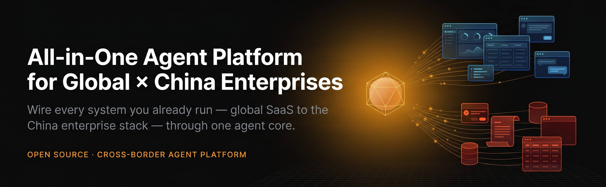
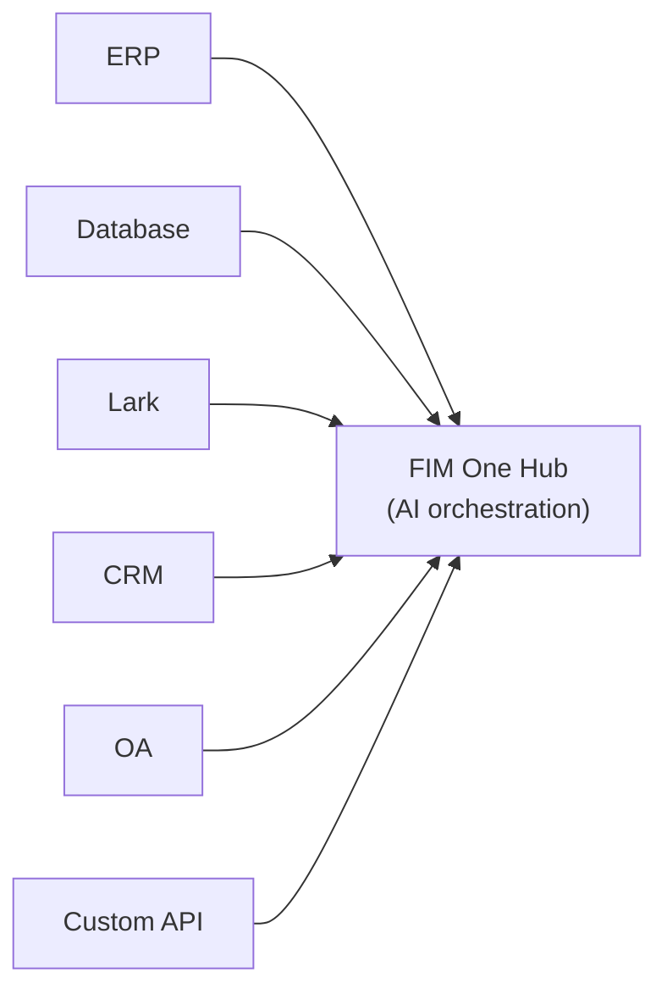

<div align="center">




[](https://github.com/fim-ai/fim-one/stargazers)
[](https://github.com/fim-ai/fim-one/network)
[](https://github.com/fim-ai/fim-one/issues)
[](https://x.com/FIM_One)
[](https://discord.gg/z64czxdC7z)
[](https://www.producthunt.com/products/fim-one)

🌐 **English** | [🇨🇳 中文](README.zh.md)

**AI駆動型コネクタハブ — 1つのシステムにコパイロットとして組み込むか、すべてをハブとして接続します。**

🌐 [ウェブサイト](https://one.fim.ai/) · 📖 [ドキュメント](https://docs.fim.ai) · 📋 [変更ログ](https://docs.fim.ai/changelog) · 🐛 [バグ報告](https://github.com/fim-ai/fim-one/issues) · 💬 [Discord](https://discord.gg/z64czxdC7z) · 🐦 [Twitter](https://x.com/FIM_One) · 🏆 [Product Hunt](https://www.producthunt.com/products/fim-one)

</div>

> [!TIP]
> **☁️ セットアップをスキップ — クラウドでFIM Oneを試してください。**
> マネージド版は **[cloud.fim.ai](https://cloud.fim.ai/)** で利用可能です：Docker不要、APIキー不要、設定不要。サインインして、数秒でシステムの接続を開始できます。_アーリーアクセス、フィードバック歓迎。_

---## 目次

- [概要](#概要)
- [ユースケース](#ユースケース)
- [FIM Oneを選ぶ理由](#fim-oneを選ぶ理由)
- [FIM Oneの位置付け](#fim-oneの位置付け)
- [主な機能](#主な機能)
- [アーキテクチャ](#アーキテクチャ)
- [クイックスタート](#クイックスタート) (Docker / ローカル / 本番環境)
- [設定](#設定)
- [開発](#開発)
- [ロードマップ](#ロードマップ)
- [貢献](#貢献)
- [スター履歴](#スター履歴)
- [アクティビティ](#アクティビティ)
- [貢献者](#貢献者)
- [ライセンス](#ライセンス)## 概要

FIM One は、プロバイダーに依存しない Python フレームワークで、AI エージェントを構築し、複雑なタスクを動的に計画・実行できます。その特徴は **Connector Hub** アーキテクチャです — 3つのデリバリーモード、1つのエージェントコア：

| モード           | 説明                                                                       | アクセス方法                       |
| -------------- | -------------------------------------------------------------------------------- | --------------------------------------- |
| **Standalone** | 汎用 AI アシスタント — 検索、コード、ナレッジベース                      | ポータル                                  |
| **Copilot**    | ホストシステムに組み込まれた AI — ユーザーの既存 UI で並行して動作        | iframe / ウィジェット / ホストページへの埋め込み |
| **Hub**        | 中央 AI オーケストレーション — すべてのシステムを接続、クロスシステムインテリジェンス | ポータル / API                            |



コアは常に同じです：ReAct 推論ループ、動的 DAG 計画と並行実行、プラグイン可能なツール、プロトコルファースト アーキテクチャでベンダーロックインなし。### エージェントの使用

### プランナーモードの使用

## ユースケース

エンタープライズデータとワークフローはOA、ERP、財務、承認システムの内部に閉じ込められています。FIM Oneは、AIエージェントがこれらのシステムを読み書きできるようにします。既存のインフラストラクチャを変更することなく、システム間のプロセスを自動化します。

| シナリオ                  | 推奨される開始方法 | 自動化される内容                                                                                                |
| ------------------------- | ----------------- | ---------------------------------------------------------------------------------------------------------------- |
| **法務・コンプライアンス**    | Copilot → Hub     | 契約条項の抽出、バージョン差分、ソース引用付きリスク検出、OA承認の自動トリガー          |
| **IT運用**         | Hub               | アラート発火 → ログ取得 → 根本原因分析 → Lark/Slackへの修正配信 — 1つの完全なループ                 |
| **ビジネス運用**   | Copilot           | スケジュール済みデータサマリーをチームチャネルにプッシュ、ライブデータベースに対するアドホック自然言語クエリ         |
| **財務自動化**    | Hub               | 請求書検証、経費承認ルーティング、ERP会計システム間の台帳照合          |
| **調達**           | Copilot → Hub     | 要件 → ベンダー比較 → 契約ドラフト → 承認 — エージェントがシステム間のハンドオフを処理           |
| **開発者統合** | API               | OpenAPI仕様をインポートするか、チャットでAPIを説明 — コネクタが数分で作成され、エージェントツールとして自動登録 |# FIM One を選ぶ理由### 段階的な展開

まず、1つのシステム（例えば、ERP）に**Copilot**を組み込むことから始めます。ユーザーは、使い慣れたインターフェース内で直接 AI と対話できます。財務データをクエリしたり、レポートを生成したり、ページを離れることなく回答を得たりできます。

価値が実証されたら、**Hub**をセットアップします。これは、すべてのシステムを接続する中央ポータルです。ERP Copilot は組み込まれたまま実行され、Hub はシステム間のオーケストレーションを追加します。CRM で契約をクエリし、OA で承認をチェックし、Lark でステークホルダーに通知する — すべて 1 か所から実行できます。

Copilot は 1 つのシステム内で価値を実証します。Hub はすべてのシステム全体で価値を解放します。### FIM One が行わないこと

FIM One は、ターゲットシステムに既に存在するワークフロー ロジックを複製しません：

- **BPM/FSM エンジンなし** — 承認チェーン、ルーティング、エスカレーション、ステートマシンはターゲットシステムの責任です。これらのシステムはこのロジックの構築に何年も費やしています。
- **ドラッグ&ドロップ ワークフロー エディタなし** — ビジュアル フローチャートが必要な場合は Dify を使用してください。FIM One の DAG プランナーは実行グラフを動的に生成します。
- **コネクタ = API 呼び出し** — コネクタの観点からは、「承認を転送」= 1 つの API 呼び出し、「理由付きで却下」= 1 つの API 呼び出しです。すべての複雑なワークフロー操作は HTTP リクエストに集約されます。FIM One は API を呼び出し、ターゲットシステムが状態を管理します。

これは機能ギャップではなく、意図的なアーキテクチャ上の境界です。### 競争的ポジショニング

|                        | Dify                       | Manus            | Coze                  | FIM One                      |
| ---------------------- | -------------------------- | ---------------- | --------------------- | ---------------------------- |
| **Approach**           | ビジュアルワークフロービルダー    | 自律エージェント | ビルダー + エージェントスペース | AI コネクタハブ             |
| **Planning**           | 人間設計の静的DAG | マルチエージェントCoT  | 静的 + 動的      | LLM DAGプランニング + ReAct     |
| **Cross-system**       | APIノード（手動）         | なし               | プラグインマーケットプレイス    | ハブモード（N:N オーケストレーション） |
| **Human Confirmation** | なし                         | なし               | なし                    | あり（実行前ゲート）     |
| **Self-hosted**        | あり（Dockerスタック）         | なし               | あり（Coze Studio）     | あり（シングルプロセス）         |

> 詳細：[Philosophy](https://docs.fim.ai/architecture/philosophy) | [Execution Modes](https://docs.fim.ai/concepts/execution-modes) | [Competitive Landscape](https://docs.fim.ai/strategy/competitive-landscape)### FIM One の位置付け

```
                Static Execution          Dynamic Execution
            ┌──────────────────────┬──────────────────────┐
 Static     │ BPM / Workflow       │ ACM                  │
 Planning   │ Camunda, Activiti    │ (Salesforce Case)    │
            │ Dify, n8n, Coze     │                      │
            ├──────────────────────┼──────────────────────┤
 Dynamic    │ (transitional —      │ Autonomous Agent     │
 Planning   │  unstable quadrant)  │ AutoGPT, Manus       │
            │                      │ ★ FIM One (bounded)│
            └──────────────────────┴──────────────────────┘
```

Dify/n8n は **Static Planning + Static Execution** です — ユーザーがビジュアルキャンバス上で DAG を設計し、ノードが固定操作を実行します。FIM One は **Dynamic Planning + Dynamic Execution** です — LLM が実行時に DAG を生成し、各ノードが ReAct ループを実行し、目標が達成されない場合は再計画します。ただし制限があります（最大 3 回の再計画ラウンド、トークン予算、確認ゲート）ため、AutoGPT よりも制御されています。

FIM One は BPM/FSM を行いません — ワークフロー ロジックはターゲット システムに属し、コネクタは単に API を呼び出すだけです。

> 詳細説明: [Philosophy](https://docs.fim.ai/architecture/philosophy)## 主な機能#### コネクタプラットフォーム（コア）
- **コネクタハブアーキテクチャ** — スタンドアロンアシスタント、組み込みコパイロット、または中央ハブ — 同じエージェントコア、異なるデリバリー。
- **任意のシステム、1つのパターン** — API、データベース、メッセージバスを接続。アクションは認証注入（Bearer、API Key、Basic）を伴うエージェントツールとして自動登録されます。
- **データベースコネクタ** — PostgreSQL、MySQL、Oracle、SQL Server、および中国のレガシーデータベース（DM、KingbaseES、GBase、Highgo）への直接SQLアクセス。スキーマイントロスペクション、AI搭載の注釈、読み取り専用クエリ実行、および保存時の暗号化された認証情報。各DBコネクタは3つのツール（`list_tables`、`describe_table`、`query`）を自動生成します。
- **コネクタを構築する3つの方法：**
  - *OpenAPI仕様をインポート* — YAML/JSON/URLをアップロード。コネクタとすべてのアクションが自動生成されます。
  - *AIチャットビルダー* — 自然言語でAPIを説明。AIが会話内でアクション設定を生成および反復処理します。10個の専門ビルダーツールがコネクタ設定、アクション、テスト、およびエージェント配線を処理します。
  - *MCPエコシステム* — 任意のMCPサーバーを直接接続。サードパーティのMCPコミュニティがそのまま機能します。#### インテリジェント計画と実行
- **動的DAG計画** — LLMが実行時に目標を依存グラフに分解します。ハードコードされたワークフローはありません。
- **並行実行** — asyncioを介して独立したステップが並列に実行されます。
- **DAG再計画** — 目標が達成されない場合、最大3ラウンドまで計画を自動的に修正します。
- **ReActエージェント** — 自動エラーリカバリー機能を備えた構造化された推論と行動のループ。
- **自動ルーティング** — 各リクエストを最適な実行モード（ReActまたはDAG）に自動的に分類します。フロントエンドは3方向トグル（Auto/Standard/Planner）をサポートしています。`AUTO_ROUTING`で設定可能です。
- **拡張思考** — `LLM_REASONING_EFFORT`を介してサポートされているモデル（OpenAI o-series、Gemini 2.5+、Claude）のチェーンオブソート推論を有効にします。モデルの推論はUI「thinking」ステップで表示されます。#### ツール & 統合
- **プラグイン可能なツールシステム** — 自動検出; Python executor、Node.js executor、計算機、ウェブ検索/取得、HTTPリクエスト、シェル実行などが付属しています。
- **プラグイン可能なサンドボックス** — `python_exec` / `node_exec` / `shell_exec` はローカルまたは Docker モード (`CODE_EXEC_BACKEND=docker`) で実行され、OS レベルの分離 (`--network=none`, `--memory=256m`) を提供します。SaaS およびマルチテナント環境に対応しています。
- **MCP プロトコル** — 任意の MCP サーバーをツールとして接続します。サードパーティの MCP エコシステムがそのまま動作します。
- **ツール成果物システム** — ツールはリッチな出力 (HTML プレビュー、生成されたファイル) を生成し、チャット内でレンダリングおよびダウンロードできます。HTML 成果物はサンドボックス化された iframe でレンダリングされ、ファイル成果物はダウンロードチップを表示します。
- **OpenAI 互換** — 任意の `/v1/chat/completions` プロバイダー (OpenAI、DeepSeek、Qwen、Ollama、vLLM…) で動作します。#### RAG & ナレッジ
- **フル RAG パイプライン** — Jina embedding + LanceDB + FTS + RRF ハイブリッド検索 + reranker。PDF、DOCX、Markdown、HTML、CSV をサポート。
- **根拠のある生成** — エビデンスアンカー RAG、インライン `[N]` 引用、競合検出、および説明可能な信頼度スコア。
- **KB ドキュメント管理** — チャンクレベルの CRUD、チャンク全体のテキスト検索、失敗したドキュメントの再試行、およびベクトルストアスキーマの自動マイグレーション。#### ポータル & UX
- **リアルタイムストリーミング (SSE v2)** — イベントプロトコルの分割 (`done` / `suggestions` / `title` / `end`)、ストリーミングドット パルスカーソル、KaTeX数式レンダリング、ツールステップの折りたたみ機能。
- **DAG ビジュアライゼーション** — ライブステータス付きインタラクティブフローグラフ、依存関係エッジ、クリックでスクロール、再計画ラウンドスナップショットを折りたたみ可能なカードとして表示。
- **会話割り込み** — エージェント実行中にフォローアップメッセージを送信可能。次の反復境界で挿入されます。
- **ダーク / ライト / システムテーマ** — システム設定検出を含む完全なテーマサポート。
- **コマンドパレット** — 会話検索、スター付け、一括操作、タイトル名変更。#### プラットフォーム & マルチテナント
- **JWT Auth** — トークンベースの SSE 認証、会話の所有権、ユーザーごとのリソース分離。
- **エージェント管理** — バインドされたモデル、ツール、指示を備えたエージェントの作成、設定、公開。エージェントごとの実行モード（Standard/Planner）と温度制御。オプションの `discoverable` フラグにより、CallAgentTool 経由での LLM 自動検出が可能。
- **プラットフォーム組織** — 組み込みの `platform` 組織がすべてのユーザーに自動参加し、従来の「グローバル」可視性の概念に代わります。組織全体でリソース（エージェント、コネクタ、ナレッジベース、MCP サーバー）を共有するための中央ハブ。
- **リソースサブスクリプション & マーケット** — ユーザーは組織マーケットから共有リソースを閲覧およびサブスクライブできます。UI または API 経由でサブスクライブ/アンサブスクライブ。すべてのリソースタイプが組織レベルの公開およびサブスクリプション管理をサポート。
- **管理パネル** — システム統計ダッシュボード（ユーザー、会話、トークン、モデル使用状況チャート、エージェント別トークン内訳）、コネクタコール指標（成功率、レイテンシ、コール数）、検索/ページネーション付きユーザー管理、ロール切り替え、パスワードリセット、アカウント有効化/無効化、ツールごとの有効化/無効化制御。
- **初回セットアップウィザード** — 初回起動時、ポータルは管理者アカウント（ユーザー名、パスワード、メール）の作成をガイドします。このワンタイムセットアップがログイン認証情報になり、設定ファイルは不要です。
- **個人センター** — ユーザーごとのグローバルシステム指示。すべての会話に適用されます。
- **言語設定** — ユーザーごとの言語設定（auto/en/zh）。選択された言語にすべての LLM 応答を指示します。#### コンテキスト & メモリ
- **LLM Compact** — トークン予算内に収まるよう、LLM搭載の自動要約機能。
- **ContextGuard + ピン留めメッセージ** — トークン予算マネージャー。ピン留めメッセージはコンパクト化から保護されます。
- **デュアルデータベースサポート** — SQLite（ゼロコンフィグのデフォルト）で数秒で開始可能。PostgreSQL は本番環境とマルチワーカーデプロイメント向け。Docker Compose は PostgreSQL をヘルスチェック付きで自動プロビジョニング。`docker compose up` で稼働開始。## アーキテクチャ### システム概要

```mermaid
graph TB
    subgraph app["Application & Interaction Layer"]
        a["Portal · API · iframe · Lark/Slack Bot · Webhook · WeCom/DingTalk"]
    end
    subgraph mid["FIM One Middleware"]
        direction LR
        m1["Connectors<br/>+ MCP Hub"] ~~~ m2["Orch Engine<br/>ReAct / DAG"] ~~~ m3["RAG /<br/>Knowledge"] ~~~ m4["Auth /<br/>Admin"]
    end
    subgraph biz["Business Systems & Data Layer"]
        b["ERP · CRM · OA · Finance · Databases · Custom APIs<br/>Lark · DingTalk · WeCom · Slack · Email · Webhook"]
    end
    app --> mid --> biz
```### コネクタハブ

```mermaid
graph LR
    ERP["ERP<br/>(SAP/Kingdee)"] --> A
    CRM["CRM<br/>(Salesforce)"] --> B
    OA["OA<br/>(Seeyon/Weaver)"] --> C
    DB["Custom DB<br/>(PG/MySQL)"] --> D
    subgraph Hub["FIM One Hub"]
        A["Agent A: Finance Audit"]
        B["Agent B: Contract Review"]
        C["Agent C: Approval Assist"]
        D["Agent D: Data Reporting"]
    end
    A --> O1["Lark / Slack"]
    B --> O2["Email / WeCom"]
    C --> O3["Teams / Webhook"]
    D --> O4["Any API"]
```

*ポータル / API / iframe*

各コネクタは標準化されたブリッジです。エージェントは SAP と通信しているのか、カスタム PostgreSQL データベースと通信しているのかを知る必要も気にする必要もありません。詳細は [コネクタアーキテクチャ](https://docs.fim.ai/architecture/connector-architecture) を参照してください。### 内部実行

FIM Oneは2つの実行モードを提供し、それらの間で自動的にルーティングされます:

| モード         | 最適な用途                  | 動作方法                                                       |
| ------------ | ------------------------- | ------------------------------------------------------------------ |
| Auto         | すべてのクエリ (デフォルト)     | 高速LLMがクエリを分類し、ReActまたはDAGにルーティング           |
| ReAct        | 単一の複雑なクエリ    | Reason → Act → Observeループとツール                             |
| DAG Planning | マルチステップの並列タスク | LLMが依存グラフを生成し、独立したステップが並行実行 |

```mermaid
graph TB
    Q[User Query] --> P["DAG Planner<br/>LLM decomposes the goal into steps + dependency edges"]
    P --> E["DAG Executor<br/>Launches independent steps concurrently via asyncio<br/>Each step is handled by a ReAct Agent"]
    E --> R1["ReAct Agent 1 → Tools<br/>(python_exec, custom, ...)"]
    E --> R2["ReAct Agent 2 → RAG<br/>(retriever interface)"]
    E --> RN["ReAct Agent N → ..."]
    R1 & R2 & RN --> An["Plan Analyzer<br/>LLM evaluates results · re-plans if goal not met"]
    An --> F[Final Answer]
```## クイックスタート### オプション A: Docker（推奨）

ローカルの Python や Node.js は不要です。すべてコンテナ内でビルドされます。

```bash
git clone https://github.com/fim-ai/fim-one.git
cd fim-one
```# 設定 — LLM_API_KEY のみが必須です
cp example.env .env# .envを編集: LLM_API_KEY を設定（オプションで LLM_BASE_URL、LLM_MODEL も設定）# ビルドと実行（初回、または新しいコードをプルした後）
```bash
docker compose up --build -d
```

http://localhost:3000 を開く — 初回起動時は、管理者アカウントの作成ガイドが表示されます。以上です。

初回ビルド後、以降の起動には以下のコマンドのみが必要です：

```bash
docker compose up -d          # 起動（イメージが変更されていない場合はリビルドをスキップ）
docker compose down           # 停止
docker compose logs -f        # ログを表示
```

データは Docker の名前付きボリューム（`fim-data`、`fim-uploads`）に永続化され、コンテナの再起動後も保持されます。

> **注記：** Docker モードはホットリロードをサポートしていません。コード変更にはイメージの再ビルド（`docker compose up --build -d`）が必要です。ライブリロード機能を備えたアクティブな開発には、以下の **オプション B** を使用してください。### オプション B: ローカル開発

前提条件: Python 3.11+、[uv](https://docs.astral.sh/uv/)、Node.js 18+、pnpm。

```bash
git clone https://github.com/fim-ai/fim-one.git
cd fim-one

cp example.env .env
```# .envを編集: LLM_API_KEYを設定# インストール
uv sync --all-extras
cd frontend && pnpm install && cd ..# 起動（ホットリロード付き）
./start.sh dev
```

| コマンド         | 起動内容                                                | URL                                      |
| ---------------- | ------------------------------------------------------- | ---------------------------------------- |
| `./start.sh`     | Next.js + FastAPI                                       | http://localhost:3000 (UI) + :8000 (API) |
| `./start.sh dev` | 同じ、ホットリロード付き（Python `--reload` + Next.js HMR） | 同じ                                     |
| `./start.sh api` | FastAPI のみ（ヘッドレス、統合またはテスト用）              | http://localhost:8000/api                |### 本番環境へのデプロイ

どちらの方法も本番環境で動作します:

| 方法     | コマンド                | 最適な用途                                    |
| ---------- | ---------------------- | ------------------------------------------- |
| **Docker** | `docker compose up -d` | ハンズオフデプロイ、簡単なアップデート          |
| **Script** | `./start.sh`           | ベアメタルサーバー、カスタムプロセスマネージャー |

どちらの方法でも、HTTPS とカスタムドメイン用に Nginx リバースプロキシをフロントに配置してください:

```
User → Nginx (443/HTTPS) → localhost:3000
```

API は内部的にポート 8000 で実行されます — Next.js は `/api/*` リクエストを自動的にプロキシします。ポート 3000 のみを公開する必要があります。

コード実行サンドボックス (`CODE_EXEC_BACKEND=docker`) を使用する場合は、Docker ソケットをマウントしてください:

```yaml
```# docker-compose.yml
volumes:
  - /var/run/docker.sock:/var/run/docker.sock
```## 設定### 推奨設定

FIM One は **OpenAI互換のあらゆるLLMプロバイダー** で動作します — OpenAI、DeepSeek、Anthropic、Qwen、Ollama、vLLM など。お好みのものを選択してください：

| プロバイダー       | `LLM_API_KEY` | `LLM_BASE_URL`                 | `LLM_MODEL`         |
| ------------------ | ------------- | ------------------------------ | ------------------- |
| **OpenAI**         | `sk-...`      | *(デフォルト)*                 | `gpt-4o`            |
| **DeepSeek**       | `sk-...`      | `https://api.deepseek.com/v1`  | `deepseek-chat`     |
| **Anthropic**      | `sk-ant-...`  | `https://api.anthropic.com/v1` | `claude-sonnet-4-6` |
| **Ollama** (ローカル) | `ollama`      | `http://localhost:11434/v1`    | `qwen2.5:14b`       |

**[Jina AI](https://jina.ai/)** はウェブ検索/取得、埋め込み、完全なRAGパイプラインを実現します（無料ティア利用可能）。

最小限の `.env`：

```bash
LLM_API_KEY=sk-your-key
```# LLM_BASE_URL=https://api.openai.com/v1   # デフォルト — 他のプロバイダーの場合は変更してください# LLM_MODEL=gpt-4o                         # デフォルト — 他のモデルに変更可能

JINA_API_KEY=jina_...                       # ウェブツール + RAG を有効化
```### すべての変数

すべての設定オプション（LLM、エージェント実行、ウェブツール、RAG、コード実行、画像生成、コネクタ、プラットフォーム、OAuth）については、完全な[環境変数](https://docs.fim.ai/configuration/environment-variables)リファレンスを参照してください。# 開発

```bash


```# すべての依存関係をインストール（開発用エクストラを含む）
uv sync --all-extras# テストを実行する
pytest# カバレッジ付きでテストを実行
pytest --cov=fim_one --cov-report=term-missing# リント
ruff check src/ tests/# 型チェック
mypy src/# git フックをインストール (クローン後に1回実行 — コミット時に自動 i18n 翻訳を有効化)
bash scripts/setup-hooks.sh
```## 国際化 (i18n)

FIM One は **6 言語** をサポートしています: 英語、中国語、日本語、韓国語、ドイツ語、フランス語。翻訳は完全に自動化されており、英語のソースファイルを編集するだけです。

**サポート言語**: `en` `zh` `ja` `ko` `de` `fr`

| 項目 | ソース (編集対象) | 自動生成 (編集しないでください) |
|------|--------------------|-----------------------------|
| UI文字列 | `frontend/messages/en/*.json` | `frontend/messages/{locale}/*.json` |
| ドキュメント | `docs/*.mdx` | `docs/{locale}/*.mdx` |
| README | `README.md` | `README.{locale}.md` |

**仕組み**: プリコミットフックが英語ファイルの変更を検出し、プロジェクトの Fast LLM を使用して翻訳します。翻訳は段階的に行われます。新規、変更、または削除されたコンテンツのみが処理されます。

```bash# セットアップ（クローン後に1回実行）
bash scripts/setup-hooks.sh# 完全翻訳（初回または新しいロケールを追加した後）
uv run scripts/translate.py --all# 特定のファイルを翻訳する
uv run scripts/translate.py --files frontend/messages/en/common.json# ターゲットロケールのオーバーライド
uv run scripts/translate.py --all --locale ja ko# API呼び出しの並列化を増やす（デフォルト: 3、APIが許可する場合は増加）
uv run scripts/translate.py --all --concurrency 10# 日常ワークフロー: コミットするだけ — フックが自動的にすべてを処理
git add frontend/messages/en/common.json
git commit -m "feat(i18n): add new strings"  # フックが自動翻訳
```

| フラグ | デフォルト | 説明 |
|------|---------|-------------|
| `--all` | — | すべてを再翻訳（キャッシュを無視） |
| `--files` | — | 特定のファイルのみを翻訳 |
| `--locale` | 自動検出 | ターゲットロケールをオーバーライド |
| `--concurrency` | 3 | LLM API呼び出しの最大並列数 |
| `--force` | — | すべてのJSONキーの再翻訳を強制 |

**新しい言語を追加する**: `mkdir frontend/messages/{locale}` → `--all` を実行 → `frontend/src/i18n/request.ts` の `SUPPORTED_LOCALES` にロケールを追加。## ロードマップ

完全な[ロードマップ](https://docs.fim.ai/roadmap)でバージョン履歴と今後の予定を確認してください。## 貢献

あらゆる種類の貢献を歓迎します — コード、ドキュメント、翻訳、バグ報告、アイデア。

> **パイオニアプログラム**: PRがマージされた最初の100人の貢献者は、**創設貢献者**として認識され、プロジェクト内に永続的なクレジット、プロフィールのバッジ、優先的な問題サポートが付与されます。[詳細はこちら &rarr;](CONTRIBUTING.md#-pioneer-program)

**クイックリンク:**

- [**貢献ガイド**](CONTRIBUTING.md) — セットアップ、規約、PRプロセス
- [**初心者向けの良い問題**](https://github.com/fim-ai/fim-one/labels/good%20first%20issue) — 新規参入者向けに厳選
- [**オープン問題**](https://github.com/fim-ai/fim-one/issues) — バグ & 機能リクエスト## スター履歴

<a href="https://star-history.com/#fim-ai/fim-one&Date">
  <picture>
    <source media="(prefers-color-scheme: dark)" srcset="https://api.star-history.com/svg?repos=fim-ai/fim-one&type=Date&theme=dark" />
    <source media="(prefers-color-scheme: light)" srcset="https://api.star-history.com/svg?repos=fim-ai/fim-one&type=Date" />
    
  </picture>
</a>## アクティビティ

## 貢献者

これらの素晴らしい人々に感謝します（[絵文字キー](https://allcontributors.org/docs/en/emoji-key)）:

<!-- ALL-CONTRIBUTORS-LIST:START - Do not remove or modify this section -->
<!-- prettier-ignore-start -->
<!-- markdownlint-disable -->
<!-- markdownlint-restore -->
<!-- prettier-ignore-end -->
<!-- ALL-CONTRIBUTORS-LIST:END -->

[](https://github.com/fim-ai/fim-one/graphs/contributors)

このプロジェクトは[all-contributors](https://allcontributors.org/)仕様に従っています。あらゆる種類の貢献を歓迎します！## ライセンス

FIM One Source Available License。これは**OSI認定のオープンソースライセンスではありません**。

**許可される行為**: 内部使用、修正、ライセンスを保持したままでの配布、独自の（競合しない）アプリケーションへの組み込み。

**制限される行為**: マルチテナント SaaS、競合するエージェントプラットフォーム、ホワイトラベル、ブランディングの削除。

商用ライセンスのお問い合わせについては、[GitHub](https://github.com/fim-ai/fim-one) で Issue を開いてください。

詳細は [LICENSE](LICENSE) をご覧ください。

---

<div align="center">

🌐 [Website](https://one.fim.ai/) · 📖 [Docs](https://docs.fim.ai) · 📋 [Changelog](https://docs.fim.ai/changelog) · 🐛 [Report Bug](https://github.com/fim-ai/fim-one/issues) · 💬 [Discord](https://discord.gg/z64czxdC7z) · 🐦 [Twitter](https://x.com/FIM_One) · 🏆 [Product Hunt](https://www.producthunt.com/products/fim-one)

</div>