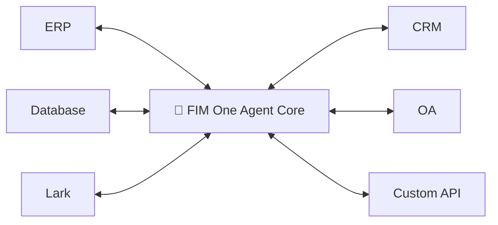
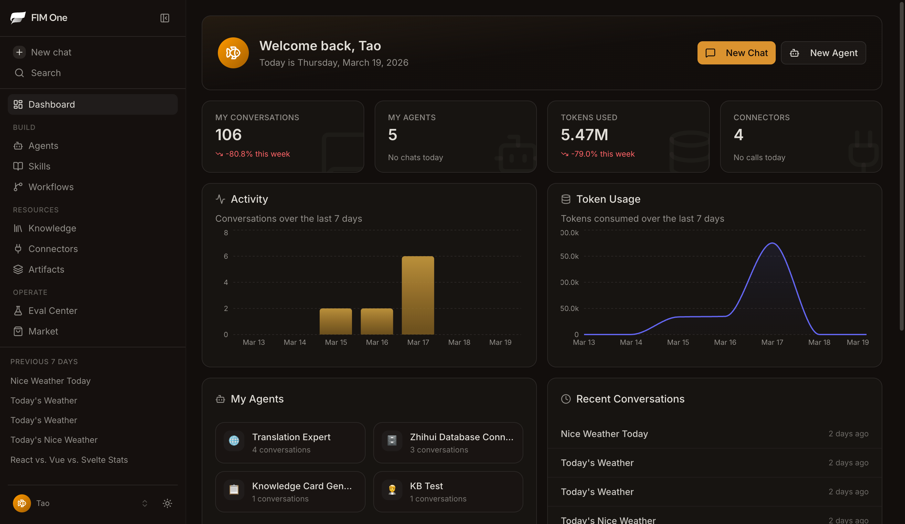
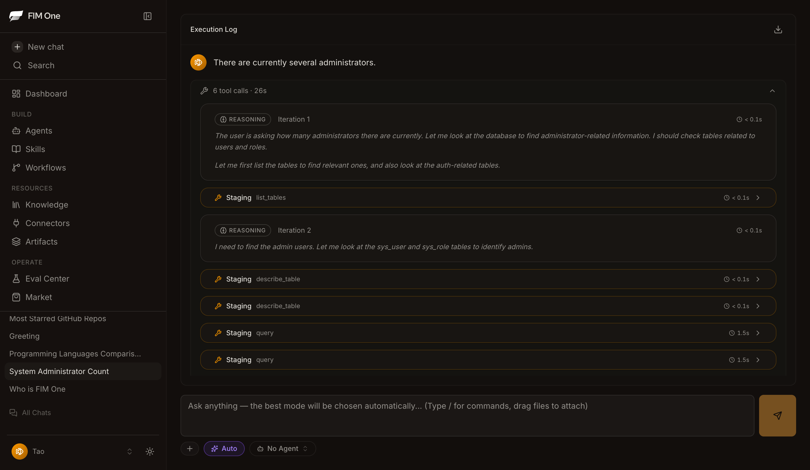
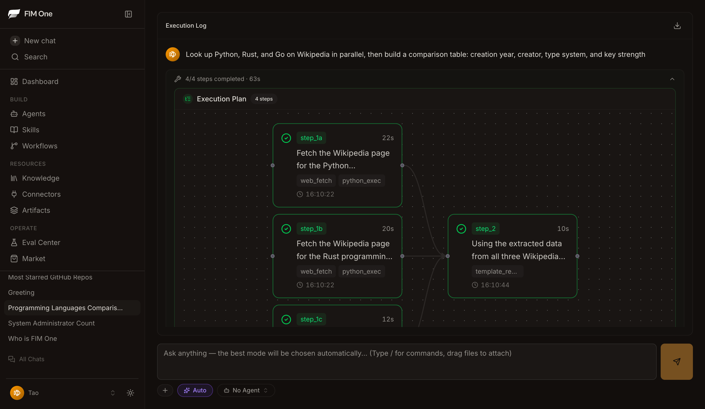
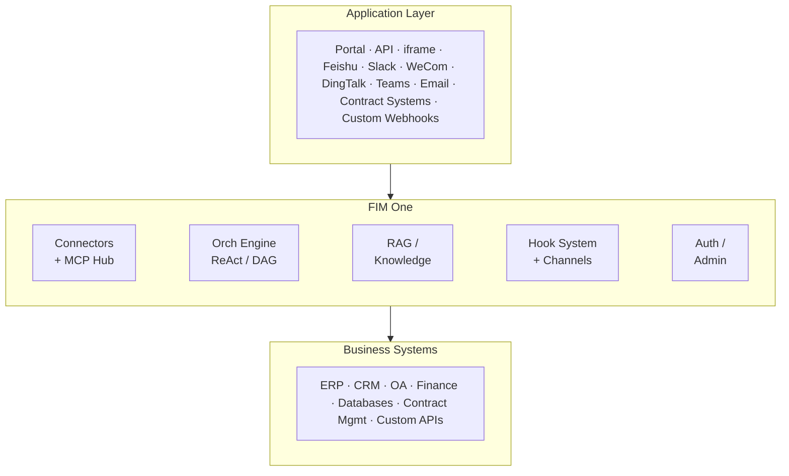

<div align="center">


[](https://github.com/fim-ai/fim-one/actions/workflows/test.yml)

[](https://discord.gg/z64czxdC7z)
[](https://x.com/FIM_One)

[🌐 English](README.md) | [🇨🇳 中文](README.zh.md) | [🇯🇵 日本語](README.ja.md) | [🇰🇷 한국어](README.ko.md) | [🇩🇪 Deutsch](README.de.md) | [🇫🇷 Français](README.fr.md)

**全球×中国企业一体化智能体平台。**
*通过一个智能体核心，连接您已有的每个系统——全球SaaS到中国技术栈。*

🌐 [网站](https://one.fim.ai/) · 📖 [文档](https://docs.fim.ai) · 📋 [更新日志](https://docs.fim.ai/changelog) · 🐛 [报告问题](https://github.com/fim-ai/fim-one/issues) · 💬 [Discord](https://discord.gg/z64czxdC7z) · 🐦 [Twitter](https://x.com/FIM_One) · 🏆 [Product Hunt](https://www.producthunt.com/products/fim-one)

</div>

> [!TIP]
> **☁️ 跳过设置——在云端尝试FIM One。**
> 托管版本已在[cloud.fim.ai](https://cloud.fim.ai/)上线——无需Docker、无需API密钥、无需配置。登录后即可在几秒内开始连接您的系统。*早期访问，欢迎反馈。*

---

## 概述

全球企业运行着一系列互不通信的系统——ERP、CRM、OA、HR、财务、数据库、跨地区的即时通讯平台。FIM One是**一体化智能体平台**，将你已有的每个系统接入一个智能体核心——一侧是全球SaaS，另一侧是完整的中国栈（飞书、企业微信、钉钉、DM、金仓等）。一个大脑。每个系统。全球SaaS × 中国栈。

| 模式           | 说明                                              | 访问方式                  |
| -------------- | ------------------------------------------------------- | ----------------------- |
| **独立模式** | 通用AI助手——搜索、代码、知识库         | 门户                  |
| **副驾驶**    | AI嵌入到宿主系统的UI中                       | iframe / widget / embed |
| **中枢**        | 跨所有连接系统的中央AI编排   | 门户 / API            |



### 截图

**仪表板** — 统计数据、活动趋势、令牌使用情况以及对智能体和对话的快速访问。



**智能体聊天** — 针对连接的数据库进行 ReAct 推理和多步工具调用。



**DAG 规划器** — LLM 生成的执行计划，支持并行步骤和实时状态跟踪。



### 演示

**使用智能体**


**使用规划器模式**


## 快速开始

### Docker（推荐）

```bash
git clone https://github.com/fim-ai/fim-one.git
cd fim-one

cp example.env .env
# Edit .env: set LLM_API_KEY (and optionally LLM_BASE_URL, LLM_MODEL)

docker compose up --build -d
```

打开 http://localhost:3000 — 首次启动时，你需要创建一个管理员账户。就这么简单。

```bash
docker compose up -d          # start
docker compose down           # stop
docker compose logs -f        # view logs
```

### 本地开发

前置条件：Python 3.11+、[uv](https://docs.astral.sh/uv/)、Node.js 18+、pnpm。

```bash
git clone https://github.com/fim-ai/fim-one.git && cd fim-one

cp example.env .env           # Edit: set LLM_API_KEY

uv sync --all-extras
cd frontend && pnpm install && cd ..

./start.sh dev                # hot reload: Python --reload + Next.js HMR
```

| 命令          | 启动内容                       | URL                            |
| ---------------- | --------------------------------- | ------------------------------ |
| `./start.sh`         | Next.js + FastAPI                 | localhost:3000 (UI) + :8000    |
| `./start.sh dev`     | 相同，带热重载             | 相同                           |
| `./start.sh dev:api` | 仅 API，开发模式（热重载）   | localhost:8000                 |
| `./start.sh dev:ui`  | 仅前端，开发模式（HMR）    | localhost:3000                 |
| `./start.sh api`     | FastAPI 仅（无界面）           | localhost:8000/api             |

> 关于生产部署（Docker、反向代理、零停机更新），请参阅[部署指南](https://docs.fim.ai/quickstart#production-deployment)。

## 主要功能

#### 跨境连接
- **三种交付模式** — 独立智能体、嵌入式Copilot或中央Hub；同一智能体核心。
- **任何系统，统一模式** — 连接API、数据库、MCP服务器。操作自动注册为智能体工具并注入身份验证。渐进式披露元工具可将所有工具类型的令牌使用量减少80%以上。
- **数据库连接器** — PostgreSQL、MySQL、Oracle、SQL Server以及中国常见的企业数据库（DM、KingbaseES、GBase、Highgo），这些是大多数全球平台无法访问的。支持模式内省和AI驱动的注释。
- **三种构建方式** — 导入OpenAPI规范、AI聊天构建器或直接连接MCP服务器。

#### 规划与执行
- **动态DAG规划** — LLM在运行时将目标分解为依赖图。无硬编码工作流。
- **并发执行** — 独立步骤通过asyncio并行运行；自动重新规划最多3轮。
- **ReAct智能体** — 结构化的推理与行动循环，具有自动错误恢复。
- **智能体框架** — 生产级执行环境：ContextGuard提供5层令牌预算管理，渐进式披露元工具保持工具表面可控，自反思循环对抗目标漂移。
- **钩子系统** — 在LLM循环外运行的确定性强制执行。首个发布版本：`FeishuGateHook`将敏感工具调用置于人工审批卡后，发布到Feishu群组。可扩展至审计日志、只读模式保护和速率限制（v0.9）。
- **内容护栏** — 三层安全防护：工具权限钩子（操作）、凭证/SSRF/MCP认证检查（协议）和内容护栏（输入/输出文本）。默认越狱短语检测器在LLM调用前中止轮次，节省令牌并在聊天中显示清晰的阻止通知。输出护栏可选，通过`FIM_GUARDRAILS_OUTPUT`启用。
- **自动路由** — 分类查询并路由到最优模式（ReAct或DAG）。可通过`AUTO_ROUTING`配置。
- **扩展思考** — OpenAI o系列、Gemini 2.5+、Claude的思维链。
- **提示词缓存可观测性** — Anthropic提示词缓存`read/create`令牌计数按轮次捕获，在聊天`done`负载中显示并记录，以便操作员验证缓存命中并检测不遵守折扣的中继站。

#### 工作流与工具
- **可视化工作流编辑器** — 12种节点类型、拖放画布（React Flow v12）、JSON格式的导入/导出。
- **智能文件处理** — 上传的文件自动内联到上下文（小文件）或通过 `read_uploaded_file` 工具按需读取。智能文档处理：PDF、DOCX和PPTX文件在模型支持视觉能力时进行视觉感知处理，并提取嵌入的图像。智能PDF模式从富文本页面提取文本，将扫描页面渲染为图像。
- **通用文档转换** — 内置 `convert_to_markdown` 工具通过Microsoft MarkItDown将PDF/Word/Excel/PowerPoint/HTML/图像/音频/Outlook `.msg`/EPUB/YouTube转录内容转换为清晰的Markdown。具有视觉能力的LLM可对嵌入的图像和扫描页面进行OCR——支持Claude、Gemini、Bedrock以及任何LiteLLM支持的提供商，无需针对各提供商的适配器代码。
- **可插拔工具** — Python、Node.js、shell执行，支持可选的Docker沙箱（`CODE_EXEC_BACKEND=docker`）。
- **V4A补丁编辑** — 超越 `find_replace`，智能体可通过 `file_ops.apply_patch` 应用带有模糊空白匹配的行块补丁——对于精确子字符串匹配过于脆弱的多行编辑具有鲁棒性。
- **完整RAG管道** — Jina嵌入+LanceDB+混合检索+重排器+内联 `[N]` 引用。视觉感知摄取将扫描PDF和Office嵌入图像通过工作区的默认视觉LLM进行OCR处理。
- **工具产物** — 丰富的输出（HTML预览、文件）在聊天中渲染。

#### 消息通道 (v0.8)
- **组织范围的即时通讯桥接** — `BaseChannel` 抽象，支持跨 Slack、Microsoft Teams、Discord、Feishu (Lark)、WeCom 和 DingTalk 的出站消息。首个发布实现是 Feishu；Slack / Teams / WeCom / Email 在 v0.9 路线图中。
- **Fernet 加密凭证** — 应用密钥和加密密钥在静态时加密；每个入站回调都经过签名验证。
- **交互式审批卡片** — 通道原生 `GateHook`（目前支持 Feishu，Slack/Teams 即将推出）在敏感工具调用触发时向你的群组发送审批/拒绝卡片；工具会阻塞直到群组成员点击决议。无需自定义工作流引擎即可实现人工审批。
- **可配置的每个智能体审批路由** — 三种模式（自动 / 仅内联 / 仅通道）配合审批人范围选择器（发起人 / 智能体所有者 / 任何组织成员）。单一审计路径记录 `approver_user_id` 和 `decided_at`，无论决议来自聊天还是通道。自动模式在未链接通道时回退到内联，因此智能体始终获得真实的审批体验。
- **任务完成通知** — 长时间运行的 ReAct 或 DAG 智能体可在工作完成时向组织通道推送摘要卡片。在"设置 → 智能体 → 通知"中按智能体配置。
- **浏览并选择 UI** — 无需从供应商控制台复制原始通道 ID；门户调用即时通讯平台的 API 并显示群组选择器。

#### 平台
- **多租户** — JWT 认证、组织隔离、带有使用分析和连接器指标的管理面板。通过 `WORKERS=N` 支持多工作进程，使用 Redis 中断代理进行跨工作进程中继。
- **应用市场** — 发布和订阅智能体、连接器、知识库、技能、工作流。
- **全局技能（SOP）** — 为每个用户加载的可复用操作流程；渐进模式可减少约 80% 的令牌消耗。
- **Stripe 计费和按用户配额** — 可选的 Pro 计划升级，通过 Stripe Checkout + Customer Portal。配额链（按用户覆盖 → 计划层级 → 系统默认值），`0` 表示无限制。管理员功能标志控制整个流程；不使用 Stripe 的私有部署保持清洁。
- **评估中心** — 测试数据集管理、并行评估运行，使用 LLM 评分判断，每个案例的通过/失败/延迟/令牌结果查看器，支持自动轮询。
- **对话恢复** — 合成 `tool_result` 行在中断的轮次后持久化；客户端通过 `/chat/resume` 自动重连断开的 SSE 流，支持指数退避和"重新连接中…"指示器。
- **6 种语言** — EN、ZH、JA、KO、DE、FR。翻译完全自动化——单一词汇表驱动每个 LLM 翻译调用（JSON、MDX、README），提交前钩子拒绝手动编辑生成的语言环境文件。
- **首次运行设置向导**、深色/浅色主题、命令面板、流式 SSE、DAG 可视化。

> 深入了解：[架构](https://docs.fim.ai/architecture/system-overview) · [钩子系统](https://docs.fim.ai/architecture/hook-system) · [通道](https://docs.fim.ai/configuration/channels/overview) · [执行模式](https://docs.fim.ai/concepts/execution-modes) · [为什么选择 FIM One](https://docs.fim.ai/why) · [竞争格局](https://docs.fim.ai/strategy/competitive-landscape)

## 架构



每个连接器和通道都是一个标准化的桥接——智能体不知道或不关心它是在与 SAP、自定义合同系统还是飞书群组通信。Hook 系统在 LLM 循环之外运行平台代码以进行审批、审计和速率限制；通道将出站通知和审批卡片传送到外部 IM 平台。详见 [连接器架构](https://docs.fim.ai/architecture/connector-architecture)、[Hook 系统](https://docs.fim.ai/architecture/hook-system) 和[通道](https://docs.fim.ai/configuration/channels/overview)。

## 配置

FIM One 支持**任何 OpenAI 兼容的提供商**：

| 提供商           | `LLM_API_KEY` | `LLM_BASE_URL`                 | `LLM_MODEL`         |
| ------------------ | ------------- | ------------------------------ | -------------------- |
| **OpenAI**         | `sk-...`      | *(默认)*                    | `gpt-4o`             |
| **DeepSeek**       | `sk-...`      | `https://api.deepseek.com/v1`  | `deepseek-chat`      |
| **Anthropic**      | `sk-ant-...`  | `https://api.anthropic.com/v1` | `claude-sonnet-4-6`  |
| **Ollama** (本地) | `ollama`      | `http://localhost:11434/v1`    | `qwen2.5:14b`        |

最小化 `.env`：

```bash
LLM_API_KEY=sk-your-key
# LLM_BASE_URL=https://api.openai.com/v1   # default
# LLM_MODEL=gpt-4o                         # default
JINA_API_KEY=jina_...                       # unlocks web tools + RAG
```

> 完整参考：[环境变量](https://docs.fim.ai/configuration/environment-variables)

## 技术栈

| 层级       | 技术                                                          |
| ----------- | ------------------------------------------------------------------- |
| 后端     | Python 3.11+, FastAPI, SQLAlchemy, Alembic, asyncio                 |
| 前端    | Next.js 14, React 18, Tailwind CSS, shadcn/ui, React Flow v12      |
| AI / RAG    | OpenAI-compatible LLMs, Jina AI (embed + search), LanceDB          |
| 数据库    | SQLite (dev) / PostgreSQL (prod)                                    |
| 消息传递   | `BaseChannel` 抽象（Slack、Teams、Discord、Feishu/Lark、WeCom、DingTalk），Fernet 加密凭证，HMAC 签名验证 |
| 基础设施       | Docker, uv, pnpm, SSE 流式传输                                    |

## 开发

```bash
uv sync --all-extras          # install dependencies
pytest                         # run tests
pytest --cov=fim_one           # with coverage
ruff check src/ tests/         # lint
mypy src/                      # type check
bash scripts/setup-hooks.sh    # install git hooks (enables auto i18n)
```

## 路线图

查看完整的[路线图](https://docs.fim.ai/roadmap)了解版本历史和计划功能。

## 常见问题

关于部署、LLM 提供商、系统要求等常见问题 — 请查看 [常见问题](https://docs.fim.ai/faq)。

## 贡献

我们欢迎各种形式的贡献 — 代码、文档、翻译、错误报告和想法。

> **先锋计划**：前 100 位获得 PR 合并的贡献者将被认可为**创始贡献者**，获得永久署名、徽章和优先问题支持。[了解更多 &rarr;](CONTRIBUTING.md#-pioneer-program)

**快速链接：**

- [**贡献指南**](CONTRIBUTING.md) — 设置、约定、PR 流程
- [**开发约定**](https://docs.fim.ai/contributing) — 类型安全、测试和代码质量标准
- [**好的首个问题**](https://github.com/fim-ai/fim-one/labels/good%20first%20issue) — 为新手精选
- [**开放问题**](https://github.com/fim-ai/fim-one/issues) — 错误和功能请求

**安全性：** 要报告漏洞，请打开一个带有 `[SECURITY]` 标签的 [GitHub issue](https://github.com/fim-ai/fim-one/issues)。对于敏感披露，请通过 Discord DM 与我们联系。

## Star History

<a href="https://star-history.com/#fim-ai/fim-one&Date">
  <picture>
    <source media="(prefers-color-scheme: dark)" srcset="https://api.star-history.com/svg?repos=fim-ai/fim-one&type=Date&theme=dark" />
    <source media="(prefers-color-scheme: light)" srcset="https://api.star-history.com/svg?repos=fim-ai/fim-one&type=Date" />
    
  </picture>
</a>

## 活动


## 贡献者

感谢这些杰出的人员（[emoji 说明](https://allcontributors.org/docs/en/emoji-key)）：

<!-- ALL-CONTRIBUTORS-LIST:START - Do not remove or modify this section -->
<!-- prettier-ignore-start -->
<!-- markdownlint-disable -->
<table>
  <tbody>
    <tr>
      <td align="center" valign="top" width="14.28%"><a href="https://github.com/tao-hpu"><br /><sub><b>Tao An</b></sub></a><br /><a href="https://github.com/fim-ai/fim-one/commits?author=tao-hpu" title="Code">💻</a> <a href="#maintenance-tao-hpu" title="Maintenance">🚧</a> <a href="#design-tao-hpu" title="Design">🎨</a> <a href="https://github.com/fim-ai/fim-one/commits?author=tao-hpu" title="Documentation">📖</a> <a href="#projectManagement-tao-hpu" title="Project Management">📆</a> <a href="#ideas-tao-hpu" title="Ideas, Planning, & Feedback">🤔</a> <a href="#infra-tao-hpu" title="Infrastructure">🚇</a></td>
      <td align="center" valign="top" width="14.28%"><a href="https://github.com/tgonzalezc5"><br /><sub><b>Teo Gonzalez Collazo</b></sub></a><br /><a href="https://github.com/fim-ai/fim-one/commits?author=tgonzalezc5" title="Code">💻</a> <a href="https://github.com/fim-ai/fim-one/commits?author=tgonzalezc5" title="Tests">⚠️</a></td>
      <td align="center" valign="top" width="14.28%"><a href="https://github.com/Houjiawei330"><br /><sub><b>Houx.</b></sub></a><br /><a href="https://github.com/fim-ai/fim-one/commits?author=Houjiawei330" title="Code">💻</a> <a href="https://github.com/fim-ai/fim-one/issues?q=author%3AHoujiawei330" title="Bug reports">🐛</a></td>
    </tr>
  </tbody>
</table>

<!-- markdownlint-restore -->
<!-- prettier-ignore-end -->
<!-- ALL-CONTRIBUTORS-LIST:END -->

本项目遵循 [all-contributors](https://allcontributors.org/) 规范。欢迎任何形式的贡献！

## 许可证

FIM One 源代码可用许可证。这**不是** OSI 批准的开源许可证。

**允许**：内部使用、修改、保持许可证完整的分发、嵌入到非竞争应用中。

**限制**：多租户 SaaS、竞争性智能体平台、白标、移除品牌标识。

如有商业许可咨询，请在 [GitHub](https://github.com/fim-ai/fim-one) 上提交 issue。

完整条款见 [LICENSE](LICENSE)。

---

<div align="center">

🌐 [网站](https://one.fim.ai/) · 📖 [文档](https://docs.fim.ai) · 📋 [更新日志](https://docs.fim.ai/changelog) · 🐛 [报告问题](https://github.com/fim-ai/fim-one/issues) · 💬 [Discord](https://discord.gg/z64czxdC7z) · 🐦 [Twitter](https://x.com/FIM_One) · 🏆 [Product Hunt](https://www.producthunt.com/products/fim-one)

</div>
