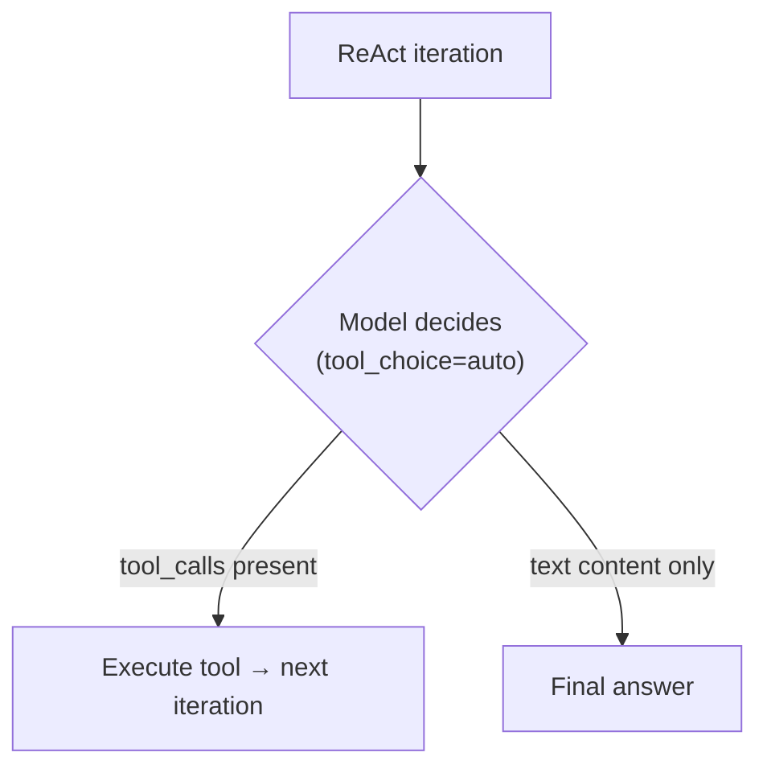
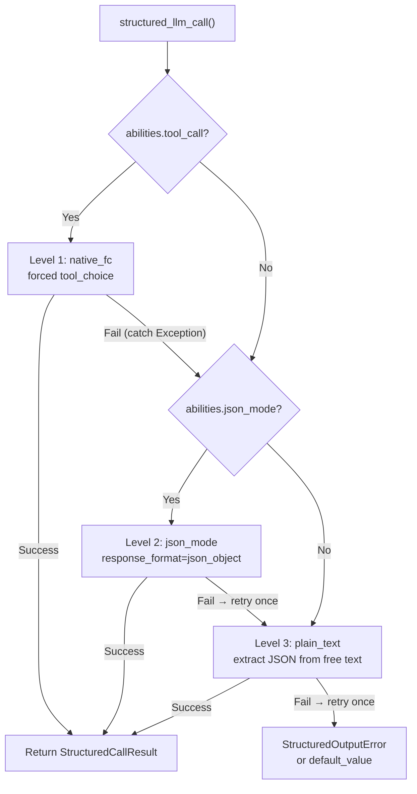
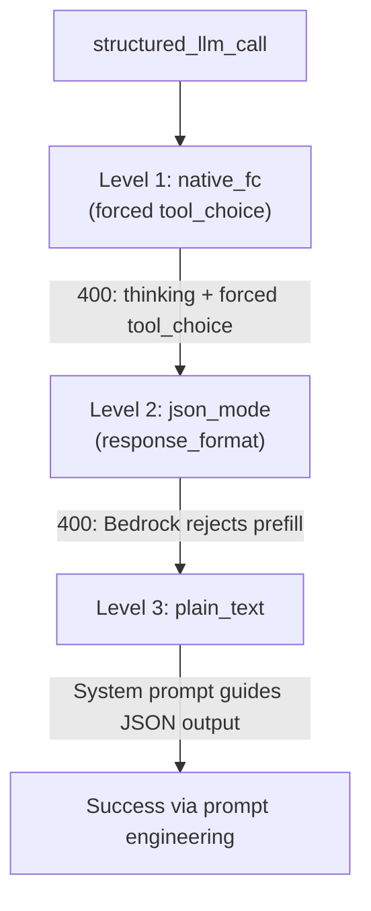

## Provider detection

FIM Agent uses LiteLLM as a universal adapter. The `_resolve_litellm_model()` function in `core/model/openai_compatible.py` maps the user's `LLM_BASE_URL` + `LLM_MODEL` to a LiteLLM model identifier with a provider prefix. The prefix determines how LiteLLM routes the request — native API protocol (Anthropic Messages API, Gemini, etc.) or generic OpenAI-compatible `/v1/chat/completions`.

Resolution order:

1. **Explicit provider** (from DB `ModelConfig.provider` field) — highest priority. If the provider matches a known domain in the URL, no `api_base` is returned (LiteLLM routes natively). Otherwise, `api_base` is set to the relay URL.
2. **Domain match** against `KNOWN_DOMAINS` — official API endpoints are recognized by hostname.
3. **URL path hint** against `PATH_PROVIDER_HINTS` — common on relay platforms like UniAPI where `/claude` or `/anthropic` in the path indicates the upstream protocol.
4. **Fallback** — `openai/` prefix (generic OpenAI-compatible).

| Domain / Path | Provider prefix | Protocol |
|---|---|---|
| `api.openai.com` | `openai/` | OpenAI Chat Completions |
| `anthropic.com` | `anthropic/` | Anthropic Messages API |
| `generativelanguage.googleapis.com` | `gemini/` | Google Gemini |
| `api.deepseek.com` | `deepseek/` | DeepSeek (OpenAI-compatible) |
| `api.mistral.ai` | `mistral/` | Mistral |
| Path contains `/claude` or `/anthropic` | `anthropic/` | Anthropic Messages API (via relay) |
| Path contains `/gemini` | `gemini/` | Google Gemini (via relay) |
| Anything else | `openai/` | Generic OpenAI-compatible |

When the provider prefix is a native protocol (anthropic, gemini, etc.) and the URL is not the official endpoint, LiteLLM uses the native protocol but sends requests to the relay's `api_base`. This means provider-specific behaviors — including the Bedrock prefill issue described below — apply regardless of whether the request goes to the official API or through a relay.

<Warning>
If your relay URL contains `/claude` in the path, FIM Agent automatically routes via Anthropic's native protocol. This is usually correct (better streaming, thinking support), but means provider-specific behaviors apply — including the Bedrock prefill issue described below.
</Warning>

## tool_choice — the four modes

The `tool_choice` parameter is standardized via the OpenAI format. LiteLLM translates it to each provider's native protocol before sending the request.

| Mode | Meaning | Provider support |
|---|---|---|
| `"auto"` | Model decides whether to call a tool or respond with text | All providers |
| `"required"` | Must call a tool, but model chooses which | Most providers |
| `{"type":"function","function":{"name":"X"}}` | Must call function X specifically | Most providers — **incompatible with Anthropic thinking** |
| `"none"` | Cannot use tools, text only | All providers |

The distinction between `"auto"` and forced (`{"type":"function",...}`) is the crux of every compatibility issue in FIM Agent. These two modes are used by completely different subsystems with different requirements.

## Where tool_choice is used

Two subsystems use `tool_choice`, and they use it in fundamentally different ways.

### ReAct engine — tool_choice="auto"

The ReAct loop needs the model to decide each iteration: call a tool, or give a final answer. Only `"auto"` makes sense here — the model freely chooses between producing `tool_calls` or text content. This is compatible with all providers, all models, and all modes including extended thinking.



The ReAct engine uses native function calling (`_run_native`) when `abilities["tool_call"] = True`, falling back to JSON-in-content mode (`_run_json`) otherwise. Both modes use `"auto"` — the difference is whether tools are passed via the `tools` parameter or described in the system prompt. See [ReAct Engine — Dual-mode execution](/architecture/react-engine#dual-mode-execution) for details.

### structured_llm_call — tool_choice=forced

One-shot structured extraction (schema annotation, DAG planning, plan analysis). Forces the model to call a specific virtual function, guaranteeing structured JSON output. This is the call site that triggers provider-specific errors.

`structured_llm_call` implements a 3-level degradation chain:



The critical design difference: `structured_llm_call`'s fallback is **runtime** — it dynamically tries each level and catches exceptions to fall through. The ReAct engine's mode selection is **build-time** — it checks `_native_mode_active` once at the start and commits to one mode for the entire loop. This means `structured_llm_call` can recover from provider-specific 400 errors transparently, while ReAct relies on the mode being correctly chosen upfront.

## The Bedrock prefill trap

When `response_format={"type":"json_object"}` is passed for a model resolved with the `anthropic/` prefix, LiteLLM internally injects an assistant prefill message to simulate JSON mode. The Anthropic Messages API has no native `response_format` parameter, so LiteLLM approximates it by prepending an opening brace as assistant content:

```json
{"role": "assistant", "content": "{"}
```

This works on Anthropic's direct API. However, newer AWS Bedrock model versions reject any conversation whose last message has `role: "assistant"` — they call this "assistant message prefill" and throw:

```
ValidationException: This model does not support assistant message prefill.
The conversation must end with a user message.
```

This error occurs only when **all three conditions** are met simultaneously:

1. The model is resolved with the `anthropic/` prefix (via domain match or URL path hint).
2. `response_format={"type":"json_object"}` is passed (the json_mode code path in `structured_llm_call`).
3. The actual backend is AWS Bedrock (which rejects prefill).

<Warning>
This does NOT affect native tool calling (`tool_choice="auto"` with `tools=` parameter). The prefill injection only happens for `response_format`. ReAct agent execution is completely unaffected.
</Warning>

The failure path in practice looks like this:



When both Level 1 (thinking conflict) and Level 2 (Bedrock prefill) fail, the system still recovers at Level 3 — but at the cost of two wasted LLM calls per structured extraction. The fix below eliminates the wasted json_mode call.

### The fix: json_mode_enabled

A per-model `json_mode_enabled` flag controls whether Level 2 (json_mode) is ever attempted:

- **DB-configured models**: toggle in Admin → Models → Advanced settings. The flag is stored on `ModelConfig.json_mode_enabled` (default `TRUE`).
- **ENV-configured models**: set `LLM_JSON_MODE_ENABLED=false` in your environment.
- **Effect**: when disabled, `abilities["json_mode"]` returns `False` → `response_format` is never passed → no prefill → Bedrock works. The degradation chain becomes `native_fc → plain_text`, skipping the doomed json_mode call entirely.
- **No quality loss**: the model still returns valid JSON because the system prompt instructs it to. The plain_text level uses `extract_json()` to parse JSON from free-form content, which works reliably with modern models.

## Anthropic thinking + forced tool_choice

Anthropic's API rejects `tool_choice={"type":"function","function":{"name":"X"}}` when extended thinking is enabled. The error:

```
Thinking may not be enabled when tool_choice forces tool use
```

This is a semantic conflict at the protocol level: forcing a specific tool call contradicts the model's freedom to reason about which tool to call (or whether to call one at all). Anthropic enforces this constraint; other providers do not.

The conflict **only affects** `structured_llm_call`'s Level 1 (native_fc), which uses forced `tool_choice` to guarantee structured output. The existing `try/except` in `_call_llm` catches the 400 response and falls through to json_mode or plain_text. No special handling is needed in the `abilities` dict.

Crucially, `tool_choice="auto"` works perfectly with Anthropic thinking enabled. The ReAct engine uses `"auto"` exclusively, so it is never affected.

<Warning>
Do NOT set `abilities["tool_call"] = False` to work around the thinking + forced tool_choice conflict. That would disable ReAct's `_run_native` mode (which uses `tool_choice="auto"` and works fine with thinking), forcing it into `_run_json` mode. In `_run_json`, the model must produce valid JSON in its content — which is less reliable and, on Bedrock, could trigger the prefill issue if json_mode is enabled. The correct fix is to let the `structured_llm_call` fallback chain handle it.
</Warning>

## Quick reference: what works where

| Scenario | ReAct mode | structured_llm_call path | Notes |
|---|---|---|---|
| OpenAI (any model) | `_run_native` | native_fc | Full support, no caveats |
| Anthropic (no thinking) | `_run_native` | native_fc | Full support |
| Anthropic + thinking | `_run_native` | native_fc → 400 → json_mode | Auto-fallback, one wasted call |
| Bedrock relay (no thinking) | `_run_native` | native_fc | Full support |
| Bedrock relay + thinking | `_run_native` | native_fc → 400 → json_mode → 400 → plain_text | Two wasted calls; set `json_mode_enabled=false` |
| Bedrock relay + `json_mode_enabled=false` | `_run_native` | native_fc → 400 → plain_text | Recommended config for Bedrock with thinking |
| Bedrock relay (no thinking) + `json_mode_enabled=false` | `_run_native` | native_fc | No impact — native_fc succeeds on first try |
| Gemini | `_run_native` | native_fc | Full support |
| DeepSeek | `_run_native` | native_fc | Full support |
| Generic OpenAI-compatible | `_run_native` | native_fc | Full support |
| Any model with `tool_call=false` | `_run_json` | json_mode or plain_text | Fallback for models without tool-call support |

**Recommended configuration for AWS Bedrock relays:**

```bash
# In .env or environment
LLM_JSON_MODE_ENABLED=false
```

Or per-model in the admin UI: Admin → Models → select the Bedrock model → Advanced → disable "JSON Mode."

This eliminates all wasted calls. The degradation path becomes `native_fc → plain_text` (no thinking) or `native_fc → 400 → plain_text` (with thinking). Both paths are fast and reliable.

## Reasoning effort and thinking configuration

FIM Agent exposes two env vars for controlling extended thinking / reasoning:

| Variable | Values | Effect |
|---|---|---|
| `LLM_REASONING_EFFORT` | `low`, `medium`, `high` | Passed as `reasoning_effort` to LiteLLM. Anthropic: mapped to `thinking` param. OpenAI o-series: passed through. Others: silently dropped (`drop_params=True`). |
| `LLM_REASONING_BUDGET_TOKENS` | integer (e.g. `10000`) | Anthropic only: sets an explicit `thinking.budget_tokens` cap, bypassing LiteLLM's auto-mapping. Useful for controlling costs on Claude models. |

When `reasoning_effort` is set and the model is resolved as `anthropic/`, two additional behaviors apply:

1. **Temperature is forced to 1.0.** Bedrock rejects `temperature != 1.0` when thinking is enabled. FIM Agent handles this automatically — no user action needed.
2. **GPT-5.x with tools**: `reasoning_effort` is silently dropped when `tools` are present, because the GPT-5 `/v1/chat/completions` endpoint rejects the combination. This only affects the ReAct tool loop; `structured_llm_call` calls that lack a `tools` parameter are unaffected.

## Troubleshooting

**"This model does not support assistant message prefill"**
Bedrock + json_mode. Set `LLM_JSON_MODE_ENABLED=false` or disable JSON Mode in the admin model settings.

**"Thinking may not be enabled when tool_choice forces tool use"**
Anthropic thinking + forced function call in `structured_llm_call`. This is **expected behavior, not an error**. The fallback chain catches the 400, skips native_fc, and succeeds at json_mode or plain_text. The log is at DEBUG level — you will only see it if `LOG_LEVEL=DEBUG`. Cost: ~300ms network round-trip, zero tokens (the model never runs on a 400). No action needed.

**ReAct falls back to JSON mode unexpectedly**
Check that the model's `abilities["tool_call"]` is `True`. This is always `True` for `OpenAICompatibleLLM`, but a custom `BaseLLM` subclass might override it. Verify with the model detail endpoint in the admin API.

**structured_llm_call exhausts all levels and raises StructuredOutputError**
The model failed to produce parseable JSON at any level. This is rare with modern models. Check: (1) the schema is valid JSON Schema, (2) the model has enough `max_tokens` to produce the full response, (3) the system prompt is not contradicting the schema instructions. The DAG planner and analyzer both provide `default_value` fallbacks, so this error only propagates from call sites that explicitly omit defaults.
