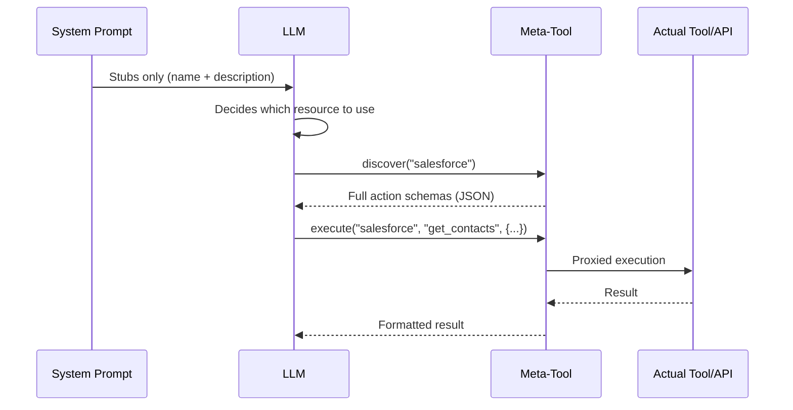
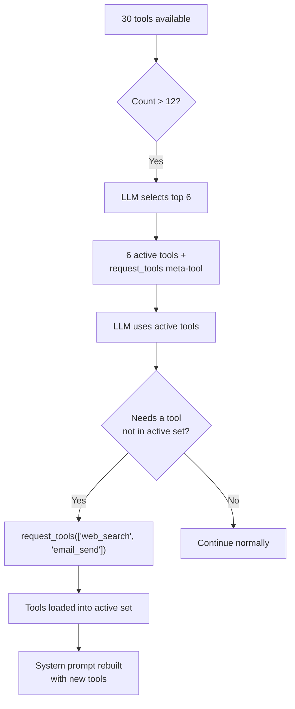

## The problem

LLMs pay for context in two currencies: tokens and attention. Every tool definition injected into the system prompt costs both. A single MCP server can expose 90+ tools. Five API connectors with 20 actions each produce 100 tool definitions. Three database connectors with 30 tables each generate another 90 schema descriptions. Before the user even types a word, the system prompt can consume 50--100KB of context -- half the budget of a 128K model.

The cost is not just tokens. Research and practice consistently show that **LLM accuracy degrades as irrelevant context grows.** An agent with 80 tool definitions in its system prompt performs measurably worse on tool selection than one with 6. The model spends attention on tool schemas it will never use, diluting its focus on the tools and instructions that matter.

The naive solution -- inject everything, let the model sort it out -- does not scale. FIM One takes the opposite approach: **show the LLM the minimum it needs to make a decision, and let it request more when it needs more.**

## The pattern

Progressive disclosure follows a two-tier architecture across all resource types:

1. **Tier 1 -- Stubs in the system prompt.** Lightweight summaries: a name, a short description, and enough metadata (action count, table count, tool count) for the LLM to decide whether it needs more.

2. **Tier 2 -- Full details on demand.** The LLM calls a meta-tool to retrieve complete schemas, parameters, and execution capabilities. The full detail enters the conversation as a tool result message -- scoped to that turn, not permanently occupying the system prompt.



The key insight: **full tool schemas are conversation-scoped, not prompt-scoped.** They appear as tool result messages that the context management system can summarize or truncate in later turns. In contrast, system prompt content persists across the entire conversation at full size.

## Five disclosure mechanisms

FIM One applies progressive disclosure uniformly across five resource types. Each uses the same two-tier pattern but with a meta-tool tailored to its semantics.

| Resource | Meta-Tool | Stubs Show | On-Demand Returns | Config Var | Default |
|---|---|---|---|---|---|
| Skills | `read_skill` | Name + description (120 chars) | Full SOP content + embedded script | `SKILL_TOOL_MODE` | `progressive` |
| API Connectors | `connector` | Connector name + action list | Full action schemas with parameters | `CONNECTOR_TOOL_MODE` | `progressive` |
| Database Connectors | `database` | DB name + table names + counts | Column schemas, SQL query execution | `DATABASE_TOOL_MODE` | `progressive` |
| MCP Servers | `mcp` | Server name + tool list | Full tool schemas + invocation | `MCP_TOOL_MODE` | `progressive` |
| Built-in Tools | `request_tools` | Compact catalog (name + 80-char desc) | Full tool schema injected into session | _(auto)_ | Auto when >12 tools |

### Skills -- `read_skill`

**What the LLM sees initially:**

```
## Available Skills
Call read_skill(name) to load full content before executing any of these:
- Customer Complaint SOP: Handle escalations per company policy...
- Refund Processing: Step-by-step refund workflow with approval gates...
```

Each stub is roughly 30 tokens -- a name plus a 120-character description truncated from the full Skill content.

**What happens on demand:** The LLM calls `read_skill("Customer Complaint SOP")` and receives the complete SOP text -- potentially thousands of tokens of step-by-step instructions, decision trees, and embedded scripts. This content enters as a tool result, not as system prompt text, so it is subject to normal context management (summarization, truncation) in later turns.

**Legacy mode:** `SKILL_TOOL_MODE=inline` embeds the full Skill content directly in the system prompt. Suitable when you have few, small Skills -- but scales poorly.

**Context savings:** A deployment with 10 Skills averaging 2,000 tokens each consumes ~300 tokens in progressive mode (stubs only) vs. ~20,000 tokens in inline mode. That is a 98% reduction in persistent context cost.

### API Connectors -- `connector`

**What the LLM sees initially:**

```
Interact with external services. Available connectors:
  - salesforce: CRM system -- actions: get_contacts, create_lead, update_opportunity
  - jira: Project management -- actions: create_issue, get_issue, search_issues

Subcommands:
  discover <name> -- list actions with full parameter schemas
  execute <name> <action> {"param": "value"} -- run an action
```

Each connector stub lists action names but not parameter schemas. The LLM knows *what* actions exist but not *how* to call them -- which is exactly the right level of detail for deciding whether to use a connector.

**What happens on demand:** `connector("discover", "salesforce")` returns the full action schemas including HTTP methods, URL paths, parameter JSON Schemas, and request body templates. `connector("execute", "salesforce", "get_contacts", {"limit": 10})` proxies execution through `ConnectorToolAdapter` with full auth injection and audit logging.

**Legacy mode:** `CONNECTOR_TOOL_MODE=legacy` registers each action as a separate tool (`salesforce__get_contacts`, `salesforce__create_lead`, etc.). A connector with 20 actions becomes 20 tool definitions in the system prompt.

**Context savings:** A connector with 15 actions generates ~50 tokens of stub vs. ~3,000 tokens of full schemas. Five connectors: ~250 tokens progressive vs. ~15,000 tokens legacy.

### Database Connectors -- `database`

**What the LLM sees initially:**

```
Query connected databases. Available databases:
  - hr_postgres: HR system (12 tables: employees, departments, salaries ...)
  - analytics_db: Analytics warehouse (45 tables: events, sessions, users ...)

Subcommands:
  list_tables <database> -- table names, descriptions, column counts
  discover <database> [table] -- full column schemas for one or all tables
  query <database> <sql> -- execute a SQL query
```

Database stubs include table names (up to 10) and counts, giving the LLM enough to decide which database to query without loading any column schemas.

**What happens on demand:** Three subcommands form a natural discovery flow:

1. `database("list_tables", "hr_postgres")` -- returns all table names with descriptions and column counts.
2. `database("discover", "hr_postgres", table="employees")` -- returns full column schemas (name, type, nullable, primary key, descriptions).
3. `database("query", "hr_postgres", sql="SELECT ...")` -- executes a validated SQL query with safety checks and row limits.

The three-step flow mirrors how a developer explores a new database: browse tables, inspect schema, then query. The LLM follows the same pattern naturally.

**Legacy mode:** `DATABASE_TOOL_MODE=legacy` registers three tools per database (`{db}__list_tables`, `{db}__describe_table`, `{db}__query`). With 5 database connectors, that is 15 tool definitions instead of 1.

**Context savings:** A database with 30 tables and 200 columns generates ~80 tokens of stub vs. ~5,000 tokens of full schema. The savings compound with multiple databases.

### MCP Servers -- `mcp`

**What the LLM sees initially:**

```
Interact with MCP servers. Available servers:
  - github: GitHub (35 tools: create_issue, list_repos, get_pull_request ...)
  - slack: Slack (12 tools: send_message, list_channels, upload_file ...)

Subcommands:
  discover <server> -- list tools with full parameter schemas
  call <server> <tool> {"param": "value"} -- invoke an MCP tool
```

MCP servers are the most dramatic case for progressive disclosure. A GitHub MCP server exposes 35+ tools. A filesystem server exposes 20+. Without progressive disclosure, connecting 3 MCP servers could inject 70+ tool definitions into the system prompt -- each with full JSON Schema parameters.

**What happens on demand:** `mcp("discover", "github")` returns the complete tool catalog with parameter schemas. `mcp("call", "github", "create_issue", {"title": "Bug report", "body": "..."})` delegates to the stored `MCPToolAdapter`, which communicates with the MCP server process.

**Legacy mode:** `MCP_TOOL_MODE=legacy` registers each MCP tool as a separate tool (`github__create_issue`, `github__list_repos`, etc.). This can easily exceed the tool selection threshold and trigger unnecessary selection phases.

**Context savings:** The savings here are extreme. A GitHub MCP server's 35 tools might consume 10,000+ tokens of schema. In progressive mode, the stub costs ~100 tokens. If the user never needs GitHub in that conversation, those 10,000 tokens are never spent.

### Built-in Tools -- `request_tools`

The fifth mechanism is architecturally different from the other four. It does not consolidate a resource type behind a meta-tool. Instead, it addresses the **tool selection bottleneck** -- what happens when the agent has more than 12 tools available.

**How it works:** When the total tool count exceeds `REACT_TOOL_SELECTION_THRESHOLD` (default: 12), the ReAct engine runs a lightweight LLM call to select the top 6 most relevant tools for the current query. The remaining tools are stored in a full registry. A `request_tools` meta-tool is automatically registered, listing all unloaded tools as a compact catalog (name + 80-character description).



**What the LLM sees initially:**

```
Load additional tools into the current session.
Available tools not yet loaded:
- web_search: Search the web for current information and return relevant results...
- email_send: Send an email to one or more recipients with subject, body, and opt...
- python_exec: Execute Python code in a sandboxed environment and return the output...
```

**What happens on demand:** `request_tools(tool_names=["web_search", "email_send"])` copies those tools from the full registry into the active registry. The system prompt is rebuilt on the next iteration so the LLM sees the full schemas. This is a side-effect -- the tool mutates the active tool set mid-conversation.

**No env var:** This mechanism activates automatically when tool selection filters the set. There is no `REQUEST_TOOLS_MODE` environment variable. If you want to disable tool selection entirely, set `REACT_TOOL_SELECTION_THRESHOLD` to a very high number.

**Context savings:** The savings depend on how many tools are available and how many the selection picks. An agent with 30 tools seeing only 6 active schemas + the `request_tools` catalog saves roughly 60--70% of the tool schema context.

## How it fits into the tool assembly pipeline

The [System Overview](/architecture/system-overview) describes an 8-step per-request tool assembly pipeline. Progressive disclosure acts at multiple points:

| Pipeline Step | Progressive Disclosure Role |
|---|---|
| **1. Base discovery** | No effect -- built-in tools are loaded normally |
| **2. Agent category filter** | No effect -- category filtering applies regardless of mode |
| **3. KB injection** | No effect -- KB tools are naturally lightweight (1--2 tools) |
| **4. Connector loading** | `ConnectorMetaTool` consolidates all API connectors; `DatabaseMetaTool` consolidates all DB connectors |
| **5. MCP loading** | `MCPServerMetaTool` consolidates all MCP servers into one tool |
| **6. Skills injection** | `ReadSkillTool` replaces full content with compact stubs in system prompt |
| **7. CallAgent registration** | No effect -- `call_agent` is already a single tool with a catalog |
| **8. Runtime selection** | `request_tools` meta-tool registered when selection filters the set |

The net effect: steps 4--6 each reduce their tool count to 1 (or a small constant), and step 8 adds a safety net for dynamically loading anything the selection phase missed. A Hub agent that would have 50+ tools in legacy mode might present 8--10 in progressive mode -- well below the selection threshold.

## Configuration

Four environment variables control progressive disclosure, one per resource type:

| Variable | Values | Default | Effect |
|---|---|---|---|
| `SKILL_TOOL_MODE` | `progressive` / `inline` | `progressive` | Skills: stubs + `read_skill` vs. full content in system prompt |
| `CONNECTOR_TOOL_MODE` | `progressive` / `legacy` | `progressive` | API Connectors: single `connector` meta-tool vs. individual action tools |
| `DATABASE_TOOL_MODE` | `progressive` / `legacy` | `progressive` | DB Connectors: single `database` meta-tool vs. 3 tools per database |
| `MCP_TOOL_MODE` | `progressive` / `legacy` | `progressive` | MCP Servers: single `mcp` meta-tool vs. individual server tools |

**Agent-level override.** Each env var can be overridden per-Agent via the `model_config_json` field:

```json
{
  "model_config_json": {
    "skill_tool_mode": "inline",
    "connector_tool_mode": "legacy",
    "database_tool_mode": "progressive",
    "mcp_tool_mode": "progressive"
  }
}
```

**Priority order:** Agent config > environment variable > default.

This means you can run `progressive` globally (the default) and selectively override for specific Agents. An Agent with a single small Skill might use `inline` mode. An Agent that needs the LLM to see all connector actions upfront (e.g., for fine-tuned models that do not reliably call meta-tools) might use `legacy` mode.

**`request_tools` has no configuration.** It activates automatically when tool selection produces a filtered subset. The threshold is controlled by `REACT_TOOL_SELECTION_THRESHOLD` (default: 12) and the max selection count by `REACT_TOOL_SELECTION_MAX` (default: 6).

## Design decisions

### Why explicit (LLM-driven) rather than implicit (framework-driven)?

An alternative design would have the framework automatically expand tool schemas based on heuristics -- e.g., detecting which connector the user's query is about and injecting its schemas before the LLM sees the prompt. FIM One deliberately chose the LLM-driven approach for three reasons:

1. **The LLM is better at intent detection than heuristics.** A query like "check if the customer has an open ticket and update their profile" involves two connectors. Heuristic matching on keywords is fragile; the LLM naturally identifies both.

2. **Transparency.** When the LLM calls `connector("discover", "jira")`, the action appears in the tool trace. The user (and the developer debugging) can see exactly which schemas were loaded and when. Implicit expansion is invisible.

3. **Context efficiency.** The framework cannot know which actions within a connector the LLM will need. Expanding all actions for a connector wastes tokens on irrelevant ones. The LLM first sees the action names (via the stub), then requests only the specific action's schema -- two-tier disclosure at its purest.

### Why per-resource meta-tools rather than one universal tool?

A single `discover_resource(type, name)` tool would be simpler to implement but worse for the LLM. Per-resource meta-tools provide:

- **Typed parameters.** `connector` has `subcommand`, `connector`, `action`, `parameters`. `database` has `subcommand`, `database`, `table`, `sql`. The parameter schemas tell the LLM exactly what is expected.
- **Enum constraints.** Each meta-tool lists its valid names (connector names, database names, server names) as enum values in the schema. The LLM cannot hallucinate a connector name.
- **Category semantics.** The `connector` tool has category `connector`, `database` has category `database`, `mcp` has category `mcp`. This feeds into agent category filtering -- an Agent configured with only `connector` category will not see the `database` or `mcp` meta-tools.

### Why both progressive and legacy modes?

Not all LLMs handle meta-tools equally well. Smaller or fine-tuned models may struggle with the two-step discover-then-execute pattern. Legacy mode provides a direct fallback where every action is a standalone tool with its full schema visible -- no meta-tool indirection required.

The dual-mode design also supports migration. Existing deployments can switch to progressive mode incrementally, testing one resource type at a time by changing a single environment variable. Each environment variable acts as a feature flag -- blast radius is limited to a single resource type, and rollback is a one-line config change.

A third, more practical reason: **debugging.** In legacy mode every tool call is explicit and self-contained -- `salesforce__get_contacts(limit=10)` is immediately readable in logs and traces. In progressive mode the same call is `connector("execute", "salesforce", "get_contacts", {"limit": 10})` -- an extra layer of indirection that requires parsing the meta-tool arguments to understand what actually happened. During development and troubleshooting, switching a single resource type back to legacy mode can significantly speed up diagnosis without affecting other resource types.
