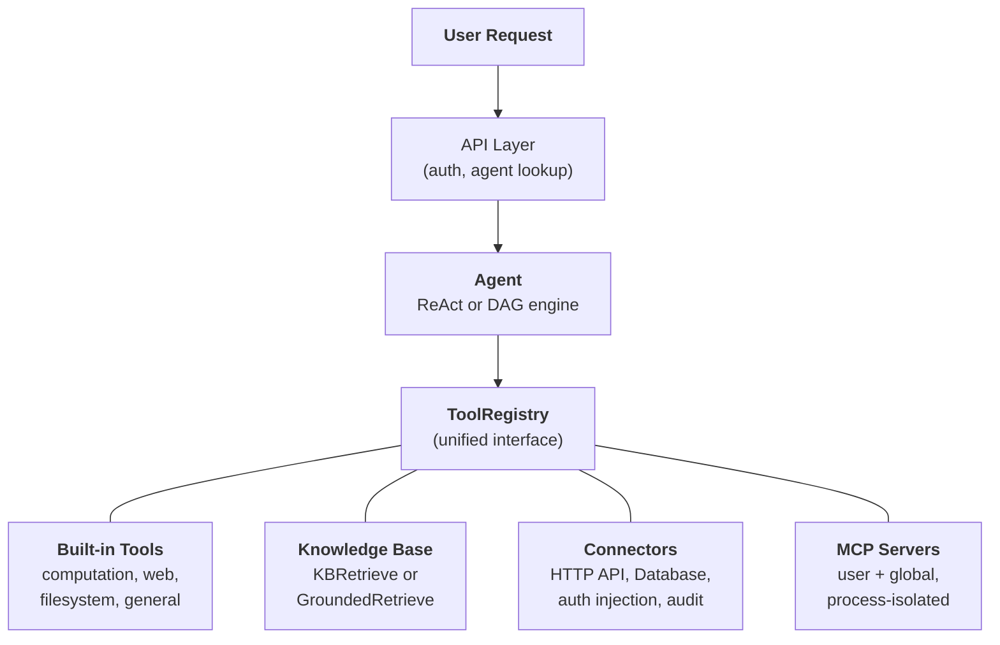
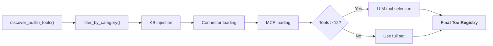

## The unified tool abstraction

The central design insight in FIM Agent is that **everything the agent can do is a tool**. A calculator, a knowledge base query, an ERP API call, and a third-party MCP server all implement the same `Tool` protocol: `name`, `description`, `parameters_schema`, `category`, and `run()`. The agent does not know or care whether it is calling a local Python function, querying a vector database, proxying into a legacy system, or invoking a community MCP server. It sees a flat list of callable tools in a `ToolRegistry`.

This is a deliberate architectural choice, not an accidental simplification. It means adding a new capability source never requires changing the agent, the execution engines, or the context management layer. You register tools; the agent uses them.

Four capability sources converge into one registry. The agent draws from all of them equally.

## Four capability sources

### Built-in Tools

Auto-discovered at startup via `discover_builtin_tools()`. Drop a `BaseTool` subclass into `core/tool/builtin/`, and it registers without any configuration. Categories include computation (`calculator`, `python_exec`), web (`web_search`, `web_fetch`), filesystem (`file_ops`), and general (`email_send`, `json_transform`, `template_render`, `text_utils`). These are the agent's native abilities -- always available, zero setup.

### Knowledge Base

Conditional. When an agent has bound `kb_ids`, the generic `kb_retrieve` tool is swapped for a specialized retrieval tool. In **simple mode**, `KBRetrieveTool` performs basic RAG retrieval. In **grounding mode**, `GroundedRetrieveTool` runs a 5-stage pipeline: multi-KB retrieve, citation extraction, alignment scoring, conflict detection, and confidence computation. The Knowledge Base is not a separate subsystem sitting beside the agent -- it enters the agent as a specialized tool, subject to the same `Tool` protocol as everything else.

### Connector

`ConnectorToolAdapter` wraps enterprise system actions as tools. Each action becomes a tool named `{connector}__{action}`, categorized as `connector`. The adapter adds HTTP proxy with auth injection (bearer, API key, basic), operation-level access control (read/write/admin), response truncation, and audit logging. For direct database access, `DatabaseToolAdapter` provides schema-aware SQL execution with optional read-only enforcement. Connectors are the bridge between AI and legacy systems -- the core differentiator. See [Connector Architecture](/architecture/connector-architecture) for the full design.

### MCP

External MCP servers provide third-party tools via the standard protocol. Each server runs in its own process (stdio or HTTP transport), fully isolated from the platform. Tools are adapted into the `Tool` protocol and registered under category `mcp`. Admins can provision **global MCP servers** that load for all users automatically. MCP is the ecosystem play -- any MCP-compatible server works without custom integration.

## Per-request tool assembly

Every chat request assembles a fresh tool set through a filtering pipeline in `_resolve_tools()`. This is not a static configuration -- it is computed per request based on the agent's settings, the user's identity, and the available connectors and MCP servers.

The six steps:

1. **Base discovery.** `discover_builtin_tools()` loads all built-in tools, scoped to the conversation's sandbox.
2. **Agent category filter.** `filter_by_category(*agent.tool_categories)` restricts to only the categories the agent is allowed to use.
3. **KB injection.** If the agent has `kb_ids`, the generic retrieval tool is replaced with `KBRetrieveTool` or `GroundedRetrieveTool` based on retrieval mode.
4. **Connector loading.** The agent's bound connectors are queried from the database. Each connector's actions (or database schemas) are instantiated as tool adapters and registered.
5. **MCP loading.** The user's personal MCP servers plus admin-provisioned global MCP servers are loaded, connected, and their tools registered.
6. **Runtime selection.** If the total tool count exceeds 12, a lightweight LLM call picks the most relevant subset (up to 6) for this specific query. Selection failure is non-fatal -- the agent falls back to the full set.

The result: the agent sees exactly the tools it needs, no more. A simple agent with no connectors and no KB might see 5 tools. A Hub agent connected to 3 enterprise systems with a grounded knowledge base and 2 MCP servers might see 30 -- but after selection, only the 6 most relevant make it into the context.

## When to use what

| Need | Use | Why |
|------|-----|-----|
| General computation, code execution, text transforms | Built-in Tool | Always available, no config needed |
| Enterprise system integration (ERP, CRM, OA) | Connector | Auth governance, audit trail, operation-level access control |
| Knowledge retrieval with citations and evidence | Knowledge Base | RAG pipeline, grounded generation, conflict detection |
| Third-party tool ecosystem | MCP | Standard protocol, process isolation, community servers |
| Direct database access | Database Connector | Schema-aware SQL, optional read-only enforcement |
| Custom internal tooling | MCP or Built-in | MCP for process isolation; built-in for tight integration |

The categories are not mutually exclusive. A single agent can use all four capability sources in one conversation -- querying a knowledge base for policy documents, calling a connector to check the ERP, and using a built-in tool to format the results.

## Execution engines are orthogonal

The tool system and execution engines are independent concerns. Both engines consume tools from the same `ToolRegistry`. The choice of engine affects how tools are orchestrated, not which tools are available.

**ReAct** is an iterative tool loop. The agent reasons, picks a tool, observes the result, and repeats until done. It excels at exploratory, conversational tasks where the next step depends on the previous result. The loop runs up to 50 iterations with per-iteration context management via ContextGuard. See [ReAct Engine](/architecture/react-engine) for implementation details.

**DAG** decomposes a goal into 2-6 parallel steps. Each step runs an independent ReAct agent. A PlanAnalyzer evaluates whether the goal was achieved; if not, the pipeline re-plans autonomously (up to 3 rounds). DAG excels at tasks with clear subtasks that can run concurrently -- "search three sources and compare results" finishes in the time of one search, not three. See [DAG Engine](/architecture/dag-engine) for the full pipeline.

The two engines share infrastructure: `structured_llm_call` for reliable structured output, `ContextGuard` for token budget enforcement, and the `ToolRegistry` for tool resolution. Adding a new tool requires zero changes to either engine. Adding a new engine (should one ever be needed) requires zero changes to the tool system.

## Lifecycle overview

**Startup.** `start.sh` runs Alembic migrations, launches the FastAPI server, discovers built-in tools, and establishes MCP server connections for any pre-configured global servers.

**Per-request.** JWT authentication, agent configuration lookup, tool assembly (the 6-step pipeline above), engine selection (ReAct or DAG based on agent config), execution with SSE streaming, and result persistence.

**Cross-cutting concerns.** [Context management](/architecture/context-management) (5-layer token budget) protects every LLM call from overflow. Audit logging tracks every connector tool invocation. Sandbox isolation contains code execution tools. The two-LLM architecture (smart + fast) optimizes cost across planning, execution, and synthesis.

The architecture is designed so that each concern -- tool registration, execution orchestration, context management, security -- can evolve independently. A new connector type, a new execution engine, or a new context strategy can be added without cascading changes across the system.
