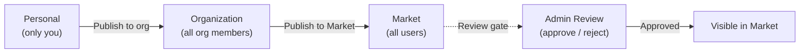

The Market is FIM One's built-in resource marketplace — a place where users browse and subscribe to Agents, Connectors, Knowledge Bases, MCP Servers, Skills, and Workflows published by others.

<Info>
The Market uses a **pull model**: resources are discovered by browsing and explicitly subscribed to. There is no auto-join or push mechanism — users choose what to install.
</Info>

## How It Works

### Publishing

Any resource owner can publish their resource to make it discoverable:



| Visibility | Who can see it | Review required? |
|---|---|---|
| **Personal** | Only the creator | No |
| **Organization** | All members of the creator's org | No (org-level trust) |
| **Market (global)** | All authenticated users | Yes — admin approval required |

Publishing to the Market always goes through a review gate. Admins can approve, reject (with a note), or leave the resource pending. Rejected resources can be revised and resubmitted.

### Subscribing

When you find a resource in the Market, subscribing makes it available in your workspace:

- **Subscribed Connectors** appear in your tool set (auto-discovery mode) and in Agent binding dropdowns
- **Subscribed Agents** appear in your Agent selector and in the `call_agent` catalog
- **Subscribed Skills** are injected into your system prompt (following the same progressive/inline mode)
- **Subscribed Knowledge Bases** are available for retrieval
- **Subscribed MCP Servers** load their tools into your sessions
- **Subscribed Workflows** appear in your Workflow list for execution

Subscriptions are instant — no approval needed from the publisher. Unsubscribe at any time to remove the resource from your workspace.

### The Shadow Org

Under the hood, the Market is implemented as a **shadow organization** — an invisible system org (`MARKET_ORG_ID`) that holds no members. Resources published to the Market are set to `visibility: "org"` within this shadow org, which allows the existing `resolve_visibility()` query to include them naturally.

This means the Market requires **zero special-case code** in the tool assembly pipeline. The same three-tier visibility filter that loads personal and org resources also loads Market resources:

```python
conditions = [
    model.user_id == user_id,           # own resources
    and_(model.visibility == "org",     # org-shared (includes Market shadow org)
         model.org_id.in_(user_org_ids)),
    model.id.in_(subscribed_ids),       # Market-subscribed
]
```

The `subscribed_ids` clause is what makes Market work — when you subscribe, a `ResourceSubscription` row is created, and the resource appears in your visibility filter via that third condition.

## Resource Types

All six resource types support the full Market lifecycle:

| Resource | Publish | Subscribe | What you get |
|---|---|---|---|
| **Agent** | ✅ | ✅ | A specialist agent in your selector and `call_agent` catalog |
| **Connector** | ✅ | ✅ | API/database bridge available as tools |
| **Knowledge Base** | ✅ | ✅ | Retrieval source for RAG queries |
| **MCP Server** | ✅ | ✅ | Third-party tools loaded into sessions |
| **Skill** | ✅ | ✅ | Global SOP injected into system prompt |
| **Workflow** | ✅ | ✅ | Fixed-process automation in your workflow list |

## API

| Endpoint | Description |
|----------|-------------|
| `GET /api/market` | Browse published resources. Supports `?resource_type=`, `?page=`, `?size=` |
| `POST /api/market/subscribe` | Subscribe to a resource (by type + ID) |
| `DELETE /api/market/unsubscribe` | Unsubscribe from a resource |
| `GET /api/market/subscriptions` | List your current subscriptions |

Each resource type also has its own `POST /api/{type}/{id}/publish` and `POST /api/{type}/{id}/unpublish` endpoints for publishing control.
