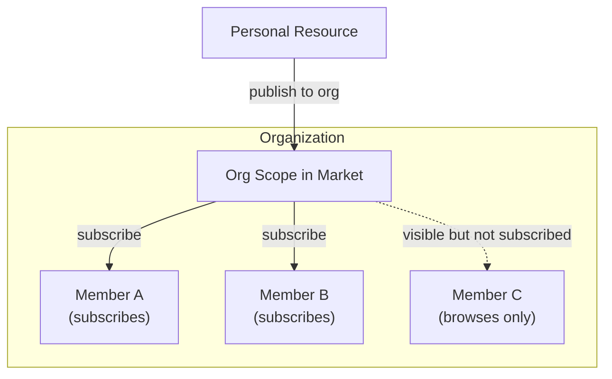
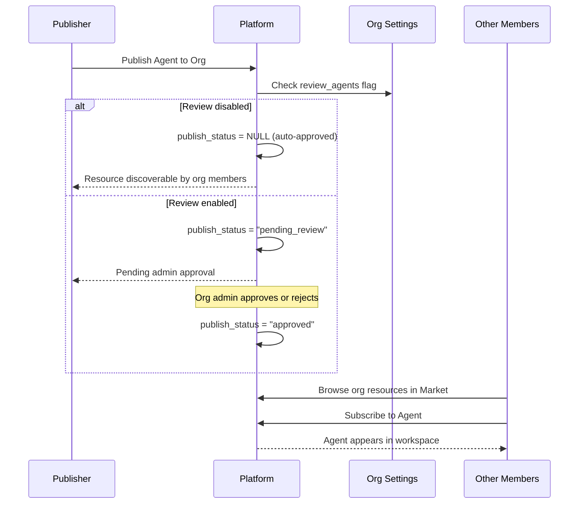
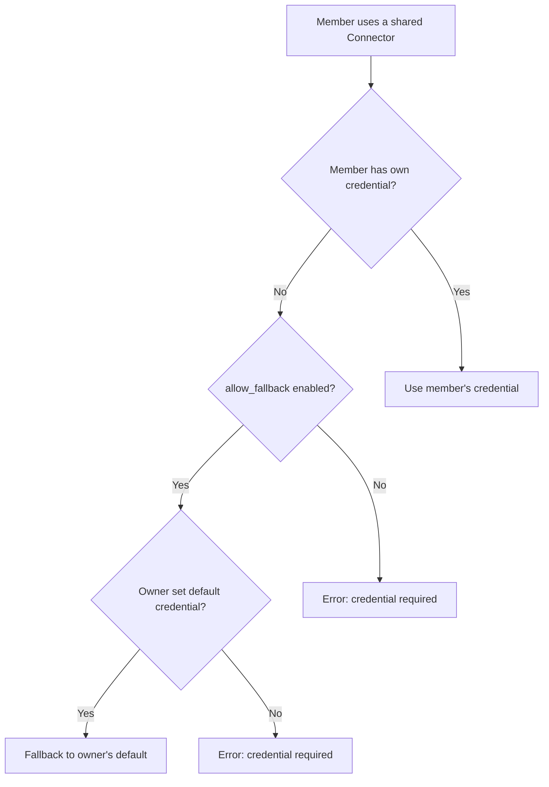

## Übersicht

Organisationen sind FIM One's Einheit für Teamzusammenarbeit. Sie ermöglichen es Benutzergruppen, Ressourcen — Agenten, Konnektoren, Wissensdatenbanken, MCP Server, Workflows und Skills — innerhalb eines vertrauenswürdigen Bereichs zu teilen.

Jede Ressource in FIM One beginnt als **persönlich** (nur für ihren Ersteller sichtbar). Wenn Sie eine Ressource in einer Organisation veröffentlichen, wird sie **auffindbar** für andere Organisationsmitglieder über den Marktplatz im Organisationsbereich. Mitglieder durchsuchen die gemeinsamen Ressourcen der Organisation und abonnieren die, die sie benötigen.



Organisationen und der globale Marktplatz nutzen das gleiche abonnementbasierte Zugriffsmodell. Der Hauptunterschied liegt im Vertrauen: Organisationen stellen ein Team oder Unternehmen dar, in dem sich Mitglieder kennen und vertrauen, daher ist eine Überprüfung optional und die Anmeldedatenverwaltung ist unkompliziert.

## Organisationen erstellen und verwalten

Jeder Benutzer kann **unbegrenzte** Organisationen erstellen und einer beliebigen Anzahl von ihnen beitreten. Eine Organisation hat drei Rollen:

| Rolle | Berechtigungen |
|---|---|
| **Eigentümer** | Vollständige Kontrolle — Mitglieder verwalten, Einstellungen konfigurieren, Überprüfung umgehen |
| **Admin** | Mitglieder verwalten und veröffentlichte Ressourcen überprüfen |
| **Mitglied** | Gemeinsame Ressourcen durchsuchen und abonnieren |

Der Eigentümer ist immer der Benutzer, der die Organisation erstellt hat. Die Eigentümerschaft kann übertragen, aber nicht geteilt werden.

## Veröffentlichung von Ressourcen

Wenn Sie eine Ressource in Ihrer Organisation veröffentlichen, wird sie **nicht** automatisch im Arbeitsbereich jedes Mitglieds angezeigt. Stattdessen wird die Ressource im Organisationsbereich des Market entdeckbar, wo Mitglieder sie durchsuchen und abonnieren können.

Dieses abonnementbasierte Modell gibt jedem Mitglied die Kontrolle über seinen Arbeitsbereich. Eine große Organisation könnte Dutzende von Konnektoren freigeben, aber ein einzelnes Mitglied abonniert nur diejenigen, die für seine Arbeit relevant sind.



### Überprüfungssystem

Überprüfung ist **optional** und wird pro Ressourcentyp konfiguriert. Jede Organisation hat unabhängige Umschalter:

- `review_agents`
- `review_connectors`
- `review_kbs`
- `review_mcp_servers`
- `review_workflows`
- `review_skills`

Wenn die Überprüfung für einen Ressourcentyp deaktiviert ist, sind veröffentlichte Ressourcen sofort für Mitglieder auffindbar — keine Administratoraktion erforderlich. Wenn die Überprüfung aktiviert ist, werden Ressourcen in den Zustand `pending_review` versetzt und erfordern die Genehmigung durch einen Administrator, bevor sie sichtbar werden.

<Tip>
Organisationseigentümer umgehen die Überprüfung automatisch. Ihre veröffentlichten Ressourcen sind immer sofort auffindbar.
</Tip>

Diese Flexibilität ermöglicht es Organisationen, ihre Governance-Anforderungen zu erfüllen. Ein kleines Startup könnte alle Überprüfungsumschalter deaktivieren, um reibungsloses Teilen zu ermöglichen, während ein compliance-fokussiertes Unternehmen die Überprüfung für Agenten und Konnektoren aktiviert, um die Kontrolle zu behalten.

## Credential Fallback

Konnektoren und MCP Server erfordern häufig Anmeldedaten (API-Schlüssel, Datenbankpasswörter, OAuth-Token). FIM One bietet einen **Fallback-Mechanismus**, damit Mitglieder nicht jede Anmeldedaten selbst konfigurieren müssen.



Es gibt zwei Modi:

- **Fallback aktiviert** (`allow_fallback=true`, Standard): Mitglieder, die ihre eigenen Anmeldedaten nicht bereitstellen, verwenden automatisch die Standardanmeldedaten des Besitzers. Dies funktioniert gut für von Teams gemeinsam genutzte API-Schlüssel oder interne Dienste, bei denen ein einzelner Schlüssel das ganze Team abdeckt.
- **Fallback deaktiviert** (`allow_fallback=false`): Jedes Mitglied muss seine eigenen Anmeldedaten konfigurieren. Dies ist angemessen, wenn jeder Benutzer einen persönlichen API-Schlüssel benötigt (z. B. pro-Benutzer-SaaS-Lizenzen).

Ressourcen, die keine Anmeldedaten erfordern – wie ein schreibgeschützter öffentlicher API-Konnektor oder ein Agent ohne Authentifizierung – funktionieren unmittelbar nach dem Abonnement. Keine Konfiguration erforderlich.

<Info>
Der Credential Fallback gilt nur nach dem Abonnement eines Mitglieds für die Ressource. Der Fallback-Mechanismus bestimmt, wie Anmeldedaten zur Laufzeit aufgelöst werden, nicht ob die Ressource zugänglich ist.
</Info>

## Ressourcensichtbarkeit

Jede Ressource in FIM One hat eine `visibility`, die ihren Zugriffsspielraum bestimmt:

| Sichtbarkeit | Bereich | Wer kann sie entdecken |
|---|---|---|
| `personal` | Nur Eigentümer | Der Benutzer, der sie erstellt hat |
| `org` | Organisation | Org-Mitglieder können durchsuchen und abonnieren (falls genehmigt) |

Der Sichtbarkeitsfilter folgt einem einheitlichen Abfragemuster:

```
A resource is available in your workspace if:
  1. You own it (any visibility), OR
  2. It's published to an org you belong to, approved, AND you've subscribed to it
```

<Warning>
Das Veröffentlichen einer Ressource für eine Organisation gewährt keinen automatischen Zugriff. Mitglieder müssen sich über den Marktplatz im Org-Bereich abonnieren, um die Ressource zu ihrem Arbeitsbereich hinzuzufügen.
</Warning>

## Praktische Szenarien

### Ein Datenbank-Connector mit dem Team teilen

1. Alice erstellt einen Connector zur PostgreSQL-Datenbank des Teams
2. Alice veröffentlicht ihn im Org-Bereich ihres Teams (die Überprüfung ist für Connectors deaktiviert)
3. Der Connector wird im Org-Bereich des Market erkannt
4. Bob durchsucht die gemeinsamen Ressourcen der Org, findet den Connector und abonniert ihn
5. Der Connector erscheint in Bobs Workspace und verwendet Alices Datenbank-Anmeldedaten als Fallback
6. Carol abonniert ebenfalls. Dave (ein externer Auftragnehmer) abonniert und konfiguriert stattdessen seine eigenen schreibgeschützten Anmeldedaten

### Organisation mit strenger Überprüfung

1. Ein compliance-fokussiertes Unternehmen aktiviert `review_agents=true` und `review_connectors=true` in seiner Organisation
2. Wenn ein Mitarbeiter einen neuen Agenten veröffentlicht, wechselt dieser in den Zustand `pending_review`
3. Ein Organisations-Admin überprüft die Agenten-Konfiguration und genehmigt sie
4. Der Agent wird auffindbar — andere Mitglieder können ihn jetzt finden und abonnieren
5. Wenn der Herausgeber den genehmigten Agenten später bearbeitet, wird dieser automatisch zur erneuten Genehmigung auf `pending_review` zurückgesetzt

### Selektive Abonnements in einer großen Organisation

1. Eine Organisation veröffentlicht 50+ Konnektoren, die interne APIs, Datenbanken und Dienste von Drittanbietern abdecken
2. Das Datateam abonniert nur Datenbank-Konnektoren und Analytics-APIs
3. Das Marketing-Team abonniert nur die CRM- und E-Mail-Plattform-Konnektoren
4. Der Arbeitsbereich jedes Teammitglieds bleibt fokussiert und übersichtlich

## Siehe auch

- [Market-Architektur](/concepts/market) — Zur globalen Market und deren Beziehung zu Organisationen. Beide verwenden das gleiche Abonnementmodell, aber der Market dient als organisationsübergreifender Discovery-Kanal mit obligatorischer Überprüfung.
- [Agent- und Ressourcen-Discovery](/architecture/agent-discovery) — Wie abonnierte Ressourcen während des Chats in Tool-Sets zusammengestellt werden.
