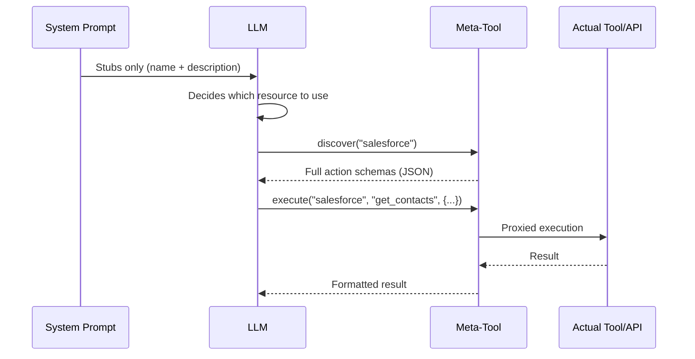
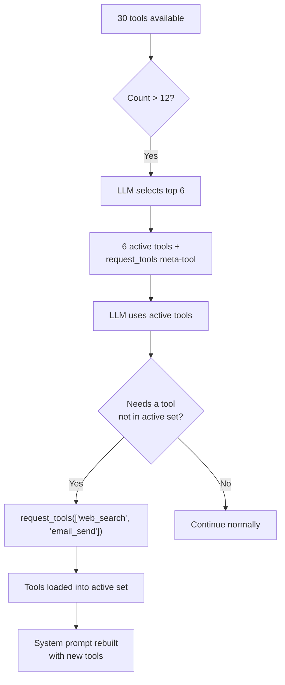

## Das Problem

LLMs zahlen für Kontext in zwei Währungen: Token und Aufmerksamkeit. Jede Werkzeugdefinition, die in den System-Prompt injiziert wird, kostet beides. Ein einzelner MCP-Server kann über 90 Werkzeuge bereitstellen. Fünf API-Konnektoren mit je 20 Aktionen erzeugen 100 Werkzeugdefinitionen. Drei Datenbank-Konnektoren mit je 30 Tabellen generieren weitere 90 Schemabeschreibungen. Bevor der Benutzer auch nur ein Wort tippt, kann der System-Prompt bereits 50–100 KB Kontext verbrauchen – die Hälfte des Budgets eines 128K-Modells.

Die Kosten sind nicht nur Token. Forschung und Praxis zeigen konsistent, dass **die Genauigkeit von LLMs mit wachsendem irrelevantem Kontext abnimmt.** Ein Agent mit 80 Werkzeugdefinitionen in seinem System-Prompt schneidet bei der Werkzeugauswahl messbar schlechter ab als einer mit 6. Das Modell verschwendet Aufmerksamkeit auf Werkzeugschemas, die es nie verwenden wird, und schwächt damit seinen Fokus auf die Werkzeuge und Anweisungen, die wichtig sind.

Die naive Lösung – alles injizieren und das Modell sortieren lassen – skaliert nicht. FIM One verfolgt den gegenteiligen Ansatz: **Zeige dem LLM das Minimum, das es für eine Entscheidung braucht, und lass es mehr anfordern, wenn es mehr braucht.**

## Das Muster

Progressive Offenlegung folgt einer zweistufigen Architektur über alle Ressourcentypen hinweg:

1. **Stufe 1 -- Stubs im System-Prompt.** Leichte Zusammenfassungen: ein Name, eine kurze Beschreibung und genug Metadaten (Aktionsanzahl, Tabellenanzahl, Werkzeuganzahl), damit das LLM entscheiden kann, ob es mehr braucht.

2. **Stufe 2 -- Vollständige Details auf Anfrage.** Das LLM ruft ein Meta-Werkzeug auf, um vollständige Schemas, Parameter und Ausführungsfähigkeiten abzurufen. Die vollständigen Details werden als Werkzeug-Ergebnis-Nachricht in das Gespräch eingegeben -- begrenzt auf diese Runde, nicht dauerhaft im System-Prompt.



Die Schlüsseleinsicht: **Vollständige Werkzeug-Schemas sind gesprächsbezogen, nicht prompt-bezogen.** Sie erscheinen als Werkzeug-Ergebnis-Nachrichten, die das Kontextverwaltungssystem in späteren Runden zusammenfassen oder kürzen kann. Im Gegensatz dazu bleibt der Inhalt des System-Prompts über das gesamte Gespräch hinweg in voller Größe erhalten.

## Fünf Offenlegungsmechanismen

FIM One wendet progressive Offenlegung einheitlich auf fünf Ressourcentypen an. Jeder verwendet das gleiche zweistufige Muster, aber mit einem Meta-Tool, das auf seine Semantik zugeschnitten ist.

| Ressource | Meta-Tool | Stubs zeigen | On-Demand-Rückgabe | Config-Variable | Standard |
|---|---|---|---|---|---|
| Skills | `read_skill` | Name + Beschreibung (120 Zeichen) | Vollständiger SOP-Inhalt + eingebettetes Skript | `SKILL_TOOL_MODE` | `progressive` |
| API-Konnektoren | `connector` | Konnektorname + Aktionsliste | Vollständige Aktionsschemas mit Parametern | `CONNECTOR_TOOL_MODE` | `progressive` |
| Datenbank-Konnektoren | `database` | DB-Name + Tabellennamen + Anzahl | Spaltenschemas, SQL-Abfrageausführung | `DATABASE_TOOL_MODE` | `progressive` |
| MCP-Server | `mcp` | Servername + Tool-Liste | Vollständige Tool-Schemas + Aufruf | `MCP_TOOL_MODE` | `progressive` |
| Integrierte Tools | `request_tools` | Kompakter Katalog (Name + 80-Zeichen-Beschreibung) | Vollständiges Tool-Schema in Sitzung injiziert | _(auto)_ | Auto bei >12 Tools |

### Fähigkeiten -- `read_skill`

**Was das LLM anfangs sieht:**

```
## Available Skills
Call read_skill(name) to load full content before executing any of these:
- Customer Complaint SOP: Handle escalations per company policy...
- Refund Processing: Step-by-step refund workflow with approval gates...
```

Jeder Stub umfasst etwa 30 Token -- einen Namen plus eine auf 120 Zeichen gekürzte Beschreibung aus dem vollständigen Fähigkeitsinhalt.

**Was bei Bedarf geschieht:** Das LLM ruft `read_skill("Customer Complaint SOP")` auf und erhält den vollständigen SOP-Text -- möglicherweise tausende Token mit Schritt-für-Schritt-Anweisungen, Entscheidungsbäumen und eingebetteten Skripten. Dieser Inhalt wird als Toolergebnis eingegeben, nicht als Systemaufforderungstext, daher unterliegt er der normalen Kontextverwaltung (Zusammenfassung, Kürzung) in späteren Durchläufen.

**Legacy-Modus:** `SKILL_TOOL_MODE=inline` bettet den vollständigen Fähigkeitsinhalt direkt in die Systemaufforderung ein. Geeignet, wenn Sie wenige, kleine Fähigkeiten haben -- skaliert aber schlecht.

**Kontexteinsparungen:** Eine Bereitstellung mit 10 Fähigkeiten mit durchschnittlich 2.000 Token verbraucht ~300 Token im progressiven Modus (nur Stubs) gegenüber ~20.000 Token im Inline-Modus. Das ist eine 98%ige Reduktion der persistenten Kontextkosten.

### API-Konnektoren -- `connector`

**Was der LLM zunächst sieht:**

```
Interact with external services. Available connectors:
  - salesforce: CRM system -- actions: get_contacts, create_lead, update_opportunity
  - jira: Project management -- actions: create_issue, get_issue, search_issues

Subcommands:
  discover <name> -- list actions with full parameter schemas
  execute <name> <action> {"param": "value"} -- run an action
```

Jeder Konnektoren-Stub listet Aktionsnamen auf, aber nicht die Parameterschemas. Der LLM weiß, *welche* Aktionen existieren, aber nicht, *wie* man sie aufruft – genau die richtige Detailebene, um zu entscheiden, ob ein Konnektor verwendet werden soll.

**Was bei Bedarf passiert:** `connector("discover", "salesforce")` gibt die vollständigen Aktionsschemas zurück, einschließlich HTTP-Methoden, URL-Pfade, Parameter-JSON-Schemas und Request-Body-Vorlagen. `connector("execute", "salesforce", "get_contacts", {"limit": 10})` leitet die Ausführung durch `ConnectorToolAdapter` mit vollständiger Auth-Injektion und Audit-Logging weiter.

**Legacy-Modus:** `CONNECTOR_TOOL_MODE=legacy` registriert jede Aktion als separates Tool (`salesforce__get_contacts`, `salesforce__create_lead`, usw.). Ein Konnektor mit 20 Aktionen wird zu 20 Tool-Definitionen im System-Prompt.

**Kontexteinsparungen:** Ein Konnektor mit 15 Aktionen generiert ~50 Token Stub gegenüber ~3.000 Token vollständiger Schemas. Fünf Konnektoren: ~250 Token progressiv gegenüber ~15.000 Token Legacy.

### Datenbank-Konnektoren -- `database`

**Was das LLM anfangs sieht:**

```
Query connected databases. Available databases:
  - hr_postgres: HR system (12 tables: employees, departments, salaries ...)
  - analytics_db: Analytics warehouse (45 tables: events, sessions, users ...)

Subcommands:
  list_tables <database> -- table names, descriptions, column counts
  discover <database> [table] -- full column schemas for one or all tables
  query <database> <sql> -- execute a SQL query
```

Datenbank-Stubs enthalten Tabellennamen (bis zu 10) und Zählungen, was dem LLM genug Informationen gibt, um zu entscheiden, welche Datenbank abgefragt werden soll, ohne Spaltenschemas zu laden.

**Was bei Bedarf geschieht:** Drei Unterbefehle bilden einen natürlichen Erkennungsfluss:

1. `database("list_tables", "hr_postgres")` -- gibt alle Tabellennamen mit Beschreibungen und Spaltenzählungen zurück.
2. `database("discover", "hr_postgres", table="employees")` -- gibt vollständige Spaltenschemas zurück (Name, Typ, nullable, Primärschlüssel, Beschreibungen).
3. `database("query", "hr_postgres", sql="SELECT ...")` -- führt eine validierte SQL-Abfrage mit Sicherheitsprüfungen und Zeilenlimits aus.

Der dreistufige Fluss spiegelt wider, wie ein Entwickler eine neue Datenbank erkundet: Tabellen durchsuchen, Schema inspizieren, dann abfragen. Das LLM folgt dem gleichen Muster natürlicherweise.

**Legacy-Modus:** `DATABASE_TOOL_MODE=legacy` registriert drei Tools pro Datenbank (`{db}__list_tables`, `{db}__describe_table`, `{db}__query`). Mit 5 Datenbank-Konnektoren sind das 15 Tool-Definitionen statt 1.

**Kontexteinsparungen:** Eine Datenbank mit 30 Tabellen und 200 Spalten erzeugt ~80 Token Stub gegenüber ~5.000 Token vollständigem Schema. Die Einsparungen verstärken sich mit mehreren Datenbanken.

### MCP-Server -- `mcp`

**Was der LLM anfangs sieht:**

```
Interact with MCP servers. Available servers:
  - github: GitHub (35 tools: create_issue, list_repos, get_pull_request ...)
  - slack: Slack (12 tools: send_message, list_channels, upload_file ...)

Subcommands:
  discover <server> -- list tools with full parameter schemas
  call <server> <tool> {"param": "value"} -- invoke an MCP tool
```

MCP-Server sind der extremste Fall für progressive Offenlegung. Ein GitHub-MCP-Server stellt 35+ Tools zur Verfügung. Ein Dateisystem-Server stellt 20+ zur Verfügung. Ohne progressive Offenlegung könnten 3 verbundene MCP-Server 70+ Tool-Definitionen in den System-Prompt injizieren -- jede mit vollständigen JSON-Schema-Parametern.

**Was bei Bedarf geschieht:** `mcp("discover", "github")` gibt den vollständigen Tool-Katalog mit Parameter-Schemas zurück. `mcp("call", "github", "create_issue", {"title": "Bug report", "body": "..."})` delegiert an den gespeicherten `MCPToolAdapter`, der mit dem MCP-Server-Prozess kommuniziert.

**Legacy-Modus:** `MCP_TOOL_MODE=legacy` registriert jedes MCP-Tool als separates Tool (`github__create_issue`, `github__list_repos`, usw.). Dies kann leicht die Tool-Auswahlschwelle überschreiten und unnötige Auswahlphasen auslösen.

**Kontexteinsparungen:** Die Einsparungen hier sind extrem. Die 35 Tools eines GitHub-MCP-Servers könnten 10.000+ Token des Schemas verbrauchen. Im Progressive-Modus kostet der Stub ~100 Token. Wenn der Benutzer GitHub in diesem Gespräch nie benötigt, werden diese 10.000 Token nie ausgegeben.

### Integrierte Tools -- `request_tools`

Der fünfte Mechanismus unterscheidet sich architektonisch von den anderen vier. Er konsolidiert keinen Ressourcentyp hinter einem Meta-Tool. Stattdessen adressiert er den **Engpass bei der Tool-Auswahl** -- was passiert, wenn der Agent mehr als 12 Tools verfügbar hat.

**Funktionsweise:** Wenn die Gesamtzahl der Tools `REACT_TOOL_SELECTION_THRESHOLD` (Standard: 12) überschreitet, führt die ReAct-Engine einen leichtgewichtigen LLM-Aufruf durch, um die 6 relevantesten Tools für die aktuelle Abfrage auszuwählen. Die verbleibenden Tools werden in einer vollständigen Registry gespeichert. Ein `request_tools` Meta-Tool wird automatisch registriert und listet alle nicht geladenen Tools als kompakten Katalog auf (Name + 80-Zeichen-Beschreibung).



**Was das LLM anfangs sieht:**

```
Load additional tools into the current session.
Available tools not yet loaded:
- web_search: Search the web for current information and return relevant results...
- email_send: Send an email to one or more recipients with subject, body, and opt...
- python_exec: Execute Python code in a sandboxed environment and return the output...
```

**Was bei Bedarf passiert:** `request_tools(tool_names=["web_search", "email_send"])` kopiert diese Tools aus der vollständigen Registry in die aktive Registry. Der System-Prompt wird in der nächsten Iteration neu erstellt, damit das LLM die vollständigen Schemas sieht. Dies ist ein Nebeneffekt -- das Tool mutiert die aktive Tool-Menge während des Gesprächs.

**Keine Umgebungsvariable:** Dieser Mechanismus aktiviert sich automatisch, wenn die Tool-Auswahl die Menge filtert. Es gibt keine `REQUEST_TOOLS_MODE` Umgebungsvariable. Wenn Sie die Tool-Auswahl vollständig deaktivieren möchten, setzen Sie `REACT_TOOL_SELECTION_THRESHOLD` auf eine sehr hohe Zahl.

**Kontexteinsparungen:** Die Einsparungen hängen davon ab, wie viele Tools verfügbar sind und wie viele die Auswahl auswählt. Ein Agent mit 30 Tools, der nur 6 aktive Schemas + den `request_tools` Katalog sieht, spart ungefähr 60--70% des Tool-Schema-Kontexts.

## Wie es sich in die Werkzeugmontage-Pipeline einfügt

Die [Systemübersicht](/architecture/system-overview) beschreibt eine 8-Schritte-pro-Anfrage-Werkzeugmontage-Pipeline. Progressive Offenlegung wirkt sich an mehreren Punkten aus:

| Pipeline-Schritt | Rolle der progressiven Offenlegung |
|---|---|
| **1. Basis-Erkennung** | Keine Auswirkung -- integrierte Werkzeuge werden normal geladen |
| **2. Agent-Kategorie-Filter** | Keine Auswirkung -- Kategoriefilterung wird unabhängig vom Modus angewendet |
| **3. KB-Injektion** | Keine Auswirkung -- KB-Werkzeuge sind natürlicherweise leichtgewichtig (1--2 Werkzeuge) |
| **4. Connector-Laden** | `ConnectorMetaTool` konsolidiert alle API-Connectoren; `DatabaseMetaTool` konsolidiert alle DB-Connectoren |
| **5. MCP-Laden** | `MCPServerMetaTool` konsolidiert alle MCP-Server in ein Werkzeug |
| **6. Skills-Injektion** | `ReadSkillTool` ersetzt vollständigen Inhalt durch kompakte Stubs in System-Prompt |
| **7. CallAgent-Registrierung** | Keine Auswirkung -- `call_agent` ist bereits ein einzelnes Werkzeug mit einem Katalog |
| **8. Laufzeit-Auswahl** | `request_tools` Meta-Werkzeug registriert, wenn die Auswahl die Menge filtert |

Der Nettoeffekt: Die Schritte 4--6 reduzieren jeweils ihre Werkzeuganzahl auf 1 (oder eine kleine Konstante), und Schritt 8 fügt ein Sicherheitsnetz zum dynamischen Laden hinzu, falls die Auswahlphase etwas verpasst hat. Ein Hub-Agent, der im Legacy-Modus 50+ Werkzeuge hätte, könnte im Progressive-Modus 8--10 präsentieren -- deutlich unter der Auswahlschwelle.

## Konfiguration

Vier Umgebungsvariablen steuern die progressive Offenlegung, eine pro Ressourcentyp:

| Variable | Werte | Standard | Effekt |
|---|---|---|---|
| `SKILL_TOOL_MODE` | `progressive` / `inline` | `progressive` | Skills: Stubs + `read_skill` vs. vollständiger Inhalt im System-Prompt |
| `CONNECTOR_TOOL_MODE` | `progressive` / `legacy` | `progressive` | API-Konnektoren: einzelnes `connector` Meta-Tool vs. einzelne Action-Tools |
| `DATABASE_TOOL_MODE` | `progressive` / `legacy` | `progressive` | DB-Konnektoren: einzelnes `database` Meta-Tool vs. 3 Tools pro Datenbank |
| `MCP_TOOL_MODE` | `progressive` / `legacy` | `progressive` | MCP-Server: einzelnes `mcp` Meta-Tool vs. einzelne Server-Tools |

**Außerkraftsetzung auf Agent-Ebene.** Jede Umgebungsvariable kann pro Agent über das Feld `model_config_json` außer Kraft gesetzt werden:

```json
{
  "model_config_json": {
    "skill_tool_mode": "inline",
    "connector_tool_mode": "legacy",
    "database_tool_mode": "progressive",
    "mcp_tool_mode": "progressive"
  }
}
```

**Prioritätsreihenfolge:** Agent-Konfiguration > Umgebungsvariable > Standard.

Das bedeutet, dass Sie global `progressive` ausführen können (Standard) und selektiv für bestimmte Agenten außer Kraft setzen. Ein Agent mit einer einzelnen kleinen Skill könnte den `inline`-Modus verwenden. Ein Agent, der das LLM alle Konnektoren-Aktionen von vornherein sehen lassen muss (z. B. für feinabgestimmte Modelle, die Meta-Tools nicht zuverlässig aufrufen), könnte den `legacy`-Modus verwenden.

**`request_tools` hat keine Konfiguration.** Es wird automatisch aktiviert, wenn die Tool-Auswahl eine gefilterte Teilmenge erzeugt. Der Schwellenwert wird durch `REACT_TOOL_SELECTION_THRESHOLD` (Standard: 12) und die maximale Auswahlanzahl durch `REACT_TOOL_SELECTION_MAX` (Standard: 6) gesteuert.

## Designentscheidungen

### Warum explizit (LLM-gesteuert) statt implizit (Framework-gesteuert)?

Ein alternatives Design würde das Framework automatisch Tool-Schemas basierend auf Heuristiken erweitern -- z. B. durch Erkennung, welcher Connector die Abfrage des Benutzers betrifft, und Einspeisung seiner Schemas, bevor das LLM den Prompt sieht. FIM One hat sich bewusst für den LLM-gesteuerten Ansatz aus drei Gründen entschieden:

1. **Das LLM ist besser bei der Intentionserkennung als Heuristiken.** Eine Abfrage wie "überprüfe, ob der Kunde ein offenes Ticket hat und aktualisiere sein Profil" betrifft zwei Connectors. Heuristische Schlüsselwortabstimmung ist fehleranfällig; das LLM identifiziert natürlicherweise beide.

2. **Transparenz.** Wenn das LLM `connector("discover", "jira")` aufruft, erscheint die Aktion in der Tool-Trace. Der Benutzer (und der Entwickler beim Debugging) kann genau sehen, welche Schemas geladen wurden und wann. Implizite Erweiterung ist unsichtbar.

3. **Kontexteffizienz.** Das Framework kann nicht wissen, welche Aktionen innerhalb eines Connectors das LLM benötigt. Das Erweitern aller Aktionen eines Connectors verschwendet Token für irrelevante. Das LLM sieht zunächst die Aktionsnamen (über den Stub), fordert dann nur das Schema der spezifischen Aktion an -- zweistufige Offenlegung in ihrer reinsten Form.

### Warum Pro-Ressourcen-Meta-Tools statt eines universellen Tools?

Ein einzelnes `discover_resource(type, name)`-Tool wäre einfacher zu implementieren, aber schlechter für das LLM. Pro-Ressourcen-Meta-Tools bieten:

- **Typisierte Parameter.** `connector` hat `subcommand`, `connector`, `action`, `parameters`. `database` hat `subcommand`, `database`, `table`, `sql`. Die Parameterschemas teilen dem LLM genau mit, was erwartet wird.
- **Enum-Einschränkungen.** Jedes Meta-Tool listet seine gültigen Namen (Connector-Namen, Datenbanknamen, Servernamen) als Enum-Werte im Schema auf. Das LLM kann einen Connector-Namen nicht halluzinieren.
- **Kategorie-Semantik.** Das `connector`-Tool hat die Kategorie `connector`, `database` hat die Kategorie `database`, `mcp` hat die Kategorie `mcp`. Dies fließt in die Agent-Kategoriefilterung ein – ein Agent, der nur mit der Kategorie `connector` konfiguriert ist, sieht die Meta-Tools `database` oder `mcp` nicht.

### Warum beide progressive und Legacy-Modi?

Nicht alle LLMs handhaben Meta-Tools gleich gut. Kleinere oder feinabgestimmte Modelle können mit dem zweistufigen Discover-then-Execute-Muster Schwierigkeiten haben. Der Legacy-Modus bietet einen direkten Fallback, bei dem jede Aktion ein eigenständiges Tool mit seinem vollständigen Schema ist – keine Meta-Tool-Umleitung erforderlich.

Das Dual-Mode-Design unterstützt auch die Migration. Bestehende Bereitstellungen können schrittweise zum Progressive-Modus wechseln, einen Ressourcentyp nach dem anderen testen, indem sie eine einzelne Umgebungsvariable ändern.
