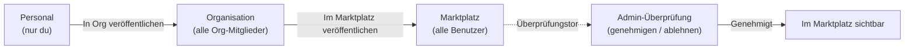

Der Marktplatz ist FIM One's integrierter Ressourcen-Marktplatz — ein Ort, an dem Benutzer Agenten, Konnektoren, Wissensdatenbanken, MCP Server, Skills und Workflows durchsuchen und abonnieren können, die von anderen veröffentlicht wurden.

<Info>
Der Marktplatz verwendet ein **Pull-Modell**: Ressourcen werden durch Durchsuchen entdeckt und explizit abonniert. Es gibt keinen automatischen Beitritt oder Push-Mechanismus — Benutzer wählen, was sie installieren möchten.
</Info>

## Wie es funktioniert

### Veröffentlichung

Jeder Ressourceneigentümer kann seine Ressource veröffentlichen, um sie auffindbar zu machen:



| Sichtbarkeit | Wer kann es sehen | Überprüfung erforderlich? |
|---|---|---|
| **Personal** | Nur der Ersteller | Nein |
| **Organisation** | Alle Mitglieder der Org des Erstellers | Nein (Vertrauen auf Org-Ebene) |
| **Marktplatz (global)** | Alle authentifizierten Benutzer | Ja — Admin-Genehmigung erforderlich |

Die Veröffentlichung im Marktplatz durchläuft immer ein Überprüfungstor. Admins können Ressourcen genehmigen, ablehnen (mit einer Notiz) oder ausstehend lassen. Abgelehnte Ressourcen können überarbeitet und erneut eingereicht werden.

### Abonnement

Wenn Sie eine Ressource im Marktplatz finden, macht das Abonnement sie in Ihrem Arbeitsbereich verfügbar:

- **Abonnierte Konnektoren** erscheinen in Ihrem Toolset (Auto-Discovery-Modus) und in Dropdown-Menüs zur Agent-Bindung
- **Abonnierte Agenten** erscheinen in Ihrem Agent-Selector und im `call_agent`-Katalog
- **Abonnierte Skills** werden in Ihren Systemprompt eingefügt (nach dem gleichen progressiven/Inline-Modus)
- **Abonnierte Wissensdatenbanken** sind für den Abruf verfügbar
- **Abonnierte MCP-Server** laden ihre Tools in Ihre Sitzungen
- **Abonnierte Workflows** erscheinen in Ihrer Workflow-Liste zur Ausführung

Abonnements sind sofort wirksam – keine Genehmigung des Herausgebers erforderlich. Sie können das Abonnement jederzeit kündigen, um die Ressource aus Ihrem Arbeitsbereich zu entfernen.

### Die Shadow Org

Unter der Haube wird der Market als **Shadow Organization** implementiert — ein unsichtbares System-Org (`MARKET_ORG_ID`), das keine Mitglieder enthält. Ressourcen, die im Market veröffentlicht werden, erhalten `visibility: "org"` innerhalb dieser Shadow Org, was ermöglicht, dass die bestehende `resolve_visibility()`-Abfrage sie natürlich einbezieht.

Das bedeutet, dass der Market **null spezielle Fälle** im Tool-Assembly-Pipeline benötigt. Der gleiche dreistufige Sichtbarkeitfilter, der persönliche und Org-Ressourcen lädt, lädt auch Market-Ressourcen:

```python
conditions = [
    model.user_id == user_id,           # own resources
    and_(model.visibility == "org",     # org-shared (includes Market shadow org)
         model.org_id.in_(user_org_ids)),
    model.id.in_(subscribed_ids),       # Market-subscribed
]
```

Die `subscribed_ids`-Klausel ist das, was den Market zum Funktionieren bringt — wenn Sie abonnieren, wird eine `ResourceSubscription`-Zeile erstellt, und die Ressource erscheint in Ihrem Sichtbarkeitfilter über diese dritte Bedingung.

## Ressourcentypen

Alle sechs Ressourcentypen unterstützen den vollständigen Marketplace-Lebenszyklus:

| Ressource | Veröffentlichen | Abonnieren | Was Sie erhalten |
|---|---|---|---|
| **Agent** | ✅ | ✅ | Ein spezialisierter Agent in Ihrem Selector und `call_agent` Katalog |
| **Connector** | ✅ | ✅ | API/Datenbank-Bridge verfügbar als Tools |
| **Knowledge Base** | ✅ | ✅ | Abrufquelle für RAG-Abfragen |
| **MCP Server** | ✅ | ✅ | Drittanbieter-Tools in Sitzungen geladen |
| **Skill** | ✅ | ✅ | Globale SOP in System-Prompt injiziert |
| **Workflow** | ✅ | ✅ | Automatisierung mit festem Prozess in Ihrer Workflow-Liste |

## API

| Endpoint | Description |
|----------|-------------|
| `GET /api/market` | Veröffentlichte Ressourcen durchsuchen. Unterstützt `?resource_type=`, `?page=`, `?size=` |
| `POST /api/market/subscribe` | Eine Ressource abonnieren (nach Typ + ID) |
| `DELETE /api/market/unsubscribe` | Abmeldung von einer Ressource |
| `GET /api/market/subscriptions` | Ihre aktuellen Abonnements auflisten |

Jeder Ressourcentyp hat auch eigene `POST /api/{type}/{id}/publish` und `POST /api/{type}/{id}/unpublish` Endpunkte zur Veröffentlichungskontrolle.
