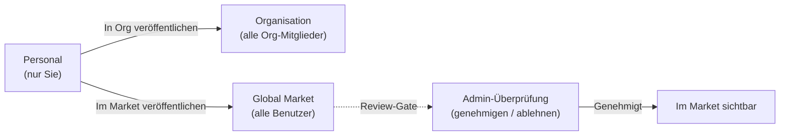

Der Marktplatz ist FIM One's integrierter Ressourcen-Marktplatz. Er organisiert gemeinsam genutzte Ressourcen in zwei Ebenen:

- **Lösungen** -- hochwertige Ressourcen, die End-to-End-Funktionen bereitstellen: Agenten, Skills und Workflows.
- **Komponenten** -- Bausteine, auf die Lösungen angewiesen sind: Konnektoren und MCP Server.

Sie durchsuchen nach Bereich (Ihre Organisation oder der globale Marktplatz), finden das, was Sie benötigen, abonnieren und beginnen, es zu nutzen -- alles ohne FIM One zu verlassen.

<Info>
Der Marktplatz verwendet ein **Pull-Modell**: Ressourcen werden durch Durchsuchen entdeckt und explizit abonniert. Es gibt keinen automatischen Beitritt oder Push-Mechanismus -- Sie wählen, was Sie installieren möchten, und können den Bereich jederzeit filtern.
</Info>

## Was kann ich hier finden?

### Lösungen

Lösungen sind vollständige, einsatzbereite Funktionen, die Sie abonnieren und sofort nutzen können.

| Ressource | Kategorie | Was Sie erhalten |
|---|---|---|
| **Agent** | Lösung | Ein spezialisierter KI-Assistent mit gebundenen Tools und Wissen |
| **Skill** | Lösung | Ein globales SOP, das in System-Prompts eingefügt wird und Agenten orchestrieren kann |
| **Workflow** | Lösung | Ein DAG-Automatisierungsfluss für geplante oder ausgelöste Ausführung |

### Komponenten

Komponenten sind die Integrationen und Tool-Services, aus denen Lösungen aufgebaut werden.

| Ressource | Kategorie | Was Sie erhalten |
|---|---|---|
| **Connector** | Komponente | API/Datenbankintegration verfügbar als Agent-Tools |
| **MCP Server** | Komponente | Third-Party-Tool-Service, der in Sessions geladen wird |

<Tip>
Knowledge Bases werden im Marketplace nicht unabhängig aufgelistet. Sie sind als interne Abhängigkeiten enthalten, wenn Sie eine Lösung abonnieren, die sie nutzt.
</Tip>

## Umfang

Der Marketplace hat einen Umfang-Selektor oben auf der Seite. Die Benutzeroberfläche und der Abonnement-Ablauf sind in beiden Umfängen identisch – nur die Sichtbarkeit von Ressourcen ändert sich.

- **Organisation** – Ressourcen, die innerhalb Ihres Teams oder Unternehmens freigegeben werden. Das Veröffentlichen hier erfordert keine Überprüfung.
- **Global Market** – Ressourcen aus der gesamten FIM One-Community. Das Veröffentlichen hier erfordert die Genehmigung durch einen Administrator.

Wechseln Sie jederzeit zwischen den Umfängen, um zu erkunden, was verfügbar ist.

## Wie abonniere ich?

Wenn Sie eine Ressource gefunden haben, die Sie möchten, klicken Sie auf **Abonnieren**. Ein Onboarding-Assistent führt Sie durch alle erforderlichen Einrichtungsschritte – beispielsweise das Eingeben von API-Anmeldedaten für einen Connector. Sie können den Assistenten überspringen und Anmeldedaten später konfigurieren, wenn Sie dies bevorzugen.

Nach dem Abonnieren:

- **Agenten** erscheinen in Ihrer Agenten-Auswahl und im `call_agent`-Katalog.
- **Skills** werden automatisch in Ihre System-Prompts eingefügt.
- **Workflows** erscheinen in Ihrer Workflow-Liste und sind bereit zur Ausführung.
- **Connectors** erscheinen in Ihrem Tool-Set und in den Dropdown-Menüs zur Agent-Bindung.
- **MCP-Server** laden ihre Tools in Ihre Sitzungen.

Wenn eine Lösung von Komponenten abhängt (z. B. ein Agent, der bestimmte Connectors verwendet), werden diese Abhängigkeiten während des Abonnements automatisch aufgelöst. Sie werden zur Eingabe erforderlicher Anmeldedaten aufgefordert.

Abonnements sind sofort wirksam – es ist keine Genehmigung des Herausgebers erforderlich. Sie können das Abonnement jederzeit kündigen, um die Ressource aus Ihrem Workspace zu entfernen.

## Wie veröffentliche ich?

Jeder Ressourceneigentümer kann veröffentlichen, um seine Ressource auffindbar zu machen. Die Veröffentlichung kann entweder auf Ihre Organisation oder den Global Market abzielen.

| Ziel | Wer kann es sehen | Überprüfung erforderlich? |
|---|---|---|
| **Organisation** | Alle Mitglieder Ihrer Org | Nein (Vertrauen auf Org-Ebene) |
| **Global Market** | Alle authentifizierten Benutzer | Ja -- Admin-Genehmigung erforderlich |

Die Veröffentlichung im Global Market durchläuft immer ein Review-Gate. Admins können Ressourcen genehmigen, ablehnen (mit einer Notiz) oder ausstehend lassen. Abgelehnte Ressourcen können überarbeitet und erneut eingereicht werden.

## Was ist mit Anmeldedaten?

Wenn Sie einen Ressource abonnieren, die Anmeldedaten erfordert (API-Schlüssel, OAuth-Token, Datenbankpasswörter), werden diese vom Onboarding-Assistent während des Abonnements erfasst. Anmeldedaten werden sicher gespeichert und auf Ihr Konto beschränkt – niemand sonst kann sie sehen.

Sie können Anmeldedaten jederzeit auf der Einstellungsseite der Ressource aktualisieren oder rotieren.

## Wie es sich integriert

Unter der Haube wird der Market als **Shadow-Organisation** implementiert – ein unsichtbares Systemorg, das keine Mitglieder enthält. Ressourcen, die auf dem Global Market veröffentlicht werden, sind auf `visibility: "org"` innerhalb dieser Shadow-Organisation gesetzt, was dem bestehenden Sichtbarkeitssystem ermöglicht, sie natürlich einzubeziehen.

Dies bedeutet, dass der Market **keinen speziellen Code** in der Tool-Assembly-Pipeline benötigt. Der gleiche dreistufige Sichtbarkeitsfilter (own -> org-shared -> subscribed), der persönliche und Org-Ressourcen lädt, lädt auch Market-Ressourcen. Wenn Sie sich abonnieren, wird ein Abonnement-Datensatz erstellt, und die Ressource erscheint automatisch in Ihrem Sichtbarkeitsfilter.

Für Lösungen, die Abhängigkeiten bündeln (z. B. ein Agent mit gebundenen Konnektoren und Knowledge Bases), löst der Abonnementprozess diese Abhängigkeiten auf und stellt sie bereit, damit alles sofort funktioniert.

Technische Details zur Funktionsweise des Sichtbarkeitsfilters über alle Ressourcentypen hinweg finden Sie unter [Agent & Resource Discovery -- Visibility Model](/architecture/agent-discovery#visibility-model).
