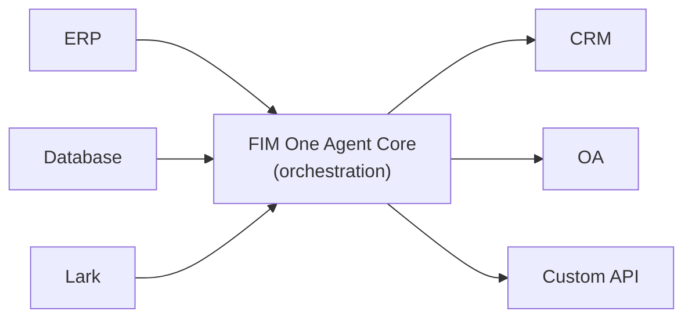

<Frame>
  
</Frame>

Willkommen bei FIM One, einem KI-gestützten Framework zum Erstellen von Agenten, die komplexe Aufgaben in Ihren Unternehmenssystemen dynamisch planen und ausführen.

  <a href="https://one.fim.ai/">Website</a> · <a href="https://github.com/fim-ai/fim-one">GitHub</a> · <a href="https://discord.gg/z64czxdC7z">Discord</a> · <a href="https://x.com/FIM_One">Twitter</a>

<Tip>
  **☁️ Probieren Sie FIM One in der Cloud aus — keine Einrichtung erforderlich.**
  Eine verwaltete Version ist live unter [**cloud.fim.ai**](https://cloud.fim.ai/): kein Docker, keine API-Schlüssel, melden Sie sich einfach an und beginnen Sie, Ihre Systeme zu verbinden. _Early Access — Feedback willkommen._
</Tip>

## Was ist FIM One?

FIM One ist ein anbieterunabhängiges Python-Framework zum Erstellen von KI-Agenten, die mit Ihren bestehenden Systemen funktionieren. Im Gegensatz zu Workflow-Buildern, die Sie auffordern, Logik zu duplizieren, verbindet FIM One Ihre Systeme proaktiv – durch Datenbankabfragen, API-Aufrufe, Push-Benachrichtigungen – alles über eine einheitliche KI-Schnittstelle.

Die Kernidee: **drei Liefermodi, ein Agent-Kern**.

## Drei Bereitstellungsmodi

| Modus | Was es ist | Bereitstellung | Anwendungsfall |
|------|-----------|----------|----------|
| **Standalone** | Universeller KI-Assistent — Suche, Code, Wissensdatenbank | Portal | Chat, Code-Ausführung, Wissensdatenbank-Q&A |
| **Copilot** | KI eingebettet in ein Host-System — arbeitet neben Benutzern in ihrer bestehenden UI | iframe / Widget / Embed | „Finance Copilot" in Ihrer ERP-Web-UI |
| **Hub** | Zentrale systemübergreifende Orchestrierung — alle Ihre Systeme verbunden | Portal / API | Agent fragt ERP ab, prüft OA, benachrichtigt über Lark |

## Ein Agent-Kern, jedes System

Der Agent-Kern ist der Differenziator — eine zentrale Orchestrierungsschicht, in der globale SaaS, der China-Enterprise-Stack und alles dazwischen auf KI treffen:

Jeder Connector ist eine standardisierte Brücke. Der Agent kümmert sich nicht darum, ob er mit SAP oder einer benutzerdefinierten PostgreSQL-Datenbank spricht. Ihre Daten bleiben in Ihren Systemen; FIM One bietet die KI-Schicht, die diese orchestriert.

## Erste Schritte

Erkunden Sie die nächsten Abschnitte, um die Architektur von FIM One zu verstehen und es bereitzustellen:

- **[Quick Start](/quickstart)** — Starten Sie FIM One in wenigen Minuten mit Docker oder lokaler Entwicklung
- **[Execution Modes](/concepts/execution-modes)** — Verstehen Sie Standalone-, Copilot- und Hub-Modi im Detail
- **[AI Builder](/concepts/ai-builder)** — Verwenden Sie KI, um Konnektoren und Agenten mit natürlicher Sprache zu erstellen
- **[Connector Architecture](/architecture/connector-architecture)** — Wie FIM One Legacy-Systeme durch KI verbindet
- **[Philosophy](/architecture/philosophy)** — Warum dynamische Planung der richtige Mittelweg zwischen starren Workflows und vollständig autonomen Agenten ist
