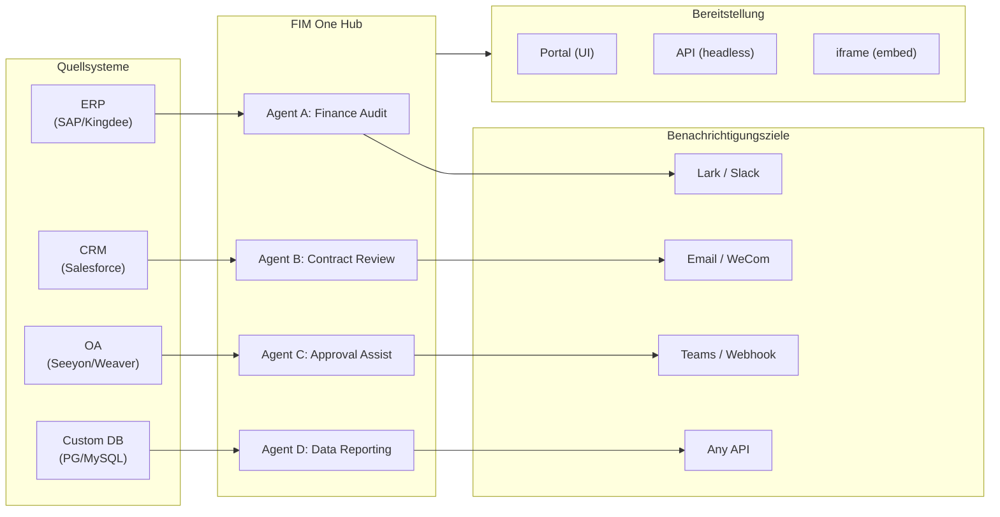

> Goal: Build an **AI-powered Connector Hub** — Standalone (portal assistant), Copilot (embedded in host system), Hub (central cross-system orchestration).
>
> Principles: **Provider-agnostic** (no vendor lock-in), **minimal-abstraction**, **protocol-first**, **connector-first** (integration is the core value).

## Produktvision

FIM One ist ein **AI-Connector-Hub**, der drei progressive Modi bedient:

```
Standalone   → Dein eigener KI-Assistent (Portal)
Copilot      → KI eingebettet in ein Host-System (iframe / Widget / Embed)
Hub          → Zentrale systemübergreifende Orchestrierung (Portal / API)
```

**Hub-Modus ist der Kernunterscheidungsfaktor.** Unternehmenskunden haben Legacy-Systeme — ERP, CRM, OA, Finanzen, HR — die über KI miteinander kommunizieren müssen:



**GTM-Pfad: Land and Expand**

| Schritt | Modus | Was passiert |
|---------|-------|-------------|
| Land | Copilot | In ein System einbetten, Wert in ihrer UI nachweisen |
| Expand | Copilot → Hub | Auf mehr Systeme ausrollen; Hub aggregiert sie |

## Ausgelieferte Versionen

### v0.1 (2026-02-22) — MVP: ReAct + DAG Planner
- ReActAgent mit Tools (calculator, python_exec, web_search)
- DAG Planner (LLM generiert Abhängigkeitsgraphen)
- Portal UI mit Streaming + KaTeX

### v0.2 (2026-02-24) — Multi-Modell + Speicher
- Wiederholung / Ratenbegrenzung / Nutzungsverfolgung
- Native Funktionsaufrufe (kein reines JSON-Parsing)
- Multi-Modell-Unterstützung (schnelles + Haupt-LLM)
- Speicher: WindowMemory, SummaryMemory
- FastAPI-Backend mit SSE-Streaming

### v0.3 (2026-02-25) — Web Tools + MCP
- Web tools (web_search, web_fetch) via Jina/Tavily/Brave
- File operations tool
- MCP client (standard tool integration)
- Tool auto-discovery + categories
- DAG visualization with click-to-scroll
- Code exec in Docker (`--network=none`)

### v0.4 (2026-02-25) — Multi-Turn + Agenten
- Multi-Turn-Konversationen (DbMemory)
- Tool-Schritt-Faltungs-UI
- HTTP-Anfrage + Shell-Exec-Tools
- Agenten-Management (erstellen, konfigurieren, veröffentlichen)
- JWT-Authentifizierung
- Pro-Agenten-Ausführungsmodus + Temperaturkontrolle

### v0.5 (2026-02-28) — Full RAG + Grounded Gen
- Vollständige RAG-Pipeline (Embedding + Vektorspeicher + FTS + RRF + Reranker)
- Grounded Generation (Zitationen, Konfidenzwerte)
- Wissensdatenbank-Dokumentverwaltung (CRUD, Suche, Wiederholung, Schema-Migration)
- ContextGuard + angeheftete Nachrichten (Token-Budget-Manager)
- DbMemory-Persistenz + LLM Compact
- DAG-Neuplanung (bis zu 3 Runden)

### v0.6 (2026-03-01) — Connector-Plattform
- **Connector CRUD**: erstellen, lesen, aktualisieren, löschen
- **ConnectorToolAdapter**: konvertiert Connector → BaseTool
- **Benutzer-spezifische Anmeldedaten**: AES-GCM-Verschlüsselung
- **Bestätigungsgate**: Genehmigung von Schreibvorgängen
- **Audit-Protokollierung**: alle Tool-Aufrufe werden aufgezeichnet
- **Circuit Breaker**: elegante Verschlechterung bei Ausfällen
- **Utility-Tools**: email_send, json_transform, template_render, text_utils
- **Embedding-Optionen**: Jina, OpenAI, benutzerdefinierte Anbieter

### v0.7 (2026-03-06) — Admin-Plattform + Multi-Mandant
- **Admin-Plattform**: Benutzerverwaltung, Rollenwechsel, Passwort-Zurücksetzen, Konto aktivieren/deaktivieren
- **Nur-auf-Einladung-Registrierung**: drei Modi (offen/Einladung/deaktiviert) + Einladungscode CRUD
- **Speicherverwaltung**: Festplattennutzung pro Benutzer, Löschen, verwaiste Bereinigung
- **Gesprächsmoderation**: Admin-Liste/Löschen aller
- **Erzwungenes Logout pro Benutzer**: alle Token widerrufen
- **API-Gesundheits-Dashboard**: Systemstatistiken, Connector-Metriken
- **Assistent für die erste Einrichtung**: geführte Admin-Kontoerstellung
- **Persönliches Zentrum**: globale Anweisungen pro Benutzer, Spracheinstellung
- **JWT-Authentifizierung**: Token-basierte SSE-Authentifizierung, Gesprächseigentum
- **Globale MCP-Server**: von Admin bereitgestellt, in allen Sitzungen geladen
- **Rückwärtskompatibilität**: registration_enabled → registration_mode automatische Migration

### v0.7.x (2026-03-07 bis 2026-03-12) — Stabilität + Verbesserungen
- Einladungscode-Verwaltung
- Benutzer-spezifische Kontingente (429-Durchsetzung)
- Strukturiertes Audit-Logging
- Filterung sensibler Wörter
- Admin-Anmeldungsverlauf
- Admin-Dateibrowser
- Erweiterte Admin-Ansichten (Felder model_name, tools, kb_ids)
- Docker Compose-Bereitstellung (einzelnes Image, benannte Volumes)
- OAuth-Automatische Erkennung von window.location
- Erweitertes Denken / Reasoning-Unterstützung (`LLM_REASONING_EFFORT`, `LLM_REASONING_BUDGET_TOKENS`) für OpenAI o-Serie, Gemini 2.5+, Claude
- Admin pro-Tool Aktivieren/Deaktivieren (deaktivierte Tools werden zur Laufzeit aus dem Chat ausgeschlossen)
- MCP-Server-Verwaltung auf die Seite „Konnektoren" verschoben
- Duale Datenbankunterstützung: SQLite (Null-Konfiguration Standard) + PostgreSQL (Produktion); Docker Compose stellt PostgreSQL automatisch bereit
- Dokumentationsseite zur Modellkonfiguration mit Extended-Thinking-Setup pro Anbieter
- SSE Protocol v2: Echtzeit-Antwort-Streaming mit `delta_reasoning`, `usage`-Feldern und geteilten `done`/`suggestions`/`title`/`end`-Events; SQLite-Pool-Größe 5 -> 20
- AI Builder-Erweiterung: 7 neue Builder-Tools (GetSettings, TestConnection, ImportOpenAPI für Konnektoren; ListConnectors, AddConnector, RemoveConnector, SetModel für Agenten), `is_builder`-Flag auf Agenten, automatische Builder-Prompt-Aktualisierung, SSRF-Schutz
- SSE v2 Frontend: Streaming-Punkt-Puls-Cursor, DAG-Neuplan-Runden-Snapshots als einklappbare Karten, DAG-Layout entkoppelt von Schrittzuständen
- Konzeptdokumentationsseite für AI Builder mit Konnektoren- und Agenten-Builder-Leitfäden
- Organisationssystem: vollständige CRUD-Operationen mit rollenbasierter Mitgliedschaft (Eigentümer/Admin/Mitglied), Admin-Verwaltungs-UI
- Dreiebenen-Ressourcensichtbarkeit (persönlich/Org/global) für Agenten, Konnektoren, Wissensdatenbanken, MCP-Server
- Veröffentlichungs-/Unveröffentlichungs-API für alle Ressourcentypen; Eigentümerdelegation für veröffentlichte Agenten
- Admin-Set-Visibility-Endpoint (ersetzt Clone-to-Global); einheitlicher `build_visibility_filter()`-Abfrage-Helper
- Datenbank-Konnektoren (Phase 1-3): direkter SQL-Zugriff auf PG/MySQL/Oracle/SQL Server + chinesische Legacy-DBs; Schema-Introspection, KI-Annotation, schreibgeschützte Abfrageausführung, verschlüsselte Anmeldedaten, 3 Tools pro Konnektor (`list_tables`, `describe_table`, `query`)
- **Evaluierungszentrum**: quantitatives Benchmarking der Agentenqualität — Test-Dataset CRUD (Prompt + erwartetes Verhalten + Assertions), Eval-Läufe (parallele Ausführung + LLM-Bewerter + Pro-Fall Pass/Fail/Latenz/Token-Ergebnisse), Ergebnis-Viewer mit automatischem Polling; Migration `r8t0v2x4z567`
- Drei Modellrollen (Allgemein/Schnell/Reasoning) mit isolierter Umgebungskonfiguration pro Tier; Schnellmodell erbt keine Hauptmodell-Einstellungen mehr
- `StepOutput`-Dataclass ersetzt einfache String-Schrittergebnisse für strukturierte Daten und Artefakt-Übergabe
- Tool-Cache für DAG-Ausführung — identische Tool-Aufrufe pro Lauf gecacht mit asynchronem Lock-Stampede-Schutz (`DAG_TOOL_CACHE`)
- Pro-Schritt-LLM-Verifizierung mit 1 Wiederholung bei Fehler (`DAG_STEP_VERIFICATION`)
- Auto-Routing: schnelles LLM klassifiziert Abfragen als ReAct oder DAG; `/api/auto`-Endpoint; Frontend 3-Wege-Modusumschalter (`AUTO_ROUTING`)
- [x] ~~**Shadow Market Organization + Resource Subscriptions**~~: Integrierte Market-Org (Shadow, kein automatischer Beitritt) ersetzt Platform-Org; Ressourcen werden durch Marketplace-Browsing entdeckt und explizit abonniert (Pull-Modell); Market-API zum Abonnieren gemeinsamer Ressourcen; Veröffentlichung auf Market erfordert immer Überprüfung; Ressourcen-Abonnements-Tabelle; Org-basierte Ressourcenfreigabe ersetzt globale Sichtbarkeit
- [x] ~~**Agent Auto-discovery and Sub-agent Binding**~~: `discoverable`-Flag auf Agenten; `sub_agent_ids`-Whitelist; CallAgentTool zum Delegieren von Aufgaben an spezialisierte Agenten
- [x] ~~**MCP Server Credentials + Per-User Override**~~: `mcp_server_credentials`-Tabelle; `PUT /api/mcp-servers/{id}/my-credentials`-Endpoint; `allow_fallback`-Flag für Fallback-Verhalten bei Anmeldedaten
- [x] ~~**Connector/KB Toggle**~~: `POST /api/connectors/{id}/toggle` und `POST /api/knowledge-bases/{id}/toggle` zum Aussetzen/Fortsetzen von Ressourcen
- [x] ~~**Standalone KB Conversations**~~: `kb_ids`-Feld auf Konversationen für direkten KB-Chat ohne Agent-Bindung

### v0.8 (2026-03-20) — Verbinder Deklarative Konfiguration + Progressive Offenlegung
- [x] **Datenbankverbinder**: direkter SQL-Zugriff (PostgreSQL, MySQL, Oracle) *(ausgeliefert in v0.7.x — Phase 1-3)*
- [x] **RBAC**: Verbinderzugriffskontrolle pro Benutzer/Rolle *(ausgeliefert in v0.7.x — Org-System + dreistufige Sichtbarkeit)*
- [x] **Verbinder-Anmeldedatenverschlüsselung + Außerkraftsetzung pro Benutzer**: `connector_credentials`-Tabelle, Fernet-Verschlüsselung über `CREDENTIAL_ENCRYPTION_KEY`, `allow_fallback`-Flag, `GET/PUT/DELETE /my-credentials`-Endpunkte, Anmeldedatenauflösung pro Benutzer beim Laden von Chat-Tools
- [x] **Veröffentlichungs-Review-UI**: Org-übergreifendes Veröffentlichungs-Review-System — Review-Umschalter pro Org, ReviewsSheet mit Genehmigung/Ablehnung-Workflow, Statusabzeichen auf Ressourcenkarten, Review-Hinweis im Veröffentlichungsdialog, erneute Einreichung für abgelehnte Ressourcen
- [x] **Verbinder Progressive Offenlegung (Phase 1-2)**: einzelnes `ConnectorMetaTool` ersetzt Pro-Aktion-Tools; Systemaufforderung erhält nur leichte **Stubs** (Name + 1-zeilige Beschreibung, ~30 Token/Verbinder vs ~250 Token/Aktion); Agent ruft `discover(connector)` auf, um vollständiges Aktionsschema bei Bedarf zu laden — Schema wird nur geladen, wenn das Modell einen Verbinder auswählt, wodurch das Aufforderungspräfix für Caching stabil bleibt. Spiegelt Muster `defer_loading: true` von Claude Code wider. `execute`-Unterbefehl; Feature-Flag für Rückwärtskompatibilität.
- [x] **Agent-Fähigkeitssystem + Kompakte Anweisungen**: Bedarfsgerechtes Laden von Fähigkeitsanweisungen für Agent-Anweisungen — `Skill`-Modell (Name, Inhalt/SOP, optionale Skripte) an Agents angehängt; in Systemaufforderung nur nach Name referenziert (~10 Token/Fähigkeit); Agent ruft `read_skill(name)` auf, um vollständigen Inhalt bei Bedarf zu laden. Reduziert Pro-Konversations-Anweisungs-Token-Kosten um ~80%, während umfangreichere SOP-Bibliotheken ermöglicht werden. Gegenstück zur progressiven Offenlegung von ConnectorMetaTool auf Anweisungsebene angewendet. Ermöglicht die Differenzierungsgeschichte „Anweisungen + Tools + Fähigkeiten". Fügt auch `compact_instructions`-Feld zum Agent-Modell hinzu — Pro-Agent-Kompressionspriorität-Liste in `ContextGuard` bei Komprimierung eingefügt (z. B. „Bestellnummern und Beträge beibehalten, rohe API-Antworten verwerfen"), ersetzt aktuelle statische generische Aufforderung. Inspiriert von Claude Code's Compact Instructions-Muster.
- [x] **Verbinder Import/Export**: Verbinder-Vorlagen teilen
- [x] **Verbinder Fork**: vorhandene Verbinder klonen + anpassen
- [x] **Workflow Phase 2 Knoten**: Iterator, Loop, VariableAggregator, ParameterExtractor, ListOperation, Transform, DocumentExtractor, QuestionUnderstanding, HumanIntervention — 9 erweiterte Knotentypen mit vollständigem Frontend + Backend + 150 neue Tests (275 insgesamt). Knotenwiederholung mit exponentiellem Backoff, sichere Ausdrucksevaluierung. Statistik-Panel mit Erfolgsquoten-Balken. 12 integrierte Vorlagen. Bereichskontextmenü (Einfügen, Alles auswählen, Ansicht anpassen, Automatisches Layout).
- [x] **Workflow Phase 3 Knoten: SubWorkflow + ENV** — 2 neue Knotentypen (25 Knoten insgesamt), 14 neue Tests (306 insgesamt), 14 integrierte Vorlagen. SubWorkflow: vollständiger datenbankgestützter verschachtelter Workflow-Executor mit Ziel-Workflow-Auswahl, Variablenzuordnung und konfigurierbarem Tiefenlimit zur Verhinderung unendlicher Rekursion. ENV: liest verschlüsselte Umgebungsvariablen mit Schlüsselwähler und Fallback-Standardwerten. Vollständiges Frontend (Knotenkomponenten, Konfigurationspanels, Palette-Einträge, Minimap-Farben). Pro-Knoten-Ausführungsstatistik-Panel (Erfolgsquoten, Dauern, Fehleranzahlen sortiert nach schlechtesten zuerst). `getNodeStats` API-Client + `NodeStatEntry`-Typ. Tastaturkürzel-Dialog (`?`-Taste).
- [x] **Workflow Geplante Trigger**: Pro-Workflow-Cron-Konfiguration mit Zeitzone, Standardeingaben und Berechnung der nächsten Ausführung. Cron-Voreinstellungsschaltflächen, 30 Trigger-Tests.
- [x] **Workflow API-Trigger**: Öffentliche Pro-Workflow-API-Schlüssel (`wf_`-Präfix) für externe Ausführung ohne Benutzerauthentifizierung, mit Ratenbegrenzung. API-Schlüsselverwaltungsdialog mit Generieren/Neugenerieren/Widerrufen, Trigger-URL und cURL/JS-Beispiele.
- [x] **Workflow Batch-Ausführung**: `POST /batch-run` mit bis zu 100 Eingabesätzen, konfigurierbare Parallelität (1-10), zusammenklappbare Pro-Element-Ergebnisse, JSON-Export. 14 Batch-Ausführungs-Tests.
- [x] **Workflow Ausführungsprotokoll-Viewer**: Echtzeit-chronologischer SSE-Ereignisstrom im Run-Panel mit Zeitstempeln, farbcodierten Abzeichen und Ereignistypfilter-Umschaltern.
- [x] **Workflow Run-Statistiken**: Backend-Batch-Abruf von Ausführungszählern und Erfolgsquoten über GROUP BY-Unterabfrage; Frontend zeigt Statistiken auf Workflow-Karten mit farbcodierten Erfolgsquoten-Indikatoren an.
- [x] **Workflow Scheduler Daemon**: Hintergrund-Async-Service, der alle 60 Sekunden nach fälligen cron-basierten Workflows abfragt. Croniter-Zeitzonenunterstützung, Semaphor-Parallelität, `last_scheduled_at`-Verfolgung, Webhook-Zustellung. 14 Tests.
- [x] **Workflow Import Konfliktlöser**: Erkennt ungelöste Agent/Verbinder/KB/MCP-Referenzen während des Imports. Batch-DB-Abfragen mit Sichtbarkeitsfilterung, Frontend-Toast-Warnungen. 17 Tests.
- [x] **Workflow Test-Knoten-Ausführung**: Isolierte Einzelknoten-Tests mit Mock-Variablen, in Editor integriert (Konfigurationspanel Test-Schaltfläche + Kontextmenü). 23 Tests.
- [x] **Workflow Versions-Diff**: Nebeneinander-Blueprint-Vergleich mit Knoten-/Kanten-Änderungserkennung, farbcodierte Indikatoren (hinzugefügt/entfernt/geändert).
- [x] **Workflow Run-Verwaltung**: Löschen einzelner Ausführungen (`DELETE /runs/{run_id}`) und Löschen aller abgeschlossenen Ausführungen (`DELETE /runs`), mit Frontend-Bestätigungsdialogen.
- [x] **Workflow Run Replay-Overlay**: Schaltfläche „Auf Canvas anzeigen" in Run-Verlauf zum Überlagern früherer Ausführungsergebnisse auf dem Canvas, Anzeige Pro-Knoten-Status und Ausgabe ohne erneute Ausführung.
- [x] **Workflow Favoriten/Anheften**: Workflows mit Stern versehen/an die Oberseite der Liste anheften mit localStorage-Persistenz.
- [x] **Workflow Run-Verlauf Export**: Exportieren Sie Run-Verlauf als JSON-Datei-Download mit vollständigen Run-Metadaten und Pro-Knoten-Ergebnissen.
- [x] **Admin Workflows-Verwaltung**: Admin-Panel-Registerkarte zur Verwaltung aller Workflows über Benutzer — Liste, Aktivierung/Deaktivierung umschalten, Löschen mit Bestätigung. Batch-Endpunkte zum Löschen, Umschalten und Veröffentlichen mit Audit-Protokollierung.
- [x] **Workflow-Vorlagensystem**: `WorkflowTemplate` ORM-Modell mit Admin-CRUD, öffentliche Auflistungs-/Klon-API und 5 Seed-Vorlagen, die beim ersten Start automatisch eingefügt werden.
- [x] **Workflow Inline-Validierungsabzeichen**: Echtzeit-Pro-Knoten `ValidationBadge` auf Canvas mit Fehler-/Warnungs-Tooltips für unmittelbares visuelles Feedback während der Bearbeitung.
- [x] **Workflow Ausführungs-Trace-Viewer**: Zeitlinienbasierter Trace-Viewer Sheet mit Engine `trace_level`-Parameter und Pro-Knoten-Variablen-Snapshots für Step-Through-Debugging.
- [x] **Workflow Ratenbegrenzung und Timeout**: Pro-Benutzer `WorkflowRateLimiter` (Schiebefenster 10 Ausführungen/Min, 3 gleichzeitig) und Standard-10-Minuten-Global-Run-Timeout.
- [x] **Workflow Blueprint-System**: Visueller Workflow-Editor zum Entwerfen und Ausführen mehrstufiger Automatisierungs-Blueprints — `Workflow` / `WorkflowRun` ORM-Modelle, vollständige CRUD + SSE-Ausführungs-API, Import/Export, Duplizieren, Blueprint-Validierungs-Endpunkt, `WorkflowEngine` mit topologischer Sortierung + Semaphor-basierter Parallelität + Bedingungsverzweigung und 12 Knotentypen (Start, End, LLM, ConditionBranch, QuestionClassifier, Agent, KnowledgeRetrieval, Connector, HTTPRequest, VariableAssign, TemplateTransform, CodeExecution), `VariableStore` mit `{{node_id.output}}`-Interpolation und `env.*`-Namespace, Fehlerstrategien pro Knoten (STOP_WORKFLOW / CONTINUE / FAIL_BRANCH) mit Pro-Knoten-Timeout und erweiterter Konfiguration UI, React Flow v12 visueller Editor mit Drag-and-Drop-Palette + Knotenconfig-Panel + Variablenwähler-Combobox + Add-Node-on-Edge + Auto-Layout (ELK.js) + Run-Verlauf Sheet, Dify-ähnliches kompaktes Knotendesign mit ringbasiertem Run-Status-Styling und animierten Kantenübergängen, 4 integrierte Starter-Vorlagen (Simple LLM Chain, Conditional Router, Knowledge-Augmented QA, HTTP API Pipeline) mit Vorlagenwähler-Dialog und `GET /templates` + `POST /from-template` API, Statistik-Endpunkt, `?run=true` URL-Parameter Auto-Open, Subprocess-basierte Code-Ausführungssicherheit, 105-Test-Suite (Vorlagen, Eval-Namespace-Flattening, Blueprint-Validierungswarnungen, Knoten-/Kanten-Löschung, Import/Export/Duplizieren, Deadlock-Erkennung, Multi-Bedingungsverzweigung)
- [x] **Operationsprüfung**: detaillierte Protokollierung wer was getan hat — Admin-Review-Log-Audit-Registerkarte hinzugefügt (Veröffentlichungs-Review-Trail pro Org/Ressource)
- [x] **Semantische Schema-Anmerkungen**: Erweitern Sie Verbinder-Schemafelder mit `semantic_tag`, `description` und `pii`-Flags; Anmerkungen in LLM-Tool-Beschreibungen angezeigt, damit der Agent die Feldabsicht versteht, ohne von Spaltennamen zu raten

## Geplante Versionen

### v0.9 — Observability + Production Hardening

**Ziel**: Produktionsreife Operationen, Debugging und Monitoring. Führt das **Hook System** ein — eine deterministische Durchsetzungsebene, die unter Agent-Anweisungen liegt und vom LLM nicht überschrieben werden kann.

- [ ] **Connector Progressive Disclosure (Phase 3-4)**: einheitliche `ConnectorExecutor`-Schnittstelle (API/DB/MCP hinter einer Abstraktion); Validierung von Aktionsparametern mit `jsonschema`; protokollagnostisches Discover/Execute
- [ ] **YAML/JSON Connector-Konfiguration**: Plattform generiert MCP-Server automatisch
- [ ] **Datenbank-Connectoren Phase 4**: Enterprise-Treiber — Oracle (`oracledb`), SQL Server (`aioodbc`), 达梦 DM8 (`aioodbc` + DM ODBC), 南大通用 GBase (`aioodbc` + GBase ODBC)
- [ ] **IM-Kanal-Integration (bidirektional)**: **Phase 1 — Ausgehender Push**: Lark, WeCom, Slack, Email, Teams Benachrichtigungsaktionen aus Agent/Workflow-Ergebnissen. **Phase 2 — Eingehender Trigger**: Benutzer erwähnen Agent in IM-Gruppenchats, um Aufgaben ohne Öffnen des Portals auszulösen; Webhook-Empfänger pro Kanal; jeder IM-Kanal modelliert als Connector mit bidirektionalen Aktionen (Senden + Empfangen). Hub-Modus Killer-Feature

#### Öffentliche API (Phase 2)

Phase 1 (ausgeliefert): API-Schlüssel-Authentifizierungsmiddleware, Scope-Unterstützung, kuratierte OpenAPI-Spezifikation, Mintlify API Reference mit interaktivem Playground.

- [ ] **Pro-Schlüssel-Ratenbegrenzung** — Konfigurierbare Anfragen/Minute und Anfragen/Tag-Limits pro API-Schlüssel; `429 Too Many Requests` Antworten mit `X-RateLimit-*` Headern
- [ ] **Pro-Schlüssel-Nutzungskontingent** — Monatliche Token/Request-Budgets mit Admin-Dashboard und Schwellenwert-Benachrichtigungen
- [ ] **Scope-Durchsetzung pro Endpunkt** — `require_scope("chat")` Abhängigkeit auf allen geschützten Endpunkten; Schlüssel mit `scopes=chat` können nur auf Chat-bezogene APIs zugreifen
- [ ] **API-Versionierung** (`/v1/...`) — Stabiler versionierter API-Vertrag; Deprecation-Header für Sunset-Endpunkte
- [ ] **Webhook-Callbacks** — Webhook-URLs pro API-Schlüssel registrieren; POST-Benachrichtigungen für Gesprächsvervollständigung, Agent-Fehler und asynchrone Task-Ergebnisse erhalten
- [ ] **SDK-Generierung** — Automatisch generierte Python und TypeScript Client-SDKs aus OpenAPI-Spezifikation; veröffentlicht auf PyPI und npm
- [ ] **Developer Portal** — Interaktive "Try it" Panels in Mintlify Docs; Nutzungsanalysen für Schlüsseleigentümer sichtbar
- [ ] **API-Schlüssel-Rotation** — One-Click-Schlüssel-Rotation mit Übergangsfrist (alter Schlüssel 24h nach Rotation gültig)
- [ ] **Batch-/Async-API** — `POST /api/batch` akzeptiert bis zu 100 Abfragen; gibt eine `batch_id` zum Abrufen von Ergebnissen zurück; nützlich für Bulk-KB-Abfragen oder Multi-Agent-Orchestrierung
- [ ] **Circuit Breaker pro externe Abhängigkeit** — Verhinderung von kaskadierenden Ausfällen, wenn nachgelagerte LLM-Anbieter oder Konnektoren nicht verfügbar sind; automatisches Fallback und Recovery

#### Observability & Agent-Laufzeit

- [ ] **Agent Trace Layer (Observability++)**: Trace-Hierarchie auf Anwendungsebene für Agent-Debugging — jede Konversation → `Trace`, jeder LLM-Aufruf / Tool-Aufruf / DAG-Schritt → `Span` mit Input/Output/Tokens/Timing. Frontend-Trace-Viewer mit Timeline und erweiterbaren LLM-Call-Payloads. Dies geht über OTel (Infrastrukturebene) hinaus und bietet umsetzbares Agent-Loop-Debugging für Entwickler und Enterprise-Kunden. OpenTelemetry-Export als Datenspeicher-Option. Modelliert nach LangSmith's Run/Trace/Thread-Konzepten — das branchenbewährte Muster für Agent-Observability.
- [ ] **Metrics-Dashboard**: Latenz, Erfolgsquote, Token-Nutzung, Connector-Call-Analytik — Aufschlüsselung pro Agent, pro Benutzer, pro Organisation
- [x] ~~**Circuit Breaker**: Zustandsmaschine mit drei Zuständen (closed/open/half-open) mit Pro-Connector-Fehler-Tracking, 5xx-Erkennung und Monitoring-Endpunkten~~ *(früh ausgeliefert — implementiert in v0.8)*
- [x] **Workflow-Run-Aufbewahrungsbereinigung**: Hintergrund-Bereinigungsaufgabe mit konfigurierbarem maximalen Alter und maximaler Anzahl pro Workflow; Pro-Workflow-Overrides; Admin-Endpunkt für manuelle Auslösung
- [x] **Workflow-Versionsänderungs-Zusammenfassungen**: `compute_blueprint_diff()` generiert automatisch menschenlesbare Zusammenfassungen aus Blueprint-Diffs beim Versionsspeichern
- [x] **DAG-Qualitätsüberholung**: Standard-Modell-Upgrade für Nicht-Fast-Schritte; Skill-Auto-Discovery in der Planung; Citation Verifier für Legal/Medical/Financial-Domains; strukturierte Content-Context-Beibehaltung; Domain-Klassifizierung im Router mit Domain-bewusster Modellauswahl
- [x] **Domain-Modell-Eskalation in ReAct**: Spezialist-Domains eskalieren automatisch zu Reasoning-Modell mit obligatorischer Web-Suche und Citation-Verifikation
- [x] **Pro-Modell Native Function Calling Toggle**: `tool_choice_enabled`-Einstellung ermöglicht Modellen, erzwungene Tool-Auswahl zu überspringen und direkt zu JSON Mode zu gehen
- [x] **DatabaseMetaTool (Progressive Disclosure für DB-Connectors)**: einzelnes `database` Meta-Tool mit `list_tables`/`discover`/`query` Unterbefehlen ersetzt 3N einzelne Tools pro Database-Connector; konfigurierbar via `DATABASE_TOOL_MODE` Umgebungsvariable (`progressive` Standard, `legacy` Fallback)
- [x] **On-Demand-Tool-Laden via `request_tools` Meta-Tool**: wenn >12 Tools nach intelligenter Auswahl verfügbar sind, kann LLM zusätzliche Tools dynamisch mid-Konversation laden; funktioniert in JSON- und Native-Function-Calling-Modi
- [x] **MCPServerMetaTool (Progressive Disclosure für MCP)**: einzelnes `mcp` Meta-Tool mit `discover`/`call` Unterbefehlen ersetzt N*M einzelne MCP-Tools; konfigurierbar via `MCP_TOOL_MODE` Umgebungsvariable (`progressive` Standard, `legacy` Fallback)
- [ ] **Workflow Connection Dep Auto-Subscribe**: Erweitern Sie Market-Abonnement-Kaskade, um automatisch Workflow-Verbindungsabhängigkeiten zu abonnieren (API-Connectors, MCP-Server). Workflow-Knoten können Connectors, MCP-Server, Agenten (die rekursiv mehr Deps referenzieren) und Sub-Workflows referenzieren — alle Verbindungs-Deps im vollständigen Baum müssen beim Abonnieren automatisch abonniert und beim Abmelden kaskadierend bereinigt werden. Komplexer als Skill/Agent aufgrund rekursiver Sub-Workflow-Auflösung mit Zyklenerkennung. Gegenstück zu Solution (Skill/Agent) Verbindungs-Dep Auto-Subscribe
- [x] **Workflow Real Executors**: ersetzten MCP und BuiltinTool Node Executor Stubs durch vollständige Implementierungen (MCP-Server-Discovery + Tool-Calling; ToolRegistry-Integration)
- [ ] **Agent Hook System**: Eine deterministische Durchsetzungsebene, die **außerhalb der LLM-Schleife** läuft — Hooks werden automatisch bei Tool-Events ausgeführt und können nicht durch Agent-Anweisungen umgangen werden. Drei Hook-Punkte: `PreToolUse` (validieren / blockieren vor Ausführung), `PostToolUse` (Nebenwirkungen nach Ausführung), `SessionStart` (dynamischen Context injizieren). Built-in Hooks: automatisches Schreiben von `ConnectorCallLog` bei jedem Connector-Call (derzeit manuell); Schreibvorgänge blockieren, wenn Organisation im Read-Only-Modus ist; automatisches Kürzen übergroßer DB-Query-Ergebnisse, bevor sie den Agent erreichen; Rate-Limit Pro-Connector-Call-Häufigkeit. Benutzerdefinierte Hooks: Pro-Agent YAML-Konfiguration (`hooks:` Feld) mit Shell-Befehlen oder Python-Callables, die bei übereinstimmenden Tool-Events ausgelöst werden — gleiches Muster wie Claude Code's Hooks. Schlüssel-Designprinzip: **Hooks sind für "muss immer passieren"-Logik, die niemals davon abhängen sollte, dass der LLM sich daran erinnert**. Anweisungen sagen "alle Calls aufzeichnen"; Hooks zeichnen sie tatsächlich auf. Anweisungen sagen "nicht im Read-Only-Modus schreiben"; Hooks blockieren es tatsächlich.
- [ ] **Agent Workspace (Persistent Agent Desktop)**: Drei Ebenen: (1) **Tool Output Offloading** — automatisches Speichern übergroßer Tool-Responses (>8K Zeichen) in `workspace://` Dateien, Rückgabe verkürzter Vorschau + URI; Built-in Tools `read_workspace_file`, `list_workspace_files`, `write_workspace_file` für selektiven Zugriff und Agent-generierte Artefakte. (2) **Handoff Notes** — `write_handoff(summary)` für Context-Übergänge über Kompression/Session-Wechsel. (3) **Workspace UI** — Frontend-Dateibrowser-Panel pro Konversation (Vorschau Text/JSON/CSV, Download, Löschen/Umbenennen); Session-übergreifende Dateispeicherung; Pro-Benutzer-Speicherquota-Integration. Erweitert `truncate_tool_output()` in Adaptern + `GET /api/conversations/{id}/workspace` Endpunkt
- [x] **Smart File Content Injection + `read_uploaded_file` Tool**: Kleine hochgeladene Dateien (`<32K` Zeichen) werden automatisch in LLM-Context eingefügt; große Dateien erhalten Metadaten + Tool-Hinweis. Dual-Mode `read_uploaded_file` Tool (paginiertes Lesen + Regex-Suche). `GET /api/files/{file_id}/content` Endpunkt, `.content` Sidecar-Speicher, `content_length` in Datei-API-Responses
- [ ] **Intelligent Document Processing (Vision-Aware)**: Adaptive Dokumentbehandlung basierend auf Modell-Fähigkeiten — wenn das Ziel-LLM Vision unterstützt (Claude, GPT-4o, Gemini), senden Sie PDF/DOCX-Seiten als geränderte Bilder über Document/Image-Content-Blöcke (Claude-Style natives PDF-Handling) für volle visuelle Treue (Layout, Diagramme, Figuren, Fotos). Wenn das Modell nur Text ist, fallen Sie auf aktuelle pdfplumber/markitdown-Textextraktion zurück. Für DOCX/PDF mit eingebetteten Bildern: extrahieren Sie Bilder separat und leiten Sie sie durch Vision-Content-Blöcke statt Base64 in Text zu dumpen. Drei Stufen: (1) **Vision-First** — Seiten als Bilder rendern, als Vision-Content senden (höchste Treue, höhere Token-Kosten); (2) **Hybrid** — Textextraktion + separate Bildextraktion für eingebettete Bilder (ausgewogen); (3) **Text-Only** — aktuelles pdfplumber/markitdown-Verhalten (niedrigste Kosten, nur Text-Modelle). Modell-Fähigkeitserkennung via Provider-Registry (`supports_vision` Flag). Benutzerorientierte Modusauswahl: "Präzise" (Vision) vs "Schnell" (Textextraktion) mit Auto-Detect-Standard
- [ ] **Session-übergreifende Dateiverwaltung**: Dateibrowser UI, Speicherquotas, automatische Ablauf-Bereinigung
- [ ] **Session-Level-Dateiassoziationen**: verfolgen Sie, welche Dateien in welchen Konversationen verwendet wurden
- [ ] **Session-übergreifender Konversationsabruf**: Agent-Tools zum Auflisten, Durchsuchen und Lesen von Konversationsverlauf — `list_conversations`, `search_conversations` (Keyword/Regex über Verlauf), `read_conversation` (vollständigen Thread abrufen). Ermöglicht "was haben wir letztes Mal besprochen" und "finde die API-Änderung, die ich letzte Woche gefragt habe" Workflows. Gekoppelt mit Session-übergreifender Dateiverwaltung, um eine vollständige Langzeit-Agent-Memory-Ebene zu bilden
- [ ] **Sandbox-Härtung**: v2-Verbesserungen zur Code-Ausführungs-Isolation
- [ ] **Performance-Tests**: Concurrent-Load-Benchmarks
- [ ] **MCP Connection Pooling**: Pro-Request STDIO-Subprocess-Spawning skaliert nicht — 100 gleichzeitige Benutzer = 100 Subprozesse pro MCP-Server. Pool STDIO-Verbindungen mit Pro-Benutzer-Env-Isolation (gekennzeichnet durch `(server_id, env_hash)`); SSE/HTTP-Transporte teilen `httpx.AsyncClient` Sessions. Ziel: unter-100ms Warm-Start für gepoolte STDIO, O(1) HTTP-Verbindungen pro MCP-Server unabhängig von Benutzeranzahl
#### Ökosystem & Skalierung

- [ ] **Geplante Jobs + Event-gesteuerte Agenten (Loop)**: cron-ähnliche Hintergrund-Task-Trigger; `scheduled_jobs` + `job_runs` DB-Tabellen; APScheduler-Integration; Job-CRUD-API + Job-Verlauf-UI; Ergebnis-Benachrichtigung über Message-Push-Konnektoren. Der Umfang umfasst sowohl zeitgesteuerte (cron) als auch ereignisgesteuerte (webhook-eingehend) Muster – ein asynchron im Hintergrund laufender Agent IST der Anwendungsfall für asynchrone Sub-Agenten im Hub-Modus.
- [ ] **Vorgefertigte Lösungsvorlagen (Market Seed Content)**: 8-10 einsatzbereite vertikale Lösungen, die beim ersten Start auf dem Markt veröffentlicht werden – Finance Audit, Contract Review, Data Reporting, IT Helpdesk, HR Onboarding, Sales Assistant, Content Writer, Meeting Summary. Jede ist ein vollständiges Agent + Skill + Konnektoren-Paket; Benutzer abonnieren und forken zum Anpassen. Niedriger Engineering-Aufwand (Konfiguration + Skill-Authoring), hohe Auswirkung auf die Benutzerakquisition
- [ ] **DB-Schema Advanced Builder**: KI-gesteuerte Schema-Management-Agent für große Datenbanken – strategische Tabellenannotation (musterbasiert, SQL-Ausführungs-informiert), Bulk-Sichtbarkeitsverwaltung nach Domain-Präfix, iterative mehrrundige Annotation für 1K–7K+ Tabellenbereitstellungen; ergänzt bestehenden Batch-Annotationsjob mit Selektivität und geschäftskontextbasierter Argumentation
- [ ] **Resource Fork (Package Phase 1 – Voraussetzung für v1.0 Package System)**: Pro-Ressourcen-Clone/Fork-Endpunkte als atomare Bausteine für Package Fork. Jeder `POST /api/{type}/{id}/fork` erstellt eine benutzergesteuerte tiefe Kopie der Ressourcenkonfiguration, entkoppelt vom Original (kein Update-Link). **Test-Matrix**: Jede Ressource muss sowohl für Market-Abonnement (Installation) als auch für organisationsweite Veröffentlichung getestet werden (zwei unterschiedliche Code-Pfade). Implementierungsreihenfolge nach Komplexität:
  1. **MCP Server Fork** – am einfachsten; Konfiguration kopieren (Befehl, Argumente, Umgebungsvorlage). MCP-Anmeldedaten pro Benutzer Override (`mcp_server_credentials`) bietet bereits atomare Anmeldedaten-Isolation – dieses Muster erweitern
  2. **Skill Fork** – Name, Inhalt/SOP, Skripte kopieren
  3. **Agent Fork** – Konfiguration kopieren + `connector_ids`, `kb_ids`, `sub_agent_ids`, `mcp_server_ids` auf geforkte Kopien neu zuordnen (erfordert, dass Blatt-Ressourcen zuerst geforkt werden). Hinweis: Skills sind global und nicht mehr an Agenten gebunden – Skill Fork ist unabhängig
  4. **Connector Fork** – bereits ausgeliefert (v0.8); überprüfen, ob es Anmeldedaten beim Fork entfernt (Benutzer muss eigene Anmeldedaten bereitstellen)
  5. **Workflow Fork** – Duplikat existiert bereits; überprüfen, ob es Knotenverweise auf Agenten/Konnektoren/KBs verarbeitet
  6. **KB Fork** – am komplexesten; **nur flache Kopie** (Metadaten + Dokumentverweise, Embeddings werden neu generiert). Das tiefe Kopieren von Vektorindizes ist prohibitiv teuer und verschwenderisch, da Fork-Benutzer typischerweise Dokumente ändern. Orientieren Sie sich an npm's Ansatz: nicht überentwickeln, flach ist ausreichend
  **Fork-Verkabelungsstrategie**: topologische Sortierung auf dem Ressourcen-Abhängigkeitsgraph – Blatt-Knoten zuerst forken (KB, Connector, MCP), `old_id → new_id` Zuordnungstabelle erstellen, dann übergeordnete Knoten (Agent, Skill) mit ID-Substitution forken. Muster aus Workflow-Import-Konfliktlöser (`compute_blueprint_diff()` ID-Zuordnung) wiederverwenden. Diese Phase 1 ist unabhängig nützlich – Benutzer können einzelne Ressourcen vom Markt forken, ohne ein Package zu benötigen

**Auswirkung**: FIM One mit Zuversicht in großem Maßstab ausführen. Vier Säulen: **Trace Layer** (sehen, was passiert ist), **Hook System** (durchsetzen, was passieren muss), **Agent Workspace** (persistente Dateiverwaltung + Handoff), **IM Channel** (Agenten leben dort, wo Benutzer arbeiten). Vorgefertigte Lösungsvorlagen eliminieren den Kaltstart; Dashboard-Verbesserung zeigt operative Gesundheit. Die Lücke zwischen „Anweisungen, denen der Agent möglicherweise folgt" und „Garantien, die das System durchsetzt" ist geschlossen – der Unterschied zwischen einer Demo und einem produktiven Enterprise-Tool.

### v1.0 — Hot-Plug + Embeddable

**Ziel**: Connector-Hinzufügung ohne Neustart, Paket-Ökosystem und eingebettete Bereitstellung.

- [ ] **Connector Progressive Disclosure (Phase 5)**: **Semantic-Guided Tool Selection** (Entity-Extraktion aus Abfrage → Ontology Registry-Lookup → Connector-Set-Reduktion; 90%+ Token-Reduktion für 50+ Connector-Bereitstellungen); Scale-Modus für Batch-/ETL-Connectors; CLI-ähnliche universelle `connector <name> <action> <params>` Schnittstelle
- [ ] **Cross-Connector Entity Alignment (Ontology Registry)**: Definieren Sie gemeinsame Entity-Typen (Customer, Order, Asset) mit Feldmappings über Connectors hinweg; DAGPlanner löst Cross-System JOIN-Schlüssel automatisch auf; ermöglicht Cross-Connector-Abfragen (z. B. „Kunden in Salesforce, die in Shopify bestellt haben") ohne hartcodierte Feldnamen
- [ ] **Hot-plug Connectors**: OpenAPI-Spezifikation hochladen, KI generiert Konfiguration, live in 5 Minuten (kein Neustart)
- [x] ~~**Marketplace Redesign Phase 1 — Solutions + Components**~~: Zwei-Ebenen-Marktmodell (Solutions: Agent/Skill/Workflow; Components: Connector/MCP Server); Scope-Selector (Global Market / org); einheitliches Abonnementmodell (org auto-appear entfernt); KB aus Market-Scope entfernt; Datenmigration füllt Abonnements für bestehende Org-Mitglieder auf
- [ ] **Market Package System**: Verteilbare Ressourcen-Bundles für den Marketplace — ersetzt pro-Typ „Marketplace" durch eine einheitliche Packaging-Schicht. `fim-package.yaml` Manifest deklariert: Metadaten (Name, Version, Beschreibung, Autor, Lizenz, Tags, `min_fim_version`), Entry Point (primäre Skill oder Agent), Ressourcenliste (Agents, Skills, Connectors, KBs, MCP Server, Workflows) mit Konfigurationsreferenzen, Inter-Package-Abhängigkeiten (Semver-Bereiche), erforderliche Anmeldedaten (auf Connector-Refs abgebildet für Installation-Zeit-Erfassung) und benutzerkonfigurierbare Variablen mit Standardwerten. **Zwei Konsummodi**: (1) **install** — Batch-Erstellung aller Ressourcen + automatisches Verdrahten interner Referenzen über ID-Substitution; Installation mit Quelle verknüpft für Versionsaktualisierungsbenachrichtigungen; `POST /api/market/packages/{id}/install`; (2) **fork** — Klonen als benutzergesteuerte bearbeitbare Kopien ohne Update-Link (dies IST der Template-Modus); `POST /api/market/packages/{id}/fork`. Zusätzliche Endpunkte: Veröffentlichung (`POST /api/market/packages` mit Review-Workflow), Deinstallation (`DELETE /packages/{id}/uninstall` mit Abhängigkeitsprüfung + Bestätigung geänderter Ressourcen), Versionsverlauf (`GET /packages/{id}/versions`), Upgrade (`POST /packages/{id}/upgrade` mit Diff-Vorschau pro Ressource). Abhängigkeitsresolver für verschachtelte Paketanforderungen mit Konflikt-Erkennung. `PackageInstallation` Tabelle verfolgt installierte Pakete pro Benutzer mit Ressourcen-ID-Mapping für Deinstallation/Upgrade. **Koexistiert mit individueller Ressourcenveröffentlichung** — Package ist eine Kompositionsschicht, kein Ersatz; ein einzelner Connector ist weiterhin eigenständig veröffentlichbar. Beispiel-Abhängigkeitsbaum: `Package: contract-review` → `Skill: contract-review` (Entry Point) → `Agent: contract-analyst` + `Agent: risk-scorer` → `KB: legal-clauses` + `Connector: docusign-api` + `MCP: pdf-extractor` + `Workflow: contract-approval-flow`
- [ ] **Creator Program**: Marketplace-Monetarisierungsschicht — Creator-Profile mit Portfolio-Seiten, Pro-Package-Analysen (Installationen, Forks, aktive Benutzer, Bewertungen/Rezensionen), Affiliate-Provisionserfassung, wenn Pakete neue Abonnements fördern. Bezahlte Package-Stufe mit Preisgestaltung, Kaufablauf und Genehmigungsworkflow. Creator-Dashboard mit Installationstrends, Umsatzberichterstattung und Benutzer-Feedback. Öffentliche Creator-API für programmgesteuerte Package-Veröffentlichung (CI/CD für Package-Autoren). Community-Funktionen: Package-Kommentare, Q&A, Changelogs pro Version
- [ ] **Embeddable Widget**: `<script src="fim-one.js">` in Host-Seite injiziert
- [ ] **Page Context Injection**: Widget liest Host-Seiten-Kontext (aktuelle ID, URL, DOM-Selektoren)
- [ ] **Advanced Triggers**: Webhook-Inbound-Events; erweiterte Zeitplan-Verbesserungen (Multi-Timezone, Kalender-bewusst)
- [ ] **Batch-Ausführung**: Verarbeitung von 1000+ Elementen über DAG
- [ ] **Enterprise Security**: IP-Whitelisting, Verschlüsselung im Ruhezustand, SSO
- [ ] **KB Advanced Editor**: Builder-Modus-Agent für Power-User, die große Wissensdatenbanken verwalten — Massen-URL-Aufnahme, Duplikat-Erkennung, Gap-Analyse, Dokument-Lifecycle-Management; erweitert vorhandenen KB-KI-Chat mit ReAct-Tool-Loop

**Auswirkungen**: Unternehmen stellen FIM One von Null bis Multi-System-Orchestrierung in Tagen bereit. Das Package-System schafft ein Creator-Ökosystem — Lösungsautoren veröffentlichen zusammengesetzte Bundles (Skill + Agents + Connectors + KBs + Workflows), Unternehmen installieren mit einem Klick, Creator verdienen durch Adoption. Install/Fork-Dualität deckt sowohl „As-is verwenden" als auch „Von Template anpassen" Anwendungsfälle in einem einzigen Mechanismus ab.

## Gefrorene Funktionen (Ausgeliefert, nur Wartung)

Gemäß der [Orthogonality Strategy](/strategy/orthogonality-strategy) sind diese Funktionen ausgeliefert und funktionsfähig, erhalten aber keine neuen Funktionen (nur Fehlerbehebungen):

| Funktion | Version | Grund für Einfrieren |
|---------|---------|-----------|
| ReAct Agent | v0.1, v0.9 | Modelle haben jetzt natives Tool Calling. Mid-Loop Self-Reflection (v0.9) verhindert Zieldrift in langen Ketten. Qualität der Tool-Observation-Synthese verbessert (8K Zeichen, konfigurierbar über `REACT_TOOL_OBS_TRUNCATION`) |
| DAG Planning / Re-Planning | v0.1, v0.5, v0.7.5 | Modell-Reasoning-Fähigkeiten verbessern sich; Dekomposition wird Single-Shot. Per-Step-Verifikation in v0.7.5 ausgeliefert (`DAG_STEP_VERIFICATION`). Gehärtet: Cascade-Fehlerausbreitung, Verifier-Status-Fix, Planner-Tool-Beschreibungen, vollständiger Replan-Verlauf, Whitelist-basierter Tool-Cache. 14 Engine-Konstanten als ENV-Variablen verfügbar — keine weiteren Planning-Primitive geplant |
| Memory (Window, Summary, Compact) | v0.2, v0.5 | Context Windows wachsen (200K+); weniger Bedarf für externe Memory-Verwaltung |
| RAG Pipeline | v0.5 | Provider bauen Retrieval nativ ein (OpenAI file_search, Gemini Search Grounding) |
| Grounded Generation | v0.5 | Modelle verbessern sich bei Zitaten; 5-stufige Pipeline bietet abnehmenden Mehrwert |
| ContextGuard / Pinned Messages | v0.5 | Wird wie vorhanden ausgeliefert; keine neuen Funktionen |

## Überlegung (Auf unbestimmte Zeit aufgeschoben)

Gemäß der Orthogonalitätsstrategie würden diese einen hohen Aufwand erfordern und ein Absorptionsrisiko bergen:

| Feature | Grund für Aufschub |
|---------|------------|
| Multi-Agent-Orchestrierung (tiefe Hierarchien) | Anbieter bauen nativ (OpenAI Swarm, Claude Code Teams, Google A2A). FIM One's CallAgentTool deckt den Fall der einstufigen Delegation ab; ereignisgesteuerte Hintergrund-Agenten werden durch Scheduled Jobs in v0.9 abgedeckt |
| Agent-Selbstmodifizierende Fähigkeiten (Procedural Memory) | Agenten aktualisieren ihre eigene `skill.md` während der Ausführung — hohe Komplexität, Sicherheits-/Audit-Oberfläche. Hängt davon ab, dass Agent Skill System (v0.8) zuerst ausgeliefert wird. Neu bewerten, wenn Unternehmenskunden explizit selbstverbessernde Agenten anfordern |
| ~~Agent Workspace (Tool Output File Offloading)~~ | Befördert zu v0.9. Der Wert liegt in **selektivem Lesen**, nicht in Kontextkapazität — Claude Code-Validierung bestätigt. Ursprüngliche Aufschublogik („200K+ Fenster reduzieren Dringlichkeit") war falsch. |
| Sitzungsübergreifendes Langzeitgedächtnis | Kontextfenster wachsen schnell (200K–2M); Anbieter fügen integriertes Gedächtnis hinzu (OpenAI memory, Gemini context caching); hohe Implementierungskosten vs. sinkender Differenzierungswert. Neu bewerten, wenn Unternehmenskunden es explizit anfordern |
| Memory Lifecycle (TTL, Kontingente) | Hängt von sitzungsübergreifendem Gedächtnis ab; zusammen aufgeschoben |
| Active Context Compression Tool (agent-ausgelöst) | Explizit eingefroren mit ContextGuard (v0.5). Kontextfenster bei 200K+ reduzieren den Wert. Wird nicht überprüft, es sei denn, Kontextkosten werden zu einer großen Unternehmensbeschwerde |
| Browser-Automatisierung / Computer Use | Hohe Wartungskosten (DOM-Änderungen, Anti-Bot, Sandboxing). Industrie konvergiert zu Computer Use Mode (Anthropic, OpenAI Operator, Google Mariner) und MCP-Browser-Tools (Puppeteer/Playwright MCP). Über MCP-Integration nutzen, nicht selbst bauen. Neu bewerten, wenn stabiler Computer Use MCP-Standard entsteht |
| Web Push-Benachrichtigungen | Browser-native Push über Service Worker + VAPID. Überlappt mit IM Channel Integration (v0.8), die unternehmensgenutzte Kanäle abdeckt (Lark/Slack/WeCom/Email). IM-Push hat höheren Unternehmenswert; Web Push ist ein Nice-to-Have für Portal-only-Benutzer. Neu bewerten nach IM Channel-Auslieferung — wenn Benutzer Browser-Benachrichtigungen über IM-Abdeckung hinaus anfordern |

## Wie Versionen mit Modi ausgerichtet sind

| Version | Standalone | Copilot | Hub | Notizen |
|---------|-----------|---------|-----|-------|
| **v0.1–v0.3** | Funktioniert | Noch nicht | Noch nicht | Nur Portal, einzelner Benutzer |
| **v0.4** | Funktioniert | Noch nicht | Noch nicht | Multi-Konversation, Agent-Verwaltung |
| **v0.5** | Funktioniert | Noch nicht | Noch nicht | Wissensdatenbank + RAG |
| **v0.6** | Funktioniert | Möglich | Möglich | Konnektoren verfügbar; Copilot/Hub möglich mit manueller Verdrahtung |
| **v0.7** | Funktioniert | Bereit | Bereit | Admin-Plattform; Multi-Tenant-Authentifizierung; produktionsbereit |
| **v0.8** | Funktioniert | Bereit | Optimiert | RBAC + Audit-Log pro System; einfacheres Onboarding |
| **v0.9** | Funktioniert | Bereit | Produktion | Observability, Performance, Härtung |
| **v1.0** | Funktioniert | Optimiert | Enterprise | Paketsystem, Creator-Programm, Hot-Plug, einbettbares Widget, Webhooks, Batch |

## Ressourcenallokation (v0.8–v1.0)

Die Orthogonalitätsstrategie bestimmt, wohin die Anstrengungen fließen:

| Kategorie | Allokation | Versionen | Grund |
|----------|-----------|----------|-----|
| **Connector-Plattform** (v0.6+) | 50% | Laufend | Kernunterscheidungsmerkmal; kein Absorptionsrisiko |
| **Enterprise-Funktionen** (RBAC, Audit, Sicherheit, Observability) | 30% | v0.8–v1.0 | Langweilig, aber dauerhaft; Produktionsanforderung. Agent Trace Layer ist kommerzieller Anker |
| **Agent-Intelligenz** (Skill-System, geplante Agenten) | 15% | v0.8–v0.9 | 指令+工具+技能 Differenzierungsgeschichte; niedriges Absorptionsrisiko — Frameworks validieren Muster, aber Enterprise-SOPs sind kundenspezifisch |
| **v0.1–v0.5 Wartung** | 5% | Laufend | Nur Fehlerbehebungen; keine neuen Funktionen |

## Metrik-gesteuerte Meilensteine

Der Erfolg wird gemessen durch:

| Metrik | v0.7 Ziel | v0.8 Ziel | v1.0 Ziel |
|--------|------------|------------|------------|
| Bereitgestellte Konnektoren | 5 | 20+ | 100+ |
| Enterprise-Kunden | 1–2 | 5–10 | 20+ |
| Durchschnittliche Konnektor-Einrichtungszeit | 2 Wochen | 2 Tage | 5 Minuten (Hot-Plug) |
| Token-Effizienz (DAG vs ReAct-only) | 30% Reduktion | 40% Reduktion | 50% Reduktion |
| Uptime SLA | 99,5% | 99,9% | 99,95% |
| Support-Ticket-Themen | Integration, Einrichtung | Benutzerdefinierte Konnektor-Logik | Hot-Plug, Skalierung |

## Offene Fragen / TBD

- **Marketplace-Moderation**: Wie können Community-Pakete und einzelne Ressourcen validiert werden? Automatisierte Überprüfung auf Credential-Lecks in Paket-Konfigurationen? (v1.0)
- **Token-Ökonomie**: Wie können Multi-Benutzer-, Multi-Agent-Szenarien bepreist werden? (v1.0)
- **Paketversionierung**: Breaking Changes in installierten Paketen — automatisches Upgrade mit Migrationsskripten oder manuelle Genehmigung pro Update? Auflösung des Dependency-Diamond-Problems? (v1.0)
- **Paketpreisgestaltung**: Kostenlose vs. kostenpflichtige Stufen, Provisionsätze für Creator Program, Integration von Zahlungsanbietern? (v1.0)
- **Paket-Credential-UX**: Credential-Erfassung bei der Installation — Wizard-ähnlich Schritt für Schritt oder aufgeschobenes Setup? Credential-Freigabe über Pakete, die denselben Connector-Typ verwenden? (v1.0)
- **Telemetrie-Opt-out**: Wie können Datenschutzpräferenzen berücksichtigt werden? (v0.8)
- **Connector-Versionierung**: Wie können Breaking Changes in Connector-APIs verwaltet werden? (v0.8)
- **Rate Limiting**: Pro-Benutzer-Workflow-Rate-Limiting implementiert (Sliding Window 10 Läufe/Min, 3 gleichzeitig). Pro-Connector und Pro-Agent-Rate-Limiting TBD (v0.9)

