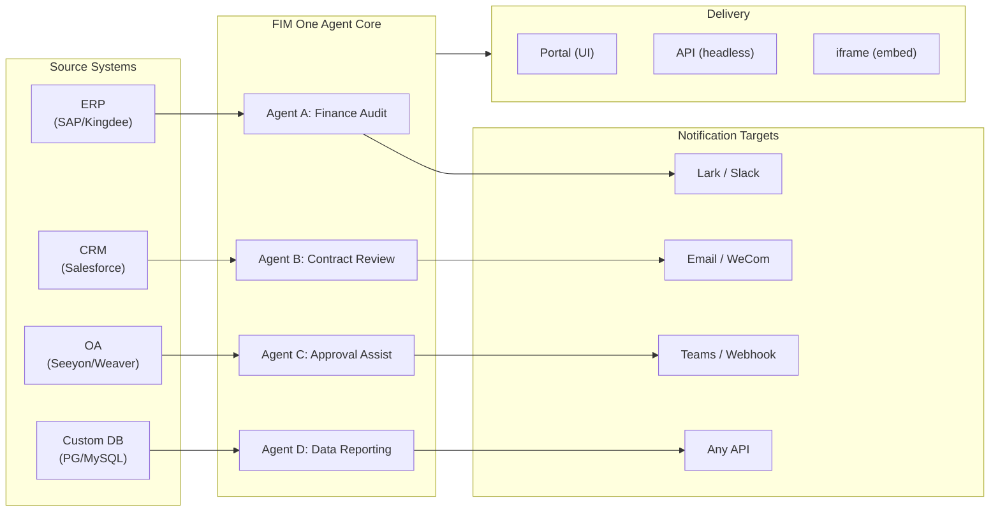

> Goal: Build an **all-in-one agent platform for Global × China enterprises** — delivered through three progressive modes: Standalone (portal assistant), Copilot (embedded in host system), Hub (central cross-system orchestration).
>
> Principles: **Provider-agnostic** (no vendor lock-in), **minimal-abstraction**, **protocol-first**, **connector-first** (integration is the core value).

## Produktvision

FIM One ist eine **All-in-One-Agent-Plattform**, die drei progressive Bereitstellungsmodi bietet:

```
Standalone   → Your own AI assistant (Portal)
Copilot      → AI embedded in a host system (iframe / widget / embed)
Hub          → Central cross-system orchestration (Portal / API)
```

**Systemübergreifende Orchestrierung ist der Kernunterscheidungsfaktor.** Unternehmenskunden haben Legacy-Systeme — ERP, CRM, OA, Finance, HR — die über KI miteinander kommunizieren müssen:



**GTM-Pfad: Land and Expand**

| Schritt | Modus | Was passiert |
|------|------|-------------|
| Land | Copilot | In ein System einbetten, Wert in ihrer Benutzeroberfläche nachweisen |
| Expand | Copilot → Hub | Auf weitere Systeme ausrollen; Hub-Modus aggregiert sie |

## Bekannte Probleme

Nachverfolgter Fehler, die in der Produktion reproduzierbar sind, aber noch nicht behoben wurden. Jeder Eintrag benennt das Symptom, den vermuteten Bereich und die Problemumgehung (falls vorhanden). Einträge werden in einen Versionsabschnitt verschoben, sobald eine Behebung definiert und geplant ist.

- **Agent-Editor zeigt Warnung zu ungespeicherten Änderungen ohne tatsächliche Bearbeitung.** Das Öffnen eines vorhandenen Agenten über `/agents/[id]` und sofortiges Zurückklicken löst den Dialog „Ungespeicherte Änderungen" aus, auch wenn kein Feld berührt wurde. Die Dirty-Check vergleicht 20+ Felder mit der geladenen Agent-Payload, daher reicht eine asymmetrische Standardeinstellung zwischen State-Initialisierung und Dirty-Vergleich aus, um einen Phantom-Mismatch zu verursachen – aktuelle Vermutung ist eines der verschachtelten `model_config_json` / Benachrichtigungs- / Genehmigungsrouting-Felder, möglicherweise von `undefined` vs `null` vs `""` Normalisierung. Reproduzierbar besonders bei organisationsgebundenen Agenten. Problemumgehung: Dialog verwerfen (`Discard and leave`) – kein Datenverlust, da sich nichts tatsächlich geändert hat. Versuchte Behebung (`cb40c86a`) entfernte ein verwandtes Orphan-Badge-Flimmern auf den Ressourcen-Pickern, löste aber dieses Problem nicht.

- **Das Speichern einer Agent-Bearbeitung kann mit `Input should be 'initiator', 'agent_owner' or 'org_members'` fehlschlagen.** Pydantic lehnt das Feld `confirmation_approver_scope` an der `/api/agents/{id}` PUT-Grenze ab, obwohl jeder gespeicherte Wert in der Datenbank einer der drei gültigen Literale ist. Vermutung: Das Frontend `as "initiator" | "agent_owner" | "org_members"` Cast ist nur ein Compile-Time-Versprechen, daher kann ein Legacy- oder unerwarteter Runtime-String (möglicherweise aus einer Vorlage, einem Import oder einer älteren Migration) durch `setConfirmationApproverScope` durchschlüpfen und wörtlich zurückgesendet werden. Problemumgehung: Wählen Sie explizit einen Wert in der Dropdown-Liste Genehmigung → Genehmiger-Bereich aus, bevor Sie speichern.

- **Playground-Stopp-und-Wiederholung zeigt vorübergehende visuelle Artefakte, die ein Seiten-Refresh immer behebt.** Drei gleichzeitige Render-Quellen – `activeConversation.messages` (DB-Snapshot), der SSE `messages` Stream und der optimistische `pendingQuery` Platzhalter – werden nicht in einen einzelnen abgeleiteten State zusammengefasst, daher kann die UI zwischen dem Klick auf „Retry" und dem Eintreffen der gepaarten Assistenten-Antwort (a) kurzzeitig die gleiche Abfrage zweimal im Pre-Stream-Fenster rendern, (b) vorherige verwaiste User-Blasen aus dem Wiederholungsverlauf löschen, während `hasLiveMessages` wahr ist und bevor der Snapshot neu geladen wird, und (c) im engen Fenster zwischen dem SSE „done" Event und dem nächsten `selectConversation` Refresh flimmern. **Daten gehen nie verloren** – jede Benutzer-Nachricht (einschließlich abgebrochener Wiederholungen) wird in `conversation.messages` beibehalten, in den nächsten LLM-Aufruf über `normalize_alternating_messages` übernommen und nach Refresh über `HistoryTurn.orphanUserContents` (eingeführt in der `48ba08c6` Render-Behebung) korrekt gerendert. Zum Kontext: Claude's eigene Web-UI zeigt eine analoge Fehlerklasse – das Stoppen einer Antwort und sofortiges Senden einer Folgefrage verzweigt die Folgefrage manchmal als Sibling-Edit-Zweig der ersten Abfrage, anstatt sie als neue Runde anzuhängen – daher ist dies ein bekanntes schwieriges Problem in Optimistic-UI + SSE + Persisted-History Designs, kein FIM-One-spezifischer Defekt. Eine ordnungsgemäße Behebung erfordert das Zusammenfassen der drei Render-Quellen in einen einzelnen abgeleiteten State; aufgeschoben bis zu einer breiteren Playground State-Machine Umgestaltung.

## Ausgelieferte Versionen

### v0.1 (2026-02-22) — MVP: ReAct + DAG Planner
- ReActAgent mit Tools (calculator, python_exec, web_search)
- DAG Planner (LLM generiert Abhängigkeitsgraphen)
- Portal UI mit Streaming + KaTeX

### v0.2 (2026-02-24) — Multi-Modell + Speicher
- Wiederholung / Ratenbegrenzung / Nutzungsverfolgung
- Native Funktionsaufrufe (kein reines JSON-Parsing)
- Multi-Modell-Unterstützung (schnelles + Haupt-LLM)
- Speicher: WindowMemory, SummaryMemory
- FastAPI-Backend mit SSE-Streaming

### v0.3 (2026-02-25) — Web Tools + MCP
- Web tools (web_search, web_fetch) via Jina/Tavily/Brave
- File operations tool
- MCP client (standard tool integration)
- Tool auto-discovery + categories
- DAG visualization with click-to-scroll
- Code exec in Docker (`--network=none`)

### v0.4 (2026-02-25) — Multi-Turn + Agenten
- Multi-Turn-Konversationen (DbMemory)
- Tool-Schritt-Faltungs-UI
- HTTP-Anfrage + Shell-Exec-Tools
- Agenten-Management (erstellen, konfigurieren, veröffentlichen)
- JWT-Authentifizierung
- Pro-Agenten-Ausführungsmodus + Temperaturkontrolle

### v0.5 (2026-02-28) — Full RAG + Grounded Gen
- Vollständige RAG-Pipeline (Embedding + Vektorspeicher + FTS + RRF + Reranker)
- Grounded Generation (Zitationen, Konfidenzwerte)
- Wissensdatenbank-Dokumentverwaltung (CRUD, Suche, Wiederholung, Schema-Migration)
- ContextGuard + angeheftete Nachrichten (Token-Budget-Manager)
- DbMemory-Persistenz + LLM Compact
- DAG-Neuplanung (bis zu 3 Runden)

### v0.6 (2026-03-01) — Connector-Plattform
- **Connector CRUD**: erstellen, lesen, aktualisieren, löschen
- **ConnectorToolAdapter**: konvertiert Connector → BaseTool
- **Benutzer-spezifische Anmeldedaten**: AES-GCM-Verschlüsselung
- **Bestätigungsgate**: Genehmigung von Schreibvorgängen
- **Audit-Protokollierung**: alle Tool-Aufrufe werden aufgezeichnet
- **Circuit Breaker**: elegante Verschlechterung bei Ausfällen
- **Utility-Tools**: email_send, json_transform, template_render, text_utils
- **Embedding-Optionen**: Jina, OpenAI, benutzerdefinierte Anbieter

### v0.7 (2026-03-06) — Admin-Plattform + Multi-Mandant
- **Admin-Plattform**: Benutzerverwaltung, Rollenwechsel, Passwort-Zurücksetzen, Konto aktivieren/deaktivieren
- **Nur-auf-Einladung-Registrierung**: drei Modi (offen/Einladung/deaktiviert) + Einladungscode CRUD
- **Speicherverwaltung**: Festplattennutzung pro Benutzer, Löschen, verwaiste Bereinigung
- **Gesprächsmoderation**: Admin-Liste/Löschen aller
- **Erzwungenes Logout pro Benutzer**: alle Token widerrufen
- **API-Gesundheits-Dashboard**: Systemstatistiken, Connector-Metriken
- **Assistent für die erste Einrichtung**: geführte Admin-Kontoerstellung
- **Persönliches Zentrum**: globale Anweisungen pro Benutzer, Spracheinstellung
- **JWT-Authentifizierung**: Token-basierte SSE-Authentifizierung, Gesprächseigentum
- **Globale MCP-Server**: von Admin bereitgestellt, in allen Sitzungen geladen
- **Rückwärtskompatibilität**: registration_enabled → registration_mode automatische Migration

### v0.7.x (2026-03-07 bis 2026-03-12) — Stabilität + Verbesserungen
- Einladungscode-Verwaltung
- Benutzer-spezifische Kontingente (429-Durchsetzung)
- Strukturiertes Audit-Logging
- Filterung sensibler Wörter
- Admin-Anmeldungsverlauf
- Admin-Dateibrowser
- Erweiterte Admin-Ansichten (Felder model_name, tools, kb_ids)
- Docker Compose-Bereitstellung (einzelnes Image, benannte Volumes)
- OAuth-Automatische Erkennung von window.location
- Erweitertes Denken / Reasoning-Unterstützung (`LLM_REASONING_EFFORT`, `LLM_REASONING_BUDGET_TOKENS`) für OpenAI o-Serie, Gemini 2.5+, Claude
- Admin pro-Tool Aktivieren/Deaktivieren (deaktivierte Tools werden zur Laufzeit aus dem Chat ausgeschlossen)
- MCP-Server-Verwaltung auf die Seite „Konnektoren" verschoben
- Duale Datenbankunterstützung: SQLite (Null-Konfiguration Standard) + PostgreSQL (Produktion); Docker Compose stellt PostgreSQL automatisch bereit
- Dokumentationsseite zur Modellkonfiguration mit Extended-Thinking-Setup pro Anbieter
- SSE Protocol v2: Echtzeit-Antwort-Streaming mit `delta_reasoning`, `usage`-Feldern und geteilten `done`/`suggestions`/`title`/`end`-Events; SQLite-Pool-Größe 5 -> 20
- AI Builder-Erweiterung: 7 neue Builder-Tools (GetSettings, TestConnection, ImportOpenAPI für Konnektoren; ListConnectors, AddConnector, RemoveConnector, SetModel für Agenten), `is_builder`-Flag auf Agenten, automatische Builder-Prompt-Aktualisierung, SSRF-Schutz
- SSE v2 Frontend: Streaming-Punkt-Puls-Cursor, DAG-Neuplan-Runden-Snapshots als einklappbare Karten, DAG-Layout entkoppelt von Schrittzuständen
- Konzeptdokumentationsseite für AI Builder mit Konnektoren- und Agenten-Builder-Leitfäden
- Organisationssystem: vollständige CRUD-Operationen mit rollenbasierter Mitgliedschaft (Eigentümer/Admin/Mitglied), Admin-Verwaltungs-UI
- Dreiebenen-Ressourcensichtbarkeit (persönlich/Org/global) für Agenten, Konnektoren, Wissensdatenbanken, MCP-Server
- Veröffentlichungs-/Unveröffentlichungs-API für alle Ressourcentypen; Eigentümerdelegation für veröffentlichte Agenten
- Admin-Set-Visibility-Endpoint (ersetzt Clone-to-Global); einheitlicher `build_visibility_filter()`-Abfrage-Helper
- Datenbank-Konnektoren (Phase 1-3): direkter SQL-Zugriff auf PG/MySQL/Oracle/SQL Server + chinesische Legacy-DBs; Schema-Introspection, KI-Annotation, schreibgeschützte Abfrageausführung, verschlüsselte Anmeldedaten, 3 Tools pro Konnektor (`list_tables`, `describe_table`, `query`)
- **Evaluierungszentrum**: quantitatives Benchmarking der Agentenqualität — Test-Dataset CRUD (Prompt + erwartetes Verhalten + Assertions), Eval-Läufe (parallele Ausführung + LLM-Bewerter + Pro-Fall Pass/Fail/Latenz/Token-Ergebnisse), Ergebnis-Viewer mit automatischem Polling; Migration `r8t0v2x4z567`
- Drei Modellrollen (Allgemein/Schnell/Reasoning) mit isolierter Umgebungskonfiguration pro Tier; Schnellmodell erbt keine Hauptmodell-Einstellungen mehr
- `StepOutput`-Dataclass ersetzt einfache String-Schrittergebnisse für strukturierte Daten und Artefakt-Übergabe
- Tool-Cache für DAG-Ausführung — identische Tool-Aufrufe pro Lauf gecacht mit asynchronem Lock-Stampede-Schutz (`DAG_TOOL_CACHE`)
- Pro-Schritt-LLM-Verifizierung mit 1 Wiederholung bei Fehler (`DAG_STEP_VERIFICATION`)
- Auto-Routing: schnelles LLM klassifiziert Abfragen als ReAct oder DAG; `/api/auto`-Endpoint; Frontend 3-Wege-Modusumschalter (`AUTO_ROUTING`)
- [x] ~~**Shadow Market Organization + Resource Subscriptions**~~: Integrierte Market-Org (Shadow, kein automatischer Beitritt) ersetzt Platform-Org; Ressourcen werden durch Marketplace-Browsing entdeckt und explizit abonniert (Pull-Modell); Market-API zum Abonnieren gemeinsamer Ressourcen; Veröffentlichung auf Market erfordert immer Überprüfung; Ressourcen-Abonnements-Tabelle; Org-basierte Ressourcenfreigabe ersetzt globale Sichtbarkeit
- [x] ~~**Agent Auto-discovery and Sub-agent Binding**~~: `discoverable`-Flag auf Agenten; `sub_agent_ids`-Whitelist; CallAgentTool zum Delegieren von Aufgaben an spezialisierte Agenten
- [x] ~~**MCP Server Credentials + Per-User Override**~~: `mcp_server_credentials`-Tabelle; `PUT /api/mcp-servers/{id}/my-credentials`-Endpoint; `allow_fallback`-Flag für Fallback-Verhalten bei Anmeldedaten
- [x] ~~**Connector/KB Toggle**~~: `POST /api/connectors/{id}/toggle` und `POST /api/knowledge-bases/{id}/toggle` zum Aussetzen/Fortsetzen von Ressourcen
- [x] ~~**Standalone KB Conversations**~~: `kb_ids`-Feld auf Konversationen für direkten KB-Chat ohne Agent-Bindung

### v0.8 (2026-03-20) — Connector Deklarative Konfiguration + Progressive Offenlegung
- [x] **Datenbank-Konnektoren**: direkter SQL-Zugriff (PostgreSQL, MySQL, Oracle) *(in v0.7.x ausgeliefert — Phase 1-3)*
- [x] **RBAC**: Konnektor-Zugriffskontrolle pro Benutzer/Rolle *(in v0.7.x ausgeliefert — Org-System + dreistufige Sichtbarkeit)*
- [x] **Konnektor-Anmeldedaten-Verschlüsselung + Benutzer-Override**: `connector_credentials`-Tabelle, Fernet-Verschlüsselung über `CREDENTIAL_ENCRYPTION_KEY`, `allow_fallback`-Flag, `GET/PUT/DELETE /my-credentials`-Endpunkte, Auflösung von Benutzer-Anmeldedaten beim Laden von Chat-Tools
- [x] **Veröffentlichungs-Review-UI**: Org-übergreifendes Veröffentlichungs-Review-System — Review-Toggle pro Org, ReviewsSheet mit Genehmigung/Ablehnung-Workflow, Status-Badges auf Ressourcen-Karten, Review-Hinweis im Veröffentlichungs-Dialog, erneute Einreichung für abgelehnte Ressourcen
- [x] **Konnektor Progressive Offenlegung (Phase 1-2)**: einzelnes `ConnectorMetaTool` ersetzt Pro-Action-Tools; System-Prompt erhält nur leichte **Stubs** (Name + 1-Zeilen-Beschreibung, ~30 Token/Konnektor vs ~250 Token/Action); Agent ruft `discover(connector)` auf, um vollständiges Action-Schema bei Bedarf zu laden — Schema wird nur geladen, wenn das Modell einen Konnektor auswählt, wodurch das Prompt-Präfix für Caching stabil bleibt. Folgt dem verzögerten Tool-Loading-Muster, das in modernen Agent-Frameworks üblich ist. `execute`-Unterbefehl; Feature-Flag für Rückwärtskompatibilität.
- [x] **Agent-Skill-System + Kompakte Anweisungen**: On-Demand-Skill-Loading für Agent-Anweisungen — `Skill`-Modell (Name, Inhalt/SOP, optionale Skripte) an Agenten angehängt; im System-Prompt nur nach Name referenziert (~10 Token/Skill); Agent ruft `read_skill(name)` auf, um vollständigen Inhalt bei Bedarf zu laden. Reduziert Pro-Konversations-Anweisungs-Token-Kosten um ~80%, während umfangreichere SOP-Bibliotheken ermöglicht werden. Gegenstück zur Progressive Offenlegung von ConnectorMetaTool auf Anweisungsebene angewendet. Ermöglicht die Differenzierungsgeschichte "指令 + 工具 + 技能". Fügt auch `compact_instructions`-Feld zum Agent-Modell hinzu — Pro-Agent-Komprimierungs-Prioritätsliste in `ContextGuard` bei Komprimierung eingefügt (z. B. "Bestellungs-IDs und Beträge bewahren, rohe API-Antworten verwerfen"), ersetzt die aktuelle statische generische Eingabeaufforderung. Folgt der Compact Instructions-Konvention, die in modernen Agent-Frameworks weit verbreitet ist.
- [x] **Konnektor Import/Export**: Konnektor-Vorlagen teilen
- [x] **Konnektor Fork**: Klonen + Anpassung vorhandener Konnektoren
- [x] **Workflow Phase 2 Knoten**: Iterator, Loop, VariableAggregator, ParameterExtractor, ListOperation, Transform, DocumentExtractor, QuestionUnderstanding, HumanIntervention — 9 erweiterte Knotentypen mit vollständigem Frontend + Backend + 150 neue Tests (275 insgesamt). Knoten-Wiederholung mit exponentiellem Backoff, sichere Ausdrucksevaluierung. Stats-Panel mit Erfolgsquoten-Balken. 12 integrierte Vorlagen. Bereichs-Kontextmenü (Einfügen, Alles auswählen, Ansicht anpassen, Auto-Layout).
- [x] **Workflow Phase 3 Knoten: SubWorkflow + ENV** — 2 neue Knotentypen (25 Knoten insgesamt), 14 neue Tests (306 insgesamt), 14 integrierte Vorlagen. SubWorkflow: vollständig DB-gestützter verschachtelter Workflow-Executor mit Ziel-Workflow-Auswahl, Variablenmapping und konfigurierbarem Tiefenlimit zur Vermeidung unendlicher Rekursion. ENV: liest verschlüsselte Umgebungsvariablen mit Schlüssel-Picker und Fallback-Standardwerte. Vollständiges Frontend (Knotenkomponenten, Konfigurationspanels, Palette-Einträge, Minimap-Farben). Pro-Knoten-Ausführungsstatistik-Panel (Erfolgsquoten, Dauern, Fehleranzahl sortiert nach Schlimmsten zuerst). `getNodeStats`-API-Client + `NodeStatEntry`-Typ. Tastaturkürzel-Dialog (`?`-Taste).
- [x] **Workflow Geplante Trigger**: Pro-Workflow-Cron-Konfiguration mit Zeitzone, Standard-Eingaben und Berechnung des nächsten Laufs. Voreingestellte Cron-Schaltflächen, 30 Trigger-Tests.
- [x] **Workflow API Trigger**: Öffentliche Pro-Workflow-API-Schlüssel (`wf_`-Präfix) für externe Ausführung ohne Benutzer-Authentifizierung, mit Rate Limiting. API-Schlüssel-Verwaltungs-Dialog mit Generieren/Neugenerieren/Widerrufen, Trigger-URL und cURL/JS-Beispiele.
- [x] **Workflow Batch-Ausführung**: `POST /batch-run` mit bis zu 100 Eingabesätzen, konfigurierbare Parallelität (1-10), zusammenklappbare Pro-Element-Ergebnisse, JSON-Export. 14 Batch-Ausführungs-Tests.
- [x] **Workflow Ausführungsprotokoll-Viewer**: Echtzeit-chronologischer SSE-Ereignisstrom im Run-Panel mit Zeitstempeln, farbcodierten Badges und Ereignistyp-Filter-Umschaltern.
- [x] **Workflow Run Stats**: Backend batch-abruft Run-Anzahl und Erfolgsquoten über GROUP BY-Unterabfrage; Frontend zeigt Stats auf Workflow-Karten mit farbcodierten Erfolgsquoten-Indikatoren an.
- [x] **Workflow Scheduler Daemon**: Hintergrund-Async-Service, der alle 60 Sekunden auf fällige Cron-basierte Workflows abfragt. Croniter-Zeitzone-Unterstützung, Semaphore-Parallelität, `last_scheduled_at`-Verfolgung, Webhook-Zustellung. 14 Tests.
- [x] **Workflow Import Konflikt-Resolver**: Erkennt ungelöste Agent/Konnektor/KB/MCP-Referenzen während des Imports. Batch-DB-Abfragen mit Sichtbarkeitsfilterung, Frontend-Toast-Warnungen. 17 Tests.
- [x] **Workflow Test-Knoten-Ausführung**: Isolierte Einzelknoten-Tests mit Mock-Variablen, in Editor integriert (Konfigurationspanel Test-Schaltfläche + Kontextmenü). 23 Tests.
- [x] **Workflow Version Diff**: Nebeneinander-Blueprint-Vergleich mit Knoten/Kanten-Änderungserkennung, farbcodierte Indikatoren (hinzugefügt/entfernt/geändert).
- [x] **Workflow Run Management**: Löschen einzelner Runs (`DELETE /runs/{run_id}`) und Löschen aller abgeschlossenen Runs (`DELETE /runs`), mit Frontend-Bestätigungsdialogen.
- [x] **Workflow Run Replay Overlay**: "Auf Canvas anzeigen"-Schaltfläche in Run-Verlauf zur Überlagerung vergangener Ausführungsergebnisse auf dem Canvas, Anzeige von Pro-Knoten-Status und Ausgabe ohne Neuausführung.
- [x] **Workflow Favoriten/Anheften**: Workflows mit Stern markieren/an die Spitze der Liste anheften mit localStorage-Persistierung.
- [x] **Workflow Run History Export**: Export-Run-Verlauf als JSON-Datei-Download mit vollständigen Run-Metadaten und Pro-Knoten-Ergebnissen.
- [x] **Admin Workflows Management**: Admin-Panel-Tab zur Verwaltung aller Workflows über Benutzer hinweg — Auflisten, Aktivieren/Deaktivieren umschalten, Löschen mit Bestätigung. Batch-Endpunkte zum Löschen, Umschalten und Veröffentlichen mit Audit-Protokollierung.
- [x] **Workflow Templates System**: `WorkflowTemplate`-ORM-Modell mit Admin-CRUD, öffentliche Auflistungs-/Clone-API und 5 Seed-Vorlagen, die beim ersten Start automatisch eingefügt werden.
- [x] **Workflow Inline Validation Badges**: Echtzeit-Pro-Knoten `ValidationBadge` auf Canvas mit Fehler-/Warnungs-Tooltips für sofortiges visuelles Feedback während der Bearbeitung.
- [x] **Workflow Execution Trace Viewer**: Timeline-basierter Trace-Viewer Sheet mit Engine `trace_level`-Parameter und Pro-Knoten-Variablen-Snapshots für Step-Through-Debugging.
- [x] **Workflow Rate Limiting und Timeout**: Pro-Benutzer `WorkflowRateLimiter` (Sliding Window 10 Runs/Min, 3 gleichzeitig) und Standard 10-Minuten-Global-Run-Timeout.
- [x] **Workflow Blueprint System**: Visueller Workflow-Editor zum Entwerfen und Ausführen mehrstufiger Automatisierungs-Blueprints — `Workflow` / `WorkflowRun`-ORM-Modelle, vollständig CRUD + SSE-Ausführungs-API, Import/Export, Duplikat, Blueprint-Validierungs-Endpunkt, `WorkflowEngine` mit topologischer Sortierung + Semaphore-basierter Parallelität + Bedingungsverzweigung und 12 Knotentypen (Start, End, LLM, ConditionBranch, QuestionClassifier, Agent, KnowledgeRetrieval, Connector, HTTPRequest, VariableAssign, TemplateTransform, CodeExecution), `VariableStore` mit `{{node_id.output}}`-Interpolation und `env.*`-Namespace, Fehlerstrategien pro Knoten (STOP_WORKFLOW / CONTINUE / FAIL_BRANCH) mit Pro-Knoten-Timeout und erweiterter Konfigurations-UI, React Flow v12 visueller Editor mit Drag-and-Drop-Palette + Knoten-Konfigurationspanel + Variablen-Picker-Combobox + Add-Node-on-Edge + Auto-Layout (ELK.js) + Run-Verlauf Sheet, Dify-ähnliches kompaktes Knoten-Design mit Ring-basiertem Run-Status-Styling und animierten Kanten-Übergängen, 4 integrierte Starter-Vorlagen (Simple LLM Chain, Conditional Router, Knowledge-Augmented QA, HTTP API Pipeline) mit Template-Picker-Dialog und `GET /templates` + `POST /from-template`-API, Stats-Endpunkt, `?run=true`-URL-Parameter Auto-Open, Subprocess-basierte Code-Ausführungs-Sicherheit, 105-Test-Suite (Vorlagen, Eval-Namespace-Flattening, Blueprint-Validierungs-Warnungen, Knoten/Kanten-Löschung, Import/Export/Duplikat, Deadlock-Erkennung, Multi-Bedingungsverzweigung)
- [x] **Operation Audit**: detaillierte Protokollierung wer was getan hat — Admin-Review-Log-Audit-Tab hinzugefügt (Veröffentlichungs-Review-Trail pro Org/Ressource)
- [x] **Semantic Schema Annotations**: Konnektor-Schema-Felder mit `semantic_tag`, `description` und `pii`-Flags erweitern; Annotationen in LLM-Tool-Beschreibungen angezeigt, damit der Agent die Feldabsicht versteht, ohne von Spaltennamen zu raten

### v0.8.1 (2026-03-29) — Progressive Disclosure Maturity + ReAct Hardening
- Progressive Disclosure für DB-Konnektoren (`DatabaseMetaTool`), MCP-Server (`MCPServerMetaTool`) und bedarfsgesteuerte Tool-Laden (`request_tools` Meta-Tool)
- DAG-Qualitätsüberholung (5 Verbesserungen: Modell-Upgrade, Skill-Autodiscovery, Citation Verifier, strukturierte Inhaltsbewahrung, Domain-bewusste Weiterleitung)
- Domain-Modell-Eskalation in ReAct (spezialisierte Domains eskalieren automatisch zum Reasoning-Modell)
- Pro-Modell Native Function Calling Toggle (`tool_choice_enabled`)
- ReAct-Zyklenerkennung (deterministische Vermeidung doppelter Tool-Aufrufe)
- ReAct-Abschlusscheckliste (Vor-Antwort-Verifikation bei Verwendung von Tools)
- Resource Fork Phase 1 (MCP Server + Skill Fork Endpoints mit Lineage Tracking)
- Workflow Connection Dep Auto-Subscribe (rekursive Sub-Workflow-Abhängigkeitsauflösung)
- Vordefinierte Lösungsvorlagen (8 vertikale Lösungen beim ersten Registrieren auf dem Markt bereitgestellt)
- Verbesserungen der Admin-Benachrichtigungen (Zeitzone-bewusst, Master-Schalter, SMTP Reply-To)
- Pro-Turn Token Budget Circuit Breaker (`REACT_MAX_TURN_TOKENS`)
- Zentralisierte Tool-Kürzung, dynamische System-Prompt-Budgetierung
- Dateianhang-Download, Behebung doppelter Nachrichteneinreichung

### v0.8.2 (2026-04-10) — Agent Core Hardening + Vision Documents
- **Agent Core Phase 0** — Compact prompt upgraded to 9-section structured format; empty tool result protection (descriptive message instead of `(no output)`); anti-loop prompt + cycle detection threshold lowered to 2; domain classifier + pre-flight DB config resolution parallelized (400–1100 ms saved per request); SSE `end` event sent immediately after answer, with title/suggestions moved to background tasks
- **Agent Core Phase 1 (Context Anti-Bloat)** — `MicroCompact` rule-based old tool result cleanup (keep last 6); `REACT_TOOL_RESULT_BUDGET=40000` aggregate cap; reactive compact on context overflow (auto-compact to 50% budget and retry instead of crashing)
- **Agent Core Phase 2 (Speed)** — Keyword-based tool pre-selection (skips LLM call on obvious matches, 200–500 ms saved); `SharedHttpClient` LLM connection pooling; completion check skipped for answers >200 tokens; `FallbackLLM` wraps primary+fast with automatic failover on 429/503/529/connection errors
- **Intelligent Document Processing (Vision-Aware)** — Adaptive document handling: PDF pages rendered as images via PyMuPDF for vision-capable models (GPT-4o, Claude 3/4, Gemini), text-only fallback via pdfplumber. Per-model `supports_vision` flag. Modes via `DOCUMENT_PROCESSING_MODE`, `DOCUMENT_VISION_DPI`, `DOCUMENT_VISION_MAX_PAGES`. DOCX/PPTX embedded image extraction. Multi-turn vision persistence across conversation turns. Smart PDF processing (text-rich pages extract text + images; scanned pages render as full-page PNG). Pre-built sandbox image (`Dockerfile.sandbox`) with common data-science packages for `--network=none` code execution
- **Resource Fork completion** — Intelligenter Agent / Connector / Workflow fork endpoints added, completing the five-type lineage tracking (KB fork removed — inherently user-local)
- **File integrity guardrail** — System prompt rule prevents the agent from substituting unrelated file contents when a target file is unreadable; uploaded files now include `file_id` in message context for direct `read_uploaded_file` access

### v0.8.3 (2026-04-16) — Universal Document Conversion + Agent Core Phase 3
- **Universal Document Conversion (`convert_to_markdown` + OCR)** — Built-in Agent tool wrapping Microsoft MarkItDown; converts PDF, Word, Excel, PowerPoint, HTML, JSON, CSV, XML, ZIP, EPUB, Outlook .msg, images, audio, YouTube URLs to Markdown. `LiteLLMOpenAIShim` enables OCR via any vision-capable LLM (Claude, Gemini, Bedrock, Azure). Vision-aware RAG ingestion with zero-regression text-only fallback. `LLM_SUPPORTS_VISION` env var for opt-out
- **Agent Core Phase 3 (Runtime Invariant Hardening)** — Conversation recovery (dangling `tool_use` auto-repair); structured compact work card (`WorkCard` typed merge across compaction rounds); turn-level profiler (`REACT_TURN_PROFILE_ENABLED`); per-user rate limiting (`LLM_RATE_LIMIT_PER_USER`); empty-content assistant message with `tool_calls` no longer dropped

### v0.8.4 (2026-04-17) — Prompt Cache + Reasoning Correctness
- **System prompt section registry with cache breakpoints** — Memoized `PromptRegistry` splits system prompts into stable prefix + dynamic suffix; cache-capable providers (Claude, Bedrock Anthropic, Vertex Claude) receive `cache_control: {"type": "ephemeral"}` on the prefix for ~60-80% per-turn input token savings. Non-cache providers get a single concatenated message (zero behavior change)
- **Prompt cache observability** — `cache_read_input_tokens` and `cache_creation_input_tokens` tracked through `UsageSummary` → `TurnProfiler` → `done_payload.cache` field. Structured `turn_cache` log line per turn. Doubles as relay cache-honesty probe
- **Conversation recovery MVP** — Synthetic `tool_result` rows persist after interrupted turns; `POST /chat/resume` replays cached SSE events from a monotonic cursor; frontend `useSseResume` hook auto-reconnects with exponential backoff (300ms → 1s → 3s, max 3 attempts) and "Reconnecting…" indicator
- **Thinking-block persistence with signature** — `reasoning_content` + Anthropic `signature` persisted in `metadata_["thinking"]` and replayed on subsequent turns; fixes HTTP 400 signature mismatch on Claude 4 multi-turn conversations
- **Provider-aware reasoning replay policy** — Centralized `reasoning_replay_policy()` in `core/prompt/reasoning.py` gates serialization per provider family: Claude replays thinking blocks with signature; DeepSeek-R1/Qwen-QwQ/Gemini-thinking/o-series drop `reasoning_content` on outbound (previously leaked, breaking provider KV caches and violating API docs)

### v0.8.5 (2026-04-23) — Channel Integration + Hook System + Contributor i18n
- **Feishu Channel (Phase 1 subset)** — Org-scoped `Channel` resource with Fernet-encrypted credentials; `FeishuChannel` supports interactive card send + callback (signature verification + URL challenge); Settings → Channels management UI (list, create/edit with dirty-state protection, details with copyable callback URL, test-send); CRUD API (`/api/channels`) and event callback endpoint (`/api/channels/{id}/callback`). Shipped early for 2026-04-24 roadshow
- **Agent Hook System (live in ReAct + DAG runtime)** — `PreToolUseHook` / `PostToolUseHook` abstraction in `src/fim_one/core/hooks/`; agents declaring `hooks.class_hooks` in `model_config_json` have hooks instantiated and registered per chat session. First consumer `FeishuGateHook` posts an Approve/Reject card to the linked Feishu group when an agent calls a `requires_confirmation=True` tool, blocks execution, and resumes or aborts based on verdict
- **Configurable confirmation gate (inline OR channel)** — Every agent gets an Approval section with three routing modes (Auto / Inline only / Channel only), approver-scope selector (initiator / owner / anyone in org), per-tool override, and explicit approval-channel picker. Auto mode gracefully falls back to an inline approval card when no channel is linked. `POST /api/confirmations/{id}/respond` shares a single decision-recording path with the Feishu webhook
- **Per-agent task completion notifications** — Long-running ReAct or DAG agents can push a summary card to the org's channel when a task finishes. First consumer of the generic outbound notification pattern
- **Hook Approval Playground** — Channels details sheet has a "Test Approval Flow" action that exercises the full production path (genuine `ConfirmationRequest` row, real Feishu callback, status transitions) — same code path a production hook uses
- **Contributor-friendly i18n CI fallback** — `.github/workflows/i18n-sync.yml` translates EN → ZH/JA/KO/DE/FR on master after PR merge and auto-commits with `[skip ci]`; contributors no longer need `LLM_API_KEY` locally. Pre-commit locale-edit guard refuses manual edits to generated locale files (`ALLOW_LOCALE_EDIT=1` override for legitimate translation fixes). End-to-end verified via smoke-test push
- **Exa integration docs** — Dedicated Integrations section with a first-class Exa page covering the full Exa search surface (neural / fast / deep-reasoning / instant), filtering, content retrieval, and three tuned presets
- **Xinchuang (信创) database support** — Database Connector now lists KingbaseES (人大金仓), HighGo (瀚高), and DM8 (达梦) alongside PostgreSQL/MySQL. PG-compatible drivers reuse `asyncpg`; DM8 uses `dmPython`. `scripts/test_xinchuang_dbs.py` verifies live connectivity from the CLI
- **Channels + Hook System architecture docs** — `docs/architecture/hook-system.mdx` explains the three hook points and walks through FeishuGateHook end-to-end; existing architecture pages cross-link; README lists Messaging Channels as a first-class capability
- **Hardening** — Duplicate Feishu callback clicks produce a replacement card instead of double-deciding; concurrent callback clicks resolved via conditional `UPDATE ... WHERE status='pending'` rowcount check; pending approvals auto-expire after `CHANNEL_CONFIRMATION_TTL_MINUTES` (default 24h) via background sweeper; Settings → Channels respects org role (members see read-only UI); parallel tool-call aggregator handles providers that reuse `index=0` for every delta; session-expiry redirect preserves query string

### v0.8.6 (2026-05-08) — Stripe Billing + Polish
- [x] Stripe billing MVP — Free + Pro tiers; Checkout, Customer Portal, webhook lifecycle; `/settings?tab=billing`; admin plan/subscription CRUD; quota enforcement respects each user's plan
- [x] Admin-controlled billing feature flag — `system_settings.billing_enabled` gates the entire Stripe pipeline so private deployments without Stripe credentials never surface a non-functional payment UX
- [x] Per-user unlimited quota — empty inherits global default, `0` grants unlimited; previously both collapsed into the same state
- [x] Translation glossary as single source of truth — `scripts/translation-glossary.md` consolidates per-locale rules; pre-commit unconditionally refuses manual edits to generated locale files
- [x] License + governing law migrated to FIM Labs Pte. Ltd. (Singapore); SIAC arbitration in English; new top-level `NOTICE` file
- [x] Playground follow-up suggestions restored, opt-in per agent
- [x] Stability fixes — strict-alternation provider history, parallel tool-call boundary detection, unbound-agent confirmation flow, channel role gating, retry-duplicate suppression, post-rejection no-paraphrase

## Geplante Versionen

### v0.9 — Observability + Production Hardening

**Ziel**: Produktionsreife Operationen + vier Säulen schließen die Lücke zwischen „Anweisungen, die der Agent möglicherweise befolgt" und „Garantien, die das System durchsetzt" — Trace Layer (sehen, was passiert ist) · Hook System (durchsetzen, was passieren muss) · Agent Workspace (persistente Dateien + Handoff) · IM Channel (Agents leben dort, wo Benutzer arbeiten).

#### Connector + Tooling

- [ ] **Connector Progressive Disclosure Phase 3-4** — unified `ConnectorExecutor` (API/DB/MCP); `jsonschema` action validation; protocol-agnostic discover/execute
- [ ] **YAML/JSON connector config** — platform auto-generates MCP server
- [ ] **Database connectors Phase 4** — Oracle (`oracledb`), SQL Server (`aioodbc`), GBase (`aioodbc` + GBase ODBC). DM8 / KingbaseES / HighGo shipped in v0.8.5
- [ ] **MCP Connection Pooling** — pool STDIO with per-user env isolation; share `httpx.AsyncClient` for SSE/HTTP. Target ≤100 ms warm-start, O(1) HTTP connections per server

#### Content Guardrails {/* dev: dev/openai-agents-insights.md */}

- [x] Content guardrails (input/output, tripwire pattern) — v0 ships jailbreak detector + max-length output guardrail, env-var configuration, structured `guardrail_tripwired` SSE event
- [ ] Off-topic filter (classifier-backed input guardrail) — defer to v0.5 if regex stays sufficient
- [ ] PII redactor output guardrail (regex + classifier hybrid)
- [ ] Per-agent guardrail configuration UI (admin panel)

#### Hook System {/* dev: dev/hook-system.md */}

- [ ] Per-Hook-Konfiguration Pass-Through (`{"name": ..., "config": {...}}` Schema)
- [ ] DAG `tools_used` Genauigkeit (echte Toolnamen aus Pro-Schritt ReAct über Step-Completion-Callback)
- [ ] Hook-Vererbung für `CallAgentTool` + Workflow `AGENT` Knoten (Sicherheits-Standard vs. Flexibilitäts-Standard)
- [ ] Integrierte Hooks: `ConnectorCallLog` Autoaufzeichnung, Read-Only-Modus-Blockierung, DB-Ergebnistrunkierung, Pro-Connector-Ratenlimit
- [ ] `SessionStart` Hook-Punkt + benutzerdefinierte YAML-Hooks
- [x] ~~Skeleton + FeishuGateHook + Approval Playground + ReAct/DAG Runtime~~ *(in v0.8.5 ausgeliefert)*

#### IM Channel Integration {/* dev: dev/im-channels.md */}

- [ ] Channels: WeCom, Slack, Email, Teams outbound
- [ ] Outbound patterns: failure alerts, budget warnings, scheduled digests, escalation, audit receipts, approval escalation
- [ ] Phase 2 — Inbound trigger (@mention agent in IM group)
- [x] ~~Feishu Channel (Phase 1 subset) + Task completion notification~~ *(shipped in v0.8.5)*

#### Connector-Autorisierungsebenen {/* dev: dev/connector-rbac/00-overview.md */}

- [ ] Stufe 1 — DB-Modus (`ConnectorScopeGuard` PreToolUse Hook: Verb-Blockierung, Tabellen-Whitelist/Blacklist, Spalten-Redaktion, Scope-Prädikat-Injektion)
- [ ] Stufe 2 — Open API-Modus (Admin-UI zur Anforderung von Benutzer-spezifischen Anmeldedaten; Key-Binding-Integritäts-Dashboard)
- [ ] Stufe 3 — Login-Ticket-Austausch (`LoginTicketCredential` für Frontend/Backend-geteilte Systeme ohne Benutzer-spezifische API-Schlüssel)
- [ ] Ebenenübergreifende Nachverfolgbarkeit (`caller_user_id`, `effective_credential_source`, `scope_rules_applied` in `ConnectorCallLog`)

#### Channel → Integration Promotion {/* dev: dev/channel-integration-sso.md */}

- [ ] `ThirdPartyIntegration` Modell — Channel in Delivery + Login + Org-graph-sync Sub-Funktionen hochstufen
- [ ] Feishu SSO ("Mit Feishu anmelden" ergibt FIM-Sitzung + Upstream-Token, entfernt Pro-Benutzer-API-Schlüssel-Reibung für Tier-2)
- [ ] Org-Graph-Synchronisierung (Feishu-Abteilungen → FIM-Organisationsbaum); WeCom + DingTalk folgen

#### Public API Phase 2 {/* dev: dev/public-api-phase2.md */}

- [ ] Pro-Schlüssel-Ratenbegrenzung (`X-RateLimit-*` Header, 429)
- [ ] Pro-Schlüssel-Nutzungskontingent (monatliches Token-/Request-Budget)
- [ ] Scope-Durchsetzung pro Endpunkt
- [ ] API-Versionierung (`/v1/...`) + Deprecation-Header
- [ ] Webhook-Callbacks (pro Schlüssel)
- [ ] SDK-Generierung (Python + TypeScript)
- [ ] Developer Portal (Try-it-Panels + Pro-Schlüssel-Analytik)
- [ ] API-Schlüsselrotation (24h Gnadenfrist)
- [ ] Batch-/Async-API (`POST /api/batch`)
- [ ] Pro-externe-Abhängigkeit Circuit Breaker

#### Observability {/* dev: dev/agent-trace-layer.md */}

- [ ] **Agent Trace Layer** — Trace/Span model, frontend timeline viewer, OTel export (LangSmith-style application-level run/trace/thread)
- [ ] **Metrics dashboard** — latency, success rate, token usage, connector analytics (per-agent / user / org)

#### Agent Workspace {/* dev: dev/agent-workspace.md */}

- [ ] Tool Output Offloading — `workspace://` URIs für >8K Antworten + `read/list/write_workspace_file` Tools
- [ ] Handoff Notes — `write_handoff(summary)` bleibt bei Komprimierung erhalten
- [ ] Workspace UI — Dateibrowser pro Konversation; Beibehaltung über Sessions hinweg; Speicherkontingent pro Benutzer
- [ ] Cross-session conversation recall — `list_conversations`, `search_conversations`, `read_conversation` Tools

#### Prompt-Cache + Reasoning-Nachverfolgungen {/* dev: dev/prompt-cache-followups.md */}

- [ ] Gemini Context Cache Adapter (separate REST cache lifecycle vs Anthropic inline marker)
- [ ] Prompt registry expansion to planner / verifier / domain classifier / compact
- [ ] Per-agent `cache_ttl` (ephemeral 5min vs extended 1h)
- [ ] DAG step-level checkpoint table for mid-DAG resume
- [ ] Dedicated `tool_call_id` Message column (indexed orphan-query lookup at scale)
- [ ] Mid-stream thinking token reconstruction (resume granularity finer than complete SSE event)
- [ ] API relay cache-honesty probe (admin-triggered: detects relays stripping `cache_control`)

#### Zuverlässigkeits-Nachverfolgungen (Agent Core Priority Matrix)

- [ ] Content replacement state persistence (streaming invariant #2: "once seen, fate frozen")
- [ ] Attachment context router (dedup, aggregate budget, liveness checks; pairs with Workspace offloading)
- [ ] Side query workers (dedicated pools for recall / classify / summary so they don't contend for main rate-limit budget)

#### Ökosystem + Skalierung

- [ ] **Geplante Jobs + ereignisgesteuerte Agents** — `scheduled_jobs` + `job_runs` + APScheduler; cron + webhook-inbound. Async Sub-Agent-Anwendungsfall für Hub-Modus
- [ ] **Workflow-Trigger-Identitätsobservabilität** — `ExecutionContext.trigger_source` (`webhook | cron | manual | batch | sub`) an allen 5 WorkflowEngine-Standorten gefüllt; in Ausführungspanel und Connector-Logs angezeigt
- [ ] **Pro-Workflow `credential_policy` Überschreibung** (`owner` / `caller` / `auto`) — überschreibt Standard-`trigger_source → identity` Zuordnung
- [ ] **DB Schema Advanced Builder** — KI-gesteuerte Annotation für 1K-7K+ Tabellenbereitstellungen (Selektivität + geschäftlicher Kontextreasoning)
- [ ] Sandbox-Härtung (v2 Code-Ausführungsisolation)
- [ ] Leistungstests (Concurrent-Load-Benchmarks)
- [ ] Internal Harness Benchmark (Harness-Parameteränderungen über Eval Center quantifizieren)

#### Bereits früh ausgeliefert

- [x] ~~Circuit breaker, Workflow run retention cleanup, Workflow version diff summaries~~ *(v0.8 / v0.8.1)*
- [x] ~~DAG quality overhaul, Domain model escalation, Per-model NFC toggle~~ *(v0.8.1)*
- [x] ~~DatabaseMetaTool, MCPServerMetaTool, On-demand `request_tools`~~ *(v0.8.1)*
- [x] ~~Workflow Connection Dep Auto-Subscribe, Workflow real executors~~ *(v0.8.1)*
- [x] ~~ReAct Cycle Detection, Completion Checklist~~ *(v0.8.1)*
- [x] ~~Prebuilt Solution Templates (8 vertical bundles), Resource Fork (MCP/Skill/Agent/Connector/Workflow)~~ *(v0.8.1)*
- [x] ~~Vision document processing (PDF / DOCX / PPTX), MarkItDown OCR~~ *(v0.8.2 / v0.8.3)*
- [x] ~~Smart File Content Injection + `read_uploaded_file`~~ *(v0.8)*
- [x] ~~Agent Core Phase 3: Conversation Recovery MVP, Compact Work Card, Turn Profiler, Per-user Rate Limiting~~ *(v0.8.3)*
- [x] ~~Conversation resume MVP, System prompt registry + cache, Thinking-block persistence, Reasoning replay policy, Cache observability~~ *(v0.8.4)*

### v1.0 — Hot-Plug + Embeddable

**Ziel**: Connector-Hinzufügung ohne Neustart, Paket-Ökosystem und eingebettete Bereitstellung.

- [ ] **Connector Progressive Disclosure (Phase 5)**: **Semantic-Guided Tool Selection** (Entity-Extraktion aus Abfrage → Ontology Registry-Suche → Connector-Set-Reduktion; 90%+ Token-Einsparung für 50+ Connector-Bereitstellungen); Scale-Modus für Batch-/ETL-Connectors; CLI-ähnliche universelle `connector <name> <action> <params>`-Schnittstelle
- [ ] **Cross-Connector Entity Alignment (Ontology Registry)**: Definieren Sie gemeinsame Entity-Typen (Customer, Order, Asset) mit Feldmappings über Connectors hinweg; DAGPlanner löst Cross-System-JOIN-Schlüssel automatisch auf; ermöglicht Cross-Connector-Abfragen (z. B. „Kunden in Salesforce, die in Shopify bestellt haben") ohne hartcodierte Feldnamen
- [ ] **Hot-plug Connectors**: OpenAPI-Spezifikation hochladen, KI generiert Konfiguration, live in 5 Minuten (kein Neustart)
- [x] ~~**Marketplace Redesign Phase 1 — Solutions + Components**~~: Zweiebenen-Marktmodell (Solutions: Agent/Skill/Workflow; Components: Connector/MCP Server); Scope-Selector (Global Market / org); einheitliches Abonnementmodell (org auto-appear entfernt); KB aus Market-Scope entfernt; Datenmigration füllt Abonnements für bestehende Org-Mitglieder auf
- [ ] **Market Package System**: Verteilbare Ressourcen-Bundles für den Marketplace — ersetzt Pro-Typ-„Marketplace" durch eine einheitliche Packaging-Schicht. `fim-package.yaml`-Manifest deklariert: Metadaten (Name, Version, Beschreibung, Autor, Lizenz, Tags, `min_fim_version`), Entry Point (primäre Skill oder Agent), Ressourcenliste (Agents, Skills, Connectors, KBs, MCP Server, Workflows) mit Konfigurationsreferenzen, Inter-Package-Abhängigkeiten (semver-Bereiche), erforderliche Anmeldedaten (auf Connector-Refs abgebildet für Installation-Zeit-Erfassung) und benutzerkonfigurierbare Variablen mit Standardwerten. **Zwei Konsummodi**: (1) **install** — Batch-Erstellung aller Ressourcen + automatisches Verdrahten interner Referenzen über ID-Substitution; Installation mit Quelle verknüpft für Versionsaktualisierungs-Benachrichtigungen; `POST /api/market/packages/{id}/install`; (2) **fork** — Klonen als benutzergesteuerte bearbeitbare Kopien ohne Aktualisierungslink (dies IST der Template-Modus); `POST /api/market/packages/{id}/fork`. Zusätzliche Endpunkte: publish (`POST /api/market/packages` mit Review-Workflow), uninstall (`DELETE /packages/{id}/uninstall` mit Abhängigkeitsprüfung + geänderter Ressourcenbestätigung), Versionshistorie (`GET /packages/{id}/versions`), upgrade (`POST /packages/{id}/upgrade` mit Pro-Ressourcen-Diff-Vorschau). Dependency Resolver für verschachtelte Package-Anforderungen mit Konflikt-Erkennung. `PackageInstallation`-Tabelle verfolgt installierte Packages pro Benutzer mit Ressourcen-ID-Mapping für Deinstallation/Upgrade. **Koexistiert mit individueller Ressourcen-Veröffentlichung** — Package ist eine Kompositionsschicht, kein Ersatz; ein einzelner Connector ist immer noch eigenständig veröffentlichbar. Beispiel-Abhängigkeitsbaum: `Package: contract-review` → `Skill: contract-review` (Entry Point) → `Agent: contract-analyst` + `Agent: risk-scorer` → `KB: legal-clauses` + `Connector: docusign-api` + `MCP: pdf-extractor` + `Workflow: contract-approval-flow`
- [ ] **Creator Program**: Marketplace-Monetarisierungsschicht — Creator-Profile mit Portfolio-Seiten, Pro-Package-Analysen (Installationen, Forks, aktive Benutzer, Bewertungen/Reviews), Affiliate-Provisionserfassung, wenn Packages neue Abonnements fördern. Bezahlte Package-Stufe mit Preisgestaltung, Kauffluss und Genehmigungsworkflow. Creator-Dashboard mit Installationstrends, Umsatzberichte und Benutzer-Feedback. Öffentliche Creator-API für programmatische Package-Veröffentlichung (CI/CD für Package-Autoren). Community-Features: Package-Kommentare, Q&A, Changelogs pro Version
- [ ] **Embeddable Widget**: `<script src="fim-one.js">` in Host-Seite injiziert
- [ ] **Page Context Injection**: Widget liest Host-Seiten-Kontext (aktuelle ID, URL, DOM-Selektoren)
- [ ] **Advanced Triggers**: Webhook-Inbound-Events; erweiterte Scheduled-Job-Verbesserungen (Multi-Timezone, Calendar-aware)
- [ ] **Batch Execution**: Verarbeiten Sie 1000+ Elemente über DAG
- [ ] **Enterprise Security**: IP-Whitelist, Verschlüsselung im Ruhezustand, SSO
- [ ] **KB Advanced Editor**: Builder-Mode-Agent für Power-User, die große Knowledge Bases verwalten — Bulk-URL-Erfassung, Duplikat-Erkennung, Gap-Analyse, Document-Lifecycle-Management; erweitert bestehenden KB-KI-Chat mit ReAct-Tool-Loop
- [ ] **Stripe Billing (v1 MVP — Pro Subscription)**: Free + Pro Zwei-Ebenen-Abonnement mit monatlichem Token-Kontingent. Stripe Checkout (gehostet) + Customer Portal (Self-Service) + Webhook-gesteuerte Lifecycle (`checkout.session.completed` / `customer.subscription.updated|deleted` / `invoice.payment_succeeded|failed`). Soft-Cap bei Kontingent-Erschöpfung (HTTP 402 + Upgrade-Aufforderung) — keine Überschussgebühren in v1. Nur Pro-Benutzer-Abrechnung; Org/Team-Abonnements bis v3 aufgeschoben. Voraussetzungen:
  - [x] ~~**Data Model + SDK Groundwork** (P1) — `billing_plans` / `subscriptions` / `stripe_webhook_events`-Tabellen, ORM-Modelle, Stripe SDK Singleton, Free + Pro Seeds~~ *(in v0.8.6 ausgeliefert)*
  - [x] ~~**Backend API + Webhook Handler** (P2) — `/api/billing/*` + `/api/webhooks/stripe` mit Signaturverifizierung + Idempotenz; Plan-bewusste Kontingente; stündliche Lifecycle-Sweep~~ *(in v0.8.6 ausgeliefert)*
  - [x] ~~**Frontend Billing Tab + 402 Upgrade Dialog** (P3) — `/settings?tab=billing` Kontingent-Anzeige, Upgrade-CTA, `past_due`-Banner, Mid-Stream-402-Dialog~~ *(in v0.8.6 ausgeliefert)*
  - [x] ~~**Admin Plan Management** (P4) — `admin/billing/{plans,subscriptions}` CRUD~~ *(in v0.8.6 ausgeliefert)*
  - [x] ~~**Admin-Controlled Billing Feature Flag** (P5) — `system_settings.billing_enabled` gated die Stripe-Pipeline; idempotente Aktivierung Seeds Free+Pro, setzt Standard-Plan-Pointer, Backfills-Benutzer; Toggle off/on ist reines Flag-Flip nach Aktivierung~~ *(in v0.8.6 ausgeliefert)*
  - [ ] **Reconciliation + e2e + Go-Live** (P6) — nächtliches `subscriptions` ↔ `stripe.Subscription.list()` Reconcile-Skript für Missed-Webhook-Recovery; vollständiger Happy-Path / Cancel-Mid-Period / Past-Due Regressions-Tests; Wechsel von Test-Mode `stripe_price_id` zu Live `price_id`; Smoke-Test auf Staging mit echter Karte.

- [ ] **Team Plan (Stripe Seats)** — Pro-Seat-Preisgestaltung über `stripe.Subscription.quantity`, integriert mit Organization-Mitgliedschaft. Ermöglicht Unternehmen, einen Team-weiten Plan mit N Seats zu abonnieren; Kontingent und Feature-Flags werden durch die Seat-Gruppe statt durch den einzelnen Benutzer aufgelöst. Baut auf dem v1.0 Stripe MVP und dem bestehenden Organization-Modell auf.
- [ ] **Group-Level Token Quota für Non-Billing-Bereitstellungen** — Enterprise/Private-Bereitstellungen ohne Stripe konfigurieren Organization-Level-Token-Budgets. Quota-Kette erstreckt sich auf `override > group > plan > default`; Group-Auflösung verwendet `max(user_quota, group_quota)`, sodass einzelne VIPs nicht durch die Team-Cap eingeschränkt werden. Landet neben dem Team Plan, damit die gleichen Primitives sowohl fakturierte als auch Self-Hosted-Topologien bedienen.

**Impact**: Unternehmen stellen FIM One von Null bis Multi-System-Orchestrierung in Tagen bereit. Das Package-System schafft ein Creator-Ökosystem — Solution-Autoren veröffentlichen zusammengesetzte Bundles (Skill + Agents + Connectors + KBs + Workflows), Unternehmen installieren mit einem Klick, Creator verdienen durch Adoption. Install/Fork-Dualität deckt sowohl „As-Is-Nutzung" als auch „Anpassung aus Template" Anwendungsfälle in einem einzigen Mechanismus ab.

## Gefrorene Funktionen (Ausgeliefert, nur Wartung)

Gemäß der [Orthogonality Strategy](/strategy/orthogonality-strategy) sind diese Funktionen ausgeliefert und funktionsfähig, erhalten aber keine neuen Funktionen (nur Fehlerbehebungen):

| Funktion | Version | Grund für Einfrieren |
|---------|---------|-----------|
| ReAct Agent | v0.1, v0.9 | Modelle haben jetzt natives Tool Calling. Mid-Loop Self-Reflection (v0.9) verhindert Zieldrift in langen Ketten. Qualität der Tool-Observation-Synthese verbessert (8K Zeichen, konfigurierbar über `REACT_TOOL_OBS_TRUNCATION`) |
| DAG Planning / Re-Planning | v0.1, v0.5, v0.7.5 | Modell-Reasoning-Fähigkeiten verbessern sich; Dekomposition wird Single-Shot. Per-Step-Verifikation in v0.7.5 ausgeliefert (`DAG_STEP_VERIFICATION`). Gehärtet: Cascade-Fehlerausbreitung, Verifier-Status-Fix, Planner-Tool-Beschreibungen, vollständiger Replan-Verlauf, Whitelist-basierter Tool-Cache. 14 Engine-Konstanten als ENV-Variablen verfügbar — keine weiteren Planning-Primitive geplant |
| Memory (Window, Summary, Compact) | v0.2, v0.5 | Context Windows wachsen (200K+); weniger Bedarf für externe Memory-Verwaltung |
| RAG Pipeline | v0.5 | Provider bauen Retrieval nativ ein (OpenAI file_search, Gemini Search Grounding) |
| Grounded Generation | v0.5 | Modelle verbessern sich bei Zitaten; 5-stufige Pipeline bietet abnehmenden Mehrwert |
| ContextGuard / Pinned Messages | v0.5 | Wird wie vorhanden ausgeliefert; keine neuen Funktionen |

## Überlegungen (Auf unbestimmte Zeit aufgeschoben)

Gemäß der Orthogonality Strategy würden diese hohen Aufwand erfordern und Absorptionsrisiken bergen:

| Feature | Grund für Aufschub |
|---------|------------|
| Multi-Agent Orchestration (tiefe Hierarchien) | Provider bauen nativ (OpenAI Swarm, Google A2A und ähnliche Multi-Agent-Angebote). FIM One's CallAgentTool deckt den One-Level-Delegationsfall ab; ereignisgesteuerte Hintergrund-Agenten werden durch Scheduled Jobs in v0.9 abgedeckt |
| Agent Self-modifying Skills (Procedural Memory) | Agenten aktualisieren ihre eigene `skill.md` während der Ausführung — hohe Komplexität, Sicherheits-/Audit-Oberfläche. Hängt davon ab, dass Agent Skill System (v0.8) zuerst ausgeliefert wird. Neu bewerten, wenn Enterprise-Kunden selbstverbessernde Agenten explizit anfordern |
| ~~Agent Workspace (Tool Output File Offloading)~~ | Zu v0.9 befördert. Der Wert liegt in **selektivem Lesen**, nicht in Kontextkapazität — Framework-übergreifende Validierung bestätigt. Ursprüngliche Aufschublogik („200K+ Fenster reduzieren Dringlichkeit") war falsch. |
| Cross-Session Long-Term Memory | Context Windows wachsen schnell (200K–2M); Provider fügen eingebautes Memory hinzu (OpenAI memory, Gemini context caching); hohe Implementierungskosten vs. sinkender Differenzierungswert. Neu bewerten, wenn Enterprise-Kunden es explizit anfordern |
| Memory Lifecycle (TTL, Quotas) | Hängt von Cross-Session Memory ab; zusammen aufgeschoben |
| Active Context Compression Tool (Agent-ausgelöst) | Explizit eingefroren mit ContextGuard (v0.5). Context Windows bei 200K+ reduzieren den Wert. Wird nicht überprüft, es sei denn, Kontextkosten werden zu einer großen Enterprise-Beschwerde |
| Browser Automation / Computer Use | Hohe Wartungskosten (DOM-Änderungen, Anti-Bot, Sandboxing). Industrie konvergiert auf Computer Use Mode (Anthropic, OpenAI Operator, Google Mariner) und MCP Browser Tools (Puppeteer/Playwright MCP). Über MCP Integration konsumieren, nicht selbst bauen. Neu bewerten, wenn stabiler Computer Use MCP Standard entsteht |
| Web Push Notifications | Browser-natives Push über Service Worker + VAPID. Überlappt mit IM Channel Integration (v0.8), die Enterprise-bevorzugte Kanäle abdeckt (Lark/Slack/WeCom/Email). IM Push hat höheren Enterprise-Wert; Web Push ist ein Nice-to-Have für Portal-only-Benutzer. Neu bewerten nach IM Channel Auslieferung — wenn Benutzer Browser-Benachrichtigungen über IM-Abdeckung hinaus anfordern |
| Multi-user Workflow Collaborative Editing | Echtzeit-Co-Editing desselben Workflow-Blueprints (Figma/Notion-Stil) mit Cursor-Awareness, Konfliktauflösung und Pro-Node-Lock. Hohe Implementierungskosten (CRDT / OT, Presence-Infrastruktur), unklar Enterprise-Nachfrage gegenüber heutigem „ein Editor gleichzeitig + Version Diff" Modell. Neu bewerten, wenn mehrere Enterprises explizit gemeinsames Live-Editing anfordern |
| Per-Node Workflow Execution Permissions (RBAC on Run) | Feinkörnige Autorisierung *innerhalb* eines einzelnen Workflow-Laufs — z.B. „Node X erfordert Rolle `finance_approver` zur Ausführung". Heute findet Autorisierung auf Workflow-Ebene statt (wer kann auslösen) und auf Connector-Ebene (wessen Credential läuft); Per-Node RBAC fügt eine dritte Achse mit erheblicher Komplexität und keiner aktiven Kundenanfrage hinzu |
| Cross-org Workflow Sharing mit Live Updates | Workflow aus einer anderen Org abonnieren und Upstream-Updates ohne Neu-Forking erhalten. Heute Abonnement = Fork (Snapshot), daher brechen Upstream-Änderungen nie aus. Live Updates würden Upstream-kompatible Schema-Evolution + Konfliktauflösung erfordern; hohe Wartungskosten. Neu bewerten, wenn Enterprises „gemeinsame Workflows über Tochtergesellschaften" anfordern |

## Wie Versionen mit Modi ausgerichtet sind

| Version | Standalone | Copilot | Hub | Notizen |
|---------|-----------|---------|-----|-------|
| **v0.1–v0.3** | Funktioniert | Noch nicht | Noch nicht | Nur Portal, einzelner Benutzer |
| **v0.4** | Funktioniert | Noch nicht | Noch nicht | Multi-Konversation, Agent-Verwaltung |
| **v0.5** | Funktioniert | Noch nicht | Noch nicht | Wissensdatenbank + RAG |
| **v0.6** | Funktioniert | Möglich | Möglich | Konnektoren verfügbar; Copilot/Hub möglich mit manueller Verdrahtung |
| **v0.7** | Funktioniert | Bereit | Bereit | Admin-Plattform; Multi-Tenant-Authentifizierung; produktionsbereit |
| **v0.8** | Funktioniert | Bereit | Optimiert | RBAC + Audit-Log pro System; einfacheres Onboarding |
| **v0.9** | Funktioniert | Bereit | Produktion | Observability, Performance, Härtung |
| **v1.0** | Funktioniert | Optimiert | Enterprise | Paketsystem, Creator-Programm, Hot-Plug, einbettbares Widget, Webhooks, Batch |

## Ressourcenallokation (v0.8–v1.0)

Die Orthogonalitätsstrategie bestimmt, wohin die Anstrengungen fließen:

| Kategorie | Allokation | Versionen | Grund |
|----------|-----------|----------|-----|
| **Connector-Plattform** (v0.6+) | 50% | Laufend | Kernunterscheidungsmerkmal; kein Absorptionsrisiko |
| **Enterprise-Funktionen** (RBAC, Audit, Sicherheit, Observability) | 30% | v0.8–v1.0 | Langweilig, aber dauerhaft; Produktionsanforderung. Agent Trace Layer ist kommerzieller Anker |
| **Agent-Intelligenz** (Skill-System, geplante Agenten) | 15% | v0.8–v0.9 | 指令+工具+技能 Differenzierungsgeschichte; niedriges Absorptionsrisiko — Frameworks validieren Muster, aber Enterprise-SOPs sind kundenspezifisch |
| **v0.1–v0.5 Wartung** | 5% | Laufend | Nur Fehlerbehebungen; keine neuen Funktionen |

## Metrik-gesteuerte Meilensteine

Der Erfolg wird gemessen durch:

| Metrik | v0.7 Ziel | v0.8 Ziel | v1.0 Ziel |
|--------|------------|------------|------------|
| Bereitgestellte Konnektoren | 5 | 20+ | 100+ |
| Enterprise-Kunden | 1–2 | 5–10 | 20+ |
| Durchschnittliche Konnektor-Einrichtungszeit | 2 Wochen | 2 Tage | 5 Minuten (Hot-Plug) |
| Token-Effizienz (DAG vs ReAct-only) | 30% Reduktion | 40% Reduktion | 50% Reduktion |
| Uptime SLA | 99,5% | 99,9% | 99,95% |
| Support-Ticket-Themen | Integration, Einrichtung | Benutzerdefinierte Konnektor-Logik | Hot-Plug, Skalierung |

## Offene Fragen / TBD

- **Marketplace-Moderation**: Wie können Community-Pakete und einzelne Ressourcen validiert werden? Automatisierte Scans auf Credential-Leaks in Paket-Konfigurationen? (v1.0)
- **Token-Ökonomie**: Wie können Multi-User-, Multi-Agent-Szenarien bepreist werden? (v1.0)
- **Paket-Versionierung**: Breaking Changes in installierten Paketen — automatisches Upgrade mit Migrationsskripten oder manuelle Genehmigung pro Update? Auflösung des Dependency-Diamond-Problems? (v1.0)
- **Paket-Preisgestaltung**: Kostenlose vs. kostenpflichtige Stufen, Provisionsätze für Creator Program, Integration von Zahlungsanbietern? (v1.0)
- **Paket-Credential-UX**: Credential-Erfassung bei Installation — Wizard-ähnlich Schritt für Schritt oder aufgeschobenes Setup? Credential-Sharing über Pakete hinweg, die denselben Connector-Typ verwenden? (v1.0)
- **Telemetry-Opt-out**: Wie können Datenschutzpräferenzen respektiert werden? (v0.8)
- **Connector-Versionierung**: Wie können Breaking Changes in Connector-APIs verwaltet werden? (v0.8)
- **Rate Limiting**: Pro-User-Workflow-Rate-Limiting implementiert (Sliding Window 10 Runs/Min, 3 gleichzeitig). Pro-Connector und Pro-Agent-Rate-Limiting TBD (v0.9)
- **Connector-Autorisierungsstufen-Auswahl**: Wie kann ein Admin herausfinden, welche Stufe für ein bestimmtes Upstream-System gilt? Auto-Probe (versuche Pro-User-API-Key → Fallback auf Login-Ticket → Fallback auf Shared-DB) vs. explizite Deklaration in der Connector-Spezifikation? Wie drücken wir "dieser Connector unterstützt Stufe 2, aber der Admin hat sich für Stufe 1 entschieden" in der UI aus, ohne nicht-technische Admins zu verwirren? (v0.9)
- **Integration vs. Connector-Dualität**: Wenn eine Feishu-Bindung gleichzeitig ein SSO-Provider UND eine API-Call-Oberfläche ist, wie präsentieren wir sie in den Einstellungen? Ein Objekt mit drei Umschaltern oder drei separate Bindungen, die eine Credential teilen? Auswirkungen auf die Deinstallations-Semantik (tötet das Widerrufen von SSO den Connector?) (v0.9)

