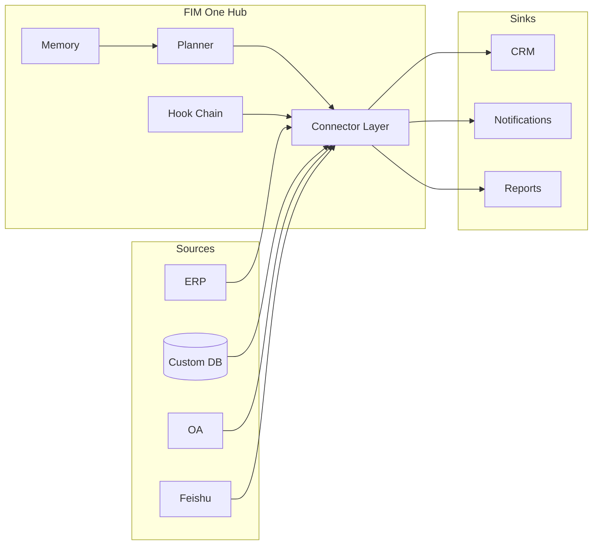

<Frame>
  
</Frame>

<Info>
  **Version 1.1 · April 2026.** Dieses Whitepaper dokumentiert die architektonische These, die Kategoriepositionierung und das Bereitstellungsmodell von FIM One.
  Es richtet sich an CTOs, Enterprise Architects, AI-Plattformleiter und technische Investoren, die evaluieren, wie sie KI in die Systeme bringen, die sie bereits betreiben.
</Info>

## Zusammenfassung

**Daten verlassen niemals Ihre Grenze.** Dieser eine Satz ist die grundlegende Designvorgabe hinter jeder Entscheidung in FIM One und der Grund, warum eine neue Infrastrukturschicht erforderlich ist — nicht eine weitere iPaaS und nicht ein weiterer universeller Agent.

Die meisten Unternehmen verfügen bereits über die Systeme, die sie benötigen — ERP, CRM, OA, benutzerdefinierte Datenbanken, interne APIs, branchenspezifische SaaS. Was ihnen fehlt, ist eine Möglichkeit für KI, diese Systeme zu **erreichen**, ohne Daten in eine Vendor-Cloud zu migrieren und ohne ein sechsmonatiges Integrationsprojekt für jeden Use Case. Der Markt ist groß, bewegt sich schnell und positioniert sich bereits neu: Die globalen Ausgaben für GenAI-Infrastruktur in Unternehmen werden 2025 auf **18 Mrd. USD geschätzt und wachsen um das 3,2-fache YoY** (Menlo Ventures 2025). China bewegt sich noch schneller — die Ausgaben für Enterprise-AI-Agenten liegen bei **120% CAGR (2023–2027) und erreichen bis 2027 ¥65,5 Mrd.** (iResearch · CAICT 2025). Zentral- und staatseigene Unternehmen machen **60%+ der Beschaffung großer Modelle** aus, und Xinchuang (信创) Private-Deployment ist eine zwingende Anforderung.

Gartner hat diese Kategorie offiziell in „AI Agent Platform" umbenannt (Dokument 6300015, 2025); CAICTs 2025 Agentic AI Technology Report nennt es „智能体平台"; MuleSoft, der historische iPaaS-Marktführer, wurde **vom Leader zum Challenger** im 2025 iPaaS Magic Quadrant herabgestuft. Die Kategorie, die die Unternehmensintegration ein Jahrzehnt lang dominierte, wird in Echtzeit ersetzt.

FIM One ist für die neue Kategorie konzipiert. Es ist eine **All-in-One-Agent-Plattform** für Global × China Unternehmen — ein Provider-agnostisches Python-Framework, bei dem KI-Agenten dynamisch Aufgaben über Ihre bestehenden Systeme planen und ausführen, globale SaaS und den China Stack über einen Agent Core verbinden, in Ihrer eigenen Umgebung bereitgestellt, vollständig nachverfolgbar. Ein Agent Core, drei Bereitstellungsmodi:

| Modus | Wo es sich befindet | Typische Bereitstellung |
|---|---|---|
| **Standalone** | Ein eigenes Portal | Knowledge Q&A, interner Chat, Code-Sandbox |
| **Copilot** | Eingebettet in ein Host-System | „Finance Copilot" in einer ERP-Web-UI |
| **Hub** | Zentraler systemübergreifender Orchestrator | Agent fragt ERP ab, prüft OA, benachrichtigt über Feishu |

Dieses Dokument erklärt, warum sich die Kategorie bewegt, warum iPaaS die neue Workload nicht aufnehmen kann, wie FIM One unter der Haube aussieht und wie Sie es in die Produktion bringen.

## 1. Das Problem: Enterprise-KI ist ein Alignment-Problem

Die öffentliche KI-Diskussion in 2025–2026 wurde von Modellkapazität dominiert — längere Kontexte, besseres Reasoning, günstigere Token. In Unternehmen ist Kapazität selten der Engpass. Der Engpass ist, dass **die KI keine Hände in Ihren Systemen hat**.

Ein Frontier-LLM, das eine zehntausendzeilige Codebasis lesen und einen korrekten Fix vorschlagen kann, kann von selbst nicht:

- Gestrige Bestandszahlen aus einer lokalen SAP-Instanz abrufen.
- Eine Urlaubsanfrage in einem SaaS-HR-Tool genehmigen, dessen einzige Integrationsoberfläche eine Legacy-SOAP-API ist.
- Eine Zeile in ein Xinchuang-konformes ERP schreiben, dessen Authentifizierung ein Login-Ticket-Service statt OAuth2 ist.
- Eine Benachrichtigung in eine Feishu-Gruppe senden und dabei die eigenen Genehmigungsregeln der Gruppe respektieren.

Jedes dieser Probleme ist einmal gelöst — eine gelöste Integrationsfrage. Die Schwierigkeit besteht darin, dass jedes Unternehmen Dutzende solcher Systeme hat, jedes mit seinem eigenen Authentifizierungsmodell, seiner eigenen Datenform und seinen eigenen Fehlermodi. Sie hardcodieren zu lassen, ergibt einen spröden Monolithen. Das LLM zur Laufzeit dazu zu bringen, sie zu entdecken, ergibt halluzinierte API-Aufrufe.

**Die fehlende Primitive ist eine ausgerichtete Oberfläche.** Eine typisierte, authentifizierte, auffindbare Schnittstelle zwischen dem Modell und dem System — eine, die dem Modell genau sagt, was es tun kann, was jede Aktion kostet, wer sie genehmigen muss und wie das Ergebnis aussieht. Diese Primitive ist das, was FIM One einen **Connector** nennt.

## 2. Warum bestehende Ansätze nicht ausreichen

### 2.1 iPaaS und Workflow Builder — eine Kategorie im Niedergang

iPaaS (MuleSoft, Boomi, Workato) und die leichtere Workflow-Familie (n8n, Zapier, Dify, Coze) behandeln Integration als ein **Design-Zeit**-Problem: Ein Mensch zeichnet einen Graphen von Knoten und verbindet sie auf Feldebene, der Graph läuft zur Laufzeit deterministisch ab. Das Modell funktionierte, als Integrationen wenige und stabil waren.

Es funktioniert nicht für KI-gesteuerte Enterprise-Automatisierung, aus drei sich verstärkenden Gründen:

1. **Die Logik existiert bereits im Zielsystem.** Jeder Knoten ist ein dünner Wrapper um einen API-Aufruf, den Sie jetzt an zwei Stellen pflegen.
2. **Der Mensch muss den Plan im Voraus kennen.** Enterprise-Fragen wie „Q1 für alle APAC-Entitäten abschließen" sind offen — der Plan muss zur Laufzeit generiert werden, nicht von einem Designer gezeichnet.
3. **Feldebenen-Mapping kollabiert bei Skalierung.** Ein Graph mit tausend Knoten über ein Dutzend Systeme ist nicht wartbar; KI-lesbare Action-Oberflächen ersetzen ihn vollständig.

Die Kategorie bewegt sich sichtbar. Gartner klassifizierte den Bereich 2025 als „AI Agent Platform" um (Dokument 6300015). CAICT übernahm denselben Rahmen in seinem 2025 Agentic AI Technology Report. Am aussagekräftigsten: **MuleSoft — der Referenz-iPaaS-Anbieter für ein Jahrzehnt — wurde im Gartner 2025 iPaaS Magic Quadrant von Leader auf Challenger herabgestuft**. Gleichzeitig wuchs das MCP-Protokoll von Anthropic, das im November 2024 veröffentlicht wurde, auf **über 10.000 Server und 97 Millionen monatliche SDK-Downloads in 15 Monaten**. Das Signal ist unmissverständlich: die Integrations-Schicht der Enterprise-Automatisierung wird neu aufgebaut.

### 2.2 Allzweck-Agenten (Manus, AutoGPT, OpenAI Assistants)

Allzweck-Agenten sind für Consumer- und Knowledge-Work-Aufgaben konzipiert — Web-Browsing, Dokumentenerstellung, Tabellenkalkulationen. Sie können nicht in Ihr VPN eindringen, sich bei Ihrem ERP authentifizieren oder Ihre Sicherheitsprüfung bestehen. Wenn sie um Unternehmensysteme herum eingesetzt werden, werden sie zu Demos, die in der Pilotphase scheitern.

### 2.3 Vendor-Embedded AI (Feishu AI, SAP Joule, Salesforce Einstein)

Vendors haben ihre eigene KI in ihre eigenen Produkte integriert. Das Problem ist strukturell: **Kein vorgelagerter Anbieter hat einen Anreiz, seine eigene Datensilo zu durchbrechen.** Feishu AI kennt Ihre ERP-Daten nicht; DingTalk AI kennt Ihren Vertragsstatus nicht. Die KI jedes Anbieters sieht nur das, was dieser Anbieter Ihnen verkauft hat. Für systemübergreifende Arbeiten sind sie keine Option.

### 2.4 Build-Your-Own und RPA

Eigenentwicklungen haben lange Entwicklungszyklen und konstante Anpassungskosten. RPA steuert die Benutzeroberfläche wie ein Mensch — der allgemeinste Ansatz und der zerbrechlichste: Jede UI-Änderung bricht ihn, jede Authentifizierungsaufforderung stoppt ihn. Es ist ein Pflaster über fehlenden APIs, keine Grundlage zum Aufbau von KI.

FIM One besetzt die Lücke, die all diese hinterlassen: typisierte APIs über echte Systeme, vom Modell geplant, vom Unternehmen gesteuert, innerhalb der Unternehmensgrenze bereitgestellt.

## 3. Die FIM One These

Drei Überzeugungen prägen jede Designentscheidung.

**Überzeugung 1 — Die Systeme existieren bereits.** Fordern Sie das Unternehmen nicht auf, alles neu aufzubauen; treffen Sie es dort, wo es ist. Jeder Connector ist eine Brücke, keine Ersetzung. Daten verlassen niemals die Quelle der Wahrheit und niemals die Unternehmensgrenze.

**Überzeugung 2 — Ausrichtung schlägt Leistung.** Ein schwächeres Modell mit einem ausgerichteten Toolset übertrifft ein stärkeres Modell, das an rohen APIs herumfummelt. Der Burggraben ist die Connector-Bibliothek, sein Authentifizierungsmodell und die Governance-Schicht — nicht das reine Reasoning des Agenten.

**Überzeugung 3 — Dynamische Planung ist der richtige Mittelweg.** Starre Workflows (iPaaS, BPM) sind zu spröde für echte Unternehmensaufgaben; vollständig autonome Agenten (AutoGPT, Manus) sind zu unvorhersehbar für die Produktion. FIM One plant zur Laufzeit, aber innerhalb eines typisierten Action Space — jeder Schritt ist ein Connector-Aufruf, kein offenes LLM-Monolog. Begrenzte Autonomie: `re-plan ≤ 3 | token budget | confirmation gate`.

### Beyond iPaaS

FIM One ist bewusst keine iPaaS, und dieser Unterschied ist nicht kosmetisch. iPaaS ist feldebenenbasiert, designzeitlich, von Menschen modelliert und in der Vendor-Cloud gehostet. FIM One ist aktionsebenenbasiert, laufzeitlich, modellgeplant und unternehmensgehostet.

| Axis | iPaaS | FIM One |
|---|---|---|
| Granularity | Field mapping | Typed action |
| Planning time | Design time | Run time |
| Who models it | Human designer | The model |
| Data location | Vendor cloud | Your servers |
| Governance | External add-on | Built-in hooks |
| Category (Gartner 2025) | iPaaS MQ (declining) | AI Agent Platform |

## 4. Architektur-Prinzipien

<CardGroup cols={2}>
  <Card title="Provider-Agnostisch" icon="shuffle">
    Jedes OpenAI-kompatible LLM — OpenAI, Anthropic, DeepSeek, Qwen, lokales Ollama, Xinchuang-zertifizierte Modelle. Die Modellwahl ist eine Bereitstellungsvariable, keine architektonische Verpflichtung.
  </Card>
  <Card title="Protokoll-First" icon="network-wired">
    Jeder Connector veröffentlicht ein typisiertes Schema. Der Agent sieht Aktionen, Parameter und Rückgabetypen — niemals rohes HTTP. OpenAPI, MCP und direkte Datenbankverbindungen sind gleichberechtigt.
  </Card>
  <Card title="Drei Ausführungs-Engines" icon="sitemap">
    **ReAct** für explorative Aufgaben, **DAG** für strukturierte Pipelines, **Workflow** (bis zu 25 Knoten) für deterministische, von Menschen entworfene Pipelines. Ein Agent-Kern wählt die Engine pro Aufgabe.
  </Card>
  <Card title="Schema-First Tool Loading" icon="bolt">
    Tool-Schemas werden mit ~30 Token vorgespeichert; der Agent erweitert bei Bedarf. Der Prompt-Overhead pro Sitzung sinkt um ~80%, und die Plattform skaliert auf **10.000+ APIs**, ohne das Kontextfenster zu überlasten.
  </Card>
  <Card title="Hook-Gesteuert" icon="shield-halved">
    Jeder Tool-Aufruf durchläuft eine konfigurierbare Hook-Kette: Audit, Richtlinie, Genehmigung durch Menschen. Hooks laufen außerhalb der LLM-Schleife — deterministisch und nachvollziehbar.
  </Card>
  <Card title="Speicher-Bewusst" icon="brain">
    Kurzfristige Konversation, langfristige Wissensdatenbank und sitzungsübergreifender Speicher sind First-Class-Primitive, keine Zusätze.
  </Card>
</CardGroup>

## 5. Drei Liefermodi — Ein Agent-Kern

Der gleiche Planner, die Memory und die Connector-Bibliothek treiben drei unterschiedliche Produktformen an. Die Wahl ist eine Bereitstellungsentscheidung, keine Code-Abzweigung.

**Standalone** — ein in sich geschlossenes Portal. Der Käufer möchte eine Chat-Schnittstelle über einer kuratierten Wissensdatenbank, oder einer Code-Sandbox, oder einem allgemeinen Assistenten. Kein Host-System beteiligt. Passt zu internen IT-Helpdesks, Engineering-Produktivität, Customer-Support-KBs.

**Copilot** — der Agent, eingebettet in ein bestehendes Host-System über iframe, Widget oder direktes Embed. Der Host verwaltet die Authentifizierung; der Copilot erbt den Benutzerkontext. Passt zu Finance Copilot in SAP Fiori, Sales Copilot in Salesforce, DevOps Copilot in einem internen Developer Portal.

**Hub** — die zentrale Orchestrierungsoberfläche. Jedes verbundene System endet hier. Benutzer stellen systemübergreifende Fragen; der Agent plant und führt systemübergreifend aus. Passt zu „Q1 für alle APAC-Entitäten abschließen", „jeden Kunden finden, der eine Erneuerung verpasst hat, und Outreach-Entwürfe erstellen", „gestrige Zahlungen zwischen Gateway und Ledger abgleichen".

## 6. Connector Alignment Model

Ein Connector ist eine typisierte Action-Oberfläche, die durch eine Authentifizierungsstrategie unterstützt wird. FIM One definiert drei Authentifizierungsstufen, die die große Mehrheit der Unternehmenssysteme abdecken.

<AccordionGroup>
  <Accordion title="Tier 1 — Database Connectors (Full oder Basic)">
    Direkte Verbindung zu einer relationalen oder dokumentorientierten Datenbank. Der **Full**-Modus stellt beliebiges SQL für den Agent bereit, gated durch eine Read-Only-Rolle; der **Basic**-Modus stellt nur vorregistrierte parametrisierte Abfragen bereit. Native Unterstützung für **Xinchuang-konforme Datenbanken — Dameng (DM8), KingbaseES, HighGo, GBase** — neben PostgreSQL, MySQL und Oracle. Zentrale/staatliche und regulierte Kunden bestehen die Compliance-Beschaffung am ersten Tag.
  </Accordion>
  <Accordion title="Tier 2 — OpenAPI Connectors (User-Key)">
    Jede REST API mit einer OpenAPI-Spezifikation. Der Agent liest die Spezifikation, wählt den Endpunkt aus und ruft ihn mit dem Schlüssel des angemeldeten Benutzers auf. Deckt modernes SaaS (Slack, Linear, GitHub) und gut dokumentierte interne APIs ab.
  </Accordion>
  <Accordion title="Tier 3 — Login-Ticket / Legacy Connectors">
    Für Systeme — besonders häufig auf dem chinesischen Markt — die sich über einen Login-Ticket-Service statt OAuth2 authentifizieren. Der Connector verwaltet den Ticket-Lebenszyklus (erwerben, aktualisieren, ungültig machen) und präsentiert eine normale typisierte Oberfläche nach oben. Diese Stufe erschließt Systeme, die jeder andere Anbieter überspringt.
  </Accordion>
</AccordionGroup>

Jeder Connector deklariert auch eine **Channel/Integration-Dualität**: dasselbe zugrunde liegende System kann sowohl als *Channel* (Benachrichtigungssenke, Genehmigungsoberfläche) als auch als *Integration* (Datenquelle, Action-Ziel) erscheinen. Feishu ist sowohl ein Benachrichtigungskanal als auch eine Gruppenchat-Datenquelle; DingTalk und WeCom folgen dem gleichen Muster.

## 7. Vertrauenswürdige Enterprise-KI — Drei Säulen

Enterprise-KI scheitert in der Produktion nicht, weil das Modell falsch ist, sondern weil die Organisation nicht nachweisen kann, dass es richtig ist. FIM One behandelt Vertrauen als Architektur, ausgedrückt in drei Säulen.

<CardGroup cols={3}>
  <Card title="Jede Schlussfolgerung Ist Zitiert" icon="paperclip">
    RAG-Abruf + Zitatkette ermöglicht es dem Agenten, für jeden Anspruch einen bestimmten Absatz in einem bestimmten Dokument zu referenzieren. Schlussfolgerungen sind nachverfolgbar und prüfbar. Keine Black-Box-Ausgabe.
  </Card>
  <Card title="Jeder Schreibvorgang Wird Bestätigt" icon="hand">
    Schreibvorgänge werden gezwungen, vor der Ausführung zu pausieren und auf eine menschliche Genehmigung zu warten — inline im Portal oder außerhalb über eine Feishu-Genehmigungsgruppe. Die Hook-Kette ist eine architektonische Einschränkung, keine Richtlinienempfehlung. Sie kann nicht umgangen werden.
  </Card>
  <Card title="Jede Veröffentlichung Wird Gemessen" icon="chart-bar">
    Datengesteuerte Evaluierung quantifiziert die Qualität vor jeder Veröffentlichung. Jede Iteration ist messbar; Enterprise-Beschaffung erhält Nachweise, keine Versprechungen.
  </Card>
</CardGroup>

Zur Unterstützung gibt jede Agent-Ausführung eine strukturierte Spur aus: Plan, Tool-Aufrufe, Argumente, Beobachtungen, Genehmigungen, endgültige Antwort. Spuren sind die Einheit der Prüfung. Anmeldedaten verwenden Fernet-Verschlüsselung (AES-128-CBC + HMAC-SHA256). Vollständige Audit-Protokolle werden gespeichert und exportierbar.

Wenn ein Operator einen Tool-Aufruf ablehnt, stoppt der Agent — er paraphrasiert nicht und versucht es erneut. Ablehnung ist eine Richtlinienentscheidung, kein Fehler, von dem man sich erholen kann.

## 8. Deployment und Geschäftsmodell

FIM One ist Open-Source unter einer permissiven Lizenz (FIM-SAL) mit drei Deployment-Varianten und drei Edition-Stufen.

<CardGroup cols={3}>
  <Card title="Community" icon="code">
    Kostenlos für immer. Self-hosted. Für Entwickler und Evaluierungsteams.
  </Card>
  <Card title="Cloud" icon="cloud">
    Wuzhi-gehostet auf cloud.fim.ai. Pro-Benutzer + Pro-Connector-Abonnement. Singapurer Unternehmen handhabt Auslandsverträge.
  </Card>
  <Card title="Enterprise" icon="briefcase">
    Private Deployment, benutzerdefinierte Preisgestaltung, Compliance-Tools, dedizierter technischer Support. Für große Unternehmen und Kunden aus Regierung/staatlichen Betrieben.
  </Card>
</CardGroup>

Die Codebasis umfasst ~170.000 Zeilen Python über 1.590+ Module, mit ~100 Test-Dateien und integrierter Unterstützung für 6 UI-Sprachen. Der Quellcode ist unter FIM-SAL offen — Unternehmen können die Sicherheit selbst prüfen. Die dominanten Laufzeitkosten entstehen durch LLM-Token, nicht durch Infrastruktur; Provider-Unabhängigkeit bedeutet, dass Sie von Preissenkungen an der Grenze profitieren, ohne Migration.

## 9. Lieferpfad

Die Produktionsbereitstellung folgt einem dreistufigen Pfad, der das Risiko begrenzt und die Time-to-Value kurz hält.

| Schritt | Zeitrahmen | Was passiert |
|---|---|---|
| **1. PoC** | 2 Wochen | 1–2 repräsentative Szenarien (Finanzprüfung, Vertragsüberprüfung, Datenberichterstattung), End-to-End mit echten Daten. Erste Version in 7 Tagen, Validierungsbericht in 14. |
| **2. Pilot** | 1–2 Monate | Private Bereitstellung auf Ihren Servern. Erste 3–5 Konnektoren (ERP / OA / Feishu / DingTalk / Datenbank). Eine Geschäftslinie abgedeckt. Audit- und Genehmigungsbaselines etabliert. |
| **3. Scale** | 3–6 Monate | Erweiterung auf weitere Geschäftslinien und Konnektoren. Industry Skill Packs gesammelt. Interne Administratoren geschult. Operations Runbook und SLA bereitgestellt. |

Acht vordefinierte vertikale Lösungsvorlagen decken die häufigsten Szenarien ab: Finanzprüfung, Vertragsüberprüfung, Datenberichterstattung, Beschaffungsabstimmung, Kundenzahlungseinzug, Compliance-Screening, HR-Screening, Ops On-Call.

## 10. Wohin das führt

**Kurzfristig — Connector-Tiefe.** Mehr Tier-3-Legacy-Konnektoren für den chinesischen Markt, tiefere Xinchuang-Zertifizierung und ein AI Builder, der eine OpenAPI-Spezifikation oder einen Datenbankschema-Screenshot in Minuten in einen funktionierenden Connector umwandelt.

**Kurzfristig — Governance-Tiefe.** Umfassendere RBAC, vierstufige Connector-Berechtigungen, unabhängiger IdP, SSO standardmäßig, SOC 2 und ISO 27001 Compliance.

**Mittelfristig — Ökosystem.** Cloud SaaS, ein Connector Marketplace und branchenspezifische Solution Packs — die Infrastrukturebene, auf der Dritte aufbauen.

Die langfristige Strategie ist, dass die Form von Enterprise AI viel mehr wie ein Hub aussehen wird als wie eine CLI. Knowledge Worker werden nicht zehn AI-Assistenten installieren; sie werden ihren Company Hub fragen, und der Hub wird wissen, wie man jedes System erreicht, das die Antwort enthält. FIM One baut den Hub.

## 11. Appendix — Going Deeper

- **[System Overview](/architecture/system-overview)** — component-level architecture.
- **[Connector Architecture](/architecture/connector-architecture)** — the connector contract, lifecycle, and extension model.
- **[Design Philosophy](/architecture/design-philosophy)** — why we made each core tradeoff.
- **[Hook System](/architecture/hook-system)** — policy, approval, and audit in depth.
- **[Competitive Landscape](/strategy/competitive-landscape)** — category positioning and head-to-head comparison.
- **[Quickstart](/quickstart)** — run FIM One on your laptop in under ten minutes.

<Tip>
  Questions, corrections, or commercial inquiries: hi@fim.ai · [Discord](https://discord.gg/z64czxdC7z) · [GitHub](https://github.com/fim-ai/fim-one)
</Tip>
