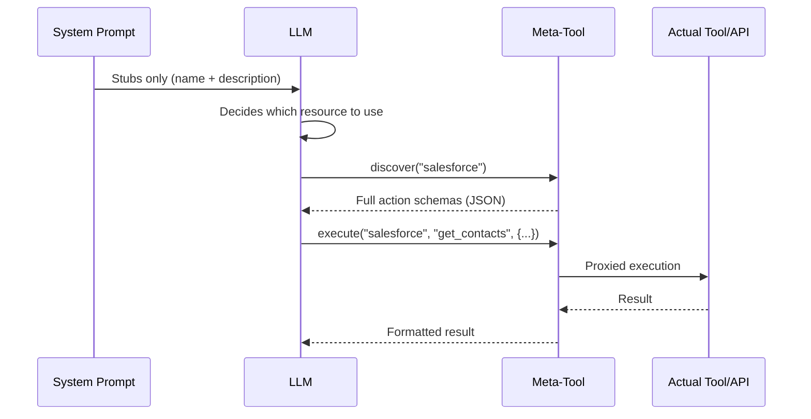
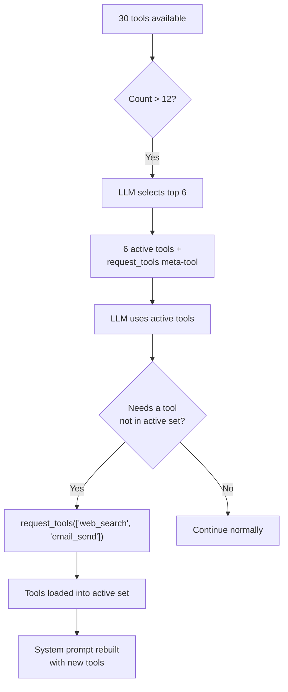

## Le problème

Les LLM paient le contexte avec deux devises : les tokens et l'attention. Chaque définition d'outil injectée dans l'invite système coûte les deux. Un seul serveur MCP peut exposer 90+ outils. Cinq connecteurs API avec 20 actions chacun produisent 100 définitions d'outils. Trois connecteurs de base de données avec 30 tables chacun génèrent 90 autres descriptions de schéma. Avant même que l'utilisateur ne tape un mot, l'invite système peut consommer 50--100 KB de contexte -- la moitié du budget d'un modèle 128K.

Le coût ne se limite pas aux tokens. La recherche et la pratique montrent régulièrement que **la précision des LLM se dégrade à mesure que le contexte non pertinent augmente.** Un agent avec 80 définitions d'outils dans son invite système fonctionne mesurément moins bien sur la sélection d'outils qu'un avec 6. Le modèle dépense de l'attention sur les schémas d'outils qu'il n'utilisera jamais, diluant sa concentration sur les outils et les instructions qui importent.

La solution naïve -- injecter tout, laisser le modèle trier -- ne s'adapte pas. FIM One adopte l'approche opposée : **montrer au LLM le minimum dont il a besoin pour prendre une décision, et lui permettre d'en demander plus quand il en a besoin.**

## Le modèle

La divulgation progressive suit une architecture à deux niveaux dans tous les types de ressources :

1. **Niveau 1 -- Stubs dans l'invite système.** Résumés légers : un nom, une brève description et suffisamment de métadonnées (nombre d'actions, nombre de tables, nombre d'outils) pour que le LLM décide s'il en a besoin de plus.

2. **Niveau 2 -- Détails complets à la demande.** Le LLM appelle un méta-outil pour récupérer les schémas complets, les paramètres et les capacités d'exécution. Le détail complet entre dans la conversation en tant que message de résultat d'outil -- limité à ce tour, n'occupant pas de manière permanente l'invite système.



L'idée clé : **les schémas d'outils complets sont limités à la conversation, non à l'invite.** Ils apparaissent en tant que messages de résultat d'outil que le système de gestion du contexte peut résumer ou tronquer dans les tours suivants. En contraste, le contenu de l'invite système persiste dans toute la conversation à sa taille complète.

## Cinq mécanismes de divulgation

FIM One applique une divulgation progressive uniformément sur cinq types de ressources. Chacun utilise le même modèle à deux niveaux mais avec un méta-outil adapté à sa sémantique.

| Ressource | Méta-Outil | Les stubs affichent | Retours à la demande | Variable de config | Par défaut |
|---|---|---|---|---|---|
| Compétences | `read_skill` | Nom + description (120 caractères) | Contenu SOP complet + script intégré | `SKILL_TOOL_MODE` | `progressive` |
| Connecteurs API | `connector` | Nom du connecteur + liste d'actions | Schémas d'action complets avec paramètres | `CONNECTOR_TOOL_MODE` | `progressive` |
| Connecteurs de base de données | `database` | Nom BD + noms de tables + comptages | Schémas de colonnes, exécution de requêtes SQL | `DATABASE_TOOL_MODE` | `progressive` |
| Serveurs MCP | `mcp` | Nom du serveur + liste d'outils | Schémas d'outils complets + invocation | `MCP_TOOL_MODE` | `progressive` |
| Outils intégrés | `request_tools` | Catalogue compact (nom + desc 80 caractères) | Schéma d'outil complet injecté dans la session | _(auto)_ | Auto quand >12 outils |

### Compétences -- `read_skill`

**Ce que le LLM voit initialement :**

```
## Available Skills
Call read_skill(name) to load full content before executing any of these:
- Customer Complaint SOP: Handle escalations per company policy...
- Refund Processing: Step-by-step refund workflow with approval gates...
```

Chaque stub fait environ 30 tokens -- un nom plus une description de 120 caractères tronquée du contenu complet de la Compétence.

**Ce qui se passe à la demande :** Le LLM appelle `read_skill("Customer Complaint SOP")` et reçoit le texte SOP complet -- potentiellement des milliers de tokens d'instructions étape par étape, d'arbres de décision et de scripts intégrés. Ce contenu entre comme résultat d'outil, pas comme texte d'invite système, il est donc soumis à la gestion normale du contexte (résumé, troncature) dans les tours suivants.

**Mode hérité :** `SKILL_TOOL_MODE=inline` intègre le contenu complet de la Compétence directement dans l'invite système. Approprié quand vous avez peu de Compétences petites -- mais s'adapte mal.

**Économies de contexte :** Un déploiement avec 10 Compétences d'une moyenne de 2 000 tokens chacune consomme ~300 tokens en mode progressif (stubs uniquement) vs. ~20 000 tokens en mode inline. C'est une réduction de 98 % du coût de contexte persistant.

### Connecteurs API -- `connector`

**Ce que l'IA voit initialement :**

```
Interact with external services. Available connectors:
  - salesforce: CRM system -- actions: get_contacts, create_lead, update_opportunity
  - jira: Project management -- actions: create_issue, get_issue, search_issues

Subcommands:
  discover <name> -- list actions with full parameter schemas
  execute <name> <action> {"param": "value"} -- run an action
```

Chaque stub de connecteur liste les noms d'actions mais pas les schémas de paramètres. L'IA sait *quelles* actions existent mais pas *comment* les appeler -- c'est exactement le bon niveau de détail pour décider d'utiliser un connecteur.

**Ce qui se passe à la demande :** `connector("discover", "salesforce")` retourne les schémas d'actions complets incluant les méthodes HTTP, les chemins URL, les schémas JSON des paramètres, et les modèles de corps de requête. `connector("execute", "salesforce", "get_contacts", {"limit": 10})` proxifie l'exécution via `ConnectorToolAdapter` avec injection d'authentification complète et journalisation d'audit.

**Mode hérité :** `CONNECTOR_TOOL_MODE=legacy` enregistre chaque action comme un outil séparé (`salesforce__get_contacts`, `salesforce__create_lead`, etc.). Un connecteur avec 20 actions devient 20 définitions d'outils dans l'invite système.

**Économies de contexte :** Un connecteur avec 15 actions génère ~50 jetons de stub vs. ~3 000 jetons de schémas complets. Cinq connecteurs : ~250 jetons progressifs vs. ~15 000 jetons hérités.

### Connecteurs de base de données -- `database`

**Ce que le LLM voit initialement :**

```
Query connected databases. Available databases:
  - hr_postgres: HR system (12 tables: employees, departments, salaries ...)
  - analytics_db: Analytics warehouse (45 tables: events, sessions, users ...)

Subcommands:
  list_tables <database> -- table names, descriptions, column counts
  discover <database> [table] -- full column schemas for one or all tables
  query <database> <sql> -- execute a SQL query
```

Les stubs de base de données incluent les noms de tables (jusqu'à 10) et les comptages, donnant au LLM suffisamment d'informations pour décider quelle base de données interroger sans charger les schémas de colonnes.

**Ce qui se passe à la demande :** Trois sous-commandes forment un flux de découverte naturel :

1. `database("list_tables", "hr_postgres")` -- retourne tous les noms de tables avec descriptions et comptages de colonnes.
2. `database("discover", "hr_postgres", table="employees")` -- retourne les schémas de colonnes complets (nom, type, nullable, clé primaire, descriptions).
3. `database("query", "hr_postgres", sql="SELECT ...")` -- exécute une requête SQL validée avec vérifications de sécurité et limites de lignes.

Le flux en trois étapes reflète la façon dont un développeur explore une nouvelle base de données : parcourir les tables, inspecter le schéma, puis interroger. Le LLM suit naturellement le même modèle.

**Mode hérité :** `DATABASE_TOOL_MODE=legacy` enregistre trois outils par base de données (`{db}__list_tables`, `{db}__describe_table`, `{db}__query`). Avec 5 connecteurs de base de données, cela représente 15 définitions d'outils au lieu de 1.

**Économies de contexte :** Une base de données avec 30 tables et 200 colonnes génère ~80 jetons de stub par rapport à ~5 000 jetons de schéma complet. Les économies s'accumulent avec plusieurs bases de données.

### Serveurs MCP -- `mcp`

**Ce que le LLM voit initialement :**

```
Interact with MCP servers. Available servers:
  - github: GitHub (35 tools: create_issue, list_repos, get_pull_request ...)
  - slack: Slack (12 tools: send_message, list_channels, upload_file ...)

Subcommands:
  discover <server> -- list tools with full parameter schemas
  call <server> <tool> {"param": "value"} -- invoke an MCP tool
```

Les serveurs MCP sont le cas le plus dramatique de divulgation progressive. Un serveur MCP GitHub expose 35+ outils. Un serveur de système de fichiers en expose 20+. Sans divulgation progressive, connecter 3 serveurs MCP pourrait injecter 70+ définitions d'outils dans l'invite système -- chacun avec des paramètres de schéma JSON complets.

**Ce qui se passe à la demande :** `mcp("discover", "github")` retourne le catalogue complet des outils avec les schémas de paramètres. `mcp("call", "github", "create_issue", {"title": "Bug report", "body": "..."})` délègue à l'`MCPToolAdapter` stocké, qui communique avec le processus du serveur MCP.

**Mode hérité :** `MCP_TOOL_MODE=legacy` enregistre chaque outil MCP en tant qu'outil séparé (`github__create_issue`, `github__list_repos`, etc.). Cela peut facilement dépasser le seuil de sélection d'outils et déclencher des phases de sélection inutiles.

**Économies de contexte :** Les économies ici sont extrêmes. Les 35 outils d'un serveur MCP GitHub pourraient consommer 10 000+ jetons de schéma. En mode progressif, le stub coûte ~100 jetons. Si l'utilisateur n'a jamais besoin de GitHub dans cette conversation, ces 10 000 jetons ne sont jamais dépensés.

### Outils intégrés -- `request_tools`

Le cinquième mécanisme est architecturalement différent des quatre autres. Il ne consolide pas un type de ressource derrière un méta-outil. Au lieu de cela, il aborde le **goulot d'étranglement de la sélection d'outils** -- ce qui se passe quand l'agent a plus de 12 outils disponibles.

**Fonctionnement :** Quand le nombre total d'outils dépasse `REACT_TOOL_SELECTION_THRESHOLD` (par défaut : 12), le moteur ReAct exécute un appel LLM léger pour sélectionner les 6 outils les plus pertinents pour la requête actuelle. Les outils restants sont stockés dans un registre complet. Un méta-outil `request_tools` est automatiquement enregistré, listant tous les outils non chargés sous forme de catalogue compact (nom + description de 80 caractères).



**Ce que le LLM voit initialement :**

```
Load additional tools into the current session.
Available tools not yet loaded:
- web_search: Search the web for current information and return relevant results...
- email_send: Send an email to one or more recipients with subject, body, and opt...
- python_exec: Execute Python code in a sandboxed environment and return the output...
```

**Ce qui se passe à la demande :** `request_tools(tool_names=["web_search", "email_send"])` copie ces outils du registre complet dans le registre actif. L'invite système est reconstruite à l'itération suivante pour que le LLM voie les schémas complets. C'est un effet secondaire -- l'outil mute l'ensemble d'outils actifs en cours de conversation.

**Pas de variable d'environnement :** Ce mécanisme s'active automatiquement quand la sélection d'outils filtre l'ensemble. Il n'y a pas de variable d'environnement `REQUEST_TOOLS_MODE`. Si vous voulez désactiver complètement la sélection d'outils, définissez `REACT_TOOL_SELECTION_THRESHOLD` sur un nombre très élevé.

**Économies de contexte :** Les économies dépendent du nombre d'outils disponibles et du nombre que la sélection choisit. Un agent avec 30 outils voyant seulement 6 schémas actifs + le catalogue `request_tools` économise environ 60--70% du contexte de schéma d'outils.

## Comment cela s'intègre dans le pipeline d'assemblage d'outils

La [Vue d'ensemble du système](/architecture/system-overview) décrit un pipeline d'assemblage d'outils en 8 étapes par requête. La divulgation progressive agit à plusieurs points :

| Étape du pipeline | Rôle de la divulgation progressive |
|---|---|
| **1. Découverte de base** | Aucun effet -- les outils intégrés sont chargés normalement |
| **2. Filtre de catégorie d'agent** | Aucun effet -- le filtrage par catégorie s'applique quel que soit le mode |
| **3. Injection KB** | Aucun effet -- les outils KB sont naturellement légers (1--2 outils) |
| **4. Chargement des connecteurs** | `ConnectorMetaTool` consolide tous les connecteurs API ; `DatabaseMetaTool` consolide tous les connecteurs DB |
| **5. Chargement MCP** | `MCPServerMetaTool` consolide tous les serveurs MCP en un seul outil |
| **6. Injection de compétences** | `ReadSkillTool` remplace le contenu complet par des stubs compacts dans l'invite système |
| **7. Enregistrement de CallAgent** | Aucun effet -- `call_agent` est déjà un seul outil avec un catalogue |
| **8. Sélection à l'exécution** | Meta-outil `request_tools` enregistré quand la sélection filtre l'ensemble |

L'effet net : les étapes 4--6 réduisent chacune leur nombre d'outils à 1 (ou une petite constante), et l'étape 8 ajoute un filet de sécurité pour charger dynamiquement tout ce que la phase de sélection aurait manqué. Un agent Hub qui aurait 50+ outils en mode hérité pourrait présenter 8--10 en mode progressif -- bien en dessous du seuil de sélection.

## Configuration

Quatre variables d'environnement contrôlent la divulgation progressive, une par type de ressource :

| Variable | Valeurs | Défaut | Effet |
|---|---|---|---|
| `SKILL_TOOL_MODE` | `progressive` / `inline` | `progressive` | Compétences : stubs + `read_skill` vs. contenu complet dans le prompt système |
| `CONNECTOR_TOOL_MODE` | `progressive` / `legacy` | `progressive` | Connecteurs API : méta-outil `connector` unique vs. outils d'action individuels |
| `DATABASE_TOOL_MODE` | `progressive` / `legacy` | `progressive` | Connecteurs BD : méta-outil `database` unique vs. 3 outils par base de données |
| `MCP_TOOL_MODE` | `progressive` / `legacy` | `progressive` | Serveurs MCP : méta-outil `mcp` unique vs. outils serveur individuels |

**Remplacement au niveau de l'agent.** Chaque variable d'environnement peut être remplacée par Agent via le champ `model_config_json` :

```json
{
  "model_config_json": {
    "skill_tool_mode": "inline",
    "connector_tool_mode": "legacy",
    "database_tool_mode": "progressive",
    "mcp_tool_mode": "progressive"
  }
}
```

**Ordre de priorité :** Config Agent > variable d'environnement > défaut.

Cela signifie que vous pouvez exécuter `progressive` globalement (par défaut) et remplacer sélectivement pour des Agents spécifiques. Un Agent avec une seule petite Compétence pourrait utiliser le mode `inline`. Un Agent qui a besoin que le LLM voie toutes les actions du connecteur à l'avance (par exemple, pour les modèles affinés qui n'appellent pas de manière fiable les méta-outils) pourrait utiliser le mode `legacy`.

**`request_tools` n'a pas de configuration.** Il s'active automatiquement quand la sélection d'outils produit un sous-ensemble filtré. Le seuil est contrôlé par `REACT_TOOL_SELECTION_THRESHOLD` (défaut : 12) et le nombre de sélection maximal par `REACT_TOOL_SELECTION_MAX` (défaut : 6).

## Décisions de conception

### Pourquoi explicite (piloté par LLM) plutôt qu'implicite (piloté par le framework) ?

Une conception alternative aurait permis au framework d'étendre automatiquement les schémas d'outils basés sur des heuristiques -- par exemple, en détectant quel connecteur la requête de l'utilisateur concerne et en injectant ses schémas avant que le LLM ne voie l'invite. FIM One a délibérément choisi l'approche pilotée par LLM pour trois raisons :

1. **Le LLM est meilleur à la détection d'intention que les heuristiques.** Une requête comme « vérifier si le client a un ticket ouvert et mettre à jour son profil » implique deux connecteurs. La correspondance heuristique sur les mots-clés est fragile ; le LLM identifie naturellement les deux.

2. **Transparence.** Quand le LLM appelle `connector("discover", "jira")`, l'action apparaît dans la trace d'outils. L'utilisateur (et le développeur qui débogue) peut voir exactement quels schémas ont été chargés et quand. L'expansion implicite est invisible.

3. **Efficacité contextuelle.** Le framework ne peut pas savoir quelles actions au sein d'un connecteur le LLM aura besoin. Étendre toutes les actions d'un connecteur gaspille des tokens sur des actions non pertinentes. Le LLM voit d'abord les noms d'actions (via le stub), puis demande uniquement le schéma de l'action spécifique -- divulgation à deux niveaux dans sa forme la plus pure.

### Pourquoi des méta-outils par ressource plutôt qu'un seul outil universel ?

Un seul outil `discover_resource(type, name)` serait plus simple à implémenter mais moins efficace pour le LLM. Les méta-outils par ressource offrent :

- **Paramètres typés.** `connector` a `subcommand`, `connector`, `action`, `parameters`. `database` a `subcommand`, `database`, `table`, `sql`. Les schémas de paramètres indiquent exactement au LLM ce qui est attendu.
- **Contraintes d'énumération.** Chaque méta-outil liste ses noms valides (noms de connecteur, noms de base de données, noms de serveur) comme valeurs d'énumération dans le schéma. Le LLM ne peut pas inventer un nom de connecteur.
- **Sémantique de catégorie.** L'outil `connector` a la catégorie `connector`, `database` a la catégorie `database`, `mcp` a la catégorie `mcp`. Cela s'intègre au filtrage de catégorie de l'agent -- un Agent configuré avec uniquement la catégorie `connector` ne verra pas les méta-outils `database` ou `mcp`.

### Pourquoi les deux modes progressif et hérité ?

Tous les LLMs ne gèrent pas les méta-outils de la même manière. Les modèles plus petits ou affinés peuvent avoir du mal avec le modèle en deux étapes découvrir-puis-exécuter. Le mode hérité fournit un repli direct où chaque action est un outil autonome avec son schéma complet visible -- aucune indirection de méta-outil requise.

La conception en mode dual soutient également la migration. Les déploiements existants peuvent basculer vers le mode progressif de manière progressive, en testant un type de ressource à la fois en changeant une seule variable d'environnement. Chaque variable d'environnement agit comme un drapeau de fonctionnalité -- le rayon d'impact est limité à un seul type de ressource, et la restauration est un changement de configuration d'une ligne.

Une troisième raison, plus pratique : **le débogage.** En mode hérité, chaque appel d'outil est explicite et autonome -- `salesforce__get_contacts(limit=10)` est immédiatement lisible dans les journaux et les traces. En mode progressif, le même appel est `connector("execute", "salesforce", "get_contacts", {"limit": 10})` -- une couche d'indirection supplémentaire qui nécessite d'analyser les arguments du méta-outil pour comprendre ce qui s'est réellement passé. Pendant le développement et le dépannage, basculer un seul type de ressource en mode hérité peut accélérer considérablement le diagnostic sans affecter les autres types de ressources.
