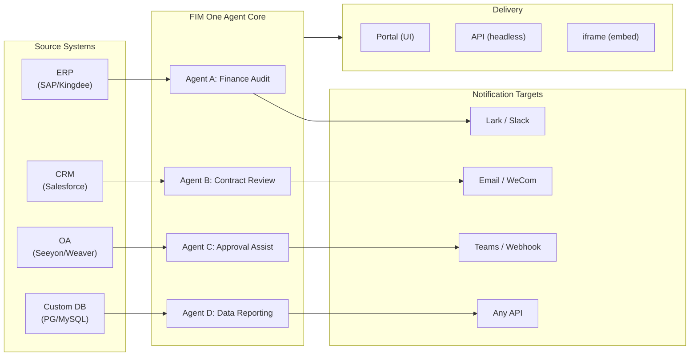

> Objectif : Construire une **plateforme d'agents tout-en-un pour les entreprises mondiales × chinoises** — livrée via trois modes progressifs : Standalone (assistant portail), Copilot (intégré au système hôte), Hub (orchestration centrale inter-systèmes).
>
> Principes : **Agnostique vis-à-vis des fournisseurs** (pas de verrouillage propriétaire), **abstraction minimale**, **protocole-first**, **connecteur-first** (l'intégration est la valeur fondamentale).

## Vision produit

FIM One est une **plateforme d'agent tout-en-un** qui propose trois modes de livraison progressifs :

```
Standalone   → Your own AI assistant (Portal)
Copilot      → AI embedded in a host system (iframe / widget / embed)
Hub          → Central cross-system orchestration (Portal / API)
```

**L'orchestration inter-systèmes est le différenciateur clé.** Les clients d'entreprise disposent de systèmes hérités — ERP, CRM, OA, finance, HR — qui doivent communiquer entre eux via l'IA :



**Stratégie GTM : Land and Expand**

| Étape | Mode | Ce qui se passe |
|------|------|-------------|
| Land | Copilot | Intégrer dans un système, prouver la valeur dans leur interface utilisateur |
| Expand | Copilot → Hub | Déployer sur plusieurs systèmes ; le mode Hub les agrège |

## Problèmes connus

Bugs tracés qui sont reproductibles en production mais pas encore corrigés. Chaque entrée nomme le symptôme, la zone de surface suspecte et la solution de contournement (le cas échéant). Les éléments passent à une section de version une fois qu'un correctif est défini et planifié.

- **L'éditeur d'agent affiche un avertissement de modifications non enregistrées sans aucune modification.** L'ouverture d'un agent existant via `/agents/[id]` et le clic immédiat sur le bouton retour déclenchent la boîte de dialogue « Modifications non enregistrées » même si aucun champ n'a été touché. La vérification de modification compare 20+ champs par rapport à la charge utile de l'agent chargée, donc une asymétrie de défaut entre l'initialisation d'état et la comparaison de modification suffit à causer une discordance fantôme — la suspicion actuelle porte sur l'un des champs imbriqués `model_config_json` / notification / approbation-routage, possiblement à partir de la normalisation `undefined` vs `null` vs `""`. Se reproduit particulièrement sur les agents à portée organisationnelle. Solution de contournement : ignorer la boîte de dialogue (`Discard and leave`) — aucune perte de données puisque rien n'a réellement changé. Une tentative de correction (`cb40c86a`) a supprimé un scintillement de badge orphelin connexe sur les sélecteurs de ressources mais n'a pas résolu ce problème.

- **L'enregistrement d'une modification d'agent peut échouer avec `Input should be 'initiator', 'agent_owner' or 'org_members'`.** Pydantic rejette le champ `confirmation_approver_scope` à la limite PUT `/api/agents/{id}` même si chaque valeur stockée dans la base de données est l'un des trois littéraux valides. Suspicion : le cast frontend `as "initiator" | "agent_owner" | "org_members"` est une promesse au moment de la compilation uniquement, donc une chaîne héritée ou inattendue au moment de l'exécution (possiblement à partir d'un modèle, d'une importation ou d'une migration plus ancienne) peut passer par `setConfirmationApproverScope` et être renvoyée textuellement. Solution de contournement : resélectionner explicitement une valeur dans la liste déroulante Approbation → Portée de l'approbateur avant d'enregistrer.

- **L'arrêt et la nouvelle tentative du terrain de jeu affichent des artefacts visuels transitoires qu'une actualisation de page efface toujours.** Trois sources de rendu concurrentes — `activeConversation.messages` (snapshot DB), le flux SSE `messages` et l'espace réservé optimiste `pendingQuery` — ne sont pas réduites à un seul état dérivé, donc entre le clic sur « Retry » et l'arrivée de la réponse de l'assistant appairée, l'interface utilisateur peut (a) brièvement afficher la même requête deux fois dans la fenêtre pré-flux, (b) supprimer les bulles utilisateur orphelines antérieures de l'historique de nouvelle tentative tandis que `hasLiveMessages` est vrai et avant le rechargement de l'instantané, et (c) scintiller dans la fenêtre étroite entre l'événement SSE « done » et l'actualisation `selectConversation` suivante. **Les données ne sont jamais perdues** — chaque message utilisateur (y compris les tentatives abandonnées) est conservé dans `conversation.messages`, porté dans l'appel LLM suivant via `normalize_alternating_messages` et rendu correctement après actualisation via `HistoryTurn.orphanUserContents` introduit dans le correctif de rendu `48ba08c6`. Pour le contexte, l'interface Web propre de Claude présente une classe analogue de bug — l'arrêt au milieu d'une réponse et l'envoi immédiat d'une requête de suivi crée parfois la requête de suivi comme une branche d'édition sœur de la première requête plutôt que de l'ajouter comme un nouveau tour — c'est donc un problème connu difficile dans les conceptions optimiste-UI + SSE + historique-persisté, pas un défaut spécifique à FIM One. Un correctif approprié nécessite de réduire les trois sources de rendu à un seul état dérivé ; reporté jusqu'à une refonte plus large de la machine d'état du terrain de jeu.

## Versions Livrées

### v0.1 (2026-02-22) — MVP: ReAct + DAG Planner
- ReActAgent avec outils (calculatrice, python_exec, web_search)
- DAG Planner (LLM génère des graphes de dépendances)
- Portal UI avec streaming + KaTeX

### v0.2 (2026-02-24) — Multi-Model + Memory
- Retry / rate limiting / usage tracking
- Native function calling (no JSON-only parsing)
- Multi-model support (fast + main LLM)
- Memory: WindowMemory, SummaryMemory
- FastAPI backend with SSE streaming

### v0.3 (2026-02-25) — Web Tools + MCP
- Web tools (web_search, web_fetch) via Jina/Tavily/Brave
- File operations tool
- MCP client (standard tool integration)
- Tool auto-discovery + categories
- DAG visualization with click-to-scroll
- Code exec in Docker (`--network=none`)

### v0.4 (2026-02-25) — Conversations multi-tours + Agents
- Conversations multi-tours (DbMemory)
- Interface de repliement des étapes d'outils
- Outils de requête HTTP + exécution shell
- Gestion des agents (créer, configurer, publier)
- Authentification JWT
- Mode d'exécution par agent + contrôle de température

### v0.5 (2026-02-28) — Full RAG + Grounded Gen
- Pipeline RAG complet (embedding + vector store + FTS + RRF + reranker)
- Génération ancrée (citations, scores de confiance)
- Gestion des documents de la base de connaissances (CRUD, recherche, retry, migration de schéma)
- ContextGuard + messages épinglés (gestionnaire de budget de tokens)
- Persistance DbMemory + LLM Compact
- DAG Re-Planning (jusqu'à 3 rounds)

### v0.6 (2026-03-01) — Plateforme de connecteurs
- **CRUD de connecteur**: créer, lire, mettre à jour, supprimer
- **ConnectorToolAdapter**: convertit Connecteur → BaseTool
- **Identifiants par utilisateur**: chiffrement AES-GCM
- **Portail de confirmation**: approbation des opérations d'écriture
- **Journalisation d'audit**: tous les appels d'outils enregistrés
- **Disjoncteur**: dégradation progressive en cas de défaillance
- **Outils utilitaires**: email_send, json_transform, template_render, text_utils
- **Options d'intégration**: Jina, OpenAI, fournisseurs personnalisés

### v0.7 (2026-03-06) — Plateforme d'administration + Multi-locataire
- **Plateforme d'administration** : gestion des utilisateurs, basculement des rôles, réinitialisation de mot de passe, activation/désactivation de compte
- **Inscription sur invitation uniquement** : trois modes (ouvert/invitation/désactivé) + CRUD de code d'invitation
- **Gestion du stockage** : utilisation disque par utilisateur, effacement, nettoyage des orphelins
- **Modération des conversations** : liste d'administration/suppression de tous
- **Déconnexion forcée par utilisateur** : révocation de tous les jetons
- **Tableau de bord de santé API** : statistiques système, métriques des connecteurs
- **Assistant de configuration initiale** : création guidée du compte administrateur
- **Centre personnel** : instructions globales par utilisateur, préférence de langue
- **Authentification JWT** : authentification SSE basée sur jetons, propriété de conversation
- **Serveurs MCP globaux** : provisionnés par l'administrateur, chargés dans toutes les sessions
- **Compatibilité rétroactive** : migration automatique registration_enabled → registration_mode

### v0.7.x (2026-03-07 to 2026-03-12) — Stabilité + Polissage
- Gestion des codes d'invitation
- Quotas par utilisateur (application 429)
- Journalisation d'audit structurée
- Filtrage des mots sensibles
- Historique de connexion administrateur
- Navigateur de fichiers administrateur
- Vues administrateur améliorées (champs model_name, tools, kb_ids)
- Déploiement Docker Compose (image unique, volumes nommés)
- Détection automatique OAuth depuis window.location
- Support de la réflexion étendue / raisonnement (`LLM_REASONING_EFFORT`, `LLM_REASONING_BUDGET_TOKENS`) pour OpenAI série o, Gemini 2.5+, Claude
- Activation/désactivation par outil administrateur (outils désactivés exclus du chat à l'exécution)
- Gestion des serveurs MCP déplacée vers la page Connecteurs
- Support de base de données double : SQLite (par défaut sans configuration) + PostgreSQL (production) ; Docker Compose provisionne automatiquement PostgreSQL
- Page de documentation de configuration des modèles avec configuration de la réflexion étendue par fournisseur
- Protocole SSE v2 : diffusion de réponses en temps réel avec champs `delta_reasoning`, `usage`, et événements `done`/`suggestions`/`title`/`end` séparés ; taille du pool SQLite 5 -> 20
- Expansion AI Builder : 7 nouveaux outils de construction (GetSettings, TestConnection, ImportOpenAPI pour connecteurs ; ListConnectors, AddConnector, RemoveConnector, SetModel pour agents), drapeau `is_builder` sur les agents, actualisation automatique du prompt du constructeur, protection SSRF
- Frontend SSE v2 : curseur à point pulsant en continu, snapshots de re-plan DAG sous forme de cartes réductibles, mise en page DAG découplée des états d'étape
- Page de documentation du concept AI Builder avec guides de construction de connecteurs et d'agents
- Système d'organisation : CRUD complet avec adhésion basée sur les rôles (propriétaire/administrateur/membre), interface de gestion administrateur
- Visibilité des ressources à trois niveaux (personnel/org/global) pour les agents, connecteurs, bases de connaissances, serveurs MCP
- API Publier/Dépublier pour tous les types de ressources ; délégation de propriétaire pour les agents publiés
- Point de terminaison administrateur set-visibility (remplace clone-to-global) ; assistant de requête `build_visibility_filter()` unifié
- Connecteurs de base de données (Phase 1-3) : accès SQL direct à PG/MySQL/Oracle/SQL Server + BD héritées chinoises ; introspection de schéma, annotation IA, exécution de requête en lecture seule, identifiants chiffrés, 3 outils par connecteur (`list_tables`, `describe_table`, `query`)
- **Centre d'évaluation** : évaluation quantitative de la qualité des agents — CRUD d'ensemble de test (prompt + comportement attendu + assertions), exécutions d'éval (exécution parallèle + évaluateur LLM + résultats par cas réussi/échoué/latence/jeton), visionneuse de résultats avec interrogation automatique ; migration `r8t0v2x4z567`
- Trois rôles de modèle (Général/Rapide/Raisonnement) avec isolation de configuration env par niveau ; le modèle rapide n'hérite plus des paramètres du modèle principal
- Classe de données `StepOutput` remplaçant les résultats d'étape en chaîne simple pour les données structurées et la transmission d'artefacts
- Cache d'outil pour l'exécution DAG — appels d'outil identiques mis en cache par exécution avec prévention du verrouillage asynchrone stampede (`DAG_TOOL_CACHE`)
- Vérification LLM par étape avec 1 nouvelle tentative en cas d'échec (`DAG_STEP_VERIFICATION`)
- Routage automatique : LLM rapide classe les requêtes comme ReAct ou DAG ; point de terminaison `/api/auto` ; basculement de mode 3 voies frontend (`AUTO_ROUTING`)
- [x] ~~**Organisation du marché fantôme + Abonnements aux ressources**~~ : Organisation du marché intégré (fantôme, pas d'adhésion automatique) remplace l'organisation de plateforme ; ressources découvertes via navigation sur le marché et explicitement souscrites (modèle pull) ; API de marché pour s'abonner aux ressources partagées ; la publication sur le marché nécessite toujours un examen ; tableau des abonnements aux ressources ; partage de ressources basé sur l'organisation remplaçant la visibilité globale
- [x] ~~**Découverte automatique d'agent et liaison de sous-agent**~~ : drapeau `discoverable` sur les agents ; liste blanche `sub_agent_ids` ; CallAgentTool pour déléguer des tâches à des agents spécialisés
- [x] ~~**Identifiants du serveur MCP + Remplacement par utilisateur**~~ : tableau `mcp_server_credentials` ; point de terminaison `PUT /api/mcp-servers/{id}/my-credentials` ; drapeau `allow_fallback` pour le comportement de secours des identifiants
- [x] ~~**Basculement connecteur/KB**~~ : `POST /api/connectors/{id}/toggle` et `POST /api/knowledge-bases/{id}/toggle` pour suspendre/reprendre les ressources
- [x] ~~**Conversations KB autonomes**~~ : champ `kb_ids` sur les conversations pour le chat KB direct sans liaison d'agent

### v0.8 (2026-03-20) — Configuration déclarative des connecteurs + Divulgation progressive
- [x] **Connecteurs de base de données**: accès SQL direct (PostgreSQL, MySQL, Oracle) *(livré en v0.7.x — Phase 1-3)*
- [x] **RBAC**: contrôle d'accès aux connecteurs par utilisateur/rôle *(livré en v0.7.x — système org + visibilité à trois niveaux)*
- [x] **Chiffrement des identifiants de connecteur + remplacement par utilisateur**: table `connector_credentials`, chiffrement Fernet via `CREDENTIAL_ENCRYPTION_KEY`, drapeau `allow_fallback`, points de terminaison `GET/PUT/DELETE /my-credentials`, résolution des identifiants par utilisateur dans le chargement des outils de chat
- [x] **Interface d'examen de publication**: système d'examen de publication au niveau de l'organisation — basculement d'examen par organisation, ReviewsSheet avec flux d'approbation/rejet, badges de statut sur les cartes de ressources, avis d'examen dans la boîte de dialogue de publication, renvoi pour les ressources rejetées
- [x] **Divulgation progressive des connecteurs (Phase 1-2)**: un seul `ConnectorMetaTool` remplace les outils par action; le message système reçoit uniquement des **stubs** légers (nom + description d'une ligne, ~30 tokens/connecteur vs ~250 tokens/action); l'agent appelle `discover(connector)` pour charger le schéma d'action complet à la demande — le schéma ne se charge que lorsque le modèle sélectionne un connecteur, maintenant le préfixe du message stable pour la mise en cache. Suit le modèle de chargement d'outils différé courant dans les frameworks d'agents modernes. Sous-commande `execute`; drapeau de fonctionnalité pour la compatibilité rétroactive.
- [x] **Système de compétences d'agent + Instructions compactes**: Chargement à la demande des instructions de compétences pour les agents — modèle `Skill` (nom, contenu/SOP, scripts optionnels) attaché aux agents; référencé dans le message système par nom uniquement (~10 tokens/compétence); l'agent appelle `read_skill(name)` pour charger le contenu complet à la demande. Réduit le coût des tokens d'instruction par conversation d'environ 80% tout en permettant des bibliothèques SOP plus riches. Homologue de la divulgation progressive de ConnectorMetaTool appliquée au niveau des instructions. Active la différenciation de l'histoire "指令 + 工具 + 技能". Ajoute également le champ `compact_instructions` au modèle Agent — liste de priorités de compression par agent injectée dans `ContextGuard` lors de la compression (par exemple, "préserver les ID de commande et les montants, supprimer les réponses API brutes"), remplaçant l'invite générique statique actuelle. Suit la convention des instructions compactes largement adoptée dans les frameworks d'agents modernes.
- [x] **Import/export de connecteurs**: partage de modèles de connecteurs
- [x] **Fork de connecteur**: cloner et personnaliser les connecteurs existants
- [x] **Nœuds de phase 2 du flux de travail**: Iterator, Loop, VariableAggregator, ParameterExtractor, ListOperation, Transform, DocumentExtractor, QuestionUnderstanding, HumanIntervention — 9 types de nœuds avancés avec frontend + backend complets + 150 nouveaux tests (275 au total). Nouvelle tentative de nœud avec backoff exponentiel, évaluation d'expression sécurisée. Panneau de statistiques avec barre de taux de réussite. 12 modèles intégrés. Menu contextuel du volet (Coller, Sélectionner tout, Ajuster la vue, Disposition automatique).
- [x] **Nœuds de phase 3 du flux de travail: SubWorkflow + ENV** — 2 nouveaux types de nœuds (25 nœuds au total), 14 nouveaux tests (306 au total), 14 modèles intégrés. SubWorkflow: exécuteur de flux de travail imbriqué complet avec support de base de données, sélection de flux de travail cible, mappage de variables et limite de profondeur configurable pour éviter la récursion infinie. ENV: lit les variables d'environnement chiffrées avec sélecteur de clé et valeurs par défaut de secours. Frontend complet (composants de nœud, panneaux de configuration, entrées de palette, couleurs de minimap). Panneau de statistiques d'exécution par nœud (taux de réussite, durées, comptages d'échecs triés du pire au premier). Client API `getNodeStats` + type `NodeStatEntry`. Boîte de dialogue des raccourcis clavier (touche `?`).
- [x] **Déclencheurs planifiés du flux de travail**: Configuration cron par flux de travail avec fuseau horaire, entrées par défaut et calcul de la prochaine exécution. Boutons cron prédéfinis, 30 tests de déclenchement.
- [x] **Déclencheurs API du flux de travail**: Clés API publiques par flux de travail (préfixe `wf_`) pour l'exécution externe sans authentification utilisateur, avec limitation de débit. Boîte de dialogue de gestion des clés API avec génération/régénération/révocation, URL de déclenchement et exemples cURL/JS.
- [x] **Exécution par lot du flux de travail**: `POST /batch-run` avec jusqu'à 100 ensembles d'entrée, parallélisme configurable (1-10), résultats par élément réductibles, export JSON. 14 tests d'exécution par lot.
- [x] **Visionneuse du journal d'exécution du flux de travail**: Flux d'événements SSE chronologique en temps réel dans le panneau d'exécution avec horodatages, badges codés par couleur et bascules de filtre par type d'événement.
- [x] **Statistiques d'exécution du flux de travail**: Le backend récupère par lot les comptages d'exécution et les taux de réussite via la sous-requête GROUP BY; le frontend affiche les statistiques sur les cartes de flux de travail avec des indicateurs de taux de réussite codés par couleur.
- [x] **Démon du planificateur de flux de travail**: Service asynchrone en arrière-plan interrogeant tous les 60 secondes les flux de travail basés sur cron dus. Support du fuseau horaire Croniter, concurrence par sémaphore, suivi de `last_scheduled_at`, livraison de webhook. 14 tests.
- [x] **Résolveur de conflits d'import de flux de travail**: Détecte les références d'agent/connecteur/KB/MCP non résolues lors de l'import. Requêtes DB par lot avec filtrage de visibilité, avertissements toast frontend. 17 tests.
- [x] **Exécution de nœud de test du flux de travail**: Test isolé de nœud unique avec variables fictives, intégré dans l'éditeur (bouton Test du panneau de configuration + menu contextuel). 23 tests.
- [x] **Diff de version du flux de travail**: Comparaison de blueprint côte à côte avec détection de changement de nœud/arête, indicateurs codés par couleur (ajouté/supprimé/modifié).
- [x] **Gestion des exécutions du flux de travail**: Supprimer les exécutions individuelles (`DELETE /runs/{run_id}`) et effacer toutes les exécutions terminées (`DELETE /runs`), avec boîtes de dialogue de confirmation frontend.
- [x] **Superposition de relecture d'exécution du flux de travail**: Bouton "Afficher sur le canevas" dans l'historique d'exécution pour superposer les résultats d'exécution passés sur le canevas, affichant le statut et la sortie par nœud sans réexécution.
- [x] **Favoris/épinglage du flux de travail**: Étoile/épingle des flux de travail en haut de la liste avec persistance localStorage.
- [x] **Export de l'historique d'exécution du flux de travail**: Exporter l'historique d'exécution en tant que téléchargement de fichier JSON avec métadonnées d'exécution complètes et résultats par nœud.
- [x] **Gestion des flux de travail administrateur**: Onglet du panneau administrateur pour gérer tous les flux de travail entre les utilisateurs — lister, basculer actif/inactif, supprimer avec confirmation. Points de terminaison par lot pour supprimer, basculer et publier avec journalisation d'audit.
- [x] **Système de modèles de flux de travail**: Modèle ORM `WorkflowTemplate` avec CRUD administrateur, API de listing/clone public et 5 modèles de semences insérés automatiquement au premier démarrage.
- [x] **Badges de validation en ligne du flux de travail**: `ValidationBadge` en temps réel par nœud sur le canevas avec info-bulles d'erreur/avertissement pour un retour visuel immédiat lors de l'édition.
- [x] **Visionneuse de trace d'exécution du flux de travail**: Visionneuse de trace basée sur la chronologie avec paramètre `trace_level` du moteur et snapshots de variables par nœud pour le débogage pas à pas.
- [x] **Limitation de débit et délai d'expiration du flux de travail**: `WorkflowRateLimiter` par utilisateur (fenêtre glissante 10 exécutions/min, 3 concurrentes) et délai d'expiration global par défaut de 10 minutes.
- [x] **Système de blueprint de flux de travail**: Éditeur de flux de travail visuel pour concevoir et exécuter des blueprints d'automatisation multi-étapes — modèles ORM `Workflow` / `WorkflowRun`, CRUD complet + API d'exécution SSE, import/export, duplication, point de terminaison de validation de blueprint, `WorkflowEngine` avec tri topologique + concurrence basée sur sémaphore + branchement conditionnel et 12 types de nœuds (Start, End, LLM, ConditionBranch, QuestionClassifier, Agent, KnowledgeRetrieval, Connector, HTTPRequest, VariableAssign, TemplateTransform, CodeExecution), `VariableStore` avec interpolation `{{node_id.output}}` et espace de noms `env.*`, stratégies d'erreur par nœud (STOP_WORKFLOW / CONTINUE / FAIL_BRANCH) avec délai d'expiration par nœud et interface de configuration avancée, éditeur visuel React Flow v12 avec palette glisser-déposer + panneau de configuration de nœud + combobox de sélecteur de variable + ajouter-nœud-sur-arête + disposition automatique (ELK.js) + feuille d'historique d'exécution, conception de nœud compact de style Dify avec statut d'exécution basé sur anneau et transitions d'arête animées, 4 modèles de démarrage intégrés (Chaîne LLM simple, Routeur conditionnel, QA augmenté par connaissance, Pipeline API HTTP) avec boîte de dialogue de sélecteur de modèle et API `GET /templates` + `POST /from-template`, point de terminaison de statistiques, paramètre URL `?run=true` ouverture automatique, exécution de code basée sur subprocess pour la sécurité, suite de tests 105 (modèles, aplatissement d'espace de noms eval, avertissements de validation de blueprint, suppression de nœud/arête, import/export/duplication, détection d'impasse, branchement multi-condition)
- [x] **Audit opérationnel**: journalisation détaillée de qui a fait quoi — onglet d'examen du journal d'audit administrateur ajouté (piste d'examen de publication par organisation/ressource)
- [x] **Annotations de schéma sémantique**: étendre les champs de schéma de connecteur avec `semantic_tag`, `description` et drapeaux `pii`; annotations affichées dans les descriptions d'outils LLM afin que l'agent comprenne l'intention du champ sans deviner à partir des noms de colonnes

### v0.8.1 (2026-03-29) — Divulgation Progressive de la Maturité + Durcissement ReAct
- Divulgation progressive pour les connecteurs de base de données (`DatabaseMetaTool`), les serveurs MCP (`MCPServerMetaTool`), et le chargement d'outils à la demande (`request_tools` meta-tool)
- Révision de la qualité du DAG (5 améliorations : mise à niveau du modèle, découverte automatique des compétences, vérificateur de citations, préservation du contenu structuré, routage conscient du domaine)
- Escalade du modèle de domaine dans ReAct (les domaines spécialisés s'escaladent automatiquement vers le modèle de raisonnement)
- Basculement d'appel de fonction native par modèle (`tool_choice_enabled`)
- Détection de cycle ReAct (prévention déterministe des appels d'outils en double)
- Liste de contrôle d'achèvement ReAct (vérification pré-réponse lorsque des outils ont été utilisés)
- Phase 1 de la fourche de ressources (points de terminaison de fourche du serveur MCP + compétence avec suivi de la lignée)
- Abonnement automatique des dépendances de connexion de flux de travail (résolution récursive des dépendances de sous-flux de travail)
- Modèles de solutions préconstruites (8 solutions verticales ensemencées au Marché lors de la première inscription)
- Améliorations des notifications d'administration (conscientes du fuseau horaire, commutateur maître, Réponse SMTP)
- Disjoncteur de budget de jetons par tour (`REACT_MAX_TURN_TOKENS`)
- Troncature d'outils centralisée, budgétisation dynamique des invites système
- Téléchargement de pièces jointes, correction de la soumission de messages en double

### v0.8.2 (2026-04-10) — Durcissement du noyau d'agent + Documents avec vision
- **Phase 0 du noyau d'agent** — Prompt compact amélioré au format structuré en 9 sections ; protection des résultats d'outils vides (message descriptif au lieu de `(no output)`) ; prompt anti-boucle + seuil de détection de cycle abaissé à 2 ; classificateur de domaine + résolution de configuration DB en vol parallélisée (400–1100 ms économisés par requête) ; événement SSE `end` envoyé immédiatement après la réponse, avec titre/suggestions déplacés aux tâches en arrière-plan
- **Phase 1 du noyau d'agent (Anti-encombrement du contexte)** — Nettoyage basé sur règles `MicroCompact` des anciens résultats d'outils (conservation des 6 derniers) ; plafond agrégé `REACT_TOOL_RESULT_BUDGET=40000` ; compactage réactif au débordement de contexte (auto-compactage à 50% du budget et nouvelle tentative au lieu de crash)
- **Phase 2 du noyau d'agent (Vitesse)** — Présélection d'outils basée sur mots-clés (ignore l'appel LLM sur les correspondances évidentes, 200–500 ms économisés) ; mise en pool de connexions LLM `SharedHttpClient` ; vérification d'achèvement ignorée pour les réponses >200 tokens ; `FallbackLLM` enveloppe le primaire+rapide avec basculement automatique sur erreurs 429/503/529/connexion
- **Traitement intelligent des documents (Vision-Aware)** — Gestion adaptative des documents : pages PDF rendues en images via PyMuPDF pour les modèles compatibles vision (GPT-4o, Claude 3/4, Gemini), secours texte uniquement via pdfplumber. Drapeau `supports_vision` par modèle. Modes via `DOCUMENT_PROCESSING_MODE`, `DOCUMENT_VISION_DPI`, `DOCUMENT_VISION_MAX_PAGES`. Extraction d'images intégrées DOCX/PPTX. Persistance vision multi-tours entre les tours de conversation. Traitement PDF intelligent (pages riches en texte extraient texte + images ; pages numérisées rendues en PNG pleine page). Image sandbox pré-construite (`Dockerfile.sandbox`) avec packages data-science courants pour exécution de code `--network=none`
- **Achèvement de la fourche de ressources** — Points de terminaison de fourche Agent / Connecteur / Workflow ajoutés, complétant le suivi de lignée de cinq types (fourche KB supprimée — intrinsèquement locale à l'utilisateur)
- **Garde-fou d'intégrité de fichier** — Règle du prompt système empêche l'agent de substituer des contenus de fichiers non liés lorsqu'un fichier cible est illisible ; les fichiers téléchargés incluent désormais `file_id` dans le contexte du message pour accès direct `read_uploaded_file`

### v0.8.3 (2026-04-16) — Conversion universelle de documents + Phase 3 du cœur de l'agent
- **Conversion universelle de documents (`convert_to_markdown` + OCR)** — Outil d'agent intégré enveloppant Microsoft MarkItDown ; convertit PDF, Word, Excel, PowerPoint, HTML, JSON, CSV, XML, ZIP, EPUB, Outlook .msg, images, audio, URLs YouTube en Markdown. `LiteLLMOpenAIShim` active l'OCR via n'importe quel LLM capable de vision (Claude, Gemini, Bedrock, Azure). Ingestion RAG sensible à la vision avec repli sans régression pour texte uniquement. Variable d'environnement `LLM_SUPPORTS_VISION` pour refuser
- **Phase 3 du cœur de l'agent (Durcissement des invariants d'exécution)** — Récupération de conversation (réparation automatique de `tool_use` en suspens) ; carte de travail compacte structurée (`WorkCard` fusion typée sur les tours de compaction) ; profileur au niveau des tours (`REACT_TURN_PROFILE_ENABLED`) ; limitation de débit par utilisateur (`LLM_RATE_LIMIT_PER_USER`) ; message d'assistant avec contenu vide et `tool_calls` ne sont plus supprimés

### v0.8.4 (2026-04-17) — Cache de prompts + Correction du raisonnement
- **Registre de section de prompts système avec points d'arrêt de cache** — `PromptRegistry` mémoïsée divise les prompts système en préfixe stable + suffixe dynamique ; les fournisseurs compatibles avec le cache (Claude, Bedrock Anthropic, Vertex Claude) reçoivent `cache_control: {"type": "ephemeral"}` sur le préfixe pour ~60-80% d'économies de tokens d'entrée par tour. Les fournisseurs sans cache reçoivent un seul message concaténé (zéro changement de comportement)
- **Observabilité du cache de prompts** — `cache_read_input_tokens` et `cache_creation_input_tokens` suivis via `UsageSummary` → `TurnProfiler` → champ `done_payload.cache`. Ligne de journal `turn_cache` structurée par tour. Sert également de sonde de vérification d'honnêteté du cache relais
- **MVP de récupération de conversation** — Les lignes `tool_result` synthétiques persistent après les tours interrompus ; `POST /chat/resume` rejoue les événements SSE en cache à partir d'un curseur monotone ; hook frontend `useSseResume` se reconnecte automatiquement avec backoff exponentiel (300ms → 1s → 3s, max 3 tentatives) et indicateur « Reconnexion en cours… »
- **Persistance des blocs de raisonnement avec signature** — `reasoning_content` + `signature` Anthropic persistés dans `metadata_["thinking"]` et rejoués aux tours suivants ; corrige l'erreur HTTP 400 de non-concordance de signature sur les conversations multi-tours Claude 4
- **Politique de relecture du raisonnement consciente du fournisseur** — `reasoning_replay_policy()` centralisée dans `core/prompt/reasoning.py` contrôle la sérialisation par famille de fournisseur : Claude rejoue les blocs de raisonnement avec signature ; DeepSeek-R1/Qwen-QwQ/Gemini-thinking/o-series suppriment `reasoning_content` en sortie (précédemment fui, cassant les caches KV des fournisseurs et violant la documentation API)

### v0.8.5 (2026-04-23) — Intégration de canal + Système de hooks + i18n pour contributeurs
- **Canal Feishu (sous-ensemble Phase 1)** — Ressource `Channel` à portée organisationnelle avec identifiants chiffrés par Fernet ; `FeishuChannel` supporte l'envoi de cartes interactives + callback (vérification de signature + défi URL) ; UI de gestion Paramètres → Canaux (liste, créer/modifier avec protection d'état modifié, détails avec URL de callback copiable, envoi de test) ; API CRUD (`/api/channels`) et endpoint de callback d'événement (`/api/channels/{id}/callback`). Livré en avant-première pour la roadshow du 2026-04-24
- **Système de hooks d'agent (actif dans les runtimes ReAct + DAG)** — Abstraction `PreToolUseHook` / `PostToolUseHook` dans `src/fim_one/core/hooks/` ; les agents déclarant `hooks.class_hooks` dans `model_config_json` ont des hooks instanciés et enregistrés par session de chat. Premier consommateur `FeishuGateHook` publie une carte Approuver/Rejeter au groupe Feishu lié quand un agent appelle un outil avec `requires_confirmation=True`, bloque l'exécution, et reprend ou abandonne selon le verdict
- **Portail de confirmation configurable (en ligne OU canal)** — Chaque agent obtient une section Approbation avec trois modes de routage (Auto / En ligne uniquement / Canal uniquement), sélecteur de portée approbateur (initiateur / propriétaire / n'importe qui dans l'org), override par outil, et sélecteur de canal d'approbation explicite. Le mode Auto bascule gracieusement vers une carte d'approbation en ligne quand aucun canal n'est lié. `POST /api/confirmations/{id}/respond` partage un chemin unique d'enregistrement de décision avec le webhook Feishu
- **Notifications de fin de tâche par agent** — Les agents ReAct ou DAG longue durée peuvent envoyer une carte de synthèse au canal de l'org quand une tâche se termine. Premier consommateur du modèle de notification sortante générique
- **Playground d'approbation par hook** — La feuille de détails des canaux a une action « Tester le flux d'approbation » qui exerce le chemin de production complet (ligne `ConfirmationRequest` authentique, vrai callback Feishu, transitions d'état) — le même chemin de code qu'un hook de production utilise
- **Fallback CI i18n convivial pour contributeurs** — `.github/workflows/i18n-sync.yml` traduit EN → ZH/JA/KO/DE/FR sur master après fusion de PR et auto-commit avec `[skip ci]` ; les contributeurs n'ont plus besoin de `LLM_API_KEY` localement. Garde de pré-commit refusant les modifications manuelles aux fichiers de locale générés (`ALLOW_LOCALE_EDIT=1` override pour les corrections de traduction légitimes). Vérifié de bout en bout via push de test de fumée
- **Docs d'intégration Exa** — Section Intégrations dédiée avec une première page Exa couvrant la surface de recherche Exa complète (neural / fast / deep-reasoning / instant), filtrage, récupération de contenu, et trois présets ajustés
- **Support de base de données Xinchuang (信创)** — Le connecteur de base de données liste maintenant KingbaseES (人大金仓), HighGo (瀚高), et DM8 (达梦) aux côtés de PostgreSQL/MySQL. Les pilotes compatibles PG réutilisent `asyncpg` ; DM8 utilise `dmPython`. `scripts/test_xinchuang_dbs.py` vérifie la connectivité en direct depuis la CLI
- **Docs d'architecture Canaux + Système de hooks** — `docs/architecture/hook-system.mdx` explique les trois points de hook et parcourt `FeishuGateHook` de bout en bout ; les pages d'architecture existantes font des renvois croisés ; README liste les canaux de messagerie comme une capacité de première classe
- **Durcissement** — Les clics de callback Feishu dupliqués produisent une carte de remplacement au lieu d'une double décision ; les clics de callback concurrents résolus via vérification de compteur de lignes `UPDATE ... WHERE status='pending'` conditionnel ; les approbations en attente expirent automatiquement après `CHANNEL_CONFIRMATION_TTL_MINUTES` (24h par défaut) via balayeur en arrière-plan ; Paramètres → Canaux respecte le rôle org (les membres voient l'UI en lecture seule) ; l'agrégateur d'appels d'outils parallèles gère les fournisseurs qui réutilisent `index=0` pour chaque delta ; la redirection d'expiration de session préserve la chaîne de requête

### v0.8.6 (2026-05-08) — Facturation Stripe + Améliorations
- [x] MVP de facturation Stripe — Niveaux Gratuit + Pro ; Checkout, Portail Client, cycle de vie webhook ; `/settings?tab=billing` ; CRUD de plan/abonnement administrateur ; l'application des quotas respecte le plan de chaque utilisateur
- [x] Drapeau de facturation contrôlé par l'administrateur — `system_settings.billing_enabled` contrôle l'ensemble du pipeline Stripe afin que les déploiements privés sans identifiants Stripe ne présentent jamais une UX de paiement non fonctionnelle
- [x] Quota illimité par utilisateur — vide hérite de la valeur par défaut globale, `0` accorde un quota illimité ; auparavant, les deux s'effondraient dans le même état
- [x] Glossaire de traduction comme source unique de vérité — `scripts/translation-glossary.md` consolide les règles par langue ; pre-commit refuse inconditionnellement les modifications manuelles aux fichiers de langue générés
- [x] Licence et droit applicable migrés vers FIM Labs Pte. Ltd. (Singapour) ; arbitrage SIAC en anglais ; nouveau fichier `NOTICE` de niveau supérieur
- [x] Suggestions de suivi du Playground restaurées, opt-in par agent
- [x] Corrections de stabilité — historique du fournisseur à alternance stricte, détection de limite d'appel d'outil parallèle, flux de confirmation d'agent non lié, gating de rôle de canal, suppression de duplication de nouvelle tentative, pas de paraphrase après rejet

## Versions Planifiées

### v0.9 — Observabilité + Durcissement pour la production

**Objectif** : Opérations de qualité production + quatre piliers comblant l'écart entre « instructions que l'agent pourrait suivre » et « garanties que le système applique » — Couche de traçage (voir ce qui s'est passé) · Système de hooks (appliquer ce qui doit se passer) · Espace de travail de l'agent (fichiers persistants + transfert) · Canal IM (les agents vivent où travaillent les utilisateurs).

#### Connecteur + outillage

- [ ] **Phase 3-4 de divulgation progressive du connecteur** — `ConnectorExecutor` unifié (API/DB/MCP) ; validation d'action `jsonschema` ; découverte/exécution agnostique du protocole
- [ ] **Configuration du connecteur YAML/JSON** — la plateforme génère automatiquement le serveur MCP
- [ ] **Connecteurs de base de données Phase 4** — Oracle (`oracledb`), SQL Server (`aioodbc`), GBase (`aioodbc` + GBase ODBC). DM8 / KingbaseES / HighGo livrés dans v0.8.5
- [ ] **Mise en pool des connexions MCP** — pool STDIO avec isolation d'environnement par utilisateur ; partage `httpx.AsyncClient` pour SSE/HTTP. Cible ≤100 ms de démarrage à chaud, connexions HTTP O(1) par serveur

#### Content Guardrails {/* dev: dev/openai-agents-insights.md */}

- [x] Content guardrails (input/output, tripwire pattern) — v0 ships jailbreak detector + max-length output guardrail, env-var configuration, structured `guardrail_tripwired` SSE event
- [ ] Off-topic filter (classifier-backed input guardrail) — defer to v0.5 if regex stays sufficient
- [ ] PII redactor output guardrail (regex + classifier hybrid)
- [ ] Per-agent guardrail configuration UI (admin panel)

#### Hook System {/* dev: dev/hook-system.md */}

- [ ] Per-hook config pass-through (`{"name": ..., "config": {...}}` schema)
- [ ] DAG `tools_used` accuracy (real tool names from per-step ReAct via step-completion callback)
- [ ] Hook inheritance for `CallAgentTool` + Workflow `AGENT` nodes (security default vs flexibility default)
- [ ] Built-in hooks: `ConnectorCallLog` autorecord, read-only-mode block, DB result truncation, per-connector rate-limit
- [ ] `SessionStart` hook point + user-defined YAML hooks
- [x] ~~Skeleton + FeishuGateHook + Approval Playground + ReAct/DAG runtime~~ *(shipped in v0.8.5)*

#### Intégration de canal IM {/* dev: dev/im-channels.md */}

- [ ] Canaux : WeCom, Slack, Email, Teams sortants
- [ ] Modèles sortants : alertes de défaillance, avertissements budgétaires, digests programmés, escalade, reçus d'audit, escalade d'approbation
- [ ] Phase 2 — Déclencheur entrant (@mention agent dans le groupe IM)
- [x] ~~Canal Feishu (sous-ensemble Phase 1) + Notification d'achèvement de tâche~~ *(livré en v0.8.5)*

#### Couches d'autorisation des connecteurs {/* dev: dev/connector-rbac/00-overview.md */}

- [ ] Tier 1 — Mode DB (`ConnectorScopeGuard` PreToolUse hook : blocage des verbes, liste d'autorisation/refus des tables, masquage des colonnes, injection de prédicat de portée)
- [ ] Tier 2 — Mode Open API (interface d'administration pour exiger des identifiants par utilisateur ; tableau de bord de santé de la liaison des clés)
- [ ] Tier 3 — Échange de ticket de connexion (`LoginTicketCredential` pour les systèmes avec séparation frontend/backend sans clé API à portée utilisateur)
- [ ] Auditabilité inter-niveaux (`caller_user_id`, `effective_credential_source`, `scope_rules_applied` dans `ConnectorCallLog`)

#### Channel → Integration Promotion {/* dev: dev/channel-integration-sso.md */}

- [ ] Modèle `ThirdPartyIntegration` — promouvoir Channel en sous-capacités Delivery + Login + Org-graph-sync
- [ ] Feishu SSO (« Login with Feishu » génère une session FIM + token upstream, supprime la friction des clés API par utilisateur pour Tier-2)
- [ ] Synchronisation du graphe organisationnel (départements Feishu → arborescence org FIM) ; WeCom + DingTalk ensuite

#### Public API Phase 2 {/* dev: dev/public-api-phase2.md */}

- [ ] Limitation de débit par clé (`X-RateLimit-*` headers, 429)
- [ ] Quota d'utilisation par clé (budget mensuel de tokens/requêtes)
- [ ] Application des scopes par endpoint
- [ ] Versioning d'API (`/v1/...`) + headers de dépréciation
- [ ] Callbacks webhook (par clé)
- [ ] Génération de SDK (Python + TypeScript)
- [ ] Portail développeur (panneaux Try-it + analytiques par clé)
- [ ] Rotation de clés API (délai de grâce de 24h)
- [ ] API batch / asynchrone (`POST /api/batch`)
- [ ] Disjoncteur par dépendance externe

#### Observabilité {/* dev: dev/agent-trace-layer.md */}

- [ ] **Agent Trace Layer** — Trace/Span model, frontend timeline viewer, OTel export (LangSmith-style application-level run/trace/thread)
- [ ] **Metrics dashboard** — latency, success rate, token usage, connector analytics (per-agent / user / org)

#### Agent Workspace {/* dev: dev/agent-workspace.md */}

- [ ] Déchargement de la sortie des outils — URIs `workspace://` pour les réponses >8K + outils `read/list/write_workspace_file`
- [ ] Notes de transfert — `write_handoff(summary)` survit à la compaction
- [ ] Interface utilisateur de l'espace de travail — navigateur de fichiers par conversation ; rétention entre sessions ; quota de stockage par utilisateur
- [ ] Rappel de conversation entre sessions — outils `list_conversations`, `search_conversations`, `read_conversation`

#### Cache de prompts + suites de raisonnement {/* dev: dev/prompt-cache-followups.md */}

- [ ] Adaptateur Gemini Context Cache (cycle de vie de cache REST séparé vs marqueur inline Anthropic)
- [ ] Expansion du registre de prompts vers planificateur / vérificateur / classificateur de domaine / compact
- [ ] `cache_ttl` par agent (éphémère 5min vs étendu 1h)
- [ ] Tableau de points de contrôle au niveau des étapes DAG pour reprise mid-DAG
- [ ] Colonne Message `tool_call_id` dédiée (recherche d'orphelins indexée à grande échelle)
- [ ] Reconstruction de jetons de réflexion mid-stream (granularité de reprise plus fine que événement SSE complet)
- [ ] Sonde d'honnêteté de cache de relais API (déclenchée par admin : détecte les relais supprimant `cache_control`)

#### Suivi de la fiabilité (Matrice de priorités d'Agent Core)

- [ ] Persistance de l'état de remplacement de contenu (invariant de streaming #2 : « une fois vu, destin figé »)
- [ ] Routeur de contexte des pièces jointes (dédupliquer, agréger le budget, vérifications de disponibilité ; s'associe au déchargement de l'espace de travail)
- [ ] Travailleurs de requête auxiliaire (pools dédiés pour rappel / classification / résumé afin qu'ils ne concurrencent pas le budget de limite de débit principal)

#### Écosystème + mise à l'échelle

- [ ] **Tâches planifiées + Agents déclenchés par événements** — `scheduled_jobs` + `job_runs` + APScheduler; cron + webhook-inbound. Cas d'usage de sous-agent asynchrone pour le mode Hub
- [ ] **Observabilité de l'identité du déclencheur de flux de travail** — `ExecutionContext.trigger_source` (`webhook | cron | manual | batch | sub`) rempli sur les 5 sites WorkflowEngine; affiché dans le panneau d'exécution et les journaux de connecteur
- [ ] **Remplacement de `credential_policy` par flux de travail** (`owner` / `caller` / `auto`) — remplace le mappage par défaut `trigger_source → identity`
- [ ] **Générateur de schéma de base de données avancé** — annotation pilotée par l'IA pour les déploiements de 1K-7K+ tables (sélectivité + raisonnement contextuel métier)
- [ ] Renforcement du bac à sable (isolation d'exécution de code v2)
- [ ] Tests de performance (benchmarks de charge concurrente)
- [ ] Benchmark du harnais interne (quantifier les changements de paramètres du harnais via Eval Center)

#### Déjà livré en avance

- [x] ~~Circuit breaker, Workflow run retention cleanup, Workflow version diff summaries~~ *(v0.8 / v0.8.1)*
- [x] ~~DAG quality overhaul, Domain model escalation, Per-model NFC toggle~~ *(v0.8.1)*
- [x] ~~DatabaseMetaTool, MCPServerMetaTool, On-demand `request_tools`~~ *(v0.8.1)*
- [x] ~~Workflow Connection Dep Auto-Subscribe, Workflow real executors~~ *(v0.8.1)*
- [x] ~~ReAct Cycle Detection, Completion Checklist~~ *(v0.8.1)*
- [x] ~~Prebuilt Solution Templates (8 vertical bundles), Resource Fork (MCP/Skill/Agent/Connector/Workflow)~~ *(v0.8.1)*
- [x] ~~Vision document processing (PDF / DOCX / PPTX), MarkItDown OCR~~ *(v0.8.2 / v0.8.3)*
- [x] ~~Smart File Content Injection + `read_uploaded_file`~~ *(v0.8)*
- [x] ~~Agent Core Phase 3: Conversation Recovery MVP, Compact Work Card, Turn Profiler, Per-user Rate Limiting~~ *(v0.8.3)*
- [x] ~~Conversation resume MVP, System prompt registry + cache, Thinking-block persistence, Reasoning replay policy, Cache observability~~ *(v0.8.4)*

### v1.0 — Hot-Plug + Embeddable

**Objectif** : Ajout de connecteurs sans redémarrage, écosystème de paquets et livraison intégrée.

- [ ] **Connector Progressive Disclosure (Phase 5)** : **Semantic-Guided Tool Selection** (extraction d'entités à partir de la requête → recherche dans le registre d'ontologie → réduction de l'ensemble de connecteurs ; réduction de 90%+ des tokens pour les déploiements de 50+ connecteurs) ; mode d'échelle pour les connecteurs batch/ETL ; interface universelle de style CLI `connector <name> <action> <params>`
- [ ] **Cross-Connector Entity Alignment (Ontology Registry)** : définir les types d'entités partagées (Customer, Order, Asset) avec mappages de champs entre connecteurs ; DAGPlanner résout automatiquement les clés JOIN inter-systèmes ; active les requêtes inter-connecteurs (par ex., « clients dans Salesforce qui ont commandé dans Shopify ») sans noms de champs codés en dur
- [ ] **Hot-plug connectors** : télécharger la spécification OpenAPI, l'IA génère la config, en direct en 5 minutes (pas de redémarrage)
- [x] ~~**Marketplace Redesign Phase 1 — Solutions + Components**~~ : modèle de marché à deux niveaux (Solutions : Agent/Skill/Workflow ; Composants : Connector/MCP Server) ; sélecteur de portée (Marché global / org) ; modèle d'abonnement unifié (suppression auto-apparition org) ; KB supprimée de la portée du marché ; migration de données rétroactive des abonnements pour les membres org existants
- [ ] **Market Package System** : paquets de ressources distribuables pour la Marketplace — remplace les « marketplaces » par type par une couche d'emballage unifiée. Le manifeste `fim-package.yaml` déclare : métadonnées (nom, version, description, auteur, licence, tags, `min_fim_version`), point d'entrée (Skill ou Agent principal), liste de ressources (agents, skills, connecteurs, KBs, serveurs MCP, workflows) avec références de config, dépendances inter-paquets (plages semver), identifiants requis (mappés aux références de connecteurs pour la collecte au moment de l'installation) et variables configurables par l'utilisateur avec valeurs par défaut. **Deux modes de consommation** : (1) **install** — création batch de toutes les ressources + auto-câblage des références internes via substitution d'ID ; installation liée à la source pour les notifications de mise à jour de version ; `POST /api/market/packages/{id}/install` ; (2) **fork** — cloner en tant que copies modifiables appartenant à l'utilisateur sans lien de mise à jour (c'est le mode modèle) ; `POST /api/market/packages/{id}/fork`. Points de terminaison supplémentaires : publier (`POST /api/market/packages` avec flux d'examen), désinstaller (`DELETE /packages/{id}/uninstall` avec vérification de dépendance + confirmation de ressource modifiée), historique des versions (`GET /packages/{id}/versions`), mettre à niveau (`POST /packages/{id}/upgrade` avec aperçu de diff par ressource). Résolveur de dépendances pour les exigences de paquets imbriqués avec détection de conflits. La table `PackageInstallation` suit les paquets installés par utilisateur avec mappage d'ID de ressource pour désinstallation/mise à niveau. **Coexiste avec la publication de ressources individuelles** — Package est une couche de composition, pas un remplacement ; un connecteur unique est toujours publiable de manière autonome. Exemple d'arborescence de dépendances : `Package: contract-review` → `Skill: contract-review` (point d'entrée) → `Agent: contract-analyst` + `Agent: risk-scorer` → `KB: legal-clauses` + `Connector: docusign-api` + `MCP: pdf-extractor` + `Workflow: contract-approval-flow`
- [ ] **Creator Program** : couche de monétisation de la Marketplace — profils de créateurs avec pages de portfolio, analyses par paquet (installations, forks, utilisateurs actifs, évaluations/avis), suivi des commissions d'affiliation lorsque les paquets génèrent de nouveaux abonnements. Niveau de paquet payant avec tarification, flux d'achat et flux de travail d'approbation. Tableau de bord créateur avec tendances d'installation, rapports de revenus et retours d'utilisateurs. API créateur public pour la publication de paquets programmatique (CI/CD pour les auteurs de paquets). Fonctionnalités communautaires : commentaires sur les paquets, Q&A, changelogs par version
- [ ] **Embeddable widget** : `<script src="fim-one.js">` injecté dans la page hôte
- [ ] **Page context injection** : le widget lit le contexte de la page hôte (ID actuel, URL, sélecteurs DOM)
- [ ] **Advanced triggers** : événements entrants Webhook ; améliorations des tâches planifiées (multi-fuseau horaire, sensibilité au calendrier)
- [ ] **Batch execution** : traiter 1000+ éléments via DAG
- [ ] **Enterprise security** : liste blanche IP, chiffrement au repos, SSO
- [ ] **KB Advanced Editor** : agent en mode Builder pour les utilisateurs avancés gérant de grandes bases de connaissances — ingestion d'URL en masse, détection des doublons, analyse des lacunes, gestion du cycle de vie des documents ; étend le chat IA KB existant avec boucle d'outils ReAct
- [ ] **Stripe Billing (v1 MVP — Pro Subscription)** : abonnement à deux niveaux Free + Pro avec quota de tokens mensuel. Stripe Checkout (hébergé) + Customer Portal (libre-service) + cycle de vie piloté par webhook (`checkout.session.completed` / `customer.subscription.updated|deleted` / `invoice.payment_succeeded|failed`). Soft-cap à l'épuisement du quota (HTTP 402 + invite de mise à niveau) — pas de frais de dépassement en v1. Facturation par utilisateur uniquement ; les abonnements Org/Team sont reportés à v3. Conditions préalables :
  - [x] ~~**Data model + SDK groundwork** (P1) — tables `billing_plans` / `subscriptions` / `stripe_webhook_events`, modèles ORM, singleton Stripe SDK, seeds Free + Pro~~ *(livré en v0.8.6)*
  - [x] ~~**Backend API + webhook handler** (P2) — `/api/billing/*` + `/api/webhooks/stripe` avec vérification de signature + idempotence ; quota conscient du plan ; balayage du cycle de vie horaire~~ *(livré en v0.8.6)*
  - [x] ~~**Frontend billing tab + 402 upgrade dialog** (P3) — `/settings?tab=billing` affichage du quota, CTA de mise à niveau, bannière `past_due`, dialogue 402 en cours de flux~~ *(livré en v0.8.6)*
  - [x] ~~**Admin plan management** (P4) — CRUD `admin/billing/{plans,subscriptions}`~~ *(livré en v0.8.6)*
  - [x] ~~**Admin-controlled billing feature flag** (P5) — `system_settings.billing_enabled` contrôle le pipeline Stripe ; activation idempotente seeds Free+Pro, définit le pointeur de plan par défaut, rétroactive les utilisateurs ; basculer on/off est un pur basculement de drapeau après activation~~ *(livré en v0.8.6)*
  - [ ] **Reconciliation + e2e + go-live** (P6) — script de réconciliation nightly `subscriptions` ↔ `stripe.Subscription.list()` pour la récupération des webhooks manqués ; tests de régression happy-path / cancel-mid-period / past-due full-stack ; basculer du `stripe_price_id` en mode test vers un `price_id` en direct ; test de fumée sur staging avec une vraie carte.

- [ ] **Team plan (Stripe seats)** — Tarification par siège via `stripe.Subscription.quantity`, intégré à l'adhésion à l'organisation. Permet aux entreprises de s'abonner à un plan d'équipe unique avec N sièges ; le quota et les drapeaux de fonctionnalités se résolvent via le groupe de sièges plutôt que l'utilisateur individuel. S'appuie sur le MVP Stripe v1.0 et le modèle d'organisation existant.
- [ ] **Group-level token quota for non-billing deployments** — Les déploiements Enterprise / privés sans Stripe configurent les budgets de tokens au niveau de l'organisation. La chaîne de quota s'étend à `override > group > plan > default` ; la résolution de groupe utilise `max(user_quota, group_quota)` afin que les VIP individuels ne soient pas limités par le plafond de l'équipe. Arrive aux côtés du plan Team afin que les mêmes primitives servent à la fois les topologies facturées et auto-hébergées.

**Impact** : Les entreprises déploient FIM One de zéro à l'orchestration multi-systèmes en quelques jours. Le système de paquets crée un écosystème de créateurs — les auteurs de solutions publient des paquets composites (Skill + Agents + Connecteurs + KBs + Workflows), les entreprises installent en un clic, les créateurs gagnent de l'adoption. La dualité install/fork couvre à la fois les cas d'usage « utiliser tel quel » et « personnaliser à partir d'un modèle » dans un seul mécanisme.

## Fonctionnalités gelées (livrées, maintenance uniquement)

Selon la [Stratégie d'orthogonalité](/strategy/orthogonality-strategy), ces fonctionnalités sont livrées et fonctionnelles mais ne recevront pas de nouvelles capacités (corrections de bugs uniquement) :

| Fonctionnalité | Version | Raison du gel |
|---------|---------|-----------|
| Agent ReAct | v0.1, v0.9 | Les modèles disposent désormais d'appels d'outils natifs. L'auto-réflexion en milieu de boucle (v0.9) prévient la dérive d'objectif dans les longues chaînes. La qualité de la synthèse d'observation d'outils s'est améliorée (8K caractères, configurable via `REACT_TOOL_OBS_TRUNCATION`) |
| Planification DAG / Re-planification | v0.1, v0.5, v0.7.5 | Les capacités de raisonnement des modèles s'améliorent ; la décomposition devient mono-coup. La vérification par étape est livrée en v0.7.5 (`DAG_STEP_VERIFICATION`). Renforcée : propagation des défaillances en cascade, correction du statut du vérificateur, descriptions des outils du planificateur, historique complet de replanification, cache d'outils basé sur liste blanche. 14 constantes de moteur exposées en tant que variables ENV — aucune nouvelle primitive de planification prévue |
| Mémoire (Fenêtre, Résumé, Compact) | v0.2, v0.5 | Les fenêtres de contexte augmentent (200K+) ; moins besoin de gestion externe de la mémoire |
| Pipeline RAG | v0.5 | Les fournisseurs construisent la récupération nativement (file_search OpenAI, Gemini Search Grounding) |
| Génération ancrée | v0.5 | Les modèles s'améliorent dans les citations ; le pipeline à 5 étapes ajoute une valeur décroissante |
| ContextGuard / Messages épinglés | v0.5 | Livraison en l'état ; aucune nouvelle fonctionnalité |

## À considérer (Reporté indéfiniment)

Selon la Stratégie d'Orthogonalité, ces éléments représenteraient un effort élevé et feraient face à un risque d'absorption :

| Fonctionnalité | Raison du report |
|---------|------------|
| Orchestration Multi-Agent (hiérarchies profondes) | Les fournisseurs construisent nativement (OpenAI Swarm, Google A2A, et offres multi-agent similaires). Le CallAgentTool de FIM One couvre le cas de délégation à un niveau ; les agents d'arrière-plan déclenchés par événement sont couverts par Scheduled Jobs en v0.9 |
| Compétences Auto-modifiantes d'Agent (Mémoire Procédurale) | Les agents mettant à jour leur propre `skill.md` pendant l'exécution — complexité élevée, surface de sécurité/audit. Dépend de la livraison du Système de Compétences d'Agent (v0.8) en premier. Réévaluer si les clients entreprise demandent explicitement des agents auto-améliorants |
| ~~Espace de Travail d'Agent (Déchargement de Fichiers de Sortie d'Outil)~~ | Promu à v0.9. La valeur est la **lecture sélective**, non la capacité de contexte — validation inter-frameworks confirmée. Le raisonnement de report original (« les fenêtres 200K+ réduisent l'urgence ») était incorrect. |
| Mémoire Long-Terme Inter-Session | Les fenêtres de contexte croissent rapidement (200K–2M) ; les fournisseurs ajoutent la mémoire intégrée (mémoire OpenAI, mise en cache de contexte Gemini) ; coût d'implémentation élevé par rapport à la valeur de différenciation décroissante. Réévaluer quand les clients entreprise le demandent explicitement |
| Cycle de Vie de la Mémoire (TTL, quotas) | Dépend de la mémoire inter-session ; reporté ensemble |
| Outil de Compression de Contexte Actif (déclenché par agent) | Explicitement gelé avec ContextGuard (v0.5). Les fenêtres de contexte à 200K+ réduisent la valeur. Ne sera pas revisité sauf si les coûts de contexte deviennent une plainte majeure de l'entreprise |
| Automatisation de Navigateur / Utilisation d'Ordinateur | Coût de maintenance élevé (changements DOM, anti-bot, sandboxing). L'industrie converge vers le mode Computer Use (Anthropic, OpenAI Operator, Google Mariner) et les outils de navigateur MCP (Puppeteer/Playwright MCP). Consommer via l'intégration MCP, ne pas auto-construire. Réévaluer quand une norme MCP Computer Use stable émerge |
| Notifications Web Push | Push natif du navigateur via Service Worker + VAPID. Chevauche l'Intégration de Canal IM (v0.8) qui couvre les canaux préférés de l'entreprise (Lark/Slack/WeCom/Email). Le push IM a une valeur entreprise plus élevée ; Web Push est un plus pour les utilisateurs Portal uniquement. Réévaluer après la livraison du canal IM — si les utilisateurs demandent des notifications de navigateur au-delà de la couverture IM |
| Édition collaborative multi-utilisateur de flux de travail | Co-édition en temps réel du même blueprint de flux de travail (style Figma/Notion) avec conscience du curseur, résolution de conflits, et verrous par nœud. Coût d'implémentation élevé (CRDT / OT, infrastructure de présence), demande entreprise peu claire par rapport au modèle actuel « un éditeur à la fois + diff de version ». Réévaluer si plusieurs entreprises demandent spécifiquement l'édition partagée en direct |
| Permissions d'exécution de flux de travail par nœud (RBAC à l'exécution) | Autorisation fine-grained *à l'intérieur* d'une seule exécution de flux de travail — par ex. « le nœud X nécessite le rôle `finance_approver` pour s'exécuter ». Aujourd'hui l'autorisation se fait au niveau du flux de travail (qui peut déclencher) et au niveau du connecteur (dont les identifiants exécutent) ; RBAC par nœud ajoute un troisième axe avec complexité matérielle et aucune demande client active |
| Partage de flux de travail inter-org avec mises à jour en direct | S'abonner à un flux de travail d'une autre org et recevoir les mises à jour en amont sans re-forker. Aujourd'hui s'abonner = forker (snapshot), donc les changements en amont cassants ne se propagent jamais. Les mises à jour en direct nécessiteraient l'évolution de schéma compatible en amont + résolution de conflits ; coût de maintenance élevé. Réévaluer si les entreprises demandent « flux de travail partagés entre filiales » |

## Comment les versions s'alignent avec les modes

| Version | Autonome | Copilot | Hub | Notes |
|---------|-----------|---------|-----|-------|
| **v0.1–v0.3** | Fonctionnel | Pas encore | Pas encore | Portail uniquement, utilisateur unique |
| **v0.4** | Fonctionnel | Pas encore | Pas encore | Multi-conversation, gestion d'agent |
| **v0.5** | Fonctionnel | Pas encore | Pas encore | Base de connaissances + RAG |
| **v0.6** | Fonctionnel | Possible | Possible | Connecteurs disponibles ; Copilot/Hub possible avec câblage manuel |
| **v0.7** | Fonctionnel | Prêt | Prêt | Plateforme d'administration ; authentification multi-locataire ; prêt pour la production |
| **v0.8** | Fonctionnel | Prêt | Optimisé | RBAC + journal d'audit par système ; intégration plus facile |
| **v0.9** | Fonctionnel | Prêt | Production | Observabilité, performance, renforcement |
| **v1.0** | Fonctionnel | Optimisé | Entreprise | Système de paquets, programme créateur, hot-plug, widget intégrable, webhooks, batch |

## Allocation des ressources (v0.8–v1.0)

La Stratégie d'Orthogonalité façonne l'orientation des efforts :

| Catégorie | Allocation | Versions | Raison |
|----------|-----------|----------|-----|
| **Plateforme de connecteurs** (v0.6+) | 50% | Continu | Différenciation centrale ; aucun risque d'absorption |
| **Fonctionnalités Entreprise** (RBAC, audit, sécurité, observabilité) | 30% | v0.8–v1.0 | Ennuyeux mais durable ; exigence de production. La couche Agent Trace est l'ancrage commercial |
| **Intelligence des agents** (Système de compétences, agents planifiés) | 15% | v0.8–v0.9 | Histoire de différenciation instructions+outils+compétences ; risque d'absorption faible — les frameworks valident les modèles, mais les procédures d'entreprise sont spécifiques aux clients |
| **Maintenance v0.1–v0.5** | 5% | Continu | Corrections de bugs uniquement ; aucune nouvelle fonctionnalité |

## Jalons pilotés par les métriques

Le succès est mesuré par :

| Métrique | Cible v0.7 | Cible v0.8 | Cible v1.0 |
|--------|------------|------------|------------|
| Connecteurs déployés | 5 | 20+ | 100+ |
| Clients entreprise | 1–2 | 5–10 | 20+ |
| Temps de configuration moyen des connecteurs | 2 semaines | 2 jours | 5 minutes (hot-plug) |
| Efficacité des tokens (DAG vs ReAct uniquement) | Réduction de 30 % | Réduction de 40 % | Réduction de 50 % |
| SLA de disponibilité | 99,5 % | 99,9 % | 99,95 % |
| Thèmes des tickets de support | Intégration, configuration | Logique personnalisée des connecteurs | Hot-plug, mise à l'échelle |

## Questions ouvertes / À déterminer

- **Modération de la marketplace** : Comment valider les packages communautaires et les ressources individuelles ? Analyse automatisée des fuites de credentials dans les configurations de packages ? (v1.0)
- **Économie des tokens** : Comment tarifier les scénarios multi-utilisateurs et multi-agents ? (v1.0)
- **Versioning des packages** : Changements cassants dans les packages installés — mise à niveau automatique avec scripts de migration, ou approbation manuelle par mise à jour ? Résolution du problème du diamant de dépendance ? (v1.0)
- **Tarification des packages** : Niveaux gratuits vs payants, taux de commission pour le Creator Program, intégration du fournisseur de paiement ? (v1.0)
- **UX des credentials de package** : Collecte de credentials au moment de l'installation — assistant étape par étape ou configuration différée ? Partage de credentials entre packages utilisant le même type de connecteur ? (v1.0)
- **Opt-out de télémétrie** : Comment respecter les préférences de confidentialité ? (v0.8)
- **Versioning des connecteurs** : Comment gérer les changements cassants dans les APIs des connecteurs ? (v0.8)
- **Rate limiting** : Rate limiting par utilisateur pour les workflows implémenté (fenêtre glissante 10 exécutions/min, 3 concurrentes). Rate limiting par connecteur et par agent à déterminer (v0.9)
- **Sélection du niveau d'autorisation du connecteur** : comment un administrateur découvre-t-il quel niveau s'applique à un système en amont donné ? Auto-détection (essayer clé API par utilisateur → revenir à login-ticket → revenir à shared-DB) vs. déclaration explicite dans la spec du connecteur ? Comment exprimer « ce connecteur supporte le Tier 2 mais l'administrateur a choisi d'opérer en Tier 1 » dans l'interface sans confondre les administrateurs non-techniques ? (v0.9)
- **Dualité Intégration vs Connecteur** : quand une liaison Feishu est simultanément un fournisseur SSO ET une surface d'appels API, comment la présenter dans Paramètres ? Un objet avec trois bascules, ou trois liaisons séparées partageant une credential ? Implications pour la sémantique de désinstallation (révoquer SSO tue-t-il le Connecteur ?) (v0.9)

