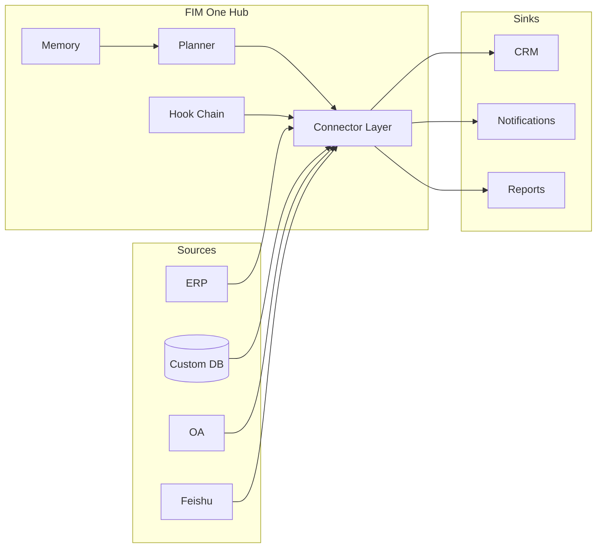

<Frame>
  
</Frame>

<Info>
  **Version 1.1 · April 2026.** Ce livre blanc documente la thèse architecturale, le positionnement catégorique et le modèle de déploiement de FIM One.
  Il est destiné aux CTO, architectes d'entreprise, responsables de plateformes IA et investisseurs techniques évaluant comment intégrer l'IA aux systèmes qu'ils utilisent déjà.
</Info>

## Résumé exécutif

**Les données ne quittent jamais votre périmètre.** Cette seule phrase est la contrainte de conception de premier ordre derrière chaque décision dans FIM One, et c'est la raison pour laquelle une nouvelle couche d'infrastructure est nécessaire — pas un autre iPaaS, et pas un autre agent généraliste.

La plupart des entreprises disposent déjà des systèmes dont elles ont besoin — ERP, CRM, OA, bases de données personnalisées, API internes, SaaS sectoriels. Ce qui leur manque, c'est un moyen pour l'IA de **accéder** à ces systèmes sans migrer les données vers le cloud d'un fournisseur et sans un projet d'intégration de six mois pour chaque cas d'usage. Le marché est vaste, évolue rapidement et se repositionne déjà : les dépenses mondiales en infrastructure GenAI pour les entreprises devraient atteindre **18 milliards USD en 2025, avec une croissance de 3,2× en glissement annuel** (Menlo Ventures 2025). La Chine évolue encore plus vite — les dépenses en Agent IA pour les entreprises à **120% TCAC (2023–2027), atteignant ¥65,5 milliards d'ici 2027** (iResearch · CAICT 2025). Les entreprises centrales et détenues par l'État représentent **plus de 60% des achats de grands modèles**, et le déploiement privé Xinchuang (信创) est une contrainte incontournable.

Gartner a officiellement renommé cette catégorie « AI Agent Platform » (document 6300015, 2025) ; le rapport 2025 de CAICT sur la technologie Agentic AI l'appelle « 智能体平台 » ; MuleSoft, le leader historique de l'iPaaS, a été **rétrogradé de Leader à Challenger** dans le Magic Quadrant iPaaS 2025. La catégorie qui a dominé l'intégration d'entreprise pendant une décennie est remplacée en temps réel.

FIM One est conçu pour la nouvelle catégorie. C'est une **plateforme d'agent tout-en-un** pour les entreprises mondiales et chinoises — un framework Python agnostique vis-à-vis des fournisseurs où les agents IA planifient et exécutent dynamiquement des tâches dans vos systèmes existants, reliant les SaaS mondiaux et la pile chinoise via un cœur d'agent unique, déployé dans votre propre environnement, auditable de bout en bout. Un cœur d'agent, trois modes de livraison :

| Mode | Où il réside | Déploiement typique |
|---|---|---|
| **Standalone** | Un portail qui lui est propre | Q&A sur les connaissances, chat interne, bac à sable de code |
| **Copilot** | Intégré dans un système hôte | « Finance Copilot » dans une interface web ERP |
| **Hub** | Orchestrateur central inter-systèmes | L'agent interroge l'ERP, vérifie l'OA, notifie via Feishu |

Ce document explique pourquoi la catégorie évolue, pourquoi l'iPaaS ne peut pas absorber la nouvelle charge de travail, à quoi ressemble FIM One sous le capot, et comment le mettre en production.

## 1. Le problème : l'IA d'entreprise est un problème d'alignement

La conversation publique sur l'IA en 2025–2026 a été dominée par les capacités des modèles — contextes plus longs, meilleure capacité de raisonnement, tokens moins chers. Dans les entreprises, la capacité est rarement le goulot d'étranglement. Le goulot d'étranglement est que **l'IA n'a pas de mains à l'intérieur de vos systèmes**.

Un LLM de pointe qui peut lire une base de code de dix mille lignes et proposer une correction correcte ne peut pas, par lui-même :

- Extraire les chiffres d'inventaire d'hier d'une instance SAP sur site.
- Approuver une demande de congé dans un outil RH SaaS dont la seule surface d'intégration est une API SOAP héritée.
- Écrire une ligne dans un ERP conforme à Xinchuang dont l'authentification est un service de ticket de connexion au lieu d'OAuth2.
- Envoyer une notification dans un groupe Feishu, en respectant les règles d'approbation du groupe.

Chacun de ces éléments est un problème d'intégration résolu — une fois. La difficulté est que chaque entreprise dispose de dizaines de tels systèmes, chacun avec son propre modèle d'authentification, sa structure de données et ses modes de défaillance. Les coder en dur vous donne un monolithe fragile. Demander au LLM de les découvrir à l'exécution vous donne des appels API hallucinez.

**La primitive manquante est une surface alignée.** Une interface typée, authentifiée et découvrable entre le modèle et le système — une qui indique au modèle exactement ce qu'il peut faire, quel est le coût de chaque action, qui doit l'approuver et à quoi ressemblera le résultat. Cette primitive est ce que FIM One appelle un **Connector**.

## 2. Pourquoi les approches existantes sont insuffisantes

### 2.1 iPaaS et générateurs de flux de travail — Une catégorie en déclin

iPaaS (MuleSoft, Boomi, Workato) et la famille plus légère des flux de travail (n8n, Zapier, Dify, Coze) traitent l'intégration comme un problème de **conception** : un humain dessine un graphe de nœuds et les relie à granularité au niveau des champs, le graphe s'exécute de manière déterministe à l'exécution. Ce modèle fonctionnait quand les intégrations étaient peu nombreuses et stables.

Il ne fonctionne pas pour l'automatisation d'entreprise pilotée par l'IA, pour trois raisons qui s'aggravent mutuellement :

1. **La logique existe déjà dans le système cible.** Chaque nœud est un simple wrapper autour d'un appel API que vous devez maintenant gérer à deux endroits.
2. **L'humain doit connaître le plan à l'avance.** Les questions d'entreprise comme « clôturer le Q1 pour toutes les entités APAC » sont ouvertes — le plan doit être généré à l'exécution, pas dessiné par un concepteur.
3. **La cartographie au niveau des champs s'effondre à grande échelle.** Un graphe de mille nœuds sur une douzaine de systèmes est impossible à maintenir ; les surfaces d'action lisibles par l'IA la remplacent entièrement.

La catégorie est visiblement en mouvement. Gartner a reclassé l'espace en tant que « AI Agent Platform » en 2025 (document 6300015). CAICT a adopté le même cadre (« 智能体平台 ») dans son rapport 2025 Agentic AI Technology Report. Plus révélateur encore, **MuleSoft — le fournisseur iPaaS de référence pendant une décennie — a été rétrogradé de Leader à Challenger dans le Magic Quadrant iPaaS 2025 de Gartner**. En même temps, le protocole MCP d'Anthropic, lancé en novembre 2024, a atteint **10 000+ serveurs et 97 millions de téléchargements mensuels du SDK en 15 mois**. Le signal est sans équivoque : la couche d'intégration de l'automatisation d'entreprise est en train d'être reconstruite.

### 2.2 Agents polyvalents (Manus, AutoGPT, OpenAI Assistants)

Les agents polyvalents sont conçus pour les tâches de consommation et de travail intellectuel — navigation web, rédaction de documents, manipulation de feuilles de calcul. Ils ne peuvent pas accéder à votre VPN, s'authentifier auprès de votre ERP ou passer votre examen de sécurité. Intégrés autour de systèmes d'entreprise, ils deviennent des démonstrations qui disparaissent au stade pilote.

### 2.3 Vendor-Embedded AI (Feishu AI, SAP Joule, Salesforce Einstein)

Les fournisseurs ont intégré leur propre IA dans leurs propres produits. Le problème est structurel : **aucun fournisseur en amont n'a intérêt à briser son propre silo de données.** Feishu AI ne connaît pas vos données ERP ; DingTalk AI ne connaît pas l'état de vos contrats. L'IA de chaque fournisseur ne voit que ce que ce fournisseur vous a vendu. Pour les travaux multi-systèmes, ils ne sont pas viables.

### 2.4 Build-Your-Own and RPA

Les développements internes ont des délais longs et des coûts d'adaptation constants. L'RPA pilote l'interface utilisateur comme un humain — l'approche la plus générale et la plus fragile : chaque changement d'interface la casse, chaque invite d'authentification l'arrête. C'est un pansement sur des API manquantes, pas une fondation pour construire l'IA.

FIM One occupe l'espace que tous ces éléments laissent derrière : des API typées sur des systèmes réels, planifiées par le modèle, gouvernées par l'entreprise, déployées à l'intérieur des limites de l'entreprise.

## 3. La thèse de FIM One

Trois convictions façonnent chaque décision de conception.

**Conviction 1 — Les systèmes existent déjà.** Ne demandez pas à l'entreprise de tout reconstruire ; rencontrez-la où elle se trouve. Chaque connecteur est un pont, pas un remplacement. Les données ne quittent jamais la source de vérité, et elles ne quittent jamais les limites de l'entreprise.

**Conviction 2 — L'alignement surpasse la capacité.** Un modèle plus faible avec un ensemble d'outils alignés surpasse un modèle plus puissant qui tâtonne avec des API brutes. Le fossé concurrentiel, c'est la bibliothèque de connecteurs, son modèle d'authentification et la couche de gouvernance — pas le raisonnement brut de l'agent.

**Conviction 3 — La planification dynamique est le juste milieu.** Les workflows rigides (iPaaS, BPM) sont trop fragiles pour les vraies tâches d'entreprise ; les agents entièrement autonomes (AutoGPT, Manus) sont trop imprévisibles pour la production. FIM One planifie à l'exécution mais dans un espace d'action typé — chaque étape est un appel de connecteur, pas un monologue LLM sans limites. Autonomie bornée : `re-plan ≤ 3 | token budget | confirmation gate`.

### Au-delà d'iPaaS

FIM One n'est délibérément pas une iPaaS, et cette distinction n'est pas cosmétique. iPaaS fonctionne au niveau des champs, au moment de la conception, avec une modélisation humaine, et est hébergée dans le cloud du fournisseur. FIM One fonctionne au niveau des actions, à l'exécution, avec une planification par le modèle, et est hébergée en entreprise.

| Axe | iPaaS | FIM One |
|---|---|---|
| Granularité | Mappage de champs | Action typée |
| Moment de la planification | Moment de la conception | Exécution |
| Qui la modélise | Concepteur humain | Le modèle |
| Localisation des données | Cloud du fournisseur | Vos serveurs |
| Gouvernance | Complément externe | Hooks intégrés |
| Catégorie (Gartner 2025) | iPaaS MQ (en déclin) | Plateforme d'agents IA |

## 4. Architecture Principles

<CardGroup cols={2}>
  <Card title="Provider-Agnostic" icon="shuffle">
    Any OpenAI-compatible LLM — OpenAI, Anthropic, DeepSeek, Qwen, local Ollama, Xinchuang-certified models. Model choice is a deployment variable, not an architectural commitment.
  </Card>
  <Card title="Protocol-First" icon="network-wired">
    Every connector publishes a typed schema. The agent sees actions, parameters, and return types — never raw HTTP. OpenAPI, MCP, and direct database connections are first-class.
  </Card>
  <Card title="Three Execution Engines" icon="sitemap">
    **ReAct** for exploratory tasks, **DAG** for structured pipelines, **Workflow** (up to 25 nodes) for deterministic human-designed pipelines. One agent core picks the engine per task.
  </Card>
  <Card title="Schema-First Tool Loading" icon="bolt">
    Tool schemas are pre-seeded at ~30 tokens each; the agent expands on demand. Per-session prompt overhead drops ~80%, and the platform scales to **10,000+ APIs** without blowing the context window.
  </Card>
  <Card title="Hook-Governed" icon="shield-halved">
    Every tool call passes through a configurable hook chain: audit, policy, human-in-the-loop approval. Hooks run outside the LLM loop — deterministic and auditable.
  </Card>
  <Card title="Memory-Aware" icon="brain">
    Short-term conversation, long-term knowledge base, and cross-session memory are first-class primitives, not bolt-ons.
  </Card>
</CardGroup>

## 5. Trois modes de livraison — Un cœur d'agent unique

Le même planificateur, la mémoire et la bibliothèque de connecteurs alimentent trois formes de produits distincts. Le choix est une décision de déploiement, non une bifurcation de code.

**Standalone** — un portail autonome. L'acheteur souhaite une interface de chat sur une base de connaissances organisée, ou un bac à sable de code, ou un assistant général. Aucun système hôte impliqué. Convient aux services d'assistance informatique internes, à la productivité de l'ingénierie, aux bases de connaissances d'assistance client.

**Copilot** — l'agent intégré dans un système hôte existant via iframe, widget ou intégration directe. L'hôte gère l'authentification ; le Copilot hérite du contexte utilisateur. Convient à Finance Copilot dans SAP Fiori, Sales Copilot dans Salesforce, DevOps Copilot dans un portail développeur interne.

**Hub** — la surface d'orchestration centrale. Chaque système connecté s'y termine. Les utilisateurs posent des questions inter-systèmes ; l'agent planifie et exécute à travers les systèmes. Convient à « clôturer Q1 pour toutes les entités APAC », « trouver chaque client qui a manqué un renouvellement et rédiger une sensibilisation », « réconcilier les paiements d'hier entre la passerelle et le grand livre ».

## 6. Modèle d'alignement des connecteurs

Un connecteur est une surface d'action typée soutenue par une stratégie d'authentification. FIM One définit trois niveaux d'authentification qui couvrent la grande majorité des systèmes d'entreprise.

<AccordionGroup>
  <Accordion title="Tier 1 — Connecteurs de base de données (Full ou Basic)">
    Connexion directe à une base de données relationnelle ou documentaire. Le mode **Full** expose du SQL arbitraire à l'agent, contrôlé par un rôle en lecture seule ; le mode **Basic** expose uniquement des requêtes paramétrées pré-enregistrées. Support natif des **bases de données conformes à Xinchuang — Dameng (DM8), KingbaseES, HighGo, GBase** — aux côtés de PostgreSQL, MySQL et Oracle. Les clients centraux/d'État et réglementés passent la journée de conformité des appels d'offres dès le premier jour.
  </Accordion>
  <Accordion title="Tier 2 — Connecteurs OpenAPI (User-Key)">
    Toute API REST avec une spécification OpenAPI. L'agent lit la spécification, sélectionne le point de terminaison et l'appelle avec la clé de l'utilisateur connecté. Couvre les SaaS modernes (Slack, Linear, GitHub) et les API internes bien documentées.
  </Accordion>
  <Accordion title="Tier 3 — Connecteurs Login-Ticket / Legacy">
    Pour les systèmes — particulièrement courants sur le marché chinois — qui s'authentifient via un service de ticket de connexion plutôt que OAuth2. Le connecteur gère le cycle de vie du ticket (acquisition, actualisation, invalidation) et présente une surface typée normale vers le haut. Ce niveau déverrouille les systèmes que tous les autres fournisseurs ignorent.
  </Accordion>
</AccordionGroup>

Chaque connecteur déclare également une **dualité Canal/Intégration** : le même système sous-jacent peut apparaître à la fois comme un *canal* (récepteur de notifications, surface d'approbation) et comme une *intégration* (source de données, cible d'action). Feishu est à la fois un canal de notification et une source de données de chat de groupe ; DingTalk et WeCom suivent le même modèle.

## 7. Intelligence Artificielle Fiable pour l'Entreprise — Trois Piliers

L'intelligence artificielle d'entreprise échoue en production non pas parce que le modèle est incorrect, mais parce que l'organisation ne peut pas prouver qu'il est correct. FIM One traite la confiance comme une architecture, exprimée en trois piliers.

<CardGroup cols={3}>
  <Card title="Chaque Conclusion Est Citée" icon="paperclip">
    La récupération RAG + la chaîne de citation permet à l'agent de référencer un paragraphe spécifique dans un document spécifique pour chaque affirmation. Les conclusions sont traçables et vérifiables. Aucune sortie de boîte noire.
  </Card>
  <Card title="Chaque Écriture Est Confirmée" icon="hand">
    Les opérations d'écriture sont forcées de s'arrêter avant l'exécution, en attente d'une approbation humaine — en ligne dans le portail ou hors bande via un groupe d'approbation Feishu. La chaîne de hook est une contrainte architecturale, pas une suggestion de politique. Elle ne peut pas être contournée.
  </Card>
  <Card title="Chaque Lancement Est Mesuré" icon="chart-bar">
    L'évaluation basée sur les données quantifie la qualité avant chaque lancement. Chaque itération est mesurable ; l'approvisionnement d'entreprise obtient des preuves, pas des promesses.
  </Card>
</CardGroup>

Pour soutenir cela, chaque exécution d'agent émet une trace structurée : plan, appels d'outils, arguments, observations, approbations, réponse finale. Les traces sont l'unité d'audit. Les identifiants utilisent le chiffrement Fernet (AES-128-CBC + HMAC-SHA256). Les journaux d'audit complets sont stockés et exportables.

Lorsqu'un opérateur rejette un appel d'outil, l'agent s'arrête — il ne paraphrase pas et ne réessaie pas. Le rejet est une décision de politique, pas une erreur à récupérer.

## 8. Déploiement et modèle commercial

FIM One est open-source sous une licence permissive (FIM-SAL), avec trois formes de déploiement et trois niveaux d'édition.

<CardGroup cols={3}>
  <Card title="Community" icon="code">
    Gratuit à vie. Auto-hébergé. Pour les développeurs et les équipes d'évaluation.
  </Card>
  <Card title="Cloud" icon="cloud">
    Hébergé par Wuzhi sur cloud.fim.ai. Abonnement par utilisateur + par connecteur. L'entité de Singapour gère les contrats internationaux.
  </Card>
  <Card title="Enterprise" icon="briefcase">
    Déploiement privé, tarification personnalisée, outils de conformité, support technique dédié. Pour les grandes entreprises et les clients gouvernementaux/publics.
  </Card>
</CardGroup>

La base de code compte environ 170 000 lignes de Python réparties sur plus de 1 590 modules, avec environ 100 fichiers de test et un support intégré pour 6 langues d'interface. Le code source est ouvert sous FIM-SAL — les entreprises peuvent auditer la sécurité elles-mêmes. Le coût d'exécution dominant provient des tokens LLM, non de l'infrastructure ; l'agnosticisme des fournisseurs signifie que vous bénéficiez des baisses de prix à la frontière, sans migration.

## 9. Delivery Path

Production deployment follows a three-step path that keeps risk bounded and time-to-value short.

| Step | Timeline | What happens |
|---|---|---|
| **1. PoC** | 2 weeks | 1–2 representative scenarios (finance audit, contract review, data reporting), end-to-end on real data. First version in 7 days, validation report in 14. |
| **2. Pilot** | 1–2 months | Private deployment to your servers. First 3–5 connectors (ERP / OA / Feishu / DingTalk / database). One business line covered. Audit and approval baselines established. |
| **3. Scale** | 3–6 months | Expansion to more business lines and connectors. Industry Skill packs accumulated. Internal administrators trained. Operations runbook and SLA delivered. |

Eight vertical pre-built Solution templates cover the most common scenarios: finance audit, contract review, data reporting, procurement reconciliation, customer payment collection, compliance screening, HR screening, ops on-call.

## 10. Où cela s'inscrit

**Court terme — profondeur des connecteurs.** Plus de connecteurs Tier-3 hérités pour le marché chinois, certification Xinchuang plus approfondie, et un AI Builder qui transforme une spécification OpenAPI ou une capture d'écran de schéma de base de données en connecteur fonctionnel en quelques minutes.

**Court terme — profondeur de la gouvernance.** RBAC plus riche, permissions de connecteur à quatre niveaux, IdP indépendant, SSO par défaut, conformité SOC 2 et ISO 27001.

**Moyen terme — écosystème.** SaaS cloud, une Marketplace de connecteurs, et des packs de solutions sectoriels — la couche d'infrastructure sur laquelle les tiers construisent.

Le pari à plus long terme est que la forme de l'IA d'entreprise ressemblera bien davantage à une plateforme d'agent multi-systèmes qu'à une CLI. Les travailleurs du savoir n'installeront pas dix assistants IA ; ils interrogeront la plateforme d'agent de leur entreprise, et la plateforme saura comment accéder à n'importe quel système détenant la réponse — SaaS mondial, la pile d'entreprise chinoise, ou n'importe quoi entre les deux. FIM One construit cette plateforme.

## 11. Appendice — Aller plus loin

- **[Aperçu du système](/architecture/system-overview)** — architecture au niveau des composants.
- **[Architecture des connecteurs](/architecture/connector-architecture)** — le contrat des connecteurs, le cycle de vie et le modèle d'extension.
- **[Philosophie de conception](/architecture/design-philosophy)** — pourquoi nous avons fait chaque compromis fondamental.
- **[Système de crochets](/architecture/hook-system)** — politique, approbation et audit en profondeur.
- **[Paysage concurrentiel](/strategy/competitive-landscape)** — positionnement de catégorie et comparaison directe.
- **[Démarrage rapide](/quickstart)** — exécutez FIM One sur votre ordinateur portable en moins de dix minutes.

<Tip>
  Questions, corrections ou demandes commerciales : hi@fim.ai · [Discord](https://discord.gg/z64czxdC7z) · [GitHub](https://github.com/fim-ai/fim-one)
</Tip>
