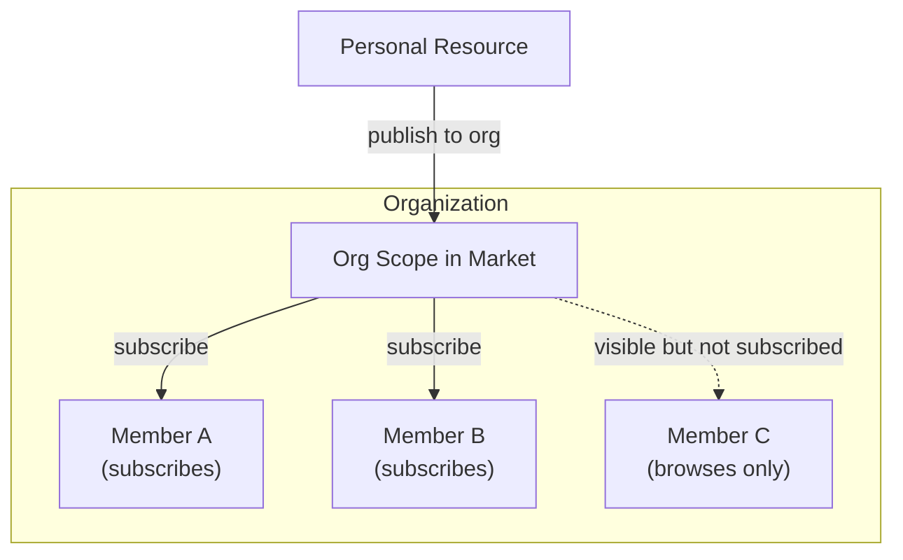
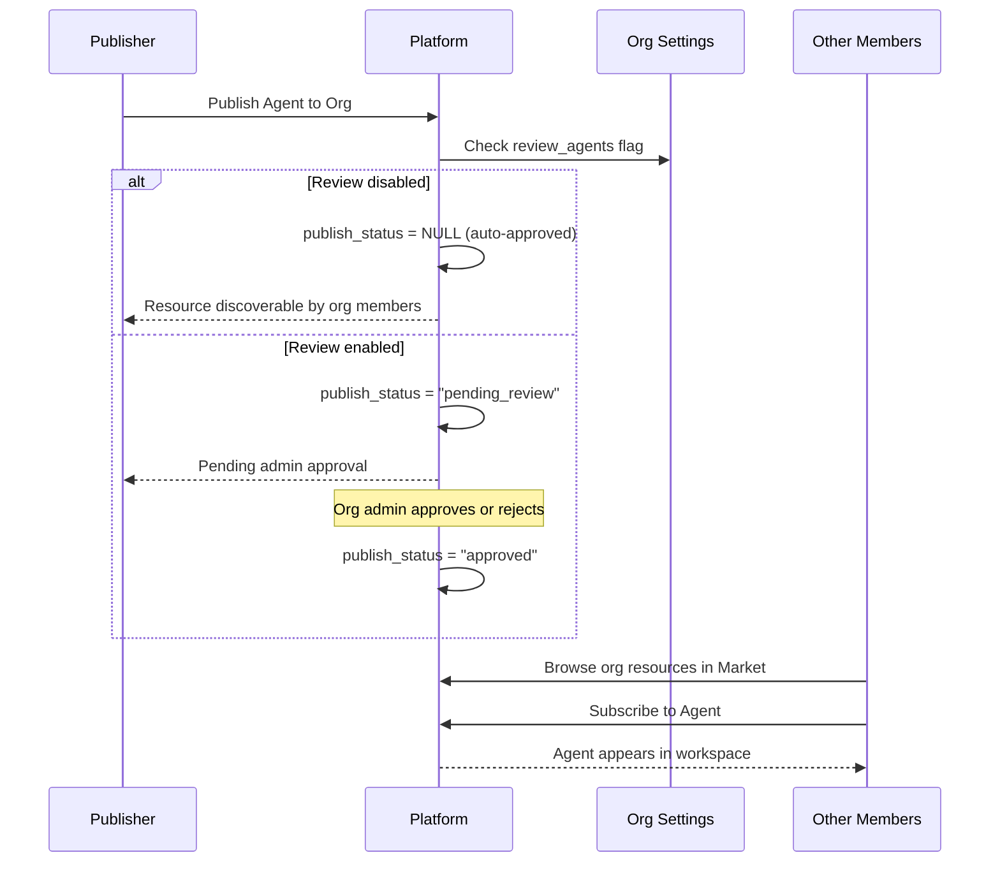
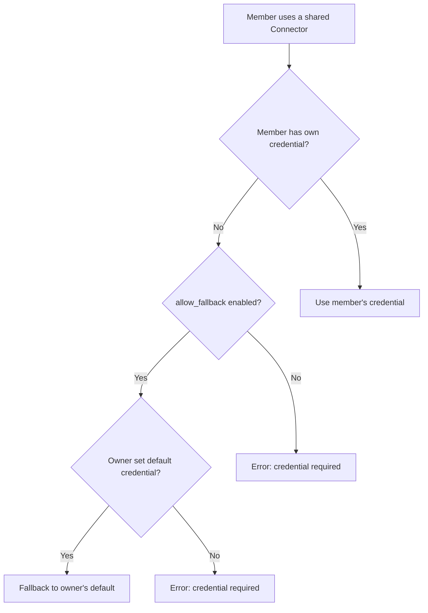

## 概要

組織はFIM Oneのチームコラボレーションの単位です。ユーザーグループがエージェント、コネクタ、ナレッジベース、MCPサーバー、ワークフロー、スキルなどのリソースを信頼できるスコープ内で共有できます。

FIM Oneのすべてのリソースは**個人用**として開始されます（作成者のみに表示されます）。リソースを組織に公開すると、**発見可能**になり、マーケットの組織スコープを通じて他の組織メンバーが見つけることができます。メンバーは組織の共有リソースを参照し、必要なものをサブスクライブします。



組織とグローバルマーケットは同じサブスクリプションベースのアクセスモデルを共有しています。主な違いは信頼です。組織はメンバーが互いに知り、信頼するチームまたは企業を表しているため、レビューはオプションであり、認証情報の共有は簡単です。

## 組織の作成と管理

すべてのユーザーは**無制限**の組織を作成でき、任意の数の組織に参加できます。組織には3つのロールがあります：

| ロール | 権限 |
|---|---|
| **オーナー** | 完全な制御 — メンバーの管理、設定の構成、レビューのバイパス |
| **管理者** | メンバーの管理と公開リソースのレビュー |
| **メンバー** | 共有リソースの閲覧とサブスクリプション |

オーナーは常に組織を作成したユーザーです。所有権は譲渡できますが、共有することはできません。

## リソースの公開

組織にリソースを公開すると、すべてのメンバーのワークスペースに自動的に表示されるわけではありません。代わりに、リソースはマーケットの組織スコープで検出可能になり、メンバーはそこでリソースを閲覧して購読できます。

このサブスクリプションベースのモデルにより、各メンバーは自分のワークスペースを制御できます。大規模な組織は数十のコネクタを共有する場合がありますが、個々のメンバーは自分の仕事に関連するものだけを購読します。



### レビューシステム

レビューは**オプション**であり、リソースタイプごとに設定されます。各組織は独立したトグルフラグを持ちます：

- `review_agents`
- `review_connectors`
- `review_kbs`
- `review_mcp_servers`
- `review_workflows`
- `review_skills`

リソースタイプのレビューが無効な場合、公開されたリソースはメンバーによってすぐに検出可能になります。管理者のアクションは不要です。レビューが有効な場合、リソースは`pending_review`状態に入り、管理者の承認が必要になってから表示されるようになります。

<Tip>
組織のオーナーは自動的にレビューをバイパスします。公開されたリソースは常にすぐに検出可能です。
</Tip>

この柔軟性により、組織はガバナンスのニーズに合わせることができます。小規模なスタートアップはすべてのレビュートグルを無効にしてシームレスな共有を実現できますが、コンプライアンス重視のエンタープライズはエージェントとコネクタのレビューを有効にして監視を維持できます。

## 認証情報フォールバック

コネクタと MCP サーバーはしばしば認証情報（API キー、データベースパスワード、OAuth トークン）を必要とします。FIM One は**フォールバック機構**を提供しており、メンバーが自分で毎回認証情報を設定する必要がありません。



2 つのモードがあります：

- **フォールバック有効** (`allow_fallback=true`、デフォルト)：独自の認証情報を提供しないメンバーは、自動的にオーナーのデフォルト認証情報を使用します。これはチーム共有の API キーや、単一のキーでチーム全体をカバーする内部サービスに適しています。
- **フォールバック無効** (`allow_fallback=false`)：すべてのメンバーが独自の認証情報を設定する必要があります。これは各ユーザーが個人用 API キーを必要とする場合（例えば、ユーザーごとのライセンスを持つ SaaS）に適しています。

認証情報を必要としないリソース（読み取り専用の公開 API コネクタや認証なしのエージェントなど）は、サブスクリプション後すぐに機能します。設定は不要です。

<Info>
認証情報フォールバックはメンバーがリソースをサブスクリプションした後にのみ適用されます。フォールバック機構はランタイムで認証情報がどのように解決されるかを決定するもので、リソースがアクセス可能かどうかを決定するものではありません。
</Info>

## リソースの可視性

FIM One のすべてのリソースには、アクセス範囲を決定する `visibility` があります:

| 可視性 | スコープ | 発見できるユーザー |
|---|---|---|
| `personal` | オーナーのみ | リソースを作成したユーザー |
| `org` | 組織 | 組織メンバーは閲覧および購読可能（承認が必要） |

可視性フィルターは統一されたクエリパターンに従います:

```
ワークスペースでリソースが利用可能な場合:
  1. あなたがそれを所有している（任意の可視性）、または
  2. あなたが属する組織に公開されており、承認されており、かつあなたが購読している
```

<Warning>
リソースを組織に公開しても、自動的にアクセス権が付与されるわけではありません。メンバーは Market の組織スコープを通じて購読し、リソースをワークスペースに追加する必要があります。
</Warning>

## 実践的なシナリオ

### チームでのデータベースコネクタの共有

1. Aliceがチームの PostgreSQL データベースへのコネクタを作成する
2. Aliceがそれをチームの組織に公開する（コネクタではレビューが無効）
3. コネクタが Market の組織スコープで検出可能になる
4. Bobが組織の共有リソースを参照し、コネクタを見つけて購読する
5. コネクタが Bob のワークスペースに表示され、Alice のデータベース認証情報がフォールバックとして使用される
6. Carol も購読する。Dave（外部契約者）も購読し、代わりに独自の読み取り専用認証情報を設定する

### 厳密なレビューを伴う組織

1. コンプライアンス重視の企業が、組織で `review_agents=true` と `review_connectors=true` を有効にする
2. 従業員が新しいエージェントを公開すると、`pending_review` 状態に入る
3. 組織管理者がエージェント設定をレビューして承認する
4. エージェントが検出可能になり、他のメンバーがそれを見つけて購読できるようになる
5. 発行者が後で承認されたエージェントを編集すると、自動的に `pending_review` に戻って再承認される

### 大規模組織における選択的サブスクリプション

1. 組織が内部API、データベース、サードパーティサービスをカバーする50以上のコネクタを公開する
2. データチームはデータベースコネクタと分析API コネクタのみにサブスクライブする
3. マーケティングチームはCRMとメールプラットフォームコネクタのみにサブスクライブする
4. 各チームメンバーのワークスペースは焦点を絞った状態で、整理されたままになる

## 関連項目

- [マーケットアーキテクチャ](/concepts/market) — グローバルマーケットと組織との関係について。両者は同じサブスクリプションモデルを使用していますが、マーケットは組織間の発見チャネルとして機能し、必須のレビュープロセスがあります。
- [エージェント＆リソース発見](/architecture/agent-discovery) — サブスクライブされたリソースがチャット中にツールセットに組み立てられる方法。
