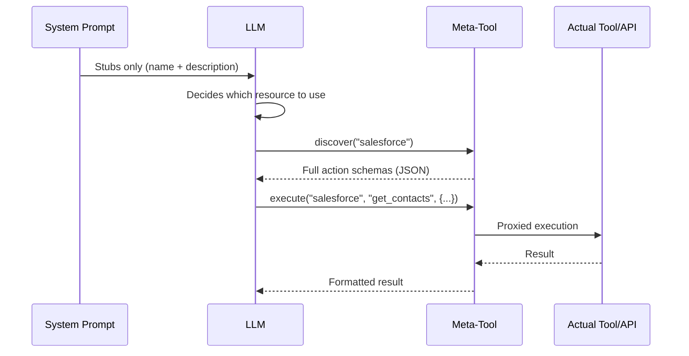
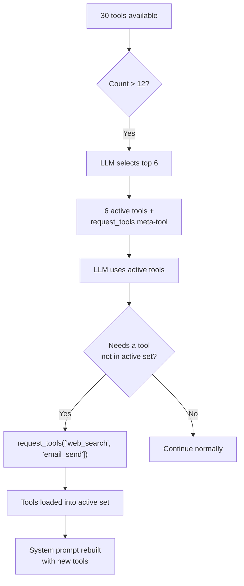

## 問題

LLMはコンテキストに対して2つの通貨で支払います：トークンとアテンション。システムプロンプトに注入されたすべてのツール定義は両方のコストがかかります。単一のMCPサーバーは90以上のツールを公開できます。20個のアクションを持つ5つのAPIコネクタは100個のツール定義を生成します。30個のテーブルを持つ3つのデータベースコネクタはさらに90個のスキーマ説明を生成します。ユーザーが一言も入力する前に、システムプロンプトは50～100KBのコンテキストを消費できます。これは128Kモデルの予算の半分です。

コストはトークンだけではありません。研究と実践は一貫して**LLMの精度は無関係なコンテキストが増えるにつれて低下する**ことを示しています。システムプロンプトに80個のツール定義を持つエージェントは、6個のツール定義を持つエージェントよりもツール選択で測定可能に悪いパフォーマンスを示します。モデルは決して使用しないツールスキーマにアテンションを費やし、重要なツールと指示への焦点を薄めます。

素朴なソリューション――すべてを注入し、モデルに整理させる――はスケールしません。FIM Oneは反対のアプローチを採用しています：**LLMが決定を下すために必要な最小限を表示し、必要に応じてより多くをリクエストさせる。**

## パターン

プログレッシブディスクロージャーは、すべてのリソースタイプ全体で2層アーキテクチャに従います：

1. **Tier 1 -- システムプロンプト内のスタブ。** 軽量なサマリー：名前、短い説明、およびLLMが詳細が必要かどうかを判断するのに十分なメタデータ（アクション数、テーブル数、ツール数）。

2. **Tier 2 -- オンデマンドの完全な詳細。** LLMがメタツールを呼び出して、完全なスキーマ、パラメータ、および実行機能を取得します。完全な詳細は、ツール結果メッセージとして会話に入ります -- システムプロンプトに永続的に占有されるのではなく、そのターンにスコープされます。



重要な洞察：**完全なツールスキーマは会話スコープであり、プロンプトスコープではありません。** これらはツール結果メッセージとして表示され、コンテキスト管理システムは後のターンで要約または切り詰めることができます。対照的に、システムプロンプトコンテンツは会話全体を通じて完全なサイズで永続化します。

## 5つの開示メカニズム

FIM Oneは、5つのリソースタイプ全体に段階的な開示を均一に適用します。各リソースは同じ2層パターンを使用しますが、メタツールはそのセマンティクスに合わせてカスタマイズされています。

| リソース | メタツール | スタブの表示内容 | オンデマンド返却内容 | 設定変数 | デフォルト |
|---|---|---|---|---|---|
| スキル | `read_skill` | 名前 + 説明（120文字） | 完全なSOP内容 + 埋め込みスクリプト | `SKILL_TOOL_MODE` | `progressive` |
| APIコネクタ | `connector` | コネクタ名 + アクション一覧 | パラメータ付きの完全なアクションスキーマ | `CONNECTOR_TOOL_MODE` | `progressive` |
| データベースコネクタ | `database` | DB名 + テーブル名 + カウント | カラムスキーマ、SQLクエリ実行 | `DATABASE_TOOL_MODE` | `progressive` |
| MCPサーバー | `mcp` | サーバー名 + ツール一覧 | 完全なツールスキーマ + 呼び出し | `MCP_TOOL_MODE` | `progressive` |
| 組み込みツール | `request_tools` | コンパクトカタログ（名前 + 80文字説明） | セッションに注入された完全なツールスキーマ | _(自動)_ | ツール数 >12 時に自動 |

### スキル -- `read_skill`

**LLMが最初に見るもの:**

```
## Available Skills
Call read_skill(name) to load full content before executing any of these:
- Customer Complaint SOP: Handle escalations per company policy...
- Refund Processing: Step-by-step refund workflow with approval gates...
```

各スタブはおおよそ30トークン -- 名前と完全なスキルコンテンツから切り詰められた120文字の説明です。

**オンデマンド時に起こること:** LLMが`read_skill("Customer Complaint SOP")`を呼び出し、完全なSOP テキスト -- ステップバイステップの指示、決定木、埋め込みスクリプトの数千トークンの可能性がある内容を受け取ります。このコンテンツはシステムプロンプトテキストではなくツール結果として入力されるため、後続のターンで通常のコンテキスト管理（要約、切り詰め）の対象となります。

**レガシーモード:** `SKILL_TOOL_MODE=inline`は完全なスキルコンテンツをシステムプロンプトに直接埋め込みます。スキルが少なく、小さい場合に適しています -- ただしスケーリングが悪くなります。

**コンテキスト削減:** 平均2,000トークンの10個のスキルを持つデプロイメントは、プログレッシブモード（スタブのみ）で約300トークン対インラインモードで約20,000トークンを消費します。これは永続的なコンテキストコストの98%削減です。

### APIコネクタ -- `connector`

**LLMが最初に見るもの:**

```
Interact with external services. Available connectors:
  - salesforce: CRM system -- actions: get_contacts, create_lead, update_opportunity
  - jira: Project management -- actions: create_issue, get_issue, search_issues

Subcommands:
  discover <name> -- list actions with full parameter schemas
  execute <name> <action> {"param": "value"} -- run an action
```

各コネクタスタブはアクション名をリストしますが、パラメータスキーマは含みません。LLMは*どのような*アクションが存在するかは知っていますが、*どのように*呼び出すかは知りません。これはコネクタを使用するかどうかを決定するための正確な詳細レベルです。

**オンデマンドで発生すること:** `connector("discover", "salesforce")` はHTTPメソッド、URLパス、パラメータJSONスキーマ、リクエストボディテンプレートを含む完全なアクションスキーマを返します。`connector("execute", "salesforce", "get_contacts", {"limit": 10})` は完全な認証注入と監査ログを備えた `ConnectorToolAdapter` を通じて実行をプロキシします。

**レガシーモード:** `CONNECTOR_TOOL_MODE=legacy` は各アクションを個別のツール（`salesforce__get_contacts`、`salesforce__create_lead` など）として登録します。20個のアクションを持つコネクタはシステムプロンプト内の20個のツール定義になります。

**コンテキスト節約:** 15個のアクションを持つコネクタはスタブで約50トークン対完全スキーマで約3,000トークンを生成します。5つのコネクタ：段階的に約250トークン対レガシーで約15,000トークン。

### データベースコネクタ -- `database`

**LLMが最初に見るもの:**

```
Query connected databases. Available databases:
  - hr_postgres: HR system (12 tables: employees, departments, salaries ...)
  - analytics_db: Analytics warehouse (45 tables: events, sessions, users ...)

Subcommands:
  list_tables <database> -- table names, descriptions, column counts
  discover <database> [table] -- full column schemas for one or all tables
  query <database> <sql> -- execute a SQL query
```

データベーススタブには、テーブル名（最大10個）とカウントが含まれており、LLMが列スキーマを読み込まずにクエリするデータベースを決定するのに十分な情報を提供します。

**オンデマンドで実行されるもの:** 3つのサブコマンドが自然な探索フローを形成します:

1. `database("list_tables", "hr_postgres")` -- すべてのテーブル名、説明、列数を返します。
2. `database("discover", "hr_postgres", table="employees")` -- 完全な列スキーマ（名前、型、null許容、主キー、説明）を返します。
3. `database("query", "hr_postgres", sql="SELECT ...")` -- 検証済みのSQLクエリを安全性チェックと行制限で実行します。

3段階のフローは、開発者が新しいデータベースを探索する方法を反映しています: テーブルを参照し、スキーマを検査してからクエリを実行します。LLMは同じパターンに自然に従います。

**レガシーモード:** `DATABASE_TOOL_MODE=legacy`は、データベースごとに3つのツール（`{db}__list_tables`、`{db}__describe_table`、`{db}__query`）を登録します。5つのデータベースコネクタがある場合、1つではなく15個のツール定義になります。

**コンテキスト削減:** 30個のテーブルと200列を持つデータベースは、スタブで約80トークン対フルスキーマで約5,000トークンを生成します。複数のデータベースがある場合、削減効果は複合します。

### MCP サーバー -- `mcp`

**LLM が最初に見るもの:**

```
Interact with MCP servers. Available servers:
  - github: GitHub (35 tools: create_issue, list_repos, get_pull_request ...)
  - slack: Slack (12 tools: send_message, list_channels, upload_file ...)

Subcommands:
  discover <server> -- list tools with full parameter schemas
  call <server> <tool> {"param": "value"} -- invoke an MCP tool
```

MCP サーバーは段階的な情報開示の最も劇的なケースです。GitHub MCP サーバーは 35 以上のツールを公開します。ファイルシステムサーバーは 20 以上を公開します。段階的な情報開示がなければ、3 つの MCP サーバーを接続すると、システムプロンプトに 70 以上のツール定義が注入される可能性があります。各ツールには完全な JSON Schema パラメータが含まれます。

**オンデマンドで何が起こるか:** `mcp("discover", "github")` は完全なツールカタログとパラメータスキーマを返します。`mcp("call", "github", "create_issue", {"title": "Bug report", "body": "..."})` は保存された `MCPToolAdapter` に委譲され、MCP サーバープロセスと通信します。

**レガシーモード:** `MCP_TOOL_MODE=legacy` は各 MCP ツールを個別のツール (`github__create_issue`、`github__list_repos` など) として登録します。これにより、ツール選択の閾値を簡単に超過し、不要な選択フェーズをトリガーする可能性があります。

**コンテキスト削減:** ここでの削減は極めて大きいです。GitHub MCP サーバーの 35 個のツールは 10,000 トークン以上のスキーマを消費する可能性があります。段階的モードでは、スタブは約 100 トークンのコストがかかります。ユーザーがそのコンバーセーション内で GitHub を必要としない場合、これらの 10,000 トークンは決して使用されません。

### 組み込みツール -- `request_tools`

5番目のメカニズムは、他の4つとは異なるアーキテクチャです。リソースタイプをメタツールの背後に統合するのではなく、**ツール選択のボトルネック**に対処します -- エージェントが12以上のツールを利用可能な場合に何が起こるかです。

**動作方法：** ツールの総数が`REACT_TOOL_SELECTION_THRESHOLD`（デフォルト：12）を超える場合、ReActエンジンは軽量なLLM呼び出しを実行して、現在のクエリに最も関連性の高い上位6つのツールを選択します。残りのツールは完全なレジストリに保存されます。`request_tools`メタツールが自動的に登録され、すべての未ロードツールをコンパクトなカタログ（名前 + 80文字の説明）としてリストアップします。



**LLMが最初に見るもの：**

```
Load additional tools into the current session.
Available tools not yet loaded:
- web_search: Search the web for current information and return relevant results...
- email_send: Send an email to one or more recipients with subject, body, and opt...
- python_exec: Execute Python code in a sandboxed environment and return the output...
```

**オンデマンドで何が起こるか：** `request_tools(tool_names=["web_search", "email_send"])`は、これらのツールを完全なレジストリからアクティブなレジストリにコピーします。次のイテレーションでシステムプロンプトが再構築されるため、LLMは完全なスキーマを見ることができます。これは副作用です -- ツールは会話の途中でアクティブなツールセットを変更します。

**環境変数なし：** このメカニズムはツール選択がセットをフィルタリングするときに自動的にアクティベートされます。`REQUEST_TOOLS_MODE`環境変数はありません。ツール選択を完全に無効にしたい場合は、`REACT_TOOL_SELECTION_THRESHOLD`を非常に大きな数に設定してください。

**コンテキストの節約：** 節約は、利用可能なツールの数と選択が選ぶツールの数によって異なります。30個のツールを持つエージェントが、アクティブなスキーマ6個 + `request_tools`カタログのみを見る場合、ツールスキーマコンテキストの約60～70%を節約できます。

## ツールアセンブリパイプラインへの適合方法

[System Overview](/architecture/system-overview)では、リクエストごとの8ステップツールアセンブリパイプラインについて説明しています。段階的開示は複数のポイントで機能します：

| パイプラインステップ | 段階的開示の役割 |
|---|---|
| **1. ベース検出** | 効果なし -- 組み込みツールは通常通りロードされます |
| **2. エージェントカテゴリフィルタ** | 効果なし -- カテゴリフィルタリングはモードに関わらず適用されます |
| **3. KB注入** | 効果なし -- KBツールは本質的に軽量です（1～2ツール） |
| **4. コネクタロード** | `ConnectorMetaTool`はすべてのAPIコネクタを統合します；`DatabaseMetaTool`はすべてのDBコネクタを統合します |
| **5. MCPロード** | `MCPServerMetaTool`はすべてのMCPサーバーを1つのツールに統合します |
| **6. スキル注入** | `ReadSkillTool`はシステムプロンプト内の完全なコンテンツをコンパクトなスタブに置き換えます |
| **7. CallAgent登録** | 効果なし -- `call_agent`は既に単一ツールでカタログを持っています |
| **8. ランタイム選択** | 選択フェーズがセットをフィルタリングするときに`request_tools`メタツールが登録されます |

最終的な効果：ステップ4～6は各々のツール数を1（または小さな定数）に削減し、ステップ8は選択フェーズで見落とされた可能性のあるものを動的にロードするためのセーフティネットを追加します。レガシーモードでは50以上のツールを持つHubエージェントが、段階的モードでは8～10個で提示される可能性があります -- 選択閾値をはるかに下回ります。

## 設定

4つの環境変数がリソースタイプごとに段階的な開示を制御します：

| 変数 | 値 | デフォルト | 効果 |
|---|---|---|---|
| `SKILL_TOOL_MODE` | `progressive` / `inline` | `progressive` | スキル：スタブ + `read_skill` vs. システムプロンプト内の完全なコンテンツ |
| `CONNECTOR_TOOL_MODE` | `progressive` / `legacy` | `progressive` | APIコネクタ：単一の `connector` メタツール vs. 個別のアクションツール |
| `DATABASE_TOOL_MODE` | `progressive` / `legacy` | `progressive` | DBコネクタ：単一の `database` メタツール vs. データベースあたり3つのツール |
| `MCP_TOOL_MODE` | `progressive` / `legacy` | `progressive` | MCPサーバー：単一の `mcp` メタツール vs. 個別のサーバーツール |

**エージェントレベルのオーバーライド。** 各環境変数は `model_config_json` フィールドを介してエージェントごとにオーバーライドできます：

```json
{
  "model_config_json": {
    "skill_tool_mode": "inline",
    "connector_tool_mode": "legacy",
    "database_tool_mode": "progressive",
    "mcp_tool_mode": "progressive"
  }
}
```

**優先順位：** エージェント設定 > 環境変数 > デフォルト。

つまり、グローバルに `progressive` を実行し（デフォルト）、特定のエージェントに対して選択的にオーバーライドできます。単一の小さなスキルを持つエージェントは `inline` モードを使用する場合があります。LLMがすべてのコネクタアクションを事前に確認する必要があるエージェント（例えば、メタツールを確実に呼び出さない微調整されたモデル）は `legacy` モードを使用する場合があります。

**`request_tools` に設定はありません。** ツール選択がフィルタされたサブセットを生成する場合、自動的にアクティブになります。閾値は `REACT_TOOL_SELECTION_THRESHOLD`（デフォルト：12）で制御され、最大選択数は `REACT_TOOL_SELECTION_MAX`（デフォルト：6）で制御されます。

## デザイン上の決定

### なぜ明示的（LLM駆動）ではなく暗黙的（フレームワーク駆動）なのか？

別の設計アプローチとしては、フレームワークがヒューリスティックに基づいてツールスキーマを自動的に展開する方法が考えられます。例えば、ユーザーのクエリがどのコネクターに関するものかを検出し、LLMがプロンプトを見る前にそのスキーマを注入するといったものです。FIM Oneは3つの理由から、LLM駆動のアプローチを意図的に選択しました：

1. **LLMはヒューリスティックよりも意図検出に優れている。** 「顧客がオープンなチケットを持っているか確認して、プロフィールを更新する」というようなクエリは2つのコネクターを含みます。キーワードのヒューリスティックマッチングは脆弱ですが、LLMは自然に両方を識別します。

2. **透明性。** LLMが`connector("discover", "jira")`を呼び出すと、そのアクションはツールトレースに表示されます。ユーザー（およびデバッグしている開発者）は、どのスキーマがいつ読み込まれたかを正確に確認できます。暗黙的な展開は見えません。

3. **コンテキスト効率。** フレームワークはLLMがコネクター内のどのアクションを必要とするかを知ることができません。コネクターのすべてのアクションを展開すると、無関係なものにトークンを浪費します。LLMはまずアクション名を（スタブ経由で）確認してから、特定のアクションのスキーマのみをリクエストします。これは純粋な2段階開示です。

### なぜ単一の汎用ツールではなくリソースごとのメタツールなのか？

単一の `discover_resource(type, name)` ツールはシンプルに実装できますが、LLMにとっては劣っています。リソースごとのメタツールは以下を提供します：

- **型付きパラメータ。** `connector` には `subcommand`、`connector`、`action`、`parameters` があります。`database` には `subcommand`、`database`、`table`、`sql` があります。パラメータスキーマはLLMに正確に何が期待されているかを伝えます。
- **列挙制約。** 各メタツールはスキーマ内の列挙値として有効な名前（コネクタ名、データベース名、サーバー名）をリストアップします。LLMはコネクタ名を幻想することはできません。
- **カテゴリセマンティクス。** `connector` ツールはカテゴリ `connector` を持ち、`database` はカテゴリ `database` を持ち、`mcp` はカテゴリ `mcp` を持ちます。これはエージェントカテゴリフィルタリングに組み込まれます。`connector` カテゴリのみで設定されたエージェントは `database` または `mcp` メタツールを見ることができません。

### なぜプログレッシブモードとレガシーモードの両方があるのか？

すべてのLLMがメタツールを同じように処理できるわけではありません。小規模なモデルまたはファインチューニングされたモデルは、2ステップの検出-実行パターンに苦労する可能性があります。レガシーモードは、すべてのアクションがスタンドアロンツールであり、その完全なスキーマが表示される直接的なフォールバックを提供します。メタツールの間接参照は必要ありません。

デュアルモード設計は移行もサポートしています。既存のデプロイメントは、単一の環境変数を変更することで、一度に1つのリソースタイプをテストしながら、段階的にプログレッシブモードに切り替えることができます。各環境変数は機能フラグとして機能します。影響範囲は単一のリソースタイプに限定され、ロールバックは1行の設定変更です。

3番目のより実用的な理由は、**デバッグです。** レガシーモードでは、すべてのツール呼び出しが明示的で自己完結しています。`salesforce__get_contacts(limit=10)` はログとトレースで即座に読み取ることができます。プログレッシブモードでは、同じ呼び出しは `connector("execute", "salesforce", "get_contacts", {"limit": 10})` です。実際に何が起こったかを理解するためにメタツール引数を解析する必要がある追加の間接参照レイヤーです。開発とトラブルシューティング中に、単一のリソースタイプをレガシーモードに戻すことで、他のリソースタイプに影響を与えることなく、診断を大幅に高速化できます。
