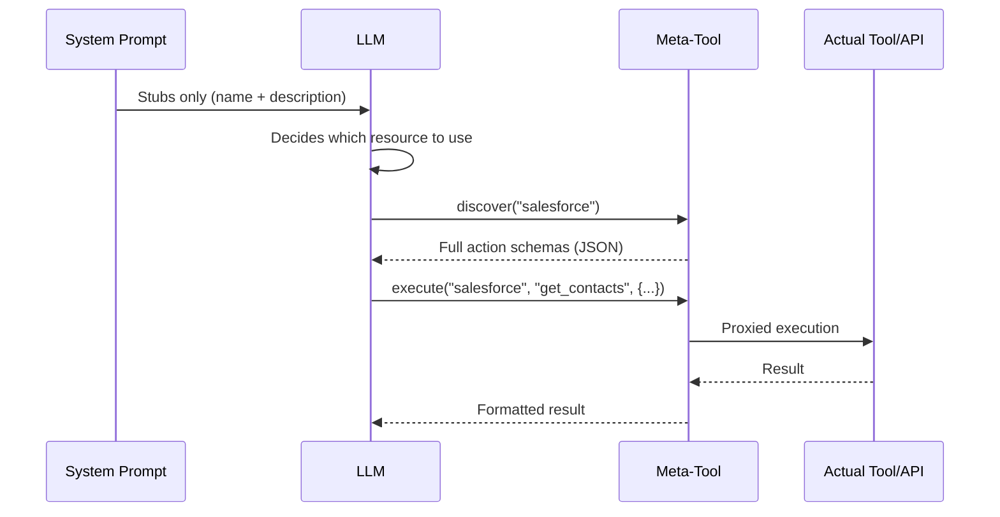
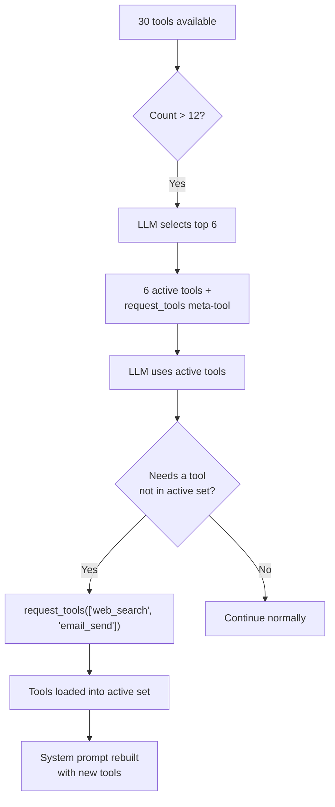

## 問題

LLMはコンテキストに対して2つの通貨で支払います：トークンと注意です。システムプロンプトに注入されるすべてのツール定義は両方のコストがかかります。単一のMCPサーバーは90以上のツールを公開できます。20個のアクションを持つ5つのAPIコネクタは100個のツール定義を生成します。30個のテーブルを持つ3つのデータベースコネクタはさらに90個のスキーマ説明を生成します。ユーザーが一言も入力する前に、システムプロンプトは50～100KBのコンテキストを消費できます。これは128Kモデルの予算の半分です。

コストはトークンだけではありません。研究と実践は一貫して**LLMの精度は無関係なコンテキストが増えるにつれて低下する**ことを示しています。システムプロンプトに80個のツール定義を持つエージェントは、6個のツール定義を持つものよりもツール選択の精度が測定可能に低下します。モデルは決して使用しないツールスキーマに注意を費やし、重要なツールと指示への焦点を薄めます。

素朴なソリューション――すべてを注入し、モデルに整理させる――はスケーリングしません。FIM Oneは反対のアプローチを採用しています：**LLMが決定を下すために必要な最小限を表示し、必要に応じてより多くをリクエストさせる。**

## パターン

プログレッシブディスクロージャーは、すべてのリソースタイプ全体で2層アーキテクチャに従います:

1. **層1 -- システムプロンプト内のスタブ。** 軽量なサマリー: 名前、短い説明、およびLLMが詳細が必要かどうかを判断するのに十分なメタデータ(アクション数、テーブル数、ツール数)。

2. **層2 -- オンデマンドの完全な詳細。** LLMがメタツールを呼び出して、完全なスキーマ、パラメータ、実行機能を取得します。完全な詳細は、ツール結果メッセージとして会話に入ります -- システムプロンプトに永続的に占有するのではなく、そのターンにスコープされます。



重要な洞察: **完全なツールスキーマは会話スコープであり、プロンプトスコープではありません。** これらはツール結果メッセージとして表示され、コンテキスト管理システムは後のターンで要約または切り詰めることができます。対照的に、システムプロンプトコンテンツは会話全体にわたって完全なサイズで永続化します。

## 5つの開示メカニズム

FIM Oneは、5つのリソースタイプ全体に段階的な開示を均一に適用します。各リソースは同じ2段階パターンを使用しますが、そのセマンティクスに合わせたメタツールを備えています。

| リソース | メタツール | スタブが表示 | オンデマンド返却 | 設定変数 | デフォルト |
|---|---|---|---|---|---|
| Skills | `read_skill` | 名前 + 説明（120文字） | 完全なSOP内容 + 埋め込みスクリプト | `SKILL_TOOL_MODE` | `progressive` |
| API Connectors | `connector` | コネクタ名 + アクションリスト | パラメータ付きの完全なアクションスキーマ | `CONNECTOR_TOOL_MODE` | `progressive` |
| Database Connectors | `database` | DB名 + テーブル名 + カウント | カラムスキーマ、SQLクエリ実行 | `DATABASE_TOOL_MODE` | `progressive` |
| MCP Servers | `mcp` | サーバー名 + ツールリスト | 完全なツールスキーマ + 呼び出し | `MCP_TOOL_MODE` | `progressive` |
| Built-in Tools | `request_tools` | コンパクトカタログ（名前 + 80文字説明） | セッションに注入された完全なツールスキーマ | _(auto)_ | ツール数 >12 時に自動 |

### スキル -- `read_skill`

**LLMが最初に見るもの:**

```
## Available Skills
Call read_skill(name) to load full content before executing any of these:
- Customer Complaint SOP: Handle escalations per company policy...
- Refund Processing: Step-by-step refund workflow with approval gates...
```

各スタブはおよそ30トークン -- 名前と完全なスキルコンテンツから切り詰められた120文字の説明です。

**オンデマンドで発生すること:** LLMが `read_skill("Customer Complaint SOP")` を呼び出し、完全なSOP テキスト -- ステップバイステップの指示、決定木、埋め込みスクリプトの潜在的に数千トークン -- を受け取ります。このコンテンツはシステムプロンプトテキストではなくツール結果として入力されるため、後続のターンで通常のコンテキスト管理（要約、切り詰め）の対象となります。

**レガシーモード:** `SKILL_TOOL_MODE=inline` は完全なスキルコンテンツをシステムプロンプトに直接埋め込みます。スキルが少なく、小さい場合に適しています -- ただしスケーリングが悪いです。

**コンテキスト削減:** 平均2,000トークンの10個のスキルを持つデプロイメントは、プログレッシブモード（スタブのみ）で約300トークンを消費するのに対し、インラインモードで約20,000トークンを消費します。これは永続的なコンテキストコストの98%削減です。

### API コネクタ -- `connector`

**LLM が最初に見るもの:**

```
Interact with external services. Available connectors:
  - salesforce: CRM system -- actions: get_contacts, create_lead, update_opportunity
  - jira: Project management -- actions: create_issue, get_issue, search_issues

Subcommands:
  discover <name> -- list actions with full parameter schemas
  execute <name> <action> {"param": "value"} -- run an action
```

各コネクタスタブはアクション名をリストしますが、パラメータスキーマは含みません。LLM は*どの*アクションが存在するかは知っていますが、*どのように*呼び出すかは知りません。これはコネクタを使用するかどうかを決定するための正確な詳細レベルです。

**オンデマンドで実行:** `connector("discover", "salesforce")` は HTTP メソッド、URL パス、パラメータ JSON スキーマ、リクエストボディテンプレートを含む完全なアクションスキーマを返します。`connector("execute", "salesforce", "get_contacts", {"limit": 10})` は `ConnectorToolAdapter` を通じて実行をプロキシし、完全な認証注入と監査ログを行います。

**レガシーモード:** `CONNECTOR_TOOL_MODE=legacy` は各アクションを個別のツール (`salesforce__get_contacts`、`salesforce__create_lead` など) として登録します。20 個のアクションを持つコネクタはシステムプロンプト内の 20 個のツール定義になります。

**コンテキスト節約:** 15 個のアクションを持つコネクタはスタブで約 50 トークンを生成し、完全なスキーマでは約 3,000 トークンを生成します。5 つのコネクタ: プログレッシブで約 250 トークン対レガシーで約 15,000 トークン。

### データベースコネクタ -- `database`

**LLMが最初に見るもの:**

```
Query connected databases. Available databases:
  - hr_postgres: HR system (12 tables: employees, departments, salaries ...)
  - analytics_db: Analytics warehouse (45 tables: events, sessions, users ...)

Subcommands:
  list_tables <database> -- table names, descriptions, column counts
  discover <database> [table] -- full column schemas for one or all tables
  query <database> <sql> -- execute a SQL query
```

データベーススタブにはテーブル名（最大10個）とカウントが含まれており、LLMがカラムスキーマを読み込まずにどのデータベースをクエリするかを決定するのに十分な情報を提供します。

**オンデマンドで実行される処理:** 3つのサブコマンドが自然な発見フローを形成します:

1. `database("list_tables", "hr_postgres")` -- すべてのテーブル名、説明、カラム数を返します。
2. `database("discover", "hr_postgres", table="employees")` -- 完全なカラムスキーマ（名前、型、null許容性、主キー、説明）を返します。
3. `database("query", "hr_postgres", sql="SELECT ...")` -- 安全性チェックと行制限を含む検証済みSQLクエリを実行します。

3ステップのフローは、開発者が新しいデータベースを探索する方法を反映しています: テーブルを参照し、スキーマを検査してからクエリを実行します。LLMは同じパターンに自然に従います。

**レガシーモード:** `DATABASE_TOOL_MODE=legacy`は、データベースごとに3つのツール（`{db}__list_tables`、`{db}__describe_table`、`{db}__query`）を登録します。5つのデータベースコネクタがある場合、1つではなく15のツール定義になります。

**コンテキスト削減:** 30個のテーブルと200個のカラムを持つデータベースは、スタブで約80トークン対フルスキーマで約5,000トークンを生成します。複数のデータベースがある場合、削減効果は複合します。

### MCP サーバー -- `mcp`

**LLM が最初に見るもの:**

```
Interact with MCP servers. Available servers:
  - github: GitHub (35 tools: create_issue, list_repos, get_pull_request ...)
  - slack: Slack (12 tools: send_message, list_channels, upload_file ...)

Subcommands:
  discover <server> -- list tools with full parameter schemas
  call <server> <tool> {"param": "value"} -- invoke an MCP tool
```

MCP サーバーは段階的な情報開示の最も劇的なケースです。GitHub MCP サーバーは 35 以上のツールを公開します。ファイルシステムサーバーは 20 以上を公開します。段階的な情報開示がなければ、3 つの MCP サーバーを接続すると、システムプロンプトに 70 以上のツール定義が注入される可能性があります。各ツールには完全な JSON Schema パラメータが含まれます。

**オンデマンドで発生すること:** `mcp("discover", "github")` は完全なツールカタログとパラメータスキーマを返します。`mcp("call", "github", "create_issue", {"title": "Bug report", "body": "..."})` は保存された `MCPToolAdapter` に委譲され、MCP サーバープロセスと通信します。

**レガシーモード:** `MCP_TOOL_MODE=legacy` は各 MCP ツールを個別のツール (`github__create_issue`、`github__list_repos` など) として登録します。これにより簡単にツール選択の閾値を超過し、不要な選択フェーズがトリガーされる可能性があります。

**コンテキスト節約:** ここでの節約は極めて大きいです。GitHub MCP サーバーの 35 ツールは 10,000 以上のトークンのスキーマを消費する可能性があります。段階的モードでは、スタブは約 100 トークンのコストがかかります。ユーザーがそのやり取りで GitHub を必要としない場合、これらの 10,000 トークンは決して使用されません。

### 組み込みツール -- `request_tools`

5番目のメカニズムは、他の4つとは異なるアーキテクチャです。リソースタイプをメタツールの背後に統合するのではなく、**ツール選択のボトルネック**に対処します -- エージェントが12個以上のツールを利用可能な場合に何が起こるかです。

**動作方法:** ツールの総数が `REACT_TOOL_SELECTION_THRESHOLD`（デフォルト: 12）を超える場合、ReActエンジンは軽量なLLM呼び出しを実行して、現在のクエリに最も関連する上位6つのツールを選択します。残りのツールは完全なレジストリに保存されます。`request_tools` メタツールが自動的に登録され、ロードされていないすべてのツールをコンパクトなカタログ（名前 + 80文字の説明）としてリストします。



**LLMが最初に見るもの:**

```
Load additional tools into the current session.
Available tools not yet loaded:
- web_search: Search the web for current information and return relevant results...
- email_send: Send an email to one or more recipients with subject, body, and opt...
- python_exec: Execute Python code in a sandboxed environment and return the output...
```

**オンデマンドで何が起こるか:** `request_tools(tool_names=["web_search", "email_send"])` は、これらのツールを完全なレジストリからアクティブなレジストリにコピーします。次の反復で システムプロンプトが再構築されるため、LLMは完全なスキーマを見ることができます。これは副作用です -- ツールは会話の途中でアクティブなツールセットを変更します。

**環境変数なし:** このメカニズムは、ツール選択がセットをフィルタリングするときに自動的に有効になります。`REQUEST_TOOLS_MODE` 環境変数はありません。ツール選択を完全に無効にしたい場合は、`REACT_TOOL_SELECTION_THRESHOLD` を非常に大きな数に設定してください。

**コンテキスト節約:** 節約は、利用可能なツールの数と選択が選ぶツールの数によって異なります。30個のツールを利用可能で、アクティブなスキーマが6個のみ + `request_tools` カタログを見るエージェントは、ツールスキーマコンテキストの約60～70%を節約します。

## ツールアセンブリパイプラインへの適合方法

[System Overview](/architecture/system-overview)は、リクエストごとの8ステップのツールアセンブリパイプラインについて説明しています。段階的な情報開示は複数のポイントで機能します：

| パイプラインステップ | 段階的な情報開示の役割 |
|---|---|
| **1. ベース検出** | 効果なし -- 組み込みツールは通常通りロードされます |
| **2. エージェントカテゴリフィルタ** | 効果なし -- カテゴリフィルタリングはモードに関係なく適用されます |
| **3. KB注入** | 効果なし -- KBツールは本質的に軽量です（1～2ツール） |
| **4. コネクタロード** | `ConnectorMetaTool`はすべてのAPIコネクタを統合します；`DatabaseMetaTool`はすべてのDBコネクタを統合します |
| **5. MCPロード** | `MCPServerMetaTool`はすべてのMCPサーバーを1つのツールに統合します |
| **6. スキル注入** | `ReadSkillTool`はシステムプロンプト内の完全なコンテンツをコンパクトなスタブに置き換えます |
| **7. CallAgent登録** | 効果なし -- `call_agent`は既に単一のツールとカタログです |
| **8. ランタイム選択** | 選択フェーズがセットをフィルタリングするときに`request_tools`メタツールが登録されます |

最終的な効果：ステップ4～6はそれぞれツール数を1（または小さな定数）に削減し、ステップ8は選択フェーズが見落とした可能性のあるものを動的にロードするための安全ネットを追加します。レガシーモードでは50以上のツールを持つHubエージェントが、段階的な情報開示モードでは8～10個のツールを提示する可能性があります -- 選択閾値をはるかに下回ります。

## 設定

4つの環境変数がリソースタイプごとに段階的な開示を制御します：

| 変数 | 値 | デフォルト | 効果 |
|---|---|---|---|
| `SKILL_TOOL_MODE` | `progressive` / `inline` | `progressive` | スキル：スタブ + `read_skill` vs. システムプロンプト内の完全なコンテンツ |
| `CONNECTOR_TOOL_MODE` | `progressive` / `legacy` | `progressive` | API コネクタ：単一の `connector` メタツール vs. 個別のアクションツール |
| `DATABASE_TOOL_MODE` | `progressive` / `legacy` | `progressive` | DB コネクタ：単一の `database` メタツール vs. データベースあたり3つのツール |
| `MCP_TOOL_MODE` | `progressive` / `legacy` | `progressive` | MCP サーバー：単一の `mcp` メタツール vs. 個別のサーバーツール |

**エージェントレベルのオーバーライド。** 各環境変数は `model_config_json` フィールドを介してエージェントごとにオーバーライドできます：

```json
{
  "model_config_json": {
    "skill_tool_mode": "inline",
    "connector_tool_mode": "legacy",
    "database_tool_mode": "progressive",
    "mcp_tool_mode": "progressive"
  }
}
```

**優先順序：** エージェント設定 > 環境変数 > デフォルト。

これにより、グローバルに `progressive` を実行し（デフォルト）、特定のエージェントに対して選択的にオーバーライドできます。単一の小さなスキルを持つエージェントは `inline` モードを使用する場合があります。LLM がすべてのコネクタアクションを事前に確認する必要があるエージェント（例えば、メタツールを確実に呼び出さない微調整されたモデル）は `legacy` モードを使用する場合があります。

**`request_tools` には設定がありません。** ツール選択がフィルタリングされたサブセットを生成する場合、自動的に有効化されます。閾値は `REACT_TOOL_SELECTION_THRESHOLD`（デフォルト：12）で制御され、最大選択数は `REACT_TOOL_SELECTION_MAX`（デフォルト：6）で制御されます。

## 設計上の決定

### なぜ明示的（LLM駆動）か暗黙的（フレームワーク駆動）か？

別の設計アプローチとしては、フレームワークがヒューリスティックに基づいてツールスキーマを自動的に展開する方法が考えられます。例えば、ユーザーのクエリがどのコネクタに関するものかを検出し、LLMがプロンプトを見る前にそのスキーマを注入するといったものです。FIM Oneは3つの理由から、LLM駆動アプローチを意図的に選択しました：

1. **LLMはヒューリスティックスより意図検出に優れている。** 「顧客がオープンなチケットを持っているか確認し、プロフィールを更新する」というようなクエリは2つのコネクタを含みます。キーワードのヒューリスティックマッチングは脆弱ですが、LLMは自然に両方を識別します。

2. **透明性。** LLMが `connector("discover", "jira")` を呼び出すと、そのアクションはツールトレースに表示されます。ユーザー（およびデバッグしている開発者）は、どのスキーマがいつ読み込まれたかを正確に確認できます。暗黙的な展開は見えません。

3. **コンテキスト効率。** フレームワークはLLMがコネクタ内のどのアクションを必要とするかを知ることができません。コネクタのすべてのアクションを展開すると、無関係なものにトークンを浪費します。LLMはまずアクション名を（スタブ経由で）確認し、その後、特定のアクションのスキーマのみをリクエストします。これが最も純粋な2段階開示です。

### リソースごとのメタツールではなく、1つの汎用ツールを使用しない理由は？

単一の `discover_resource(type, name)` ツールはシンプルに実装できますが、LLMにとっては劣ります。リソースごとのメタツールは以下を提供します：

- **型付きパラメータ。** `connector` は `subcommand`、`connector`、`action`、`parameters` を持ちます。`database` は `subcommand`、`database`、`table`、`sql` を持ちます。パラメータスキーマは、LLMに正確に何が期待されているかを伝えます。
- **列挙型制約。** 各メタツールは、スキーマ内の列挙値として有効な名前（コネクタ名、データベース名、サーバー名）をリストします。LLMはコネクタ名を作り出すことはできません。
- **カテゴリセマンティクス。** `connector` ツールはカテゴリ `connector` を持ち、`database` はカテゴリ `database` を持ち、`mcp` はカテゴリ `mcp` を持ちます。これはエージェントカテゴリフィルタリングに入ります。`connector` カテゴリのみで設定されたエージェントは、`database` または `mcp` メタツールを表示しません。

### 進行的モードとレガシーモードの両方が必要な理由

すべてのLLMがメタツールを同じように処理できるわけではありません。小規模なモデルまたはファインチューニングされたモデルは、2段階の検出-実行パターンに苦労する可能性があります。レガシーモードは、すべてのアクションがスタンドアロンツールであり、その完全なスキーマが表示される直接的なフォールバックを提供します。メタツール間接参照は不要です。

デュアルモード設計は移行もサポートしています。既存のデプロイメントは、単一の環境変数を変更することで、一度に1つのリソースタイプをテストしながら、段階的に進行的モードに切り替えることができます。
