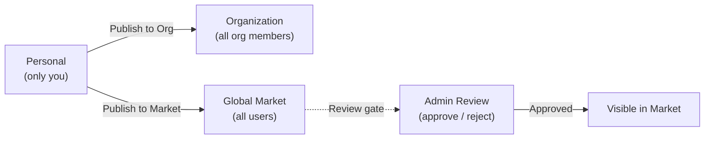

マーケットはFIM Oneの組み込みリソースマーケットプレイスです。共有リソースを2つのレベルに整理しています：

- **ソリューション** -- エンドツーエンドの機能を提供する高レベルのリソース：エージェント、スキル、およびワークフロー。
- **コンポーネント** -- ソリューションが依存する構成要素：コネクタおよびMCP サーバー。

スコープ（組織またはグローバルマーケット）で参照し、必要なものを見つけて購読し、FIM Oneを離れることなく使用を開始できます。

<Info>
マーケットは**プルモデル**を使用しています：リソースは参照して明示的に購読することで発見されます。自動参加やプッシュメカニズムはありません。インストールするものを選択でき、いつでもスコープでフィルタリングできます。
</Info>

## 何が見つかりますか？

### ソリューション

ソリューションは、サブスクライブしてすぐに活用できる、完全で即座に使用可能な機能です。

| リソース | カテゴリ | 提供内容 |
|---|---|---|
| **エージェント** | ソリューション | バインドされたツールと知識を備えた専門的なAIアシスタント |
| **スキル** | ソリューション | システムプロンプトに注入されたグローバルSOP、エージェントをオーケストレーション可能 |
| **ワークフロー** | ソリューション | スケジュール実行またはトリガー実行用のDAG自動化フロー |

### コンポーネント

コンポーネントは、ソリューションが構築される統合とツールサービスです。

| リソース | カテゴリ | 内容 |
|---|---|---|
| **コネクタ** | コンポーネント | エージェントツールとして利用可能なAPI/データベース統合 |
| **MCP Server** | コンポーネント | セッションに読み込まれるサードパーティツールサービス |

<Tip>
ナレッジベースはマーケットに独立してリストされていません。これらはナレッジベースを使用するソリューションにサブスクライブする際の内部依存関係として含まれます。
</Tip>

## スコープ

マーケットプレイスの上部にはスコープセレクターがあります。UI とサブスクリプションフローは両方のスコープで同じです。リソースの表示のみが変わります。

- **Organization** -- チームまたは会社内で共有されるリソース。ここに公開する場合、レビューは不要です。
- **Global Market** -- FIM One コミュニティ全体からのリソース。ここに公開する場合、管理者の承認が必要です。

いつでもスコープを切り替えて、利用可能なものを確認できます。

## サブスクライブするにはどうすればよいですか？

必要なリソースが見つかったら、**Subscribe** をクリックします。オンボーディングウィザードが必要なセットアップ（例えば、コネクタの API 認証情報の入力）を案内します。ウィザードをスキップして、後で認証情報を設定することもできます。

サブスクライブすると：

- **エージェント**がエージェントセレクタと `call_agent` カタログに表示されます。
- **スキル**がシステムプロンプトに自動的に注入されます。
- **ワークフロー**がワークフローリストに表示され、実行準備が整います。
- **コネクタ**がツールセットとエージェントバインディングドロップダウンに表示されます。
- **MCP サーバー**がそのツールをセッションに読み込みます。

ソリューションがコンポーネント（例えば、特定のコネクタを使用するエージェント）に依存している場合、これらの依存関係はサブスクリプション中に自動的に解決されます。必要な認証情報の入力を求められます。

サブスクリプションは即座に有効になります。パブリッシャーからの承認は不要です。いつでもサブスクリプションを解除して、リソースをワークスペースから削除できます。

## 公開方法

リソースの所有者は誰でも公開して、リソースを発見可能にすることができます。公開は Organization または Global Market のいずれかをターゲットにできます。

| ターゲット | 表示対象 | レビュー必須？ |
|---|---|---|
| **Organization** | Organization のすべてのメンバー | いいえ (Organization レベルの信頼) |
| **Global Market** | すべての認証済みユーザー | はい -- 管理者の承認が必須 |

Global Market への公開は常にレビューゲートを通ります。管理者は承認、却下 (注記付き)、またはリソースを保留中のままにすることができます。却下されたリソースは修正して再提出できます。

## 認証情報について

認証情報（APIキー、OAuthトークン、データベースパスワード）が必要なリソースにサブスクライブする場合、オンボーディングウィザードはサブスクリプション中にそれらを収集します。認証情報は安全に保存され、アカウントにスコープされます。他のユーザーはそれらを見ることができません。

リソースの設定ページから、いつでも認証情報を更新またはローテーションできます。

## 統合方法

内部的には、マーケットは**シャドウ組織**として実装されています。つまり、メンバーを持たない不可視のシステム組織です。グローバルマーケットに公開されたリソースは、このシャドウ組織内で `visibility: "org"` に設定されており、既存の可視性システムでそれらを自然に含めることができます。

つまり、マーケットはツールアセンブリパイプラインで**特別な処理コードが不要**です。個人リソースと組織リソースを読み込む同じ3階層の可視性フィルター（own -> org-shared -> subscribed）が、マーケットリソースも読み込みます。サブスクライブすると、サブスクリプションレコードが作成され、リソースが可視性フィルターに自動的に表示されます。

依存関係をバンドルするソリューション（例えば、バインドされたコネクタとナレッジベースを持つエージェント）の場合、サブスクリプションプロセスはそれらの依存関係を解決してプロビジョニングするため、すべてがそのまま機能します。

すべてのリソースタイプ全体で可視性フィルターがどのように機能するかについての技術的詳細は、[エージェント＆リソース検出 -- 可視性モデル](/architecture/agent-discovery#visibility-model)を参照してください。
