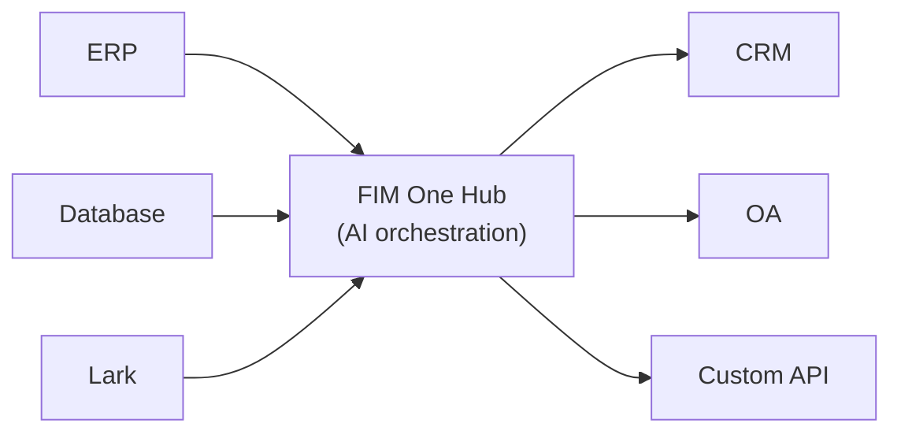

<Frame>
  
</Frame>

FIM Oneへようこそ。これはエンタープライズシステム全体で複雑なタスクを動的に計画・実行するエージェントを構築するためのAI駆動型フレームワークです。

  <a href="https://one.fim.ai/">ウェブサイト</a> · <a href="https://github.com/fim-ai/fim-one">GitHub</a> · <a href="https://discord.gg/z64czxdC7z">Discord</a> · <a href="https://x.com/FIM_One">Twitter</a> · <a href="https://www.producthunt.com/products/fim-one">Product Hunt</a>

<Tip>
  **☁️ FIM Oneをクラウドで試す — セットアップ不要。**
  マネージド版が [**cloud.fim.ai**](https://cloud.fim.ai/) で利用可能です。Docker不要、APIキー不要、サインインしてシステムの接続を開始するだけです。_アーリーアクセス — フィードバック歓迎。_
</Tip>## FIM One とは？

FIM One は、既存システムと連携する AI エージェントを構築するためのプロバイダー非依存の Python フレームワークです。ロジックを複製するよう求めるワークフロービルダーとは異なり、FIM One はシステムをプロアクティブに橋渡しします — データベースの読み取り、API の呼び出し、通知のプッシュ — すべて統一された AI インターフェースを通じて。

コアの洞察：**3 つの配信モード、1 つのエージェントコア**。## 3つの配信モード

| モード | 概要 | 配信方法 | ユースケース |
|------|-----------|----------|----------|
| **スタンドアロン** | 汎用AI アシスタント — 検索、コード、ナレッジベース | ポータル | チャット、コード実行、ナレッジベースQ&A |
| **コパイロット** | ホストシステムに組み込まれたAI — ユーザーの既存UIで並行して動作 | iframe / ウィジェット / 埋め込み | ERP ウェブUIの「Finance Copilot」 |
| **ハブ** | 中央クロスシステムオーケストレーション — すべてのシステムが接続 | ポータル / API | エージェントがERP をクエリ、OA を確認、Lark 経由で通知 |## ハブアーキテクチャ

ハブはコア差別化要因です。すべてのシステムがAIと出会う中央ポータルです：

各コネクタは標準化されたブリッジです。エージェントはSAPと通信しているのか、カスタムPostgreSQLデータベースと通信しているのかを知る必要も気にする必要もありません。データはシステムに留まり、FIM Oneはそれらを調整するAIレイヤーを提供します。## はじめに

次のセクションを参照して、FIM Oneのアーキテクチャを理解し、デプロイしてください:

- **[クイックスタート](/quickstart)** — Dockerまたはローカル開発でFIM Oneを数分で実行する
- **[実行モード](/concepts/execution-modes)** — Standalone、Copilot、Hubモードを詳しく理解する
- **[AIビルダー](/concepts/ai-builder)** — 自然言語を使用してコネクタとエージェントをAIで構築する
- **[コネクタアーキテクチャ](/architecture/connector-architecture)** — FIM OneがAIを通じてレガシーシステムを接続する方法
- **[哲学](/architecture/philosophy)** — 動的計画が厳密なワークフローと完全に自律的なエージェントの間の正しい中間地点である理由