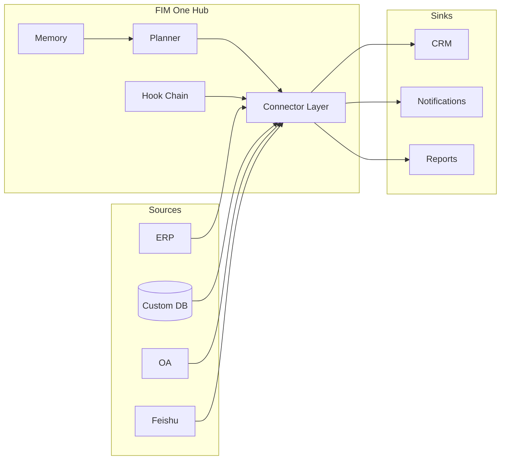

<Frame>
  
</Frame>

<Info>
  **Version 1.1 · April 2026.** このホワイトペーパーは、FIM Oneのアーキテクチャの論理的根拠、カテゴリーポジショニング、およびデプロイメントモデルについて説明しています。
  このドキュメントは、CTO、エンタープライズアーキテクト、AIプラットフォームリード、および既に運用しているシステムにAIをもたらす方法を評価している技術投資家を対象としています。
</Info>

## エグゼクティブサマリー

**データは決してあなたの境界を離れません。** この単一の文が、FIM Oneのあらゆる決定の背後にある第一次設計制約であり、新しいインフラストラクチャレイヤーが必要とされる理由です——別のiPaaSではなく、別の汎用エージェントでもありません。

ほとんどのエンタープライズは既に必要なシステムを持っています——ERP、CRM、OA、カスタムデータベース、内部API、業界別SaaS。彼らに欠けているのは、AIがベンダークラウドへのデータ移行なしに、また各ユースケースごとに6ヶ月のインテグレーションプロジェクトなしに、これらのシステムに**到達**する方法です。市場は大きく、急速に動いており、既に再編成されています：グローバルエンタープライズGenAIインフラストラクチャ支出は2025年に**米国180億ドルと予測され、前年比3.2倍で成長**しています（Menlo Ventures 2025）。中国はさらに速く動いています——エンタープライズAIエージェント支出は**120% CAGR（2023–2027）で、2027年までに¥65.5B**に達します（iResearch · CAICT 2025）。中央・国有企業は**大規模言語モデル調達の60%以上**を占めており、信創（Xinchuang）プライベートデプロイメントは厳しい制約です。

Gartnerはこのカテゴリを正式に「AI Agent Platform」（ドキュメント6300015、2025）に改名しました；CAICTの2025 Agentic AI Technology Reportではこれを「智能体平台」と呼んでいます；歴史的なiPaaSリーダーであるMuleSoftは、2025年のiPaaS Magic Quadrantで**リーダーからチャレンジャーに格下げ**されました。10年間エンタープライズインテグレーションを支配していたカテゴリは、リアルタイムで置き換わっています。

FIM Oneは新しいカテゴリのために構築されています。これは**グローバル×中国エンタープライズ向けのオールインワンエージェントプラットフォーム**です——プロバイダーに依存しないPythonフレームワークで、AIエージェントが既存システム全体にわたってタスクを動的に計画・実行し、グローバルSaaSと中国スタックを1つのエージェントコアで接続し、あなた自身の環境にデプロイされ、エンドツーエンドで監査可能です。1つのエージェントコア、3つのデリバリーモード：

| モード | 配置場所 | 典型的なデプロイメント |
|---|---|---|
| **スタンドアロン** | 独自のポータル | ナレッジQ&A、内部チャット、コードサンドボックス |
| **コパイロット** | ホストシステム内に埋め込み | ERPウェブUIの「Finance Copilot」 |
| **ハブ** | クロスシステム中央オーケストレーター | エージェントがERP照会、OA確認、Feishu経由で通知 |

本論文では、カテゴリが移動している理由、iPaaSが新しいワークロードを吸収できない理由、FIM Oneの内部がどのように見えるか、そして本番環境にそれを導入する方法を説明します。

## 1. The Problem: Enterprise AI Is an Alignment Problem

2025–2026年の公開AI議論はモデル能力——より長いコンテキスト、より優れた推論、より安いトークン——に支配されてきました。エンタープライズ内では、能力はめったにボトルネックになりません。ボトルネックは**AIがあなたのシステム内に手を持たない**ことです。

1万行のコードベースを読んで正しい修正を提案できるフロンティアLLMは、それ自体では以下のことができません：

- オンプレミスのSAPインスタンスから昨日の在庫数を取得する。
- 唯一の統合サーフェスがレガシーSOAP APIであるSaaS HRツールで休暇申請を承認する。
- Xinchuang準拠のERPに行を書き込む。その認証はOAuth2ではなくログインチケットサービスです。
- グループ独自の承認ルールを尊重しながら、Feishuグループに通知を送信する。

これらの各々は、一度解決された統合問題です。難しいのは、すべてのエンタープライズが数十のそのようなシステムを持っており、それぞれが独自の認証モデル、データ形状、および障害モードを持っていることです。それらをハードコーディングすると、脆いモノリスが得られます。LLMに実行時にそれらを発見するよう求めると、幻覚的なAPI呼び出しが得られます。

**不足しているプリミティブは整列されたサーフェスです。** モデルとシステム間の型付き、認証済み、発見可能なインターフェース——モデルに正確に何ができるか、各アクションのコストは何か、誰がそれを承認する必要があるか、結果がどのように見えるかを伝えるもの。そのプリミティブが、FIM Oneが**Connector**と呼ぶものです。

## 2. 既存のアプローチが不十分な理由

### 2.1 iPaaS とワークフロービルダー — 衰退するカテゴリ

iPaaS（MuleSoft、Boomi、Workato）と軽量ワークフローファミリー（n8n、Zapier、Dify、Coze）は、統合を**設計時**の問題として扱います。人間がノードのグラフを描き、フィールドレベルの粒度で配線し、グラフは実行時に決定論的に実行されます。統合が少なく安定していた時代には、このアプローチは機能していました。

AI駆動のエンタープライズオートメーションには対応できません。3つの複合的な理由があります：

1. **ロジックはすでにターゲットシステム内に存在します。** すべてのノードは、現在2つの場所で保守する必要があるAPI呼び出しの薄いラッパーです。
2. **人間は事前に計画を知っておく必要があります。** 「すべてのAPAC エンティティのQ1をクローズアウトする」のようなエンタープライズの質問はオープンエンドです。計画は実行時に生成される必要があり、デザイナーが描くものではありません。
3. **フィールドレベルのマッピングはスケール下で崩壊します。** 数十のシステムにまたがる数千ノードのグラフは保守不可能です。AI可読のアクションサーフェスがそれを完全に置き換えます。

このカテゴリは明らかに変わっています。Gartnerは2025年にこのスペースを「AI Agent Platform」として再分類しました（ドキュメント6300015）。CAICTも2025年の「Agentic AI Technology Report」で同じフレーミング（「智能体平台」）を採用しました。最も注目すべきことに、**10年間のiPaaS参照ベンダーであるMuleSoftは、Gartnerの2025年iPaaS Magic QuadrantでLeaderからChallengerにダウングレードされました**。同時に、2024年11月にリリースされたAnthropicのMCPプロトコルは、**15ヶ月で10,000以上のサーバーと月間9,700万のSDKダウンロードに成長しました**。シグナルは明確です。エンタープライズオートメーションの統合レイヤーが再構築されています。

### 2.2 汎用エージェント（Manus、AutoGPT、OpenAI Assistants）

汎用エージェントは、Webブラウジング、ドキュメント作成、スプレッドシート操作など、消費者向けおよび知識労働タスク向けに設計されています。VPNに接続したり、ERPに認証したり、セキュリティレビューに合格することはできません。エンタープライズシステムでラップされると、パイロット段階で終わるデモになってしまいます。

### 2.3 ベンダー組み込みAI（Feishu AI、SAP Joule、Salesforce Einstein）

ベンダーは独自のAIを独自の製品に組み込んでいます。問題は構造的です：**上流のベンダーには、独自のデータサイロを破壊するインセンティブがありません。** Feishu AIはERP データを認識しません。DingTalk AIは契約ステータスを認識しません。各ベンダーのAIは、そのベンダーが販売したものだけを認識します。クロスシステム作業では、これらは実用的ではありません。

### 2.4 自社開発とRPA

自社開発には長い開発期間と継続的な適応コストがかかります。RPAはUIを人間のように操作します——最も汎用的なアプローチですが、最も脆弱です。UIの変更のたびに破損し、認証プロンプトのたびに停止します。これはAPIの欠落に対する一時的な対処であり、AIを構築するための基盤ではありません。

FIM Oneはこれらすべてが残す隙間を埋めます。実システム上の型付きAPI、モデルによって計画され、エンタープライズによって管理され、エンタープライズ境界内にデプロイされます。

## 3. FIM One テーゼ

三つの信念が、すべての設計判断を形作っています。

**信念 1 — システムはすでに存在する。** エンタープライズに再構築を求めないでください。現状のままで対応します。すべてのコネクタはブリッジであり、置き換えではありません。データはデータソースを離れることはなく、エンタープライズの境界を越えることもありません。

**信念 2 — 能力よりも整合性が重要。** 整合性の取れたツールセットを備えた弱いモデルは、生の API に手探りで対応する強いモデルを上回ります。競争優位性は、エージェントの生の推論能力ではなく、コネクタライブラリ、その認証モデル、およびガバナンスレイヤーにあります。

**信念 3 — 動的計画は適切な中間地点。** 厳密なワークフロー（iPaaS、BPM）は実際のエンタープライズタスクには脆すぎます。完全に自律的なエージェント（AutoGPT、Manus）は本番環境には予測不可能すぎます。FIM One は実行時に計画しますが、型付きアクション空間内で行います——すべてのステップはコネクタ呼び出しであり、オープンエンドな LLM 独白ではありません。制限された自律性：`re-plan ≤ 3 | token budget | confirmation gate`。

### iPaaS を超えて

FIM One は意図的に iPaaS ではなく、その違いは表面的なものではありません。iPaaS はフィールドレベル、設計時、人間がモデル化、ベンダークラウドホスト型です。FIM One はアクションレベル、ランタイム、モデル計画型、エンタープライズホスト型です。

| 軸 | iPaaS | FIM One |
|---|---|---|
| 粒度 | フィールドマッピング | 型付きアクション |
| 計画時間 | 設計時 | ランタイム |
| モデル化する者 | 人間デザイナー | モデル |
| データの場所 | ベンダークラウド | お客様のサーバー |
| ガバナンス | 外部アドオン | 組み込みフック |
| カテゴリ（Gartner 2025） | iPaaS MQ（衰退中） | AI Agent Platform |

## 4. アーキテクチャの原則

<CardGroup cols={2}>
  <Card title="プロバイダー非依存" icon="shuffle">
    OpenAI互換のあらゆるLLM — OpenAI、Anthropic、DeepSeek、Qwen、ローカルOllama、Xinchuang認定モデル。モデルの選択はデプロイメント変数であり、アーキテクチャ上の制約ではありません。
  </Card>
  <Card title="プロトコルファースト" icon="network-wired">
    すべてのコネクターは型付きスキーマを公開します。エージェントはアクション、パラメーター、戻り値の型を認識します — 生のHTTPではなく。OpenAPI、MCP、直接データベース接続はすべてファーストクラスです。
  </Card>
  <Card title="3つの実行エンジン" icon="sitemap">
    **ReAct** は探索的なタスク用、**DAG** は構造化されたパイプライン用、**Workflow**（最大25ノード）は決定論的な人間設計のパイプライン用。1つのエージェントコアがタスクごとにエンジンを選択します。
  </Card>
  <Card title="スキーマファースト・ツール読み込み" icon="bolt">
    ツールスキーマは約30トークンで事前シード化され、エージェントはオンデマンドで拡張します。セッションごとのプロンプトオーバーヘッドは約80%削減され、プラットフォームはコンテキストウィンドウを圧迫することなく **10,000以上のAPI** にスケールします。
  </Card>
  <Card title="フック統治" icon="shield-halved">
    すべてのツール呼び出しは設定可能なフックチェーンを通過します：監査、ポリシー、人間参加型の承認。フックはLLMループの外で実行されます — 決定論的で監査可能です。
  </Card>
  <Card title="メモリ対応" icon="brain">
    短期会話、長期知識ベース、セッション間メモリはファーストクラスのプリミティブであり、後付けではありません。
  </Card>
</CardGroup>

## 5. 3つの配信モード — 1つのエージェントコア

同じプランナー、メモリ、コネクタライブラリが3つの異なるプロダクト形態を支えています。選択はコード分岐ではなく、デプロイメント決定です。

**スタンドアロン** — 自己完結型のポータル。購入者は、キュレーションされたナレッジベース上のチャットインターフェース、またはコードサンドボックス、または汎用アシスタントを求めています。ホストシステムは関与しません。内部IT ヘルプデスク、エンジニアリング生産性、カスタマーサポートKBに適しています。

**Copilot** — iframe、ウィジェット、または直接埋め込みを介して既存のホストシステム内に埋め込まれたエージェント。ホストが認証を処理し、Copilotはユーザーコンテキストを継承します。SAP Fiori内のFinance Copilot、Salesforce内のSales Copilot、内部開発者ポータル内のDevOps Copilotに適しています。

**Hub** — 中央オーケストレーション表面。すべての接続されたシステムがここで終端します。ユーザーはクロスシステムの質問をします。エージェントはシステム全体でプランと実行を行います。「すべてのAPAC エンティティのQ1をクローズアウト」、「更新を逃したすべての顧客を見つけてアウトリーチドラフトを作成」、「ゲートウェイと台帳間の昨日の支払いを調整」に適しています。

## 6. コネクタアライメントモデル

コネクタは認証戦略によって支えられた型付きアクションサーフェスです。FIM Oneは、エンタープライズシステムの大多数をカバーする3つの認証層を定義しています。

<AccordionGroup>
  <Accordion title="Tier 1 — データベースコネクタ（フルまたはベーシック）">
    リレーショナルまたはドキュメントデータベースへの直接接続。**フル**モードは読み取り専用ロールでゲートされた任意のSQLを智能体に公開し、**ベーシック**モードは事前登録されたパラメータ化クエリのみを公開します。**Xinchuang準拠データベース — Dameng (DM8)、KingbaseES、HighGo、GBase** — PostgreSQL、MySQL、Oracleと並んでネイティブサポート。中央/州有および規制対象の顧客は初日からコンプライアンス調達に対応します。
  </Accordion>
  <Accordion title="Tier 2 — OpenAPIコネクタ（ユーザーキー）">
    OpenAPI仕様を備えた任意のREST API。智能体は仕様を読み取り、エンドポイントを選択し、ログインしているユーザーのキーで呼び出します。モダンSaaS（Slack、Linear、GitHub）とドキュメント化されたよく整備された内部APIをカバーします。
  </Accordion>
  <Accordion title="Tier 3 — ログインチケット/レガシーコネクタ">
    特に中国市場で一般的なシステム向けで、OAuth2ではなくログインチケットサービスを介して認証します。コネクタはチケットライフサイクル（取得、更新、無効化）を管理し、通常の型付きサーフェスを上向きに提示します。この層は他のベンダーがスキップするシステムのロックを解除します。
  </Accordion>
</AccordionGroup>

各コネクタは**通道/統合の二重性**も宣言します。同じ基盤となるシステムは、*通道*（通知シンク、審批サーフェス）と*統合*（データソース、アクションターゲット）の両方として表示できます。Feishuは通知通道とグループチャットデータソースの両方です。DingTalkとWeComも同じパターンに従います。

## 7. 信頼できるエンタープライズAI — 3つの柱

エンタープライズAIが本番環境で失敗するのは、モデルが間違っているからではなく、組織がそれが正しいことを証明できないからです。FIM Oneは信頼をアーキテクチャとして扱い、3つの柱で表現しています。

<CardGroup cols={3}>
  <Card title="すべての結論は引用される" icon="paperclip">
    RAG検索と引用チェーンにより、智能体は特定のドキュメント内の特定の段落を参照して、すべての主張をサポートできます。結論は追跡可能で監査可能です。ブラックボックス出力はありません。
  </Card>
  <Card title="すべての書き込みは確認される" icon="hand">
    書き込み操作は実行前に一時停止され、人間の承認を待ちます——門户内でインラインで、またはFeishu審批グループ経由で帯域外で。フック チェーンはアーキテクチャ上の制約であり、ポリシーの提案ではありません。バイパスすることはできません。
  </Card>
  <Card title="すべてのリリースは測定される" icon="chart-bar">
    データセット駆動の評価により、各リリース前に品質を定量化します。すべての反復は測定可能です。エンタープライズ調達は約束ではなく証拠を得られます。
  </Card>
</CardGroup>

これをサポートするために、すべての智能体実行は構造化トレースを発行します：計画、工具呼び出し、引数、観察、承認、最終回答。トレースは監査の単位です。認証情報はFernet暗号化（AES-128-CBC + HMAC-SHA256）を使用します。完全な監査ログは保存およびエクスポート可能です。

オペレーターが工具呼び出しを拒否した場合、智能体は停止します——言い換えて再試行することはありません。拒否はポリシー決定であり、回復するエラーではありません。

## 8. デプロイメントとビジネスモデル

FIM Oneは寛容なライセンス（FIM-SAL）の下でオープンソースであり、3つのデプロイメント形態と3つのエディションティアを提供しています。

<CardGroup cols={3}>
  <Card title="Community" icon="code">
    永久無料。セルフホスト。開発者と評価チーム向け。
  </Card>
  <Card title="Cloud" icon="cloud">
    cloud.fim.aiでのWuzhi ホスト。ユーザーあたり + コネクタあたりのサブスクリプション。シンガポール拠点が海外契約を担当。
  </Card>
  <Card title="Enterprise" icon="briefcase">
    プライベートデプロイメント、カスタム価格設定、コンプライアンスツール、専任技術サポート。大規模企業および政府・国営企業向け。
  </Card>
</CardGroup>

コードベースは1,590以上のモジュールにわたる約170,000行のPythonで構成されており、約100のテストファイルと6つのUI言語の組み込みサポートを備えています。ソースはFIM-SALの下でオープンであり、企業は自身でセキュリティを監査できます。支配的な実行時コストはインフラストラクチャではなくLLMトークンです。プロバイダに依存しないアーキテクチャにより、フロンティアが価格を下げるにつれて移行なしでメリットを享受できます。

## 9. デリバリーパス

本番環境へのデプロイメントは、リスクを限定し、価値実現までの時間を短縮する3段階のパスに従います。

| ステップ | タイムライン | 実施内容 |
|---|---|---|
| **1. PoC** | 2週間 | 1～2の代表的なシナリオ（財務監査、契約レビュー、データレポート）を実データで完全に実施。初版は7日以内、検証レポートは14日以内に完成。 |
| **2. パイロット** | 1～2ヶ月 | お客様のサーバーへのプライベートデプロイメント。最初の3～5コネクタ（ERP / OA / Feishu / DingTalk / データベース）。1つのビジネスラインをカバー。監査と承認のベースラインを確立。 |
| **3. スケール** | 3～6ヶ月 | より多くのビジネスラインとコネクタへの拡張。業界別スキルパックの蓄積。社内管理者のトレーニング。運用ランブックとSLAの納品。 |

8つの業界別プリビルトソリューションテンプレートが、最も一般的なシナリオをカバーしています：財務監査、契約レビュー、データレポート、調達照合、顧客支払い回収、コンプライアンススクリーニング、HR スクリーニング、オペレーション オンコール。

## 10. ここに向かう方向

**近期——コネクタの深化。** 中国市場向けのTier-3レガシーコネクタの追加、Xinchuang認証の深化、OpenAPI仕様またはデータベーススキーマのスクリーンショットから数分で動作するコネクタを生成するAI Builderの実装。

**近期——ガバナンスの深化。** より豊富なRBAC、4段階のコネクタ権限、独立したIdP、デフォルトでのSSO、SOC 2およびISO 27001への対応。

**中期——エコシステム。** クラウドSaaS、コネクタマーケットプレイス、業界別ソリューションパック——サードパーティが構築する基盤となるインフラストラクチャレイヤー。

長期的な見通しは、エンタープライズAIの形態がCLIよりもはるかにHubに近くなるということです。ナレッジワーカーは10個のAIアシスタントをインストールするのではなく、自社のHubに問い合わせ、Hubが答えを持つシステムにどのようにアクセスするかを知っています。FIM Oneはこのハブを構築しています。

## 11. 付録 — さらに詳しく

- **[System Overview](/architecture/system-overview)** — コンポーネントレベルのアーキテクチャ。
- **[Connector Architecture](/architecture/connector-architecture)** — コネクタの契約、ライフサイクル、および拡張モデル。
- **[Design Philosophy](/architecture/design-philosophy)** — 各コア トレードオフを行った理由。
- **[Hook System](/architecture/hook-system)** — ポリシー、承認、および監査の詳細。
- **[Competitive Landscape](/strategy/competitive-landscape)** — カテゴリーのポジショニングおよび競合比較。
- **[Quickstart](/quickstart)** — FIM One をノートパソコンで 10 分以内に実行します。

<Tip>
  ご質問、修正、または商業的なお問い合わせ: hi@fim.ai · [Discord](https://discord.gg/z64czxdC7z) · [GitHub](https://github.com/fim-ai/fim-one)
</Tip>
