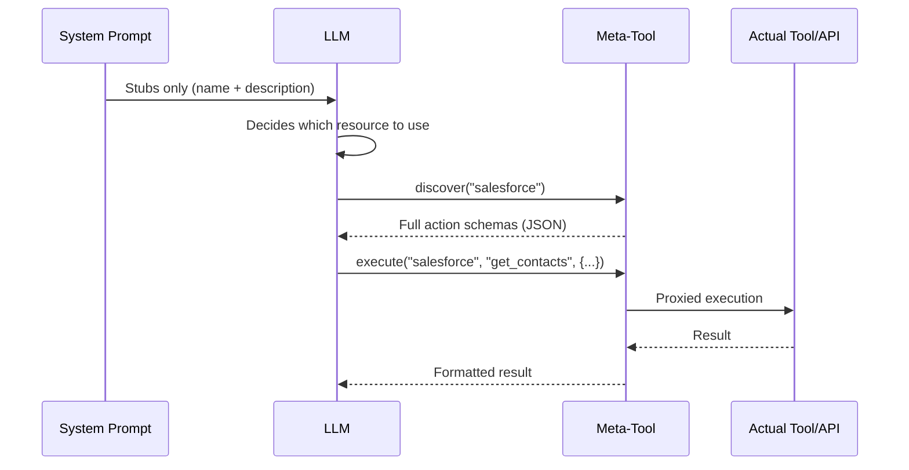
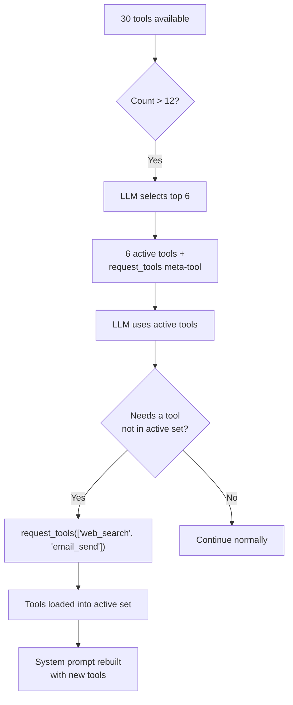

## 문제

LLM은 두 가지 통화로 컨텍스트 비용을 지불합니다: 토큰과 어텐션입니다. 시스템 프롬프트에 주입된 모든 도구 정의는 둘 다의 비용이 듭니다. 단일 MCP 서버는 90개 이상의 도구를 노출할 수 있습니다. 각각 20개의 작업을 가진 5개의 API 커넥터는 100개의 도구 정의를 생성합니다. 각각 30개의 테이블을 가진 3개의 데이터베이스 커넥터는 또 다른 90개의 스키마 설명을 생성합니다. 사용자가 한 글자도 입력하기 전에 시스템 프롬프트는 50~100KB의 컨텍스트를 소비할 수 있습니다 -- 128K 모델의 예산의 절반입니다.

비용은 단순히 토큰만이 아닙니다. 연구와 실무는 **관련 없는 컨텍스트가 증가함에 따라 LLM 정확도가 저하된다**는 것을 일관되게 보여줍니다. 시스템 프롬프트에 80개의 도구 정의를 가진 에이전트는 6개를 가진 에이전트보다 도구 선택에서 측정 가능하게 더 나쁜 성능을 보입니다. 모델은 절대 사용하지 않을 도구 스키마에 어텐션을 소비하여 중요한 도구와 지시사항에 대한 초점을 희석시킵니다.

순진한 해결책 -- 모든 것을 주입하고 모델이 정렬하도록 하기 -- 는 확장되지 않습니다. FIM One은 반대의 접근 방식을 취합니다: **LLM이 결정을 내리기 위해 필요한 최소한의 것을 보여주고, 더 필요할 때 더 많은 것을 요청하도록 하기.**

## 패턴

점진적 공개는 모든 리소스 유형에 걸쳐 2계층 아키텍처를 따릅니다:

1. **계층 1 -- 시스템 프롬프트의 스텁.** 경량 요약: 이름, 짧은 설명, 그리고 LLM이 더 많은 정보가 필요한지 결정할 수 있도록 충분한 메타데이터(작업 수, 테이블 수, 도구 수).

2. **계층 2 -- 요청 시 전체 세부 정보.** LLM이 메타 도구를 호출하여 완전한 스키마, 매개변수 및 실행 기능을 검색합니다. 전체 세부 정보는 도구 결과 메시지로 대화에 입력되며 -- 시스템 프롬프트에 영구적으로 차지하지 않고 해당 턴으로 범위가 지정됩니다.



핵심 통찰: **전체 도구 스키마는 대화 범위이지, 프롬프트 범위가 아닙니다.** 이들은 컨텍스트 관리 시스템이 이후 턴에서 요약하거나 자를 수 있는 도구 결과 메시지로 나타납니다. 반대로 시스템 프롬프트 콘텐츠는 전체 대화에 걸쳐 전체 크기로 유지됩니다.

## 다섯 가지 공개 메커니즘

FIM One은 다섯 가지 리소스 유형에 걸쳐 점진적 공개를 균일하게 적용합니다. 각각은 동일한 2단계 패턴을 사용하지만 의미론에 맞게 조정된 메타 도구를 사용합니다.

| 리소스 | 메타 도구 | 스텁 표시 | 온디맨드 반환 | 구성 변수 | 기본값 |
|---|---|---|---|---|---|
| Skills | `read_skill` | 이름 + 설명 (120자) | 전체 SOP 콘텐츠 + 임베드된 스크립트 | `SKILL_TOOL_MODE` | `progressive` |
| API Connectors | `connector` | 커넥터 이름 + 작업 목록 | 매개변수가 포함된 전체 작업 스키마 | `CONNECTOR_TOOL_MODE` | `progressive` |
| Database Connectors | `database` | DB 이름 + 테이블 이름 + 개수 | 열 스키마, SQL 쿼리 실행 | `DATABASE_TOOL_MODE` | `progressive` |
| MCP Servers | `mcp` | 서버 이름 + 도구 목록 | 전체 도구 스키마 + 호출 | `MCP_TOOL_MODE` | `progressive` |
| Built-in Tools | `request_tools` | 컴팩트 카탈로그 (이름 + 80자 설명) | 세션에 주입된 전체 도구 스키마 | _(자동)_ | >12개 도구일 때 자동 |

### 스킬 -- `read_skill`

**LLM이 처음 보는 것:**

```
## Available Skills
Call read_skill(name) to load full content before executing any of these:
- Customer Complaint SOP: Handle escalations per company policy...
- Refund Processing: Step-by-step refund workflow with approval gates...
```

각 스텁은 대략 30개의 토큰입니다 -- 전체 스킬 콘텐츠에서 잘린 이름과 120자 설명입니다.

**필요할 때 발생하는 일:** LLM이 `read_skill("Customer Complaint SOP")`를 호출하고 완전한 SOP 텍스트를 받습니다 -- 잠재적으로 수천 개의 토큰의 단계별 지침, 의사결정 트리, 그리고 임베드된 스크립트입니다. 이 콘텐츠는 시스템 프롬프트 텍스트가 아닌 도구 결과로 입력되므로, 이후 턴에서 일반적인 컨텍스트 관리(요약, 잘라내기)의 대상이 됩니다.

**레거시 모드:** `SKILL_TOOL_MODE=inline`은 전체 스킬 콘텐츠를 시스템 프롬프트에 직접 임베드합니다. 스킬이 적고 작을 때 적합합니다 -- 하지만 확장성이 떨어집니다.

**컨텍스트 절감:** 평균 2,000개의 토큰을 가진 10개의 스킬이 있는 배포는 프로그레시브 모드(스텁만)에서 ~300개의 토큰을 소비하는 반면 인라인 모드에서는 ~20,000개의 토큰을 소비합니다. 이는 지속적인 컨텍스트 비용에서 98%의 감소입니다.

### API 커넥터 -- `connector`

**LLM이 초기에 보는 내용:**

```
Interact with external services. Available connectors:
  - salesforce: CRM system -- actions: get_contacts, create_lead, update_opportunity
  - jira: Project management -- actions: create_issue, get_issue, search_issues

Subcommands:
  discover <name> -- list actions with full parameter schemas
  execute <name> <action> {"param": "value"} -- run an action
```

각 커넥터 스텁은 액션 이름을 나열하지만 매개변수 스키마는 나열하지 않습니다. LLM은 *어떤* 액션이 존재하는지는 알지만 *어떻게* 호출하는지는 모릅니다 -- 이것이 커넥터 사용 여부를 결정하기 위한 정확한 수준의 세부 정보입니다.

**필요에 따라:** `connector("discover", "salesforce")`는 HTTP 메서드, URL 경로, 매개변수 JSON 스키마 및 요청 본문 템플릿을 포함한 전체 액션 스키마를 반환합니다. `connector("execute", "salesforce", "get_contacts", {"limit": 10})`은 전체 인증 주입 및 감사 로깅과 함께 `ConnectorToolAdapter`를 통해 실행을 프록시합니다.

**레거시 모드:** `CONNECTOR_TOOL_MODE=legacy`는 각 액션을 별도의 도구로 등록합니다(`salesforce__get_contacts`, `salesforce__create_lead` 등). 20개의 액션을 가진 커넥터는 시스템 프롬프트에서 20개의 도구 정의가 됩니다.

**컨텍스트 절약:** 15개의 액션을 가진 커넥터는 스텁의 ~50 토큰 대 전체 스키마의 ~3,000 토큰을 생성합니다. 5개의 커넥터: 점진적 ~250 토큰 대 레거시 ~15,000 토큰입니다.

### 데이터베이스 커넥터 -- `database`

**LLM이 초기에 보는 것:**

```
Query connected databases. Available databases:
  - hr_postgres: HR system (12 tables: employees, departments, salaries ...)
  - analytics_db: Analytics warehouse (45 tables: events, sessions, users ...)

Subcommands:
  list_tables <database> -- table names, descriptions, column counts
  discover <database> [table] -- full column schemas for one or all tables
  query <database> <sql> -- execute a SQL query
```

데이터베이스 스텁에는 테이블 이름(최대 10개)과 개수가 포함되어 있어서, LLM이 열 스키마를 로드하지 않고도 어느 데이터베이스를 쿼리할지 결정할 수 있을 만큼의 정보를 제공합니다.

**필요에 따라 수행되는 작업:** 세 개의 하위 명령이 자연스러운 검색 흐름을 형성합니다:

1. `database("list_tables", "hr_postgres")` -- 모든 테이블 이름, 설명 및 열 개수를 반환합니다.
2. `database("discover", "hr_postgres", table="employees")` -- 전체 열 스키마(이름, 유형, nullable, 기본 키, 설명)를 반환합니다.
3. `database("query", "hr_postgres", sql="SELECT ...")` -- 안전 검사 및 행 제한이 적용된 검증된 SQL 쿼리를 실행합니다.

3단계 흐름은 개발자가 새로운 데이터베이스를 탐색하는 방식을 반영합니다: 테이블 찾아보기, 스키마 검사, 그 다음 쿼리 실행. LLM도 자연스럽게 같은 패턴을 따릅니다.

**레거시 모드:** `DATABASE_TOOL_MODE=legacy`는 데이터베이스당 3개의 도구(`{db}__list_tables`, `{db}__describe_table`, `{db}__query`)를 등록합니다. 5개의 데이터베이스 커넥터가 있으면 1개 대신 15개의 도구 정의가 생깁니다.

**컨텍스트 절감:** 30개의 테이블과 200개의 열이 있는 데이터베이스는 스텁으로 약 80개 토큰 대 전체 스키마로 약 5,000개 토큰을 생성합니다. 절감 효과는 여러 데이터베이스에서 누적됩니다.

### MCP 서버 -- `mcp`

**LLM이 초기에 보는 것:**

```
Interact with MCP servers. Available servers:
  - github: GitHub (35 tools: create_issue, list_repos, get_pull_request ...)
  - slack: Slack (12 tools: send_message, list_channels, upload_file ...)

Subcommands:
  discover <server> -- list tools with full parameter schemas
  call <server> <tool> {"param": "value"} -- invoke an MCP tool
```

MCP 서버는 점진적 공개의 가장 극적인 사례입니다. GitHub MCP 서버는 35개 이상의 도구를 노출합니다. 파일 시스템 서버는 20개 이상을 노출합니다. 점진적 공개가 없으면 3개의 MCP 서버를 연결하면 시스템 프롬프트에 70개 이상의 도구 정의가 주입될 수 있습니다 -- 각각 전체 JSON Schema 매개변수를 포함합니다.

**필요에 따라 발생하는 것:** `mcp("discover", "github")`는 매개변수 스키마와 함께 완전한 도구 카탈로그를 반환합니다. `mcp("call", "github", "create_issue", {"title": "Bug report", "body": "..."})`는 저장된 `MCPToolAdapter`에 위임하며, 이는 MCP 서버 프로세스와 통신합니다.

**레거시 모드:** `MCP_TOOL_MODE=legacy`는 각 MCP 도구를 별도의 도구(`github__create_issue`, `github__list_repos` 등)로 등록합니다. 이는 쉽게 도구 선택 임계값을 초과하고 불필요한 선택 단계를 트리거할 수 있습니다.

**컨텍스트 절감:** 여기서의 절감은 극적입니다. GitHub MCP 서버의 35개 도구는 스키마의 10,000개 이상의 토큰을 소비할 수 있습니다. 점진적 모드에서 스텁은 약 100개 토큰의 비용이 듭니다. 사용자가 해당 대화에서 GitHub이 필요하지 않으면 이 10,000개 토큰은 절대 사용되지 않습니다.

### 기본 제공 도구 -- `request_tools`

다섯 번째 메커니즘은 다른 네 가지와 아키텍처적으로 다릅니다. 리소스 타입을 메타 도구 뒤에 통합하지 않습니다. 대신 **도구 선택 병목 현상**을 해결합니다 -- 에이전트가 12개 이상의 도구를 사용할 수 있을 때 발생하는 상황입니다.

**작동 방식:** 전체 도구 개수가 `REACT_TOOL_SELECTION_THRESHOLD`(기본값: 12)를 초과하면, ReAct 엔진은 현재 쿼리에 가장 관련성이 높은 상위 6개 도구를 선택하기 위해 경량 LLM 호출을 실행합니다. 나머지 도구는 전체 레지스트리에 저장됩니다. `request_tools` 메타 도구가 자동으로 등록되며, 로드되지 않은 모든 도구를 간단한 카탈로그(이름 + 80자 설명)로 나열합니다.



**LLM이 처음 보는 것:**

```
Load additional tools into the current session.
Available tools not yet loaded:
- web_search: Search the web for current information and return relevant results...
- email_send: Send an email to one or more recipients with subject, body, and opt...
- python_exec: Execute Python code in a sandboxed environment and return the output...
```

**필요에 따라 발생하는 일:** `request_tools(tool_names=["web_search", "email_send"])`는 전체 레지스트리에서 해당 도구를 활성 레지스트리로 복사합니다. 다음 반복에서 시스템 프롬프트가 재구성되므로 LLM은 전체 스키마를 볼 수 있습니다. 이것은 부작용입니다 -- 도구가 대화 중간에 활성 도구 집합을 변경합니다.

**환경 변수 없음:** 이 메커니즘은 도구 선택이 집합을 필터링할 때 자동으로 활성화됩니다. `REQUEST_TOOLS_MODE` 환경 변수는 없습니다. 도구 선택을 완전히 비활성화하려면 `REACT_TOOL_SELECTION_THRESHOLD`를 매우 높은 숫자로 설정하세요.

**컨텍스트 절감:** 절감액은 사용 가능한 도구의 개수와 선택이 선택하는 도구의 개수에 따라 달라집니다. 30개의 도구를 사용할 수 있지만 활성 스키마 6개만 보는 에이전트 + `request_tools` 카탈로그는 대략 60~70%의 도구 스키마 컨텍스트를 절감합니다.

## 도구 조립 파이프라인에서의 역할

[System Overview](/architecture/system-overview)는 요청당 8단계 도구 조립 파이프라인을 설명합니다. 점진적 공개는 여러 지점에서 작동합니다:

| 파이프라인 단계 | 점진적 공개 역할 |
|---|---|
| **1. 기본 검색** | 영향 없음 -- 기본 제공 도구는 정상적으로 로드됨 |
| **2. 에이전트 카테고리 필터** | 영향 없음 -- 카테고리 필터링은 모드와 관계없이 적용됨 |
| **3. KB 주입** | 영향 없음 -- KB 도구는 자연스럽게 경량임 (1--2개 도구) |
| **4. 커넥터 로딩** | `ConnectorMetaTool`은 모든 API 커넥터를 통합함; `DatabaseMetaTool`은 모든 DB 커넥터를 통합함 |
| **5. MCP 로딩** | `MCPServerMetaTool`은 모든 MCP 서버를 하나의 도구로 통합함 |
| **6. 스킬 주입** | `ReadSkillTool`은 시스템 프롬프트에서 전체 콘텐츠를 간단한 스텁으로 대체함 |
| **7. CallAgent 등록** | 영향 없음 -- `call_agent`는 이미 카탈로그가 있는 단일 도구임 |
| **8. 런타임 선택** | `request_tools` 메타 도구는 선택이 집합을 필터링할 때 등록됨 |

순 효과: 4--6단계는 각각 도구 개수를 1개(또는 작은 상수)로 줄이고, 8단계는 선택 단계에서 놓친 항목을 동적으로 로드하기 위한 안전장치를 추가합니다. 레거시 모드에서 50개 이상의 도구를 가질 수 있는 Hub 에이전트는 점진적 모드에서 8--10개를 제시할 수 있습니다 -- 선택 임계값 이하입니다.

## 구성

네 개의 환경 변수가 리소스 유형별로 점진적 공개를 제어합니다:

| 변수 | 값 | 기본값 | 효과 |
|---|---|---|---|
| `SKILL_TOOL_MODE` | `progressive` / `inline` | `progressive` | 스킬: 스텁 + `read_skill` vs. 시스템 프롬프트의 전체 콘텐츠 |
| `CONNECTOR_TOOL_MODE` | `progressive` / `legacy` | `progressive` | API 커넥터: 단일 `connector` 메타 도구 vs. 개별 액션 도구 |
| `DATABASE_TOOL_MODE` | `progressive` / `legacy` | `progressive` | DB 커넥터: 단일 `database` 메타 도구 vs. 데이터베이스당 3개 도구 |
| `MCP_TOOL_MODE` | `progressive` / `legacy` | `progressive` | MCP 서버: 단일 `mcp` 메타 도구 vs. 개별 서버 도구 |

**에이전트 수준 재정의.** 각 환경 변수는 `model_config_json` 필드를 통해 에이전트별로 재정의할 수 있습니다:

```json
{
  "model_config_json": {
    "skill_tool_mode": "inline",
    "connector_tool_mode": "legacy",
    "database_tool_mode": "progressive",
    "mcp_tool_mode": "progressive"
  }
}
```

**우선순위:** 에이전트 구성 > 환경 변수 > 기본값.

이는 전역적으로 `progressive`를 실행하고(기본값) 특정 에이전트에 대해 선택적으로 재정의할 수 있음을 의미합니다. 단일 소규모 스킬을 가진 에이전트는 `inline` 모드를 사용할 수 있습니다. LLM이 모든 커넥터 액션을 미리 볼 필요가 있는 에이전트(예: 메타 도구를 안정적으로 호출하지 않는 미세 조정된 모델)는 `legacy` 모드를 사용할 수 있습니다.

**`request_tools`는 구성이 없습니다.** 도구 선택이 필터링된 부분 집합을 생성할 때 자동으로 활성화됩니다. 임계값은 `REACT_TOOL_SELECTION_THRESHOLD`(기본값: 12)로 제어되고 최대 선택 개수는 `REACT_TOOL_SELECTION_MAX`(기본값: 6)로 제어됩니다.

## 설계 결정

### 명시적(LLM 기반) vs 암시적(프레임워크 기반)인 이유

대안적 설계는 프레임워크가 휴리스틱을 기반으로 도구 스키마를 자동으로 확장하는 것입니다. 예를 들어, 사용자의 쿼리가 어떤 커넥터에 관한 것인지 감지하고 LLM이 프롬프트를 보기 전에 해당 스키마를 주입하는 방식입니다. FIM One은 세 가지 이유로 LLM 기반 접근 방식을 의도적으로 선택했습니다:

1. **LLM이 휴리스틱보다 의도 감지에 더 능합니다.** "고객이 미해결 티켓을 가지고 있는지 확인하고 프로필을 업데이트하세요"와 같은 쿼리는 두 개의 커넥터를 포함합니다. 키워드 기반 휴리스틱 매칭은 취약하지만, LLM은 자연스럽게 둘 다 식별합니다.

2. **투명성.** LLM이 `connector("discover", "jira")`를 호출할 때, 해당 작업이 도구 추적에 나타납니다. 사용자(및 디버깅 중인 개발자)는 정확히 어떤 스키마가 로드되었는지, 언제 로드되었는지 볼 수 있습니다. 암시적 확장은 보이지 않습니다.

3. **컨텍스트 효율성.** 프레임워크는 LLM이 필요로 할 커넥터 내의 어떤 작업인지 알 수 없습니다. 커넥터의 모든 작업을 확장하면 관련 없는 작업에 토큰을 낭비합니다. LLM은 먼저 작업 이름을 보고(스텁을 통해), 그 다음 특정 작업의 스키마만 요청합니다. 순수한 2단계 공개입니다.

### 리소스별 메타-도구를 사용하는 이유는?

단일 `discover_resource(type, name)` 도구가 더 간단하게 구현될 수 있지만 LLM에는 더 나쁩니다. 리소스별 메타-도구는 다음을 제공합니다:

- **타입이 지정된 매개변수.** `connector`는 `subcommand`, `connector`, `action`, `parameters`를 가집니다. `database`는 `subcommand`, `database`, `table`, `sql`을 가집니다. 매개변수 스키마는 LLM에게 정확히 무엇이 예상되는지 알려줍니다.
- **열거형 제약.** 각 메타-도구는 유효한 이름(커넥터 이름, 데이터베이스 이름, 서버 이름)을 스키마의 열거형 값으로 나열합니다. LLM은 커넥터 이름을 만들어낼 수 없습니다.
- **카테고리 의미론.** `connector` 도구는 카테고리 `connector`를 가지고, `database`는 카테고리 `database`를 가지고, `mcp`는 카테고리 `mcp`를 가집니다. 이는 에이전트 카테고리 필터링으로 전달됩니다 -- `connector` 카테고리만으로 구성된 에이전트는 `database` 또는 `mcp` 메타-도구를 볼 수 없습니다.

### 왜 프로그레시브 모드와 레거시 모드 둘 다 필요한가?

모든 LLM이 메타 도구를 동일하게 잘 처리하지는 못합니다. 더 작거나 미세 조정된 모델은 2단계 발견-후-실행 패턴에 어려움을 겪을 수 있습니다. 레거시 모드는 모든 작업이 전체 스키마가 표시되는 독립 실행형 도구인 직접적인 폴백을 제공합니다 -- 메타 도구 간접 처리가 필요하지 않습니다.

이중 모드 설계는 마이그레이션도 지원합니다. 기존 배포는 단일 환경 변수를 변경하여 한 번에 하나의 리소스 유형을 테스트하면서 점진적으로 프로그레시브 모드로 전환할 수 있습니다.
