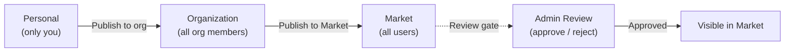

마켓은 FIM One의 내장 리소스 마켓플레이스입니다. 사용자가 다른 사람이 게시한 에이전트, 커넥터, 지식 베이스, MCP 서버, 스킬 및 워크플로우를 찾아보고 구독할 수 있는 공간입니다.

<Info>
마켓은 **풀 모델**을 사용합니다. 리소스는 검색을 통해 발견되고 명시적으로 구독됩니다. 자동 가입이나 푸시 메커니즘은 없으며, 사용자가 설치할 항목을 선택합니다.
</Info>

## 작동 방식

### 게시

모든 리소스 소유자는 자신의 리소스를 게시하여 검색 가능하게 만들 수 있습니다:



| 가시성 | 볼 수 있는 사람 | 검토 필요? |
|---|---|---|
| **개인** | 작성자만 | 아니오 |
| **조직** | 작성자의 조직의 모든 멤버 | 아니오 (조직 수준 신뢰) |
| **마켓(전역)** | 모든 인증된 사용자 | 예 — 관리자 승인 필수 |

마켓에 게시하는 것은 항상 검토 게이트를 거칩니다. 관리자는 승인, 거부(메모 포함), 또는 리소스를 보류 상태로 둘 수 있습니다. 거부된 리소스는 수정 후 재제출할 수 있습니다.

### 구독

마켓에서 리소스를 찾으면 구독하여 워크스페이스에서 사용할 수 있습니다:

- **구독한 커넥터**는 도구 집합(자동 발견 모드)과 에이전트 바인딩 드롭다운에 나타납니다
- **구독한 에이전트**는 에이전트 선택기와 `call_agent` 카탈로그에 나타납니다
- **구독한 스킬**은 시스템 프롬프트에 주입됩니다(동일한 점진적/인라인 모드 따름)
- **구독한 지식 베이스**는 검색에 사용 가능합니다
- **구독한 MCP 서버**는 세션에 도구를 로드합니다
- **구독한 워크플로우**는 실행을 위해 워크플로우 목록에 나타납니다

구독은 즉시 적용되며 게시자의 승인이 필요하지 않습니다. 언제든지 구독을 취소하여 워크스페이스에서 리소스를 제거할 수 있습니다.

### Shadow Org

내부적으로 Market은 **shadow organization** — 멤버를 보유하지 않는 보이지 않는 시스템 org(`MARKET_ORG_ID`)로 구현됩니다. Market에 게시된 리소스는 이 shadow org 내에서 `visibility: "org"`로 설정되므로, 기존 `resolve_visibility()` 쿼리가 자연스럽게 이들을 포함할 수 있습니다.

이는 Market이 도구 어셈블리 파이프라인에서 **특수한 경우의 코드가 전혀 필요하지 않음**을 의미합니다. 개인 및 org 리소스를 로드하는 동일한 3계층 가시성 필터가 Market 리소스도 로드합니다:

```python
conditions = [
    model.user_id == user_id,           # own resources
    and_(model.visibility == "org",     # org-shared (includes Market shadow org)
         model.org_id.in_(user_org_ids)),
    model.id.in_(subscribed_ids),       # Market-subscribed
]
```

`subscribed_ids` 절이 Market을 작동하게 하는 것입니다 — 구독하면 `ResourceSubscription` 행이 생성되고, 리소스는 해당 세 번째 조건을 통해 가시성 필터에 나타납니다.

## 리소스 유형

6가지 리소스 유형 모두 전체 마켓플레이스 라이프사이클을 지원합니다:

| 리소스 | 게시 | 구독 | 제공 내용 |
|---|---|---|---|
| **에이전트** | ✅ | ✅ | 선택기 및 `call_agent` 카탈로그의 전문 에이전트 |
| **커넥터** | ✅ | ✅ | 도구로 사용 가능한 API/데이터베이스 브릿지 |
| **지식 베이스** | ✅ | ✅ | RAG 쿼리의 검색 소스 |
| **MCP 서버** | ✅ | ✅ | 세션에 로드된 타사 도구 |
| **스킬** | ✅ | ✅ | 시스템 프롬프트에 주입된 글로벌 SOP |
| **워크플로우** | ✅ | ✅ | 워크플로우 목록의 고정 프로세스 자동화 |

## API

| 엔드포인트 | 설명 |
|----------|-------------|
| `GET /api/market` | 게시된 리소스 탐색. `?resource_type=`, `?page=`, `?size=` 지원 |
| `POST /api/market/subscribe` | 리소스 구독 (유형 + ID 기준) |
| `DELETE /api/market/unsubscribe` | 리소스 구독 취소 |
| `GET /api/market/subscriptions` | 현재 구독 목록 조회 |

각 리소스 유형에는 게시 제어를 위한 `POST /api/{type}/{id}/publish` 및 `POST /api/{type}/{id}/unpublish` 엔드포인트도 있습니다.
