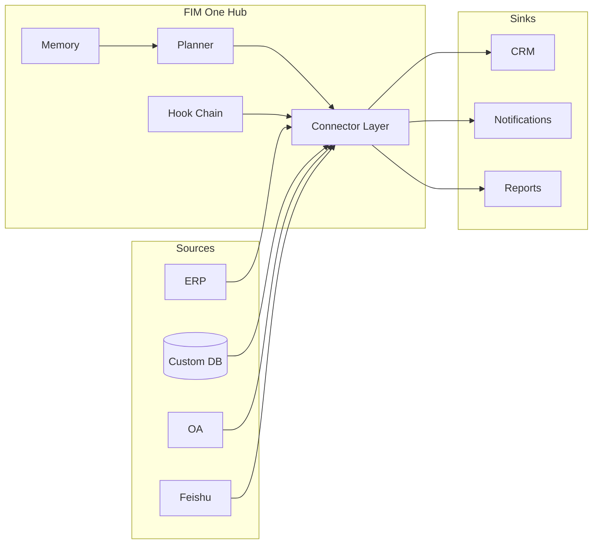

<Frame>
  
</Frame>

<Info>
  **버전 1.1 · 2026년 4월.** 이 백서는 FIM One의 아키텍처 논제, 카테고리 포지셔닝, 배포 모델을 문서화합니다.
  이는 이미 운영 중인 시스템에 AI를 도입하는 방법을 평가하는 CTO, 엔터프라이즈 아키텍트, AI 플랫폼 리드, 기술 투자자를 대상으로 합니다.
</Info>

## Executive Summary

**데이터는 절대 귀사의 경계를 벗어나지 않습니다.** 이 한 문장이 FIM One의 모든 의사결정 뒤에 있는 1차 설계 제약이며, 새로운 인프라 계층이 필요한 이유입니다 — 또 다른 iPaaS가 아니고, 또 다른 범용 에이전트도 아닙니다.

대부분의 엔터프라이즈는 이미 필요한 시스템을 갖추고 있습니다 — ERP, CRM, OA, 커스텀 데이터베이스, 내부 API, 산업별 SaaS. 부족한 것은 AI가 벤더 클라우드로 데이터를 마이그레이션하지 않고, 모든 사용 사례마다 6개월 통합 프로젝트를 거치지 않고도 이러한 시스템에 **접근**할 수 있는 방법입니다. 시장은 크고 빠르게 움직이고 있으며, 이미 재편되고 있습니다: 글로벌 엔터프라이즈 GenAI 인프라 지출은 **2025년 미화 18억 달러로 예상되며, 전년 대비 3.2배 성장** (Menlo Ventures 2025). 중국은 더욱 빠르게 움직이고 있습니다 — 엔터프라이즈 AI Agent 지출이 **120% CAGR (2023–2027)로 2027년까지 ¥65.5B에 도달** (iResearch · CAICT 2025). 중앙/국영 기업이 **대규모 모델 조달의 60% 이상**을 차지하고 있으며, Xinchuang (信创) 자체 배포는 필수 제약입니다.

Gartner는 공식적으로 이 카테고리를 "AI Agent Platform"으로 명명했습니다 (문서 6300015, 2025); CAICT의 2025 Agentic AI Technology Report는 이를 "智能体平台"이라고 부릅니다; 역사적 iPaaS 리더인 MuleSoft는 **2025 iPaaS Magic Quadrant에서 Leader에서 Challenger로 강등**되었습니다. 지난 10년간 엔터프라이즈 통합을 지배했던 카테고리가 실시간으로 대체되고 있습니다.

FIM One은 새로운 카테고리를 위해 구축되었습니다. 이는 글로벌 × 중국 엔터프라이즈를 위한 **올인원 에이전트 플랫폼**입니다 — AI 에이전트가 기존 시스템 전반에서 동적으로 작업을 계획하고 실행하는 공급자 무관 Python 프레임워크로, 글로벌 SaaS와 중국 스택을 하나의 에이전트 코어로 연결하고, 귀사 환경에 배포되며, 엔드투엔드 감사 가능합니다. 하나의 에이전트 코어, 세 가지 배포 모드:

| 모드 | 위치 | 일반적 배포 |
|---|---|---|
| **Standalone** | 자체 포털 | 지식 Q&A, 내부 채팅, 코드 샌드박스 |
| **Copilot** | 호스트 시스템 내 임베드 | ERP 웹 UI 내 "Finance Copilot" |
| **Hub** | 중앙 크로스시스템 오케스트레이터 | 에이전트가 ERP를 쿼리하고, OA를 확인하고, Feishu를 통해 알림 |

이 문서는 카테고리가 왜 이동하고 있는지, iPaaS가 새로운 워크로드를 흡수할 수 없는 이유, FIM One이 내부적으로 어떻게 보이는지, 그리고 프로덕션에 어떻게 배포하는지를 설명합니다.

## 1. The Problem: Enterprise AI Is an Alignment Problem

2025–2026년의 공개 AI 논의는 모델 성능——더 긴 컨텍스트, 더 나은 추론, 저렴한 토큰——에 의해 지배되어 왔습니다. 엔터프라이즈 내부에서는 성능이 거의 차단 요소가 아닙니다. 차단 요소는 **AI가 당신의 시스템 내부에 손을 가지고 있지 않다**는 것입니다.

만 줄의 코드베이스를 읽고 올바른 수정을 제안할 수 있는 최첨단 LLM도 자체적으로는 다음을 할 수 없습니다:

- 온프레미스 SAP 인스턴스에서 어제의 재고 수치를 추출합니다.
- 유일한 통합 인터페이스가 레거시 SOAP API인 SaaS HR 도구에서 휴가 요청을 승인합니다.
- OAuth2 대신 로그인 티켓 서비스를 인증으로 사용하는 Xinchuang 준수 ERP에 행을 작성합니다.
- Feishu 그룹의 자체 승인 규칙을 준수하면서 그룹에 알림을 보냅니다.

이들 각각은 한 번 해결된 통합 문제입니다. 어려움은 모든 엔터프라이즈가 각각 자체 인증 모델, 데이터 형태 및 실패 모드를 가진 수십 개의 이러한 시스템을 가지고 있다는 것입니다. 이들을 하드코딩하면 취약한 모놀리식 구조를 얻게 됩니다. LLM에 런타임에 이들을 발견하도록 요청하면 환각된 API 호출을 얻게 됩니다.

**누락된 기본 요소는 정렬된 인터페이스입니다.** 모델과 시스템 사이의 타입화되고 인증된 발견 가능한 인터페이스——모델에 정확히 무엇을 할 수 있는지, 각 작업의 비용이 무엇인지, 누가 승인해야 하는지, 결과가 어떻게 보일지를 알려주는 인터페이스입니다. 이 기본 요소가 FIM One이 **Connector**라고 부르는 것입니다.

## 2. 기존 접근 방식이 부족한 이유

### 2.1 iPaaS 및 워크플로우 빌더 — 쇠퇴하는 카테고리

iPaaS(MuleSoft, Boomi, Workato)와 경량 워크플로우 제품군(n8n, Zapier, Dify, Coze)은 통합을 **설계 시점** 문제로 취급합니다. 사용자가 노드 그래프를 그리고 필드 수준의 세분성으로 연결하면, 그래프는 런타임에 결정론적으로 실행됩니다. 통합이 적고 안정적일 때는 이 방식이 작동했습니다.

하지만 AI 기반 엔터프라이즈 자동화에는 작동하지 않습니다. 세 가지 복합적인 이유 때문입니다:

1. **논리가 이미 대상 시스템 내부에 존재합니다.** 모든 노드는 이제 두 곳에서 유지보수해야 하는 API 호출의 얇은 래퍼입니다.
2. **사용자가 미리 계획을 알아야 합니다.** "모든 APAC 엔티티의 Q1 마감"과 같은 엔터프라이즈 질문은 개방형입니다. 계획은 설계자가 그리는 것이 아니라 런타임에 생성되어야 합니다.
3. **필드 수준 매핑은 규모에서 붕괴됩니다.** 수십 개 시스템에 걸친 수천 개 노드 그래프는 유지보수 불가능합니다. AI 가독형 작업 표면이 이를 완전히 대체합니다.

이 카테고리는 명백히 변화하고 있습니다. Gartner는 2025년에 이 공간을 "AI Agent Platform"으로 재분류했습니다(문서 6300015). CAICT는 2025년 Agentic AI Technology Report에서 동일한 프레임워크("智能体平台")를 채택했습니다. 가장 주목할 점은 **10년간 iPaaS의 기준 벤더였던 MuleSoft가 Gartner의 2025년 iPaaS Magic Quadrant에서 Leader에서 Challenger로 강등되었다는 것입니다**. 동시에 2024년 11월 출시된 Anthropic의 MCP 프로토콜은 **15개월 만에 10,000개 이상의 서버와 월 9,700만 SDK 다운로드로 성장했습니다**. 신호는 명확합니다. 엔터프라이즈 자동화의 통합 계층이 재구축되고 있습니다.

### 2.2 범용 에이전트 (Manus, AutoGPT, OpenAI Assistants)

범용 에이전트는 웹 브라우징, 문서 작성, 스프레드시트 조작 등 소비자 및 지식 작업을 위해 설계되었습니다. VPN에 접근하거나, ERP에 인증하거나, 보안 검토를 통과할 수 없습니다. 엔터프라이즈 시스템을 감싸면 파일럿 단계에서 사라지는 데모가 될 뿐입니다.

### 2.3 공급업체 내장형 AI (Feishu AI, SAP Joule, Salesforce Einstein)

공급업체들은 자신의 제품에 자체 AI를 탑재했습니다. 문제는 구조적입니다: **어떤 상류 공급업체도 자신의 데이터 사일로를 깨뜨릴 인센티브가 없습니다.** Feishu AI는 귀사의 ERP 데이터를 알지 못하고, DingTalk AI는 계약 상태를 알지 못합니다. 각 공급업체의 AI는 해당 공급업체가 판매한 것만 볼 수 있습니다. 시스템 간 작업의 경우 이들은 시작점이 될 수 없습니다.

### 2.4 자체 구축 및 RPA

자체 구축은 긴 개발 기간과 지속적인 적응 비용이 소요됩니다. RPA는 UI를 인간처럼 조작합니다——가장 일반적인 접근 방식이지만 가장 취약합니다. UI 변경이 발생할 때마다 작동이 중단되고, 인증 프롬프트가 나타나면 멈춥니다. 이는 누락된 API에 대한 임시방편일 뿐, AI를 구축하기 위한 기초가 아닙니다.

FIM One은 이 모든 것들이 남겨둔 공백을 채웁니다. 실제 시스템에 대한 타입화된 API를 제공하며, 모델이 계획하고, 엔터프라이즈가 관리하고, 엔터프라이즈 경계 내에 배포됩니다.

## 3. FIM One 논제

세 가지 신념이 모든 설계 결정을 주도합니다.

**신념 1 — 시스템은 이미 존재합니다.** 엔터프라이즈에 재구축을 요구하지 마세요. 현재 상태에서 만나세요. 모든 connector는 대체가 아닌 다리입니다. 데이터는 신뢰할 수 있는 출처를 떠나지 않으며, 엔터프라이즈 경계를 벗어나지 않습니다.

**신념 2 — 정렬이 능력을 이깁니다.** 정렬된 도구 세트를 갖춘 약한 모델이 원시 API를 헤매는 강한 모델을 능가합니다. 경쟁 우위는 connector 라이브러리, 인증 모델, 거버넌스 계층에 있습니다. 에이전트의 순수한 추론 능력이 아닙니다.

**신념 3 — 동적 계획이 올바른 중간 지점입니다.** 엄격한 워크플로우(iPaaS, BPM)는 실제 엔터프라이즈 작업에 너무 취약합니다. 완전히 자율적인 에이전트(AutoGPT, Manus)는 프로덕션에 너무 예측 불가능합니다. FIM One은 런타임에 계획하지만 타입이 지정된 액션 공간 내에서 계획합니다. 모든 단계는 connector 호출이지, 개방형 LLM 독백이 아닙니다. 제한된 자율성: `re-plan ≤ 3 | token budget | confirmation gate`.

### iPaaS를 넘어서

FIM One은 의도적으로 iPaaS가 아니며, 이 구분은 단순한 용어의 차이가 아닙니다. iPaaS는 필드 수준, 설계 시점, 인간 모델링, 벤더 클라우드 호스팅입니다. FIM One은 작업 수준, 런타임, 모델 계획, 엔터프라이즈 호스팅입니다.

| 축 | iPaaS | FIM One |
|---|---|---|
| 세분화 | 필드 매핑 | 타입 지정 작업 |
| 계획 시점 | 설계 시점 | 런타임 |
| 모델링 담당 | 인간 설계자 | 모델 |
| 데이터 위치 | 벤더 클라우드 | 귀사 서버 |
| 거버넌스 | 외부 추가 기능 | 내장 훅 |
| 카테고리 (Gartner 2025) | iPaaS MQ (감소 중) | AI Agent Platform |

## 4. 아키텍처 원칙

<CardGroup cols={2}>
  <Card title="공급자 무관" icon="shuffle">
    OpenAI 호환 LLM — OpenAI, Anthropic, DeepSeek, Qwen, 로컬 Ollama, Xinchuang 인증 모델. 모델 선택은 배포 변수이지 아키텍처 약속이 아닙니다.
  </Card>
  <Card title="프로토콜 우선" icon="network-wired">
    모든 연결기는 타입이 지정된 스키마를 게시합니다. 에이전트는 작업, 매개변수 및 반환 타입을 봅니다 — 원본 HTTP는 절대 아닙니다. OpenAPI, MCP 및 직접 데이터베이스 연결은 1급입니다.
  </Card>
  <Card title="3가지 실행 엔진" icon="sitemap">
    탐색 작업을 위한 **ReAct**, 구조화된 파이프라인을 위한 **DAG**, 결정론적 사람이 설계한 파이프라인을 위한 **Workflow**(최대 25개 노드). 하나의 에이전트 코어가 작업당 엔진을 선택합니다.
  </Card>
  <Card title="스키마 우선 도구 로딩" icon="bolt">
    도구 스키마는 약 30개 토큰으로 사전 시드됩니다. 에이전트는 필요에 따라 확장합니다. 세션당 프롬프트 오버헤드는 약 80% 감소하며, 플랫폼은 컨텍스트 윈도우를 초과하지 않고 **10,000개 이상의 API**로 확장됩니다.
  </Card>
  <Card title="훅 관리" icon="shield-halved">
    모든 도구 호출은 구성 가능한 훅 체인을 통과합니다: 감사, 정책, 인간 승인. 훅은 LLM 루프 외부에서 실행됩니다 — 결정론적이고 감사 가능합니다.
  </Card>
  <Card title="메모리 인식" icon="brain">
    단기 대화, 장기 지식 기반 및 세션 간 메모리는 1급 기본 요소이지 추가 기능이 아닙니다.
  </Card>
</CardGroup>

## 5. 세 가지 배포 모드 — 하나의 에이전트 코어

동일한 플래너, 메모리 및 커넥터 라이브러리가 세 가지 서로 다른 제품 형태를 지원합니다. 선택은 배포 결정이지, 코드 포크가 아닙니다.

**Standalone** — 자체 포함된 포털입니다. 구매자는 큐레이션된 지식 기반, 코드 샌드박스 또는 일반 어시스턴트에 대한 채팅 인터페이스를 원합니다. 호스트 시스템이 관여하지 않습니다. 내부 IT 헬프데스크, 엔지니어링 생산성, 고객 지원 KB에 적합합니다.

**Copilot** — iframe, 위젯 또는 직접 임베드를 통해 기존 호스트 시스템 내에 임베드된 에이전트입니다. 호스트가 인증을 처리하고, Copilot은 사용자 컨텍스트를 상속합니다. SAP Fiori 내 Finance Copilot, Salesforce 내 Sales Copilot, 내부 개발자 포털 내 DevOps Copilot에 적합합니다.

**Hub** — 중앙 오케스트레이션 표면입니다. 연결된 모든 시스템이 여기에서 종료됩니다. 사용자가 교차 시스템 질문을 하면, 에이전트가 시스템 전체에서 계획하고 실행합니다. "모든 APAC 엔티티에 대해 Q1 종료", "갱신을 놓친 모든 고객을 찾아 아웃리치 초안 작성", "어제의 결제를 게이트웨이와 원장 간에 조정"에 적합합니다.

## 6. 연결기 정렬 모델

연결기는 인증 전략으로 지원되는 타입화된 작업 표면입니다. FIM One은 대부분의 엔터프라이즈 시스템을 포괄하는 세 가지 인증 계층을 정의합니다.

<AccordionGroup>
  <Accordion title="계층 1 — 데이터베이스 연결기 (전체 또는 기본)">
    관계형 또는 문서 데이터베이스에 대한 직접 연결입니다. **전체** 모드는 읽기 전용 역할로 제어되는 임의의 SQL을 스마트 체에 노출하고, **기본** 모드는 사전 등록된 매개변수화된 쿼리만 노출합니다. **Xinchuang 호환 데이터베이스 — Dameng (DM8), KingbaseES, HighGo, GBase** — PostgreSQL, MySQL, Oracle과 함께 기본 지원됩니다. 중앙/국영 및 규제 대상 고객은 1일차 규정 준수 조달을 통과합니다.
  </Accordion>
  <Accordion title="계층 2 — OpenAPI 연결기 (사용자 키)">
    OpenAPI 사양이 있는 모든 REST API입니다. 스마트 체는 사양을 읽고, 엔드포인트를 선택하고, 로그인한 사용자의 키로 호출합니다. 최신 SaaS (Slack, Linear, GitHub) 및 잘 문서화된 내부 API를 포괄합니다.
  </Accordion>
  <Accordion title="계층 3 — 로그인 티켓 / 레거시 연결기">
    특히 중국 시장에서 흔한 OAuth2가 아닌 로그인 티켓 서비스를 통해 인증하는 시스템용입니다. 연결기는 티켓 수명 주기 (획득, 새로 고침, 무효화)를 관리하고 위쪽으로 일반적인 타입화된 표면을 제시합니다. 이 계층은 다른 모든 공급업체가 건너뛰는 시스템을 활성화합니다.
  </Accordion>
</AccordionGroup>

각 연결기는 또한 **통도/집성 이중성**을 선언합니다: 동일한 기본 시스템은 *통도* (알림 싱크, 승인 표면)와 *집성* (데이터 소스, 작업 대상) 모두로 나타날 수 있습니다. Feishu는 알림 통도이자 그룹 채팅 데이터 소스입니다. DingTalk와 WeCom도 동일한 패턴을 따릅니다.

## 7. 신뢰할 수 있는 엔터프라이즈 AI — 세 가지 기둥

엔터프라이즈 AI가 프로덕션에서 실패하는 이유는 모델이 잘못되었기 때문이 아니라 조직이 모델이 올바르다는 것을 증명할 수 없기 때문입니다. FIM One은 신뢰를 아키텍처로 취급하며, 세 가지 기둥으로 표현됩니다.

<CardGroup cols={3}>
  <Card title="모든 결론에는 인용이 있습니다" icon="paperclip">
    RAG 검색 + 인용 체인을 통해 에이전트는 모든 주장에 대해 특정 문서의 특정 단락을 참조할 수 있습니다. 결론은 추적 가능하고 감사 가능합니다. 블랙박스 출력이 없습니다.
  </Card>
  <Card title="모든 쓰기 작업은 확인됩니다" icon="hand">
    쓰기 작업은 실행 전에 일시 중지되어 인간의 승인을 기다립니다 — 포털 내 또는 Feishu 승인 그룹을 통해 대역 외로. 훅 체인은 아키텍처 제약이지, 정책 제안이 아닙니다. 우회할 수 없습니다.
  </Card>
  <Card title="모든 릴리스는 측정됩니다" icon="chart-bar">
    데이터셋 기반 평가는 각 릴리스 전에 품질을 정량화합니다. 모든 반복은 측정 가능하며, 엔터프라이즈 조달은 약속이 아닌 증거를 얻습니다.
  </Card>
</CardGroup>

이를 지원하기 위해 모든 에이전트 실행은 구조화된 추적을 내보냅니다: 계획, 도구 호출, 인수, 관찰, 승인, 최종 답변. 추적은 감사의 단위입니다. 자격 증명은 Fernet 암호화(AES-128-CBC + HMAC-SHA256)를 사용합니다. 전체 감사 로그는 저장되고 내보낼 수 있습니다.

운영자가 도구 호출을 거부하면 에이전트는 중지됩니다 — 다시 표현하고 재시도하지 않습니다. 거부는 정책 결정이지, 복구해야 할 오류가 아닙니다.

## 8. 배포 및 비즈니스 모델

FIM One은 허용적 라이선스(FIM-SAL)에 따라 오픈소스이며, 세 가지 배포 형태와 세 가지 에디션 계층을 제공합니다.

<CardGroup cols={3}>
  <Card title="Community" icon="code">
    영구 무료. 자체 호스팅. 개발자 및 평가 팀용.
  </Card>
  <Card title="Cloud" icon="cloud">
    cloud.fim.ai에서 Wuzhi 호스팅. 사용자당 + 커넥터당 구독. 싱가포르 법인이 해외 계약 담당.
  </Card>
  <Card title="Enterprise" icon="briefcase">
    프라이빗 배포, 맞춤형 가격 책정, 규정 준수 도구, 전담 기술 지원. 대규모 기업 및 정부/국영 고객용.
  </Card>
</CardGroup>

코드베이스는 1,590개 이상의 모듈에 걸쳐 약 170,000줄의 Python으로 구성되어 있으며, 약 100개의 테스트 파일과 6개 UI 언어에 대한 기본 지원이 포함되어 있습니다. 소스는 FIM-SAL에 따라 오픈되어 있으므로 기업은 자체적으로 보안을 감시할 수 있습니다. 지배적인 런타임 비용은 인프라가 아닌 LLM 토큰이며, 공급자 무관성은 프론티어가 가격을 낮출 때 마이그레이션 없이 이점을 얻을 수 있음을 의미합니다.

## 9. 배포 경로

프로덕션 배포는 위험을 제한하고 가치 창출 시간을 단축하는 3단계 경로를 따릅니다.

| 단계 | 타임라인 | 수행 내용 |
|---|---|---|
| **1. PoC** | 2주 | 1–2개의 대표 시나리오(재무 감사, 계약 검토, 데이터 보고), 실제 데이터에 대한 엔드투엔드 구현. 7일 내 첫 번째 버전, 14일 내 검증 보고서. |
| **2. Pilot** | 1–2개월 | 귀사 서버에 대한 프라이빗 배포. 처음 3–5개 커넥터(ERP / OA / Feishu / DingTalk / 데이터베이스). 하나의 비즈니스 라인 커버. 감사 및 승인 기준선 수립. |
| **3. Scale** | 3–6개월 | 더 많은 비즈니스 라인 및 커넥터로 확장. 산업별 스킬 팩 누적. 내부 관리자 교육. 운영 실행 가이드 및 SLA 제공. |

8개의 수직 사전 구축 솔루션 템플릿이 가장 일반적인 시나리오를 다룹니다: 재무 감사, 계약 검토, 데이터 보고, 조달 조정, 고객 결제 수금, 컴플라이언스 심사, HR 심사, 운영 온콜.

## 10. 이것이 나아갈 방향

**단기 — 연결기 심화.** 중국 시장을 위한 더 많은 Tier-3 레거시 연결기, 더 깊은 Xinchuang 인증, 그리고 OpenAPI 스펙이나 데이터베이스 스키마 스크린샷을 몇 분 안에 작동하는 연결기로 변환하는 AI Builder.

**단기 — 거버넌스 심화.** 더 풍부한 RBAC, 4단계 연결기 권한, 독립적인 IdP, 기본 SSO, SOC 2 및 ISO 27001 준수.

**중기 — 에코시스템.** Cloud SaaS, 연결기 마켓플레이스, 그리고 업계별 솔루션 팩 — 제3자가 구축할 수 있는 인프라 계층.

더 장기적인 전략은 엔터프라이즈 AI의 형태가 CLI보다는 Hub처럼 보일 것이라는 것입니다. 지식 근로자들은 10개의 AI 어시스턴트를 설치하지 않을 것이고, 대신 자신의 회사의 Hub에 질문할 것이며, Hub는 답을 가진 어떤 시스템에든 도달하는 방법을 알 것입니다. FIM One은 Hub를 구축하고 있습니다.

## 11. 부록 — 더 깊이 있는 학습

- **[System Overview](/architecture/system-overview)** — 컴포넌트 수준의 아키텍처.
- **[Connector Architecture](/architecture/connector-architecture)** — 연결기 계약, 생명주기 및 확장 모델.
- **[Design Philosophy](/architecture/design-philosophy)** — 각 핵심 트레이드오프를 선택한 이유.
- **[Hook System](/architecture/hook-system)** — 정책, 승인 및 감사 심화.
- **[Competitive Landscape](/strategy/competitive-landscape)** — 카테고리 포지셔닝 및 직접 비교.
- **[Quickstart](/quickstart)** — 10분 이내에 노트북에서 FIM One을 실행하세요.

<Tip>
  질문, 수정 사항 또는 상업적 문의: hi@fim.ai · [Discord](https://discord.gg/z64czxdC7z) · [GitHub](https://github.com/fim-ai/fim-one)
</Tip>
