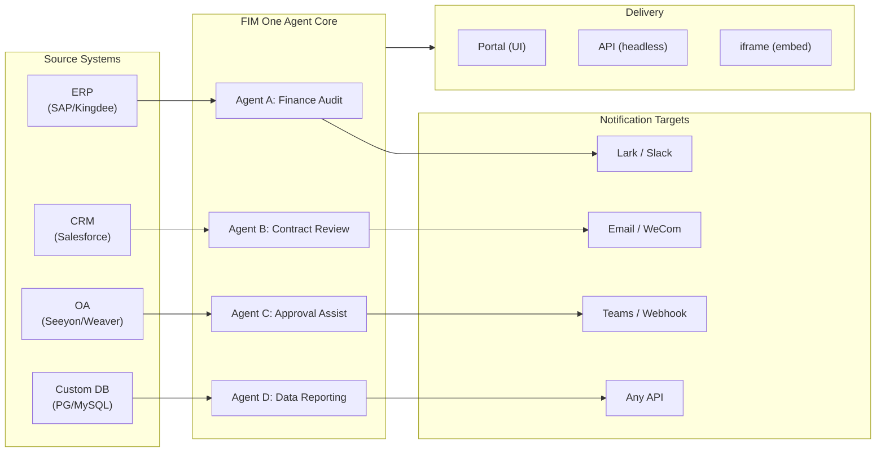

> Goal: Build an **all-in-one agent platform for Global × China enterprises** — delivered through three progressive modes: Standalone (portal assistant), Copilot (embedded in host system), Hub (central cross-system orchestration).
>
> Principles: **Provider-agnostic** (no vendor lock-in), **minimal-abstraction**, **protocol-first**, **connector-first** (integration is the core value).

## Product Vision

FIM One is an **all-in-one agent platform** that serves three progressive delivery modes:

```
Standalone   → Your own AI assistant (Portal)
Copilot      → AI embedded in a host system (iframe / widget / embed)
Hub          → Central cross-system orchestration (Portal / API)
```

**Cross-system orchestration is the core differentiator.** Enterprise clients have legacy systems — ERP, CRM, OA, finance, HR — that need to talk to each other through AI:



**GTM path: Land and Expand**

| Step | Mode | What happens |
|------|------|-------------|
| Land | Copilot | Embed into one system, prove value inside their UI |
| Expand | Copilot → Hub | Roll out to more systems; Hub mode aggregates them |

## Known Issues

Tracked bugs that are reproducible in production but not yet fixed. Each entry names the symptom, the suspected surface area, and the workaround (if any). Items move to a version section once a fix is scoped and scheduled.

- **Agent editor shows unsaved-changes warning on entry without any edit.** Opening an existing agent via `/agents/[id]` and immediately clicking back triggers the "Unsaved changes" dialog even when no field was touched. The dirty check diffs 20+ fields against the loaded agent payload, so one asymmetric default between state init and dirty compare is enough to cause a phantom mismatch — current suspicion is one of the nested `model_config_json` / notification / approval-routing fields, possibly from `undefined` vs `null` vs `""` normalization. Reproduces on org-scoped agents in particular. Workaround: dismiss the dialog (`Discard and leave`) — no data loss since nothing actually changed. Attempted fix (`cb40c86a`) removed a related orphan-badge flicker on the resource pickers but did not resolve this.

- **Saving an agent edit can fail with `Input should be 'initiator', 'agent_owner' or 'org_members'`.** Pydantic rejects the `confirmation_approver_scope` field at the `/api/agents/{id}` PUT boundary even though every stored value in the database is one of the three valid literals. Suspicion: the frontend `as "initiator" | "agent_owner" | "org_members"` cast is a compile-time-only promise, so a legacy or unexpected runtime string (possibly from a template, import, or older migration) can slip through `setConfirmationApproverScope` and be echoed back verbatim. Workaround: explicitly re-select a value in the Approval → Approver Scope dropdown before saving.
- **Playground stop-and-retry shows transient visual artefacts that a page refresh always clears.** Three concurrent render sources — `activeConversation.messages` (DB snapshot), the SSE `messages` stream, and the optimistic `pendingQuery` placeholder — are not collapsed into a single derived state, so between clicking "Retry" and the paired assistant response landing, the UI can (a) briefly render the same query twice in the pre-stream window, (b) drop prior orphan user bubbles from the retry history while `hasLiveMessages` is true and before the snapshot reloads, and (c) flicker in the narrow window between the SSE "done" event and the next `selectConversation` refresh. **Data is never lost** — every user message (including aborted retries) is persisted in `conversation.messages`, carried into the next LLM call via `normalize_alternating_messages`, and rendered correctly after refresh via `HistoryTurn.orphanUserContents` introduced in the `48ba08c6` render fix. For context, Claude's own web UI exhibits an analogous class of bug — stopping mid-response and immediately sending a follow-up query sometimes forks the follow-up as a sibling-edit branch of the first query rather than appending it as a new turn — so this is a known hard problem in optimistic-UI + SSE + persisted-history designs, not a FIM-One-specific defect. A proper fix requires collapsing the three render sources into a single derived state; deferred until a broader Playground state-machine refactor.

## Shipped Versions

### v0.1 (2026-02-22) — MVP: ReAct + DAG Planner
- ReActAgent with tools (calculator, python_exec, web_search)
- DAG Planner (LLM generates dependency graphs)
- Portal UI with streaming + KaTeX

### v0.2 (2026-02-24) — Multi-Model + Memory
- Retry / rate limiting / usage tracking
- Native function calling (no JSON-only parsing)
- Multi-model support (fast + main LLM)
- Memory: WindowMemory, SummaryMemory
- FastAPI backend with SSE streaming

### v0.3 (2026-02-25) — Web Tools + MCP
- Web tools (web_search, web_fetch) via Jina/Tavily/Brave
- File operations tool
- MCP client (standard tool integration)
- Tool auto-discovery + categories
- DAG visualization with click-to-scroll
- Code exec in Docker (`--network=none`)

### v0.4 (2026-02-25) — Multi-Turn + Agents
- Multi-turn conversations (DbMemory)
- Tool step folding UI
- HTTP request + shell exec tools
- Agent management (create, configure, publish)
- JWT authentication
- Per-agent execution mode + temperature control

### v0.5 (2026-02-28) — Full RAG + Grounded Gen
- Full RAG pipeline (embedding + vector store + FTS + RRF + reranker)
- Grounded Generation (citations, confidence scores)
- Knowledge base document management (CRUD, search, retry, schema migration)
- ContextGuard + pinned messages (token budget manager)
- DbMemory persistence + LLM Compact
- DAG Re-Planning (up to 3 rounds)

### v0.6 (2026-03-01) — Connector Platform
- **Connector CRUD**: create, read, update, delete
- **ConnectorToolAdapter**: converts Connector → BaseTool
- **Per-user credentials**: AES-GCM encryption
- **Confirmation gate**: write operation approval
- **Audit logging**: all tool calls recorded
- **Circuit breaker**: graceful degradation on failures
- **Utility tools**: email_send, json_transform, template_render, text_utils
- **Embedding options**: Jina, OpenAI, custom providers

### v0.7 (2026-03-06) — Admin Platform + Multi-Tenant
- **Admin Platform**: user management, role toggle, password reset, account enable/disable
- **Invite-only registration**: three modes (open/invite/disabled) + invite code CRUD
- **Storage management**: per-user disk usage, clear, orphan cleanup
- **Conversation moderation**: admin list/delete all
- **Per-user force logout**: revoke all tokens
- **API health dashboard**: system stats, connector metrics
- **First-run setup wizard**: guided admin account creation
- **Personal Center**: per-user global instructions, language preference
- **JWT auth**: token-based SSE auth, conversation ownership
- **Global MCP servers**: admin-provisioned, loaded in all sessions
- **Backward-compat**: registration_enabled → registration_mode auto-migration

### v0.7.x (2026-03-07 to 2026-03-12) — Stability + Polish
- Invite code management
- Per-user quotas (429 enforcement)
- Structured audit logging
- Sensitive word filtering
- Admin login history
- Admin file browser
- Enhanced admin views (model_name, tools, kb_ids fields)
- Docker Compose deployment (single image, named volumes)
- OAuth auto-detection from window.location
- Extended thinking / reasoning support (`LLM_REASONING_EFFORT`, `LLM_REASONING_BUDGET_TOKENS`) for OpenAI o-series, Gemini 2.5+, Claude
- Admin per-tool enable/disable (disabled tools excluded from chat at runtime)
- MCP servers management moved to Connectors page
- Dual database support: SQLite (zero-config default) + PostgreSQL (production); Docker Compose auto-provisions PostgreSQL
- Models configuration documentation page with extended thinking setup per provider
- SSE Protocol v2: real-time answer streaming with `delta_reasoning`, `usage` fields, and split `done`/`suggestions`/`title`/`end` events; SQLite pool size 5 -> 20
- AI Builder expansion: 7 new builder tools (GetSettings, TestConnection, ImportOpenAPI for connectors; ListConnectors, AddConnector, RemoveConnector, SetModel for agents), `is_builder` flag on agents, builder prompt auto-refresh, SSRF guard
- SSE v2 frontend: streaming dot-pulse cursor, DAG re-plan round snapshots as collapsible cards, DAG layout decoupled from step states
- AI Builder concept documentation page with connector and agent builder guides
- Organization system: full CRUD with role-based membership (owner/admin/member), admin management UI
- Three-tier resource visibility (personal/org/global) for agents, connectors, knowledge bases, MCP servers
- Publish/unpublish API for all resource types; owner delegation for published agents
- Admin set-visibility endpoint (replaces clone-to-global); unified `build_visibility_filter()` query helper
- Database Connectors (Phase 1-3): direct SQL access to PG/MySQL/Oracle/SQL Server + Chinese legacy DBs; schema introspection, AI annotation, read-only query execution, encrypted credentials, 3 tools per connector (`list_tables`, `describe_table`, `query`)
- **Evaluation Center**: quantitative agent quality benchmarking — test dataset CRUD (prompt + expected behavior + assertions), eval runs (parallel execution + LLM grader + per-case pass/fail/latency/token results), results viewer with auto-polling; migration `r8t0v2x4z567`
- Three model roles (General/Fast/Reasoning) with per-tier env config isolation; fast model no longer inherits main model settings
- `StepOutput` dataclass replacing plain string step results for structured data and artifact passing
- Tool cache for DAG execution — identical tool calls cached per-run with async lock stampede prevention (`DAG_TOOL_CACHE`)
- Per-step LLM verification with 1 retry on failure (`DAG_STEP_VERIFICATION`)
- Auto-routing: fast LLM classifies queries as ReAct or DAG; `/api/auto` endpoint; frontend 3-way mode toggle (`AUTO_ROUTING`)
- [x] ~~**Shadow Market Organization + Resource Subscriptions**~~: Built-in Market org (shadow, no auto-join) replaces Platform org; resources discovered via marketplace browsing and explicitly subscribed (pull model); Market API for subscribing to shared resources; publish-to-Market always requires review; Resource subscriptions table; org-based resource sharing replacing global visibility
- [x] ~~**Agent Auto-discovery and Sub-agent Binding**~~: `discoverable` flag on agents; `sub_agent_ids` whitelist; CallAgentTool for delegating tasks to specialist agents
- [x] ~~**MCP Server Credentials + Per-User Override**~~: `mcp_server_credentials` table; `PUT /api/mcp-servers/{id}/my-credentials` endpoint; `allow_fallback` flag for credential fallback behavior
- [x] ~~**Connector/KB Toggle**~~: `POST /api/connectors/{id}/toggle` and `POST /api/knowledge-bases/{id}/toggle` for suspending/resuming resources
- [x] ~~**Standalone KB Conversations**~~: `kb_ids` field on conversations for direct KB chat without agent binding

### v0.8 (2026-03-20) — Connector Declarative Config + Progressive Disclosure
- [x] **Database connectors**: direct SQL access (PostgreSQL, MySQL, Oracle) *(shipped in v0.7.x — Phase 1-3)*
- [x] **RBAC**: per-user/role connector access control *(shipped in v0.7.x — org system + three-tier visibility)*
- [x] **Connector credential encryption + per-user override**: `connector_credentials` table, Fernet encryption via `CREDENTIAL_ENCRYPTION_KEY`, `allow_fallback` flag, `GET/PUT/DELETE /my-credentials` endpoints, per-user credential resolution in chat tool loading
- [x] **Publish review UI**: Org-level publish review system — review toggle per org, ReviewsSheet with approve/reject workflow, status badges on resource cards, review notice in publish dialog, resubmit for rejected resources
- [x] **Connector Progressive Disclosure (Phase 1-2)**: single `ConnectorMetaTool` replaces per-action tools; system prompt receives lightweight **stubs** only (name + 1-line description, ~30 tokens/connector vs ~250 tokens/action); agent calls `discover(connector)` to load full action schema on demand — schema only loads when the model selects a connector, keeping the prompt prefix stable for caching. Follows the deferred tool-loading pattern common in modern agent frameworks. `execute` subcommand; feature flag for backward compatibility.
- [x] **Agent Skill System + Compact Instructions**: On-demand skill loading for agent instructions — `Skill` model (name, content/SOP, optional scripts) attached to agents; referenced in system prompt by name only (~10 tokens/skill); agent calls `read_skill(name)` to load full content on demand. Reduces per-conversation instruction token cost by ~80% while allowing richer SOP libraries. Counterpart to ConnectorMetaTool's progressive disclosure applied at the instruction level. Enables the "指令 + 工具 + 技能" differentiation story. Also adds `compact_instructions` field to Agent model — per-agent compression priority list injected into `ContextGuard` when compacting (e.g., "preserve order IDs and amounts, drop raw API responses"), replacing the current static generic prompt. Follows the Compact Instructions convention widely adopted in modern agent frameworks.
- [x] **Connector import/export**: share connector templates
- [x] **Connector fork**: clone + customize existing connectors
- [x] **Workflow Phase 2 Nodes**: Iterator, Loop, VariableAggregator, ParameterExtractor, ListOperation, Transform, DocumentExtractor, QuestionUnderstanding, HumanIntervention — 9 advanced node types with full frontend + backend + 150 new tests (275 total). Node retry with exponential backoff, safe expression evaluation. Stats panel with success rate bar. 12 built-in templates. Pane context menu (Paste, Select All, Fit View, Auto Layout).
- [x] **Workflow Phase 3 Nodes: SubWorkflow + ENV** — 2 new node types (25 nodes total), 14 new tests (306 total), 14 built-in templates. SubWorkflow: full DB-backed nested workflow executor with target workflow selection, variable mapping, and configurable depth limit to prevent infinite recursion. ENV: reads encrypted environment variables with key picker and fallback defaults. Full frontend (node components, config panels, palette entries, minimap colors). Per-node execution statistics panel (success rates, durations, failure counts sorted worst-first). `getNodeStats` API client + `NodeStatEntry` type. Keyboard shortcuts dialog (`?` key).
- [x] **Workflow Scheduled Triggers**: Per-workflow cron configuration with timezone, default inputs, and next-run-at calculation. Preset cron buttons, 30 trigger tests.
- [x] **Workflow API Triggers**: Public per-workflow API keys (`wf_` prefix) for external execution without user auth, with rate limiting. API key management dialog with generate/regenerate/revoke, trigger URL, and cURL/JS examples.
- [x] **Workflow Batch Execution**: `POST /batch-run` with up to 100 input sets, configurable parallelism (1-10), collapsible per-item results, JSON export. 14 batch execution tests.
- [x] **Workflow Execution Log Viewer**: Real-time chronological SSE event stream in the run panel with timestamps, color-coded badges, and event type filter toggles.
- [x] **Workflow Run Stats**: Backend batch-fetches run counts and success rates via GROUP BY subquery; frontend displays stats on workflow cards with color-coded success rate indicators.
- [x] **Workflow Scheduler Daemon**: Background async service polling every 60s for due cron-based workflows. Croniter timezone support, semaphore concurrency, `last_scheduled_at` tracking, webhook delivery. 14 tests.
- [x] **Workflow Import Conflict Resolver**: Detects unresolved agent/connector/KB/MCP references during import. Batch DB queries with visibility filtering, frontend toast warnings. 17 tests.
- [x] **Workflow Test-Node Execution**: Isolated single-node testing with mock variables, integrated into editor (config panel Test button + context menu). 23 tests.
- [x] **Workflow Version Diff**: Side-by-side blueprint comparison with node/edge change detection, color-coded indicators (added/removed/modified).
- [x] **Workflow Run Management**: Delete individual runs (`DELETE /runs/{run_id}`) and clear all completed runs (`DELETE /runs`), with frontend confirmation dialogs.
- [x] **Workflow Run Replay Overlay**: "View on Canvas" button in run history to overlay past execution results on the canvas, showing per-node status and output without re-executing.
- [x] **Workflow Favorites/Pinning**: Star/pin workflows to the top of the list with localStorage persistence.
- [x] **Workflow Run History Export**: Export run history as JSON file download with full run metadata and per-node results.
- [x] **Admin Workflows Management**: Admin panel tab for managing all workflows across users — list, toggle active/inactive, delete with confirmation. Batch endpoints for delete, toggle, and publish with audit logging.
- [x] **Workflow Templates System**: `WorkflowTemplate` ORM model with admin CRUD, public listing/clone API, and 5 seed templates auto-inserted on first startup.
- [x] **Workflow Inline Validation Badges**: Real-time per-node `ValidationBadge` on canvas with error/warning tooltips for immediate visual feedback during editing.
- [x] **Workflow Execution Trace Viewer**: Timeline-based trace viewer Sheet with engine `trace_level` parameter and per-node variable snapshots for step-through debugging.
- [x] **Workflow Rate Limiting and Timeout**: Per-user `WorkflowRateLimiter` (sliding window 10 runs/min, 3 concurrent) and default 10-minute global run timeout.
- [x] **Workflow Blueprint System**: Visual workflow editor for designing and executing multi-step automation blueprints — `Workflow` / `WorkflowRun` ORM models, full CRUD + SSE execution API, import/export, duplicate, blueprint validation endpoint, `WorkflowEngine` with topological sort + semaphore-based concurrency + condition branching and 12 node types (Start, End, LLM, ConditionBranch, QuestionClassifier, Agent, KnowledgeRetrieval, Connector, HTTPRequest, VariableAssign, TemplateTransform, CodeExecution), `VariableStore` with `{{node_id.output}}` interpolation and `env.*` namespace, error strategies per node (STOP_WORKFLOW / CONTINUE / FAIL_BRANCH) with per-node timeout and advanced config UI, React Flow v12 visual editor with drag-and-drop palette + node config panel + variable picker combobox + add-node-on-edge + auto-layout (ELK.js) + run history sheet, Dify-style compact node design with ring-based run status styling and animated edge transitions, 4 built-in starter templates (Simple LLM Chain, Conditional Router, Knowledge-Augmented QA, HTTP API Pipeline) with template picker dialog and `GET /templates` + `POST /from-template` API, stats endpoint, `?run=true` URL param auto-open, subprocess-based code execution security, 105-test suite (templates, eval namespace flattening, blueprint validation warnings, node/edge deletion, import/export/duplicate, deadlock detection, multi-condition branching)
- [x] **Operation audit**: detailed logging of who did what — admin review log audit tab added (publish review trail per org/resource)
- [x] **Semantic Schema Annotations**: extend connector schema fields with `semantic_tag`, `description`, and `pii` flags; annotations surfaced in LLM tool descriptions so the agent understands field intent without guessing from column names

### v0.8.1 (2026-03-29) — Progressive Disclosure Maturity + ReAct Hardening
- Progressive disclosure for DB connectors (`DatabaseMetaTool`), MCP servers (`MCPServerMetaTool`), and on-demand tool loading (`request_tools` meta-tool)
- DAG quality overhaul (5 improvements: model upgrade, skill auto-discovery, citation verifier, structured content preservation, domain-aware routing)
- Domain model escalation in ReAct (specialist domains auto-escalate to reasoning model)
- Per-model Native Function Calling toggle (`tool_choice_enabled`)
- ReAct cycle detection (deterministic duplicate tool call prevention)
- ReAct completion checklist (pre-answer verification when tools were used)
- Resource Fork Phase 1 (MCP Server + Skill fork endpoints with lineage tracking)
- Workflow Connection Dep Auto-Subscribe (recursive sub-workflow dependency resolution)
- Prebuilt Solution Templates (8 vertical solutions seeded to Market on first registration)
- Admin notification improvements (timezone-aware, master switch, SMTP Reply-To)
- Per-turn token budget circuit breaker (`REACT_MAX_TURN_TOKENS`)
- Centralized tool truncation, dynamic system prompt budgeting
- File attachment download, duplicate message submission fix

### v0.8.2 (2026-04-10) — Agent Core Hardening + Vision Documents
- **Agent Core Phase 0** — Compact prompt upgraded to 9-section structured format; empty tool result protection (descriptive message instead of `(no output)`); anti-loop prompt + cycle detection threshold lowered to 2; domain classifier + pre-flight DB config resolution parallelized (400–1100 ms saved per request); SSE `end` event sent immediately after answer, with title/suggestions moved to background tasks
- **Agent Core Phase 1 (Context Anti-Bloat)** — `MicroCompact` rule-based old tool result cleanup (keep last 6); `REACT_TOOL_RESULT_BUDGET=40000` aggregate cap; reactive compact on context overflow (auto-compact to 50% budget and retry instead of crashing)
- **Agent Core Phase 2 (Speed)** — Keyword-based tool pre-selection (skips LLM call on obvious matches, 200–500 ms saved); `SharedHttpClient` LLM connection pooling; completion check skipped for answers >200 tokens; `FallbackLLM` wraps primary+fast with automatic failover on 429/503/529/connection errors
- **Intelligent Document Processing (Vision-Aware)** — Adaptive document handling: PDF pages rendered as images via PyMuPDF for vision-capable models (GPT-4o, Claude 3/4, Gemini), text-only fallback via pdfplumber. Per-model `supports_vision` flag. Modes via `DOCUMENT_PROCESSING_MODE`, `DOCUMENT_VISION_DPI`, `DOCUMENT_VISION_MAX_PAGES`. DOCX/PPTX embedded image extraction. Multi-turn vision persistence across conversation turns. Smart PDF processing (text-rich pages extract text + images; scanned pages render as full-page PNG). Pre-built sandbox image (`Dockerfile.sandbox`) with common data-science packages for `--network=none` code execution
- **Resource Fork completion** — Agent / Connector / Workflow fork endpoints added, completing the five-type lineage tracking (KB fork removed — inherently user-local)
- **File integrity guardrail** — System prompt rule prevents the agent from substituting unrelated file contents when a target file is unreadable; uploaded files now include `file_id` in message context for direct `read_uploaded_file` access

### v0.8.3 (2026-04-16) — Universal Document Conversion + Agent Core Phase 3
- **Universal Document Conversion (`convert_to_markdown` + OCR)** — Built-in Agent tool wrapping Microsoft MarkItDown; converts PDF, Word, Excel, PowerPoint, HTML, JSON, CSV, XML, ZIP, EPUB, Outlook .msg, images, audio, YouTube URLs to Markdown. `LiteLLMOpenAIShim` enables OCR via any vision-capable LLM (Claude, Gemini, Bedrock, Azure). Vision-aware RAG ingestion with zero-regression text-only fallback. `LLM_SUPPORTS_VISION` env var for opt-out
- **Agent Core Phase 3 (Runtime Invariant Hardening)** — Conversation recovery (dangling `tool_use` auto-repair); structured compact work card (`WorkCard` typed merge across compaction rounds); turn-level profiler (`REACT_TURN_PROFILE_ENABLED`); per-user rate limiting (`LLM_RATE_LIMIT_PER_USER`); empty-content assistant message with `tool_calls` no longer dropped

### v0.8.4 (2026-04-17) — Prompt Cache + Reasoning Correctness
- **System prompt section registry with cache breakpoints** — Memoized `PromptRegistry` splits system prompts into stable prefix + dynamic suffix; cache-capable providers (Claude, Bedrock Anthropic, Vertex Claude) receive `cache_control: {"type": "ephemeral"}` on the prefix for ~60-80% per-turn input token savings. Non-cache providers get a single concatenated message (zero behavior change)
- **Prompt cache observability** — `cache_read_input_tokens` and `cache_creation_input_tokens` tracked through `UsageSummary` → `TurnProfiler` → `done_payload.cache` field. Structured `turn_cache` log line per turn. Doubles as relay cache-honesty probe
- **Conversation recovery MVP** — Synthetic `tool_result` rows persist after interrupted turns; `POST /chat/resume` replays cached SSE events from a monotonic cursor; frontend `useSseResume` hook auto-reconnects with exponential backoff (300ms → 1s → 3s, max 3 attempts) and "Reconnecting…" indicator
- **Thinking-block persistence with signature** — `reasoning_content` + Anthropic `signature` persisted in `metadata_["thinking"]` and replayed on subsequent turns; fixes HTTP 400 signature mismatch on Claude 4 multi-turn conversations
- **Provider-aware reasoning replay policy** — Centralized `reasoning_replay_policy()` in `core/prompt/reasoning.py` gates serialization per provider family: Claude replays thinking blocks with signature; DeepSeek-R1/Qwen-QwQ/Gemini-thinking/o-series drop `reasoning_content` on outbound (previously leaked, breaking provider KV caches and violating API docs)

### v0.8.5 (2026-04-23) — Channel Integration + Hook System + Contributor i18n
- **Feishu Channel (Phase 1 subset)** — Org-scoped `Channel` resource with Fernet-encrypted credentials; `FeishuChannel` supports interactive card send + callback (signature verification + URL challenge); Settings → Channels management UI (list, create/edit with dirty-state protection, details with copyable callback URL, test-send); CRUD API (`/api/channels`) and event callback endpoint (`/api/channels/{id}/callback`). Shipped early for 2026-04-24 roadshow
- **Agent Hook System (live in ReAct + DAG runtime)** — `PreToolUseHook` / `PostToolUseHook` abstraction in `src/fim_one/core/hooks/`; agents declaring `hooks.class_hooks` in `model_config_json` have hooks instantiated and registered per chat session. First consumer `FeishuGateHook` posts an Approve/Reject card to the linked Feishu group when an agent calls a `requires_confirmation=True` tool, blocks execution, and resumes or aborts based on verdict
- **Configurable confirmation gate (inline OR channel)** — Every agent gets an Approval section with three routing modes (Auto / Inline only / Channel only), approver-scope selector (initiator / owner / anyone in org), per-tool override, and explicit approval-channel picker. Auto mode gracefully falls back to an inline approval card when no channel is linked. `POST /api/confirmations/{id}/respond` shares a single decision-recording path with the Feishu webhook
- **Per-agent task completion notifications** — Long-running ReAct or DAG agents can push a summary card to the org's channel when a task finishes. First consumer of the generic outbound notification pattern
- **Hook Approval Playground** — Channels details sheet has a "Test Approval Flow" action that exercises the full production path (genuine `ConfirmationRequest` row, real Feishu callback, status transitions) — same code path a production hook uses
- **Contributor-friendly i18n CI fallback** — `.github/workflows/i18n-sync.yml` translates EN → ZH/JA/KO/DE/FR on master after PR merge and auto-commits with `[skip ci]`; contributors no longer need `LLM_API_KEY` locally. Pre-commit locale-edit guard refuses manual edits to generated locale files (`ALLOW_LOCALE_EDIT=1` override for legitimate translation fixes). End-to-end verified via smoke-test push
- **Exa integration docs** — Dedicated Integrations section with a first-class Exa page covering the full Exa search surface (neural / fast / deep-reasoning / instant), filtering, content retrieval, and three tuned presets
- **Xinchuang (信创) database support** — Database Connector now lists KingbaseES (人大金仓), HighGo (瀚高), and DM8 (达梦) alongside PostgreSQL/MySQL. PG-compatible drivers reuse `asyncpg`; DM8 uses `dmPython`. `scripts/test_xinchuang_dbs.py` verifies live connectivity from the CLI
- **Channels + Hook System architecture docs** — `docs/architecture/hook-system.mdx` explains the three hook points and walks through FeishuGateHook end-to-end; existing architecture pages cross-link; README lists Messaging Channels as a first-class capability
- **Hardening** — Duplicate Feishu callback clicks produce a replacement card instead of double-deciding; concurrent callback clicks resolved via conditional `UPDATE ... WHERE status='pending'` rowcount check; pending approvals auto-expire after `CHANNEL_CONFIRMATION_TTL_MINUTES` (default 24h) via background sweeper; Settings → Channels respects org role (members see read-only UI); parallel tool-call aggregator handles providers that reuse `index=0` for every delta; session-expiry redirect preserves query string

### v0.8.6 (2026-05-08) — Stripe Billing + Polish
- [x] Stripe billing MVP — Free + Pro tiers; Checkout, Customer Portal, webhook lifecycle; `/settings?tab=billing`; admin plan/subscription CRUD; quota enforcement respects each user's plan
- [x] Admin-controlled billing feature flag — `system_settings.billing_enabled` gates the entire Stripe pipeline so private deployments without Stripe credentials never surface a non-functional payment UX
- [x] Per-user unlimited quota — empty inherits global default, `0` grants unlimited; previously both collapsed into the same state
- [x] Translation glossary as single source of truth — `scripts/translation-glossary.md` consolidates per-locale rules; pre-commit unconditionally refuses manual edits to generated locale files
- [x] License + governing law migrated to FIM Labs Pte. Ltd. (Singapore); SIAC arbitration in English; new top-level `NOTICE` file
- [x] Playground follow-up suggestions restored, opt-in per agent
- [x] Stability fixes — strict-alternation provider history, parallel tool-call boundary detection, unbound-agent confirmation flow, channel role gating, retry-duplicate suppression, post-rejection no-paraphrase

## Planned Versions

### v0.9 — Observability + Production Hardening

**Goal**: Production-grade operations + four pillars closing the gap between "instructions the agent might follow" and "guarantees the system enforces" — Trace Layer (see what happened) · Hook System (enforce what must happen) · Agent Workspace (persistent files + handoff) · IM Channel (agents live where users work).

#### Connector + tooling

- [ ] **Connector Progressive Disclosure Phase 3-4** — unified `ConnectorExecutor` (API/DB/MCP); `jsonschema` action validation; protocol-agnostic discover/execute
- [ ] **YAML/JSON connector config** — platform auto-generates MCP server
- [ ] **Database connectors Phase 4** — Oracle (`oracledb`), SQL Server (`aioodbc`), GBase (`aioodbc` + GBase ODBC). DM8 / KingbaseES / HighGo shipped in v0.8.5
- [ ] **MCP Connection Pooling** — pool STDIO with per-user env isolation; share `httpx.AsyncClient` for SSE/HTTP. Target ≤100 ms warm-start, O(1) HTTP connections per server

#### Hook System {/* dev: dev/hook-system.md */}

- [ ] Per-hook config pass-through (`{"name": ..., "config": {...}}` schema)
- [ ] DAG `tools_used` accuracy (real tool names from per-step ReAct via step-completion callback)
- [ ] Hook inheritance for `CallAgentTool` + Workflow `AGENT` nodes (security default vs flexibility default)
- [ ] Built-in hooks: `ConnectorCallLog` autorecord, read-only-mode block, DB result truncation, per-connector rate-limit
- [ ] `SessionStart` hook point + user-defined YAML hooks
- [x] ~~Skeleton + FeishuGateHook + Approval Playground + ReAct/DAG runtime~~ *(shipped in v0.8.5)*

#### IM Channel Integration {/* dev: dev/im-channels.md */}

- [ ] Channels: WeCom, Slack, Email, Teams outbound
- [ ] Outbound patterns: failure alerts, budget warnings, scheduled digests, escalation, audit receipts, approval escalation
- [ ] Phase 2 — Inbound trigger (@mention agent in IM group)
- [x] ~~Feishu Channel (Phase 1 subset) + Task completion notification~~ *(shipped in v0.8.5)*

#### Connector Authorization Layers {/* dev: dev/connector-rbac/00-overview.md */}

- [ ] Tier 1 — DB mode (`ConnectorScopeGuard` PreToolUse hook: verb blocking, table allow/deny, column redaction, scope predicate injection)
- [ ] Tier 2 — Open API mode (admin UI to require per-user credentials; key-binding health dashboard)
- [ ] Tier 3 — Login-ticket exchange (`LoginTicketCredential` for frontend/backend-split systems with no user-scoped API key)
- [ ] Cross-tier auditability (`caller_user_id`, `effective_credential_source`, `scope_rules_applied` in `ConnectorCallLog`)

#### Channel → Integration Promotion {/* dev: dev/channel-integration-sso.md */}

- [ ] `ThirdPartyIntegration` model — promote Channel into Delivery + Login + Org-graph-sync sub-capabilities
- [ ] Feishu SSO ("Login with Feishu" yields FIM session + upstream token, removes per-user API-key friction for Tier-2)
- [ ] Org graph sync (Feishu departments → FIM org tree); WeCom + DingTalk next

#### Public API Phase 2 {/* dev: dev/public-api-phase2.md */}

- [ ] Per-key rate limiting (`X-RateLimit-*` headers, 429)
- [ ] Per-key usage quota (monthly token/request budget)
- [ ] Scope enforcement per endpoint
- [ ] API versioning (`/v1/...`) + deprecation headers
- [ ] Webhook callbacks (per-key)
- [ ] SDK generation (Python + TypeScript)
- [ ] Developer Portal (Try-it panels + per-key analytics)
- [ ] API key rotation (24h grace)
- [ ] Batch / async API (`POST /api/batch`)
- [ ] Per-external-dep circuit breaker

#### Observability {/* dev: dev/agent-trace-layer.md */}

- [ ] **Agent Trace Layer** — Trace/Span model, frontend timeline viewer, OTel export (LangSmith-style application-level run/trace/thread)
- [ ] **Metrics dashboard** — latency, success rate, token usage, connector analytics (per-agent / user / org)

#### Agent Workspace {/* dev: dev/agent-workspace.md */}

- [ ] Tool Output Offloading — `workspace://` URIs for >8K responses + `read/list/write_workspace_file` tools
- [ ] Handoff Notes — `write_handoff(summary)` survives compaction
- [ ] Workspace UI — file browser per conversation; cross-session retention; per-user storage quota
- [ ] Cross-session conversation recall — `list_conversations`, `search_conversations`, `read_conversation` tools

#### Prompt cache + reasoning follow-ups {/* dev: dev/prompt-cache-followups.md */}

- [ ] Gemini Context Cache Adapter (separate REST cache lifecycle vs Anthropic inline marker)
- [ ] Prompt registry expansion to planner / verifier / domain classifier / compact
- [ ] Per-agent `cache_ttl` (ephemeral 5min vs extended 1h)
- [ ] DAG step-level checkpoint table for mid-DAG resume
- [ ] Dedicated `tool_call_id` Message column (indexed orphan-query lookup at scale)
- [ ] Mid-stream thinking token reconstruction (resume granularity finer than complete SSE event)
- [ ] API relay cache-honesty probe (admin-triggered: detects relays stripping `cache_control`)

#### Reliability follow-ups (Agent Core Priority Matrix)

- [ ] Content replacement state persistence (streaming invariant #2: "once seen, fate frozen")
- [ ] Attachment context router (dedup, aggregate budget, liveness checks; pairs with Workspace offloading)
- [ ] Side query workers (dedicated pools for recall / classify / summary so they don't contend for main rate-limit budget)

#### Ecosystem + scaling

- [ ] **Scheduled jobs + Event-triggered Agents** — `scheduled_jobs` + `job_runs` + APScheduler; cron + webhook-inbound. Async sub-agent use case for Hub mode
- [ ] **Workflow trigger identity observability** — `ExecutionContext.trigger_source` (`webhook | cron | manual | batch | sub`) populated at all 5 WorkflowEngine sites; surfaced in run panel and connector logs
- [ ] **Per-workflow `credential_policy` override** (`owner` / `caller` / `auto`) — overrides default `trigger_source → identity` mapping
- [ ] **DB Schema Advanced Builder** — AI-driven annotation for 1K-7K+ table deployments (selectivity + business-context reasoning)
- [ ] Sandbox hardening (v2 code execution isolation)
- [ ] Performance testing (concurrent load benchmarks)
- [ ] Internal Harness Benchmark (quantify harness parameter changes via Eval Center)

#### Already shipped early

- [x] ~~Circuit breaker, Workflow run retention cleanup, Workflow version diff summaries~~ *(v0.8 / v0.8.1)*
- [x] ~~DAG quality overhaul, Domain model escalation, Per-model NFC toggle~~ *(v0.8.1)*
- [x] ~~DatabaseMetaTool, MCPServerMetaTool, On-demand `request_tools`~~ *(v0.8.1)*
- [x] ~~Workflow Connection Dep Auto-Subscribe, Workflow real executors~~ *(v0.8.1)*
- [x] ~~ReAct Cycle Detection, Completion Checklist~~ *(v0.8.1)*
- [x] ~~Prebuilt Solution Templates (8 vertical bundles), Resource Fork (MCP/Skill/Agent/Connector/Workflow)~~ *(v0.8.1)*
- [x] ~~Vision document processing (PDF / DOCX / PPTX), MarkItDown OCR~~ *(v0.8.2 / v0.8.3)*
- [x] ~~Smart File Content Injection + `read_uploaded_file`~~ *(v0.8)*
- [x] ~~Agent Core Phase 3: Conversation Recovery MVP, Compact Work Card, Turn Profiler, Per-user Rate Limiting~~ *(v0.8.3)*
- [x] ~~Conversation resume MVP, System prompt registry + cache, Thinking-block persistence, Reasoning replay policy, Cache observability~~ *(v0.8.4)*

### v1.0 — Hot-Plug + Embeddable

**Goal**: Zero-restart connector addition, Package ecosystem, and embedded delivery.

- [ ] **Connector Progressive Disclosure (Phase 5)**: **Semantic-Guided Tool Selection** (entity extraction from query → Ontology Registry lookup → connector set reduction; 90%+ token reduction for 50+ connector deployments); Scale mode for batch/ETL connectors; CLI-style universal `connector <name> <action> <params>` interface
- [ ] **Cross-Connector Entity Alignment (Ontology Registry)**: define shared entity types (Customer, Order, Asset) with field mappings across connectors; DAGPlanner auto-resolves cross-system JOIN keys; enables cross-connector queries (e.g., "customers in Salesforce who ordered in Shopify") without hardcoded field names
- [ ] **Hot-plug connectors**: upload OpenAPI spec, AI generates config, live in 5 minutes (no restart)
- [x] ~~**Marketplace Redesign Phase 1 — Solutions + Components**~~: Two-tier Market model (Solutions: Agent/Skill/Workflow; Components: Connector/MCP Server); scope selector (Global Market / org); unified subscription model (org auto-appear removed); KB removed from Market scope; data migration backfills subscriptions for existing org members
- [ ] **Market Package System**: Distributable resource bundles for the Marketplace — replaces per-type "marketplace" with a unified packaging layer. `fim-package.yaml` manifest declares: metadata (name, version, description, author, license, tags, `min_fim_version`), entry point (primary Skill or Agent), resource list (agents, skills, connectors, KBs, MCP servers, workflows) with config references, inter-package dependencies (semver ranges), required credentials (mapped to connector refs for install-time collection), and user-configurable variables with defaults. **Two consumption modes**: (1) **install** — batch-create all resources + auto-wire internal references via ID substitution; installation linked to source for version update notifications; `POST /api/market/packages/{id}/install`; (2) **fork** — clone as user-owned editable copies with no update link (this IS the template mode); `POST /api/market/packages/{id}/fork`. Additional endpoints: publish (`POST /api/market/packages` with review workflow), uninstall (`DELETE /packages/{id}/uninstall` with dependency check + modified-resource confirmation), version history (`GET /packages/{id}/versions`), upgrade (`POST /packages/{id}/upgrade` with per-resource diff preview). Dependency resolver for nested package requirements with conflict detection. `PackageInstallation` table tracks installed packages per user with resource ID mapping for uninstall/upgrade. **Coexists with individual resource publishing** — Package is a composition layer, not a replacement; a single Connector is still publishable standalone. Example dependency tree: `Package: contract-review` → `Skill: contract-review` (entry point) → `Agent: contract-analyst` + `Agent: risk-scorer` → `KB: legal-clauses` + `Connector: docusign-api` + `MCP: pdf-extractor` + `Workflow: contract-approval-flow`
- [ ] **Creator Program**: Marketplace monetization layer — creator profiles with portfolio pages, per-package analytics (installs, forks, active users, ratings/reviews), affiliate commission tracking when packages drive new subscriptions. Paid package tier with pricing, purchase flow, and approval workflow. Creator dashboard with install trends, revenue reporting, and user feedback. Public creator API for programmatic package publishing (CI/CD for package authors). Community features: package comments, Q&A, changelogs per version
- [ ] **Embeddable widget**: `<script src="fim-one.js">` injected into host page
- [ ] **Page context injection**: widget reads host page context (current ID, URL, DOM selectors)
- [ ] **Advanced triggers**: Webhook inbound events; scheduled job enhancements (multi-timezone, calendar-aware)
- [ ] **Batch execution**: process 1000+ items via DAG
- [ ] **Enterprise security**: IP whitelisting, encryption at rest, SSO
- [ ] **KB Advanced Editor**: Builder-mode agent for power users managing large knowledge bases — bulk URL ingestion, duplicate detection, gap analysis, document lifecycle management; extends existing KB AI chat with ReAct tool loop
- [ ] **Stripe Billing (v1 MVP — Pro Subscription)**: Free + Pro two-tier subscription with monthly token quota. Stripe Checkout (hosted) + Customer Portal (self-service) + webhook-driven lifecycle (`checkout.session.completed` / `customer.subscription.updated|deleted` / `invoice.payment_succeeded|failed`). Soft-cap at quota exhaustion (HTTP 402 + upgrade prompt) — no overage charges in v1. Per-user billing only; Org/Team subscriptions deferred to v3. Prerequisites:
  - [x] ~~**Data model + SDK groundwork** (P1) — `billing_plans` / `subscriptions` / `stripe_webhook_events` tables, ORM models, Stripe SDK singleton, Free + Pro seeds~~ *(shipped in v0.8.6)*
  - [x] ~~**Backend API + webhook handler** (P2) — `/api/billing/*` + `/api/webhooks/stripe` with signature verification + idempotency; plan-aware quota; hourly lifecycle sweep~~ *(shipped in v0.8.6)*
  - [x] ~~**Frontend billing tab + 402 upgrade dialog** (P3) — `/settings?tab=billing` quota display, upgrade CTA, `past_due` banner, mid-stream 402 dialog~~ *(shipped in v0.8.6)*
  - [x] ~~**Admin plan management** (P4) — `admin/billing/{plans,subscriptions}` CRUD~~ *(shipped in v0.8.6)*
  - [x] ~~**Admin-controlled billing feature flag** (P5) — `system_settings.billing_enabled` gates the Stripe pipeline; idempotent activation seeds Free+Pro, sets default plan pointer, backfills users; toggle off/on is pure flag flip after activation~~ *(shipped in v0.8.6)*
  - [ ] **Reconciliation + e2e + go-live** (P6) — nightly `subscriptions` ↔ `stripe.Subscription.list()` reconcile script for missed-webhook recovery; full-stack happy-path / cancel-mid-period / past-due regression tests; switch from test-mode `stripe_price_id` to a live `price_id`; smoke test on staging with a real card.

- [ ] **Team plan (Stripe seats)** — Per-seat pricing via `stripe.Subscription.quantity`, integrated with Organization membership. Lets companies subscribe to one team-wide plan with N seats; quota and feature flags resolve through the seat group rather than the individual user. Builds on the v1.0 Stripe MVP and the existing Organization model.
- [ ] **Group-level token quota for non-billing deployments** — Enterprise / private deployments without Stripe configure organization-level token budgets. Quota chain extends to `override > group > plan > default`; group resolution uses `max(user_quota, group_quota)` so individual VIPs aren't constrained by the team cap. Lands alongside the Team plan so the same primitives serve both billed and self-hosted topologies.

**Impact**: Enterprises deploy FIM One from zero to multi-system orchestration in days. Package system creates a creator ecosystem — solution authors publish composite bundles (Skill + Agents + Connectors + KBs + Workflows), enterprises install with one click, creators earn from adoption. Install/fork duality covers both "use as-is" and "customize from template" use cases in a single mechanism.

## Frozen Features (Shipped, Maintain Only)

Per the [Orthogonality Strategy](/strategy/orthogonality-strategy), these features are shipped and working but will not receive new capabilities (bug fixes only):

| Feature | Version | Why frozen |
|---------|---------|-----------|
| ReAct Agent | v0.1, v0.9 | Models now have native tool calling. Mid-loop self-reflection (v0.9) prevents goal drift in long chains. Tool observation synthesis quality improved (8K chars, configurable via `REACT_TOOL_OBS_TRUNCATION`) |
| DAG Planning / Re-Planning | v0.1, v0.5, v0.7.5 | Model reasoning capabilities improving; decomposition becoming single-shot. Per-step verification shipped in v0.7.5 (`DAG_STEP_VERIFICATION`). Hardened: cascade failure propagation, verifier status fix, planner tool descriptions, full replan history, whitelist-based tool cache. 14 engine constants exposed as ENV vars — no further planning primitives planned |
| Memory (Window, Summary, Compact) | v0.2, v0.5 | Context windows growing (200K+); less need for external memory management |
| RAG pipeline | v0.5 | Providers building retrieval natively (OpenAI file_search, Gemini Search Grounding) |
| Grounded Generation | v0.5 | Models improving at citations; 5-stage pipeline adds diminishing value |
| ContextGuard / Pinned Messages | v0.5 | Shipping as-is; no new features |

## Consider (Deferred Indefinitely)

Per the Orthogonality Strategy, these would be high-effort and face absorption risk:

| Feature | Why deferred |
|---------|------------|
| Multi-Agent Orchestration (deep hierarchies) | Providers building natively (OpenAI Swarm, Google A2A, and similar multi-agent offerings). FIM One's CallAgentTool covers the one-level delegation case; event-triggered background agents are covered by Scheduled Jobs in v0.9 |
| Agent Self-modifying Skills (Procedural Memory) | Agents updating their own `skill.md` during execution — high complexity, safety/audit surface area. Depends on Agent Skill System (v0.8) shipping first. Re-evaluate if enterprise customers request self-improving agents explicitly |
| ~~Agent Workspace (Tool Output File Offloading)~~ | Promoted to v0.9. The value is **selective reading**, not context capacity — cross-framework validation confirmed. Original deferral reasoning ("200K+ windows reduce urgency") was wrong. |
| Cross-Session Long-Term Memory | Context windows growing rapidly (200K–2M); providers adding built-in memory (OpenAI memory, Gemini context caching); high implementation cost vs diminishing differentiation value. Re-evaluate when enterprise customers explicitly request it |
| Memory Lifecycle (TTL, quotas) | Depends on cross-session memory; deferred together |
| Active Context Compression Tool (agent-triggered) | Explicitly frozen with ContextGuard (v0.5). Context windows at 200K+ reduce value. Will not be revisited unless context costs become a major enterprise complaint |
| Browser Automation / Computer Use | High maintenance cost (DOM changes, anti-bot, sandboxing). Industry converging on Computer Use mode (Anthropic, OpenAI Operator, Google Mariner) and MCP browser tools (Puppeteer/Playwright MCP). Consume via MCP integration, don't self-build. Re-evaluate when stable Computer Use MCP standard emerges |
| Web Push Notifications | Browser-native push via Service Worker + VAPID. Overlaps with IM Channel Integration (v0.8) which covers enterprise-preferred channels (Lark/Slack/WeCom/Email). IM push has higher enterprise value; Web Push is a nice-to-have for Portal-only users. Re-evaluate after IM Channel ships — if users request browser notifications beyond IM coverage |
| Multi-user workflow collaborative editing | Real-time co-editing of the same workflow blueprint (Figma/Notion style) with cursor awareness, conflict resolution, and per-node lock. High implementation cost (CRDT / OT, presence infra), unclear enterprise demand over today's "one editor at a time + version diff" model. Re-evaluate if multiple enterprises specifically request shared live editing |
| Per-node workflow execution permissions (RBAC on run) | Fine-grained authorization *inside* a single workflow run — e.g. "node X requires role `finance_approver` to execute". Today authorization happens at the workflow level (who can trigger) and at the connector level (whose credential runs); per-node RBAC adds a third axis with material complexity and no active customer request |
| Cross-org workflow sharing with live updates | Subscribe to a workflow from another org and receive upstream updates without re-forking. Today subscribe = fork (snapshot), so breaking upstream changes never propagate. Live updates would require upstream-compatible schema evolution + conflict resolution; high maintenance cost. Re-evaluate if enterprises ask for "shared workflows across subsidiaries" |

## How Versions Align With Modes

| Version | Standalone | Copilot | Hub | Notes |
|---------|-----------|---------|-----|-------|
| **v0.1–v0.3** | Working | Not yet | Not yet | Portal-only, single-user |
| **v0.4** | Working | Not yet | Not yet | Multi-conversation, agent management |
| **v0.5** | Working | Not yet | Not yet | Knowledge base + RAG |
| **v0.6** | Working | Possible | Possible | Connectors ship; Copilot/Hub possible with manual wiring |
| **v0.7** | Working | Ready | Ready | Admin platform; multi-tenant auth; ready for production |
| **v0.8** | Working | Ready | Optimized | RBAC + audit log per-system; easier to onboard |
| **v0.9** | Working | Ready | Production | Observability, performance, hardening |
| **v1.0** | Working | Optimized | Enterprise | Package system, creator program, hot-plug, embeddable widget, webhooks, batch |

## Resource Allocation (v0.8–v1.0)

The Orthogonality Strategy shapes where effort goes:

| Category | Allocation | Versions | Why |
|----------|-----------|----------|-----|
| **Connector Platform** (v0.6+) | 50% | Ongoing | Core differentiation; no absorption risk |
| **Enterprise Features** (RBAC, audit, security, observability) | 30% | v0.8–v1.0 | Boring but durable; production requirement. Agent Trace Layer is commercial anchor |
| **Agent Intelligence** (Skill System, scheduled agents) | 15% | v0.8–v0.9 | 指令+工具+技能 differentiation story; low absorption risk — frameworks validate patterns, but enterprise SOPs are customer-specific |
| **v0.1–v0.5 maintenance** | 5% | Ongoing | Bug fixes only; no new features |

## Metric-Driven Milestones

Success is measured by:

| Metric | v0.7 Target | v0.8 Target | v1.0 Target |
|--------|------------|------------|------------|
| Connectors deployed | 5 | 20+ | 100+ |
| Enterprise customers | 1–2 | 5–10 | 20+ |
| Avg connector setup time | 2 weeks | 2 days | 5 minutes (hot-plug) |
| Token efficiency (DAG vs ReAct-only) | 30% reduction | 40% reduction | 50% reduction |
| Uptime SLA | 99.5% | 99.9% | 99.95% |
| Support ticket themes | Integration, setup | Connector custom logic | Hot-plug, scaling |

## Open Questions / TBD

- **Marketplace moderation**: How to validate community packages and individual resources? Automated scanning for credential leaks in package configs? (v1.0)
- **Token economics**: How to price multi-user, multi-agent scenarios? (v1.0)
- **Package versioning**: Breaking changes in installed packages — auto-upgrade with migration scripts, or manual approval per update? Dependency diamond problem resolution? (v1.0)
- **Package pricing**: Free vs paid tiers, commission rates for Creator Program, payment provider integration? (v1.0)
- **Package credential UX**: Install-time credential collection — wizard-style step-by-step or deferred setup? Credential sharing across packages that use the same connector type? (v1.0)
- **Telemetry opt-out**: How to honor privacy preferences? (v0.8)
- **Connector versioning**: How to manage breaking changes in connector APIs? (v0.8)
- **Rate limiting**: Per-user workflow rate limiting shipped (sliding window 10 runs/min, 3 concurrent). Per-connector and per-agent rate limiting TBD (v0.9)
- **Connector authorization tier selection**: how does an admin discover which tier applies to a given upstream system? Auto-probe (try per-user API key → fall back to login-ticket → fall back to shared-DB) vs. explicit declaration in the connector spec? How do we express "this connector supports Tier 2 but the admin chose to operate in Tier 1" in the UI without confusing non-technical admins? (v0.9)
- **Integration vs Connector duality**: when a Feishu binding is simultaneously an SSO provider AND an API-call surface, how do we present it in Settings? One object with three toggles, or three separate bindings that share a credential? Implications for uninstall semantics (does revoking SSO kill the Connector?) (v0.9)

