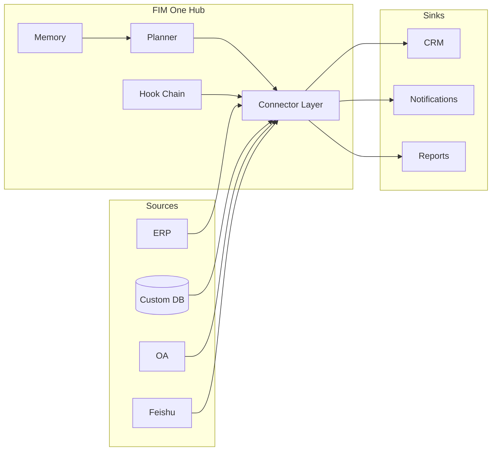

<Frame>
  
</Frame>

<Info>
  **Version 1.1 · April 2026.** This whitepaper documents the architectural thesis, category positioning, and deployment model of FIM One.
  It is intended for CTOs, enterprise architects, AI platform leads, and technical investors evaluating how to bring AI to the systems they already run.
</Info>

## Executive Summary

**Data never leaves your boundary.** That single sentence is the first-order design constraint behind every decision in FIM One, and it is the reason a new infrastructure layer is needed — not another iPaaS, and not another general-purpose agent.

Most enterprises already have the systems they need — ERP, CRM, OA, custom databases, internal APIs, industry SaaS. What they lack is a way for AI to **reach** those systems without migrating data to a vendor cloud and without a six-month integration project for every use case. The market is large, moving fast, and already repositioning: global enterprise GenAI infrastructure spend is projected at **US$18B in 2025, growing 3.2× YoY** (Menlo Ventures 2025). China is moving even faster — enterprise AI Agent spend at **120% CAGR (2023–2027), reaching ¥65.5B by 2027** (iResearch · CAICT 2025). Central/state-owned enterprises account for **60%+ of large-model procurement**, and Xinchuang (信创) private-deployment is a hard constraint.

Gartner has formally renamed this category "AI Agent Platform" (document 6300015, 2025); CAICT's 2025 Agentic AI Technology Report calls it "智能体平台"; MuleSoft, the historical iPaaS leader, was **downgraded from Leader to Challenger** in the 2025 iPaaS Magic Quadrant. The category that dominated enterprise integration for a decade is being replaced in real time.

FIM One is built for the new category. It is a **Connector Hub** — a provider-agnostic Python framework where AI agents dynamically plan and execute tasks across your existing systems, deployed in your own environment, auditable end-to-end. One agent core, three delivery modes:

| Mode | Where it lives | Typical deployment |
|---|---|---|
| **Standalone** | A portal of its own | Knowledge Q&A, internal chat, code sandbox |
| **Copilot** | Embedded inside a host system | "Finance Copilot" inside an ERP web UI |
| **Hub** | Central cross-system orchestrator | Agent queries ERP, checks OA, notifies via Feishu |

This paper explains why the category is moving, why iPaaS cannot absorb the new workload, what FIM One looks like under the hood, and how you get it into production.

## 1. The Problem: Enterprise AI Is an Alignment Problem

The public AI conversation in 2025–2026 has been dominated by model capability — longer contexts, better reasoning, cheaper tokens. Inside enterprises, capability is rarely the blocker. The blocker is that **the AI does not have hands inside your systems**.

A frontier LLM that can read a ten-thousand-line codebase and propose a correct fix cannot, by itself:

- Pull yesterday's inventory numbers out of an on-premise SAP instance.
- Approve a leave request in a SaaS HR tool whose only integration surface is a legacy SOAP API.
- Write a row into a Xinchuang-compliant ERP whose authentication is a login-ticket service instead of OAuth2.
- Send a notification into a Feishu group, respecting the group's own approval rules.

Each of these is a solved integration problem — once. The difficulty is that every enterprise has dozens of such systems, each with its own auth model, data shape, and failure modes. Hardcoding them gives you a brittle monolith. Asking the LLM to discover them at runtime gives you hallucinated API calls.

**The missing primitive is an aligned surface.** A typed, authenticated, discoverable interface between the model and the system — one that tells the model exactly what it can do, what each action costs, who must approve it, and what the result will look like. That primitive is what FIM One calls a **Connector**.

## 2. Why Existing Approaches Fall Short

### 2.1 iPaaS and Workflow Builders — A Category in Decline

iPaaS (MuleSoft, Boomi, Workato) and the lighter workflow family (n8n, Zapier, Dify, Coze) treat integration as a **design-time** problem: a human draws a graph of nodes and wires them at field-level granularity, the graph runs deterministically at runtime. The shape worked when integrations were few and stable.

It does not work for AI-driven enterprise automation, for three compounding reasons:

1. **The logic already exists inside the target system.** Every node is a thin wrapper around an API call you now maintain in two places.
2. **The human must know the plan in advance.** Enterprise questions like "close out Q1 for all APAC entities" are open-ended — the plan must be generated at runtime, not drawn by a designer.
3. **Field-level mapping collapses under scale.** A thousand-node graph across a dozen systems is unmaintainable; AI-readable action surfaces replace it entirely.

The category is visibly moving. Gartner reclassified the space as "AI Agent Platform" in 2025 (document 6300015). CAICT adopted the same framing ("智能体平台") in its 2025 Agentic AI Technology Report. Most tellingly, **MuleSoft — the reference iPaaS vendor for a decade — was downgraded from Leader to Challenger in Gartner's 2025 iPaaS Magic Quadrant**. At the same time, Anthropic's MCP protocol, released November 2024, grew to **10,000+ servers and 97M monthly SDK downloads in 15 months**. The signal is unambiguous: the integration layer of enterprise automation is being rebuilt.

### 2.2 General-Purpose Agents (Manus, AutoGPT, OpenAI Assistants)

General agents are designed for consumer and knowledge-work tasks — browsing the web, drafting documents, manipulating spreadsheets. They cannot enter your VPN, authenticate to your ERP, or pass your security review. Wrapped around enterprise systems, they become demos that die at the pilot stage.

### 2.3 Vendor-Embedded AI (Feishu AI, SAP Joule, Salesforce Einstein)

Vendors have shipped their own AI into their own products. The problem is structural: **no upstream vendor has any incentive to break its own data silo.** Feishu AI does not know your ERP data; DingTalk AI does not know your contract status. Each vendor's AI sees only what that vendor sold you. For cross-system work, they are a non-starter.

### 2.4 Build-Your-Own and RPA

In-house builds have long runways and constant adaptation cost. RPA drives the UI like a human — the most general approach and the most brittle: every UI change breaks it, every auth prompt stops it. It is a bandage over missing APIs, not a foundation to build AI on.

FIM One occupies the gap all of these leave behind: typed APIs over real systems, planned by the model, governed by the enterprise, deployed inside the enterprise boundary.

## 3. The FIM One Thesis

Three convictions shape every design decision.

**Conviction 1 — The systems already exist.** Do not ask the enterprise to rebuild; meet it where it is. Every connector is a bridge, not a replacement. Data never leaves the source of truth, and it never leaves the enterprise boundary.

**Conviction 2 — Alignment beats capability.** A weaker model with an aligned toolset outperforms a stronger model groping at raw APIs. The moat is the connector library, its auth model, and the governance layer — not the agent's raw reasoning.

**Conviction 3 — Dynamic planning is the right middle ground.** Rigid workflows (iPaaS, BPM) are too brittle for real enterprise tasks; fully autonomous agents (AutoGPT, Manus) are too unpredictable for production. FIM One plans at runtime but within a typed action space — every step is a connector call, not an open-ended LLM monologue. Bounded autonomy: `re-plan ≤ 3 | token budget | confirmation gate`.

### Beyond iPaaS

FIM One is deliberately not an iPaaS, and the distinction is not cosmetic. iPaaS is field-level, design-time, human-modeled, and vendor-cloud-hosted. FIM One is action-level, runtime, model-planned, and enterprise-hosted.

| Axis | iPaaS | FIM One |
|---|---|---|
| Granularity | Field mapping | Typed action |
| Planning time | Design time | Run time |
| Who models it | Human designer | The model |
| Data location | Vendor cloud | Your servers |
| Governance | External add-on | Built-in hooks |
| Category (Gartner 2025) | iPaaS MQ (declining) | AI Agent Platform |

## 4. Architecture Principles

<CardGroup cols={2}>
  <Card title="Provider-Agnostic" icon="shuffle">
    Any OpenAI-compatible LLM — OpenAI, Anthropic, DeepSeek, Qwen, local Ollama, Xinchuang-certified models. Model choice is a deployment variable, not an architectural commitment.
  </Card>
  <Card title="Protocol-First" icon="network-wired">
    Every connector publishes a typed schema. The agent sees actions, parameters, and return types — never raw HTTP. OpenAPI, MCP, and direct database connections are first-class.
  </Card>
  <Card title="Three Execution Engines" icon="sitemap">
    **ReAct** for exploratory tasks, **DAG** for structured pipelines, **Workflow** (up to 25 nodes) for deterministic human-designed pipelines. One agent core picks the engine per task.
  </Card>
  <Card title="Schema-First Tool Loading" icon="bolt">
    Tool schemas are pre-seeded at ~30 tokens each; the agent expands on demand. Per-session prompt overhead drops ~80%, and the platform scales to **10,000+ APIs** without blowing the context window.
  </Card>
  <Card title="Hook-Governed" icon="shield-halved">
    Every tool call passes through a configurable hook chain: audit, policy, human-in-the-loop approval. Hooks run outside the LLM loop — deterministic and auditable.
  </Card>
  <Card title="Memory-Aware" icon="brain">
    Short-term conversation, long-term knowledge base, and cross-session memory are first-class primitives, not bolt-ons.
  </Card>
</CardGroup>

## 5. Three Delivery Modes — One Agent Core

The same planner, memory, and connector library power three distinct product shapes. The choice is a deployment decision, not a code fork.

**Standalone** — a self-contained portal. The buyer wants a chat interface over a curated knowledge base, or a code sandbox, or a general assistant. No host system involved. Fits internal IT help desks, engineering productivity, customer-support KBs.

**Copilot** — the agent embedded inside an existing host system via iframe, widget, or direct embed. The host handles auth; the Copilot inherits user context. Fits Finance Copilot inside SAP Fiori, Sales Copilot inside Salesforce, DevOps Copilot inside an internal developer portal.

**Hub** — the central orchestration surface. Every connected system terminates here. Users ask cross-system questions; the agent plans and executes across systems. Fits "close out Q1 for all APAC entities", "find every customer who missed a renewal and draft outreach", "reconcile yesterday's payments between gateway and ledger".

## 6. Connector Alignment Model

A connector is a typed action surface backed by an auth strategy. FIM One defines three auth tiers that cover the vast majority of enterprise systems.

<AccordionGroup>
  <Accordion title="Tier 1 — Database Connectors (Full or Basic)">
    Direct connection to a relational or document database. **Full** mode exposes arbitrary SQL to the agent, gated by a read-only role; **Basic** mode exposes only pre-registered parameterized queries. Native support for **Xinchuang-compliant databases — Dameng (DM8), KingbaseES, HighGo, GBase** — alongside PostgreSQL, MySQL, and Oracle. Central/state-owned and regulated customers pass compliance procurement day-one.
  </Accordion>
  <Accordion title="Tier 2 — OpenAPI Connectors (User-Key)">
    Any REST API with an OpenAPI specification. The agent reads the spec, selects the endpoint, and calls it with the logged-in user's key. Covers modern SaaS (Slack, Linear, GitHub) and well-documented internal APIs.
  </Accordion>
  <Accordion title="Tier 3 — Login-Ticket / Legacy Connectors">
    For systems — particularly common in the Chinese market — that authenticate via a login-ticket service rather than OAuth2. The connector manages the ticket lifecycle (acquire, refresh, invalidate) and presents a normal typed surface upward. This tier unlocks systems every other vendor skips.
  </Accordion>
</AccordionGroup>

Each connector also declares a **Channel/Integration duality**: the same underlying system can appear both as a *channel* (notification sink, approval surface) and as an *integration* (data source, action target). Feishu is both a notification channel and a group-chat data source; DingTalk and WeCom follow the same pattern.

## 7. Trustworthy Enterprise AI — Three Pillars

Enterprise AI fails in production not because the model is wrong but because the organization cannot prove it is right. FIM One treats trust as architecture, expressed in three pillars.

<CardGroup cols={3}>
  <Card title="Every Conclusion Is Cited" icon="paperclip">
    RAG retrieval + citation chain lets the agent reference a specific paragraph in a specific document for every claim. Conclusions are traceable and auditable. No black-box output.
  </Card>
  <Card title="Every Write Is Confirmed" icon="hand">
    Write operations are forced to pause before execution, waiting for a human approval — inline in the portal or out-of-band via a Feishu approval group. The hook chain is an architectural constraint, not a policy suggestion. It cannot be bypassed.
  </Card>
  <Card title="Every Release Is Measured" icon="chart-bar">
    Dataset-driven evaluation quantifies quality before each release. Every iteration is measurable; enterprise procurement gets evidence, not promises.
  </Card>
</CardGroup>

Supporting this, every agent run emits a structured trace: plan, tool calls, arguments, observations, approvals, final answer. Traces are the unit of audit. Credentials use Fernet encryption (AES-128-CBC + HMAC-SHA256). Full audit logs are stored and exportable.

When an operator rejects a tool call, the agent stops — it does not paraphrase and retry. Rejection is a policy decision, not an error to recover from.

## 8. Deployment and Business Model

FIM One is open-source under a permissive license (FIM-SAL), with three deployment shapes and three edition tiers.

<CardGroup cols={3}>
  <Card title="Community" icon="code">
    Free forever. Self-hosted. For developers and evaluation teams.
  </Card>
  <Card title="Cloud" icon="cloud">
    Wuzhi-hosted on cloud.fim.ai. Per-user + per-connector subscription. Singapore entity handles overseas contracts.
  </Card>
  <Card title="Enterprise" icon="briefcase">
    Private deployment, custom pricing, compliance tooling, dedicated technical support. For large enterprises and government/state-owned customers.
  </Card>
</CardGroup>

The codebase is ~170,000 lines of Python across 1,590+ modules, with ~100 test files and built-in support for 6 UI languages. Source is open under FIM-SAL — enterprises can audit security themselves. The dominant runtime cost is LLM tokens, not infrastructure; provider-agnosticism means you benefit as the frontier pushes prices down, without migration.

## 9. Delivery Path

Production deployment follows a three-step path that keeps risk bounded and time-to-value short.

| Step | Timeline | What happens |
|---|---|---|
| **1. PoC** | 2 weeks | 1–2 representative scenarios (finance audit, contract review, data reporting), end-to-end on real data. First version in 7 days, validation report in 14. |
| **2. Pilot** | 1–2 months | Private deployment to your servers. First 3–5 connectors (ERP / OA / Feishu / DingTalk / database). One business line covered. Audit and approval baselines established. |
| **3. Scale** | 3–6 months | Expansion to more business lines and connectors. Industry Skill packs accumulated. Internal administrators trained. Operations runbook and SLA delivered. |

Eight vertical pre-built Solution templates cover the most common scenarios: finance audit, contract review, data reporting, procurement reconciliation, customer payment collection, compliance screening, HR screening, ops on-call.

## 10. Where This Goes

**Near-term — connector depth.** More Tier-3 legacy connectors for the Chinese market, deeper Xinchuang certification, and an AI Builder that turns an OpenAPI spec or a database schema screenshot into a working connector in minutes.

**Near-term — governance depth.** Richer RBAC, four-tier connector permissions, independent IdP, SSO by default, SOC 2 and ISO 27001 posture.

**Mid-term — ecosystem.** Cloud SaaS, a Connector Marketplace, and industry Solution packs — the infrastructure layer that third parties build on top of.

The longer-term bet is that the shape of enterprise AI will look far more like a Hub than a CLI. Knowledge workers will not install ten AI assistants; they will ask their company's Hub, and the Hub will know how to reach whatever system holds the answer. FIM One is building the Hub.

## 11. Appendix — Going Deeper

- **[System Overview](/architecture/system-overview)** — component-level architecture.
- **[Connector Architecture](/architecture/connector-architecture)** — the connector contract, lifecycle, and extension model.
- **[Design Philosophy](/architecture/design-philosophy)** — why we made each core tradeoff.
- **[Hook System](/architecture/hook-system)** — policy, approval, and audit in depth.
- **[Competitive Landscape](/strategy/competitive-landscape)** — category positioning and head-to-head comparison.
- **[Quickstart](/quickstart)** — run FIM One on your laptop in under ten minutes.

<Tip>
  Questions, corrections, or commercial inquiries: hi@fim.ai · [Discord](https://discord.gg/z64czxdC7z) · [GitHub](https://github.com/fim-ai/fim-one)
</Tip>
