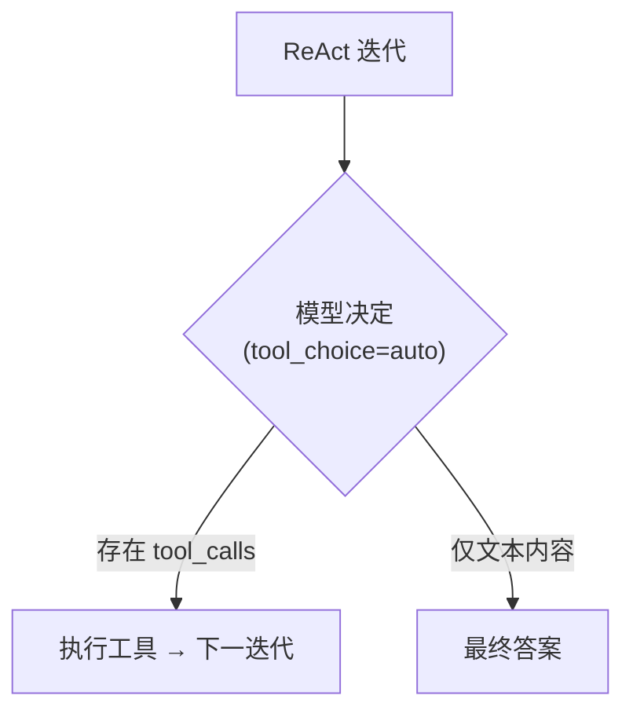
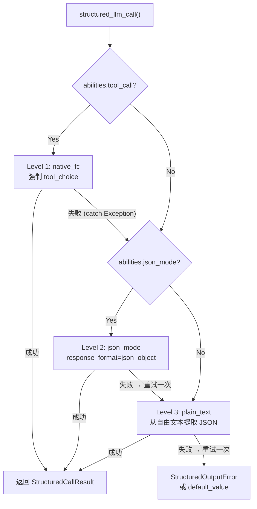
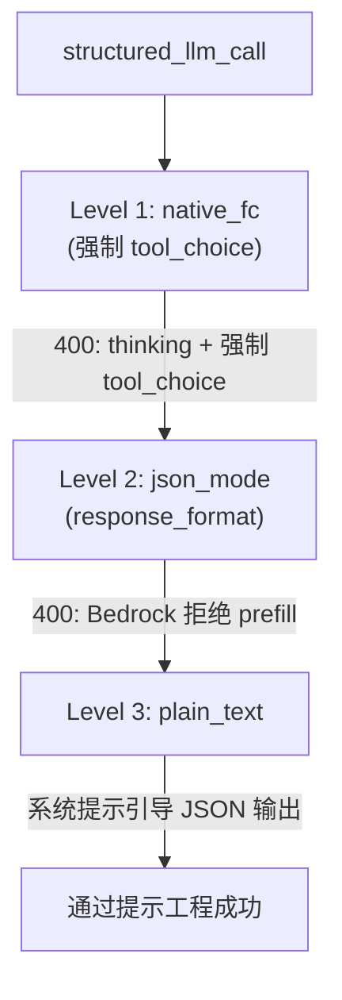

## 供应商检测

FIM Agent 使用 LiteLLM 作为通用适配器。`core/model/openai_compatible.py` 中的 `_resolve_litellm_model()` 函数将用户的 `LLM_BASE_URL` + `LLM_MODEL` 映射为带有供应商前缀的 LiteLLM 模型标识符。该前缀决定了 LiteLLM 如何路由请求 — 使用原生 API 协议（Anthropic Messages API、Gemini 等）还是通用 OpenAI 兼容的 `/v1/chat/completions`。

解析顺序：

1. **显式供应商**（来自数据库 `ModelConfig.provider` 字段）— 最高优先级。如果供应商与 URL 中的已知域名匹配，则不返回 `api_base`（LiteLLM 原生路由）。否则，`api_base` 设为中继 URL。
2. **域名匹配** — 通过 `KNOWN_DOMAINS` 识别官方 API 端点的主机名。
3. **URL 路径提示** — 通过 `PATH_PROVIDER_HINTS` 识别，常见于 UniAPI 等中继平台，其中 URL 路径中的 `/claude` 或 `/anthropic` 表示上游协议。
4. **兜底** — `openai/` 前缀（通用 OpenAI 兼容）。

| 域名 / 路径 | 供应商前缀 | 协议 |
|---|---|---|
| `api.openai.com` | `openai/` | OpenAI Chat Completions |
| `anthropic.com` | `anthropic/` | Anthropic Messages API |
| `generativelanguage.googleapis.com` | `gemini/` | Google Gemini |
| `api.deepseek.com` | `deepseek/` | DeepSeek（OpenAI 兼容） |
| `api.mistral.ai` | `mistral/` | Mistral |
| 路径包含 `/claude` 或 `/anthropic` | `anthropic/` | Anthropic Messages API（经中继） |
| 路径包含 `/gemini` | `gemini/` | Google Gemini（经中继） |
| 其他 | `openai/` | 通用 OpenAI 兼容 |

当供应商前缀是原生协议（anthropic、gemini 等）且 URL 不是官方端点时，LiteLLM 使用原生协议但将请求发送到中继的 `api_base`。这意味着供应商特有的行为 — 包括下文描述的 Bedrock prefill 问题 — 无论请求是发往官方 API 还是通过中继，都会生效。

<Warning>
如果你的中继 URL 路径中包含 `/claude`，FIM Agent 会自动通过 Anthropic 原生协议路由。这通常是正确的（更好的流式传输、thinking 支持），但意味着供应商特有的行为会生效 — 包括下文描述的 Bedrock prefill 问题。
</Warning>

## tool_choice — 四种模式

`tool_choice` 参数以 OpenAI 格式标准化。LiteLLM 在发送请求前将其转换为每个供应商的原生协议。

| 模式 | 含义 | 供应商支持 |
|---|---|---|
| `"auto"` | 模型决定是调用工具还是返回文本 | 所有供应商 |
| `"required"` | 必须调用工具，但模型选择调用哪个 | 大多数供应商 |
| `{"type":"function","function":{"name":"X"}}` | 必须调用指定的函数 X | 大多数供应商 — **与 Anthropic thinking 不兼容** |
| `"none"` | 不能使用工具，仅文本 | 所有供应商 |

`"auto"` 和强制模式（`{"type":"function",...}`）之间的区别是 FIM Agent 中每个兼容性问题的核心。这两种模式由完全不同的子系统以不同的方式使用。

## tool_choice 的使用位置

两个子系统使用 `tool_choice`，且使用方式截然不同。

### ReAct 引擎 — tool_choice="auto"

ReAct 循环需要模型在每次迭代中决定：调用工具，还是给出最终答案。这里只有 `"auto"` 有意义 — 模型自由选择产生 `tool_calls` 或文本内容。这与所有供应商、所有模型、包括扩展思考在内的所有模式都兼容。



当 `abilities["tool_call"] = True` 时，ReAct 引擎使用原生函数调用（`_run_native`），否则回退到 JSON 内容模式（`_run_json`）。两种模式都使用 `"auto"` — 区别在于工具是通过 `tools` 参数传递还是在系统提示中描述。详见 [ReAct 引擎 — 双模式执行](/zh/architecture/react-engine#双模式执行)。

### structured_llm_call — tool_choice=强制

一次性结构化提取（schema 标注、DAG 规划、计划分析）。强制模型调用特定的虚拟函数，保证结构化 JSON 输出。这是触发供应商特定错误的调用点。

`structured_llm_call` 实现了三级降级链：



关键设计区别：`structured_llm_call` 的回退是**运行时**的 — 它动态尝试每个级别并捕获异常以进行降级。ReAct 引擎的模式选择是**构建时**的 — 在启动时检查一次 `_native_mode_active` 并在整个循环中使用该模式。这意味着 `structured_llm_call` 可以透明地从供应商特定的 400 错误中恢复，而 ReAct 依赖于模式在一开始就被正确选择。

## Bedrock prefill 陷阱

当为以 `anthropic/` 前缀解析的模型传递 `response_format={"type":"json_object"}` 时，LiteLLM 会内部注入一条 assistant prefill 消息来模拟 JSON 模式。Anthropic Messages API 没有原生的 `response_format` 参数，因此 LiteLLM 通过预填充一个左花括号作为 assistant 内容来近似实现：

```json
{"role": "assistant", "content": "{"}
```

这在 Anthropic 直连 API 上可以工作。然而，较新版本的 AWS Bedrock 模型会拒绝最后一条消息为 `role: "assistant"` 的对话 — 它们称之为"assistant message prefill"并抛出：

```
ValidationException: This model does not support assistant message prefill.
The conversation must end with a user message.
```

此错误仅在**同时满足以下三个条件**时发生：

1. 模型以 `anthropic/` 前缀解析（通过域名匹配或 URL 路径提示）。
2. 传递了 `response_format={"type":"json_object"}`（`structured_llm_call` 中的 json_mode 代码路径）。
3. 实际后端是 AWS Bedrock（拒绝 prefill）。

<Warning>
这不影响原生工具调用（带 `tools=` 参数的 `tool_choice="auto"`）。prefill 注入仅在 `response_format` 时发生。ReAct agent 执行完全不受影响。
</Warning>

实际的失败路径如下：



当 Level 1（thinking 冲突）和 Level 2（Bedrock prefill）都失败时，系统仍然在 Level 3 恢复 — 但代价是每次结构化提取浪费两次 LLM 调用。下面的修复方案消除了浪费的 json_mode 调用。

### 修复方案：json_mode_enabled

每个模型的 `json_mode_enabled` 标志控制是否尝试 Level 2（json_mode）：

- **数据库配置的模型**：在管理后台 → 模型 → 高级设置中切换。该标志存储在 `ModelConfig.json_mode_enabled`（默认 `TRUE`）。
- **环境变量配置的模型**：在环境中设置 `LLM_JSON_MODE_ENABLED=false`。
- **效果**：禁用后，`abilities["json_mode"]` 返回 `False` → 永远不传递 `response_format` → 没有 prefill → Bedrock 正常工作。降级链变为 `native_fc → plain_text`，完全跳过注定失败的 json_mode 调用。
- **无质量损失**：模型仍然返回有效的 JSON，因为系统提示指导其这样做。plain_text 级别使用 `extract_json()` 从自由文本中解析 JSON，在现代模型上运行可靠。

## Anthropic thinking + 强制 tool_choice

Anthropic API 在启用扩展思考时拒绝 `tool_choice={"type":"function","function":{"name":"X"}}`。错误信息：

```
Thinking may not be enabled when tool_choice forces tool use
```

这是协议层面的语义冲突：强制特定工具调用与模型推理选择哪个工具（或是否调用工具）的自由相矛盾。Anthropic 强制执行此约束；其他供应商不会。

此冲突**仅影响** `structured_llm_call` 的 Level 1（native_fc），它使用强制 `tool_choice` 来保证结构化输出。`_call_llm` 中现有的 `try/except` 捕获 400 响应并降级到 json_mode 或 plain_text。`abilities` 字典中不需要特殊处理。

关键是，`tool_choice="auto"` 在 Anthropic thinking 启用时完美工作。ReAct 引擎专门使用 `"auto"`，因此永远不受影响。

<Warning>
不要通过设置 `abilities["tool_call"] = False` 来绕过 thinking + 强制 tool_choice 的冲突。这会禁用 ReAct 的 `_run_native` 模式（它使用 `tool_choice="auto"` 且与 thinking 完美兼容），迫使其进入 `_run_json` 模式。在 `_run_json` 中，模型必须在内容中产生有效的 JSON — 这不太可靠，而且在 Bedrock 上，如果启用了 json_mode，可能触发 prefill 问题。正确的修复方式是让 `structured_llm_call` 的降级链自行处理。
</Warning>

## 快速参考：各场景兼容性

| 场景 | ReAct 模式 | structured_llm_call 路径 | 备注 |
|---|---|---|---|
| OpenAI（任何模型） | `_run_native` | native_fc | 完全支持，无注意事项 |
| Anthropic（无 thinking） | `_run_native` | native_fc | 完全支持 |
| Anthropic + thinking | `_run_native` | native_fc → 400 → json_mode | 自动降级，浪费一次调用 |
| Bedrock 中继（无 thinking） | `_run_native` | native_fc | 完全支持 |
| Bedrock 中继 + thinking | `_run_native` | native_fc → 400 → json_mode → 400 → plain_text | 浪费两次调用；设置 `json_mode_enabled=false` |
| Bedrock 中继 + `json_mode_enabled=false` | `_run_native` | native_fc → 400 → plain_text | Bedrock + thinking 的推荐配置 |
| Bedrock 中继（无 thinking）+ `json_mode_enabled=false` | `_run_native` | native_fc | 无影响 — native_fc 首次即成功 |
| Gemini | `_run_native` | native_fc | 完全支持 |
| DeepSeek | `_run_native` | native_fc | 完全支持 |
| 通用 OpenAI 兼容 | `_run_native` | native_fc | 完全支持 |
| 任何 `tool_call=false` 的模型 | `_run_json` | json_mode 或 plain_text | 不支持工具调用的模型的回退方案 |

**AWS Bedrock 中继的推荐配置：**

```bash
# 在 .env 或环境变量中
LLM_JSON_MODE_ENABLED=false
```

或在管理后台按模型设置：管理后台 → 模型 → 选择 Bedrock 模型 → 高级 → 禁用"JSON Mode"。

这消除了所有浪费的调用。降级路径变为 `native_fc → plain_text`（无 thinking）或 `native_fc → 400 → plain_text`（有 thinking）。两条路径都快速可靠。

## 推理能力与 thinking 配置

FIM Agent 提供两个环境变量来控制扩展思考 / 推理：

| 变量 | 值 | 效果 |
|---|---|---|
| `LLM_REASONING_EFFORT` | `low`、`medium`、`high` | 作为 `reasoning_effort` 传递给 LiteLLM。Anthropic：映射为 `thinking` 参数。OpenAI o 系列：直接传递。其他：静默丢弃（`drop_params=True`）。 |
| `LLM_REASONING_BUDGET_TOKENS` | 整数（如 `10000`） | 仅 Anthropic：设置显式的 `thinking.budget_tokens` 上限，绕过 LiteLLM 的自动映射。用于控制 Claude 模型的成本。 |

当设置了 `reasoning_effort` 且模型解析为 `anthropic/` 时，有两个额外行为：

1. **温度强制为 1.0。** Bedrock 在启用 thinking 时拒绝 `temperature != 1.0`。FIM Agent 自动处理此问题 — 无需用户操作。
2. **GPT-5.x + tools**：当存在 `tools` 时，`reasoning_effort` 被静默丢弃，因为 GPT-5 的 `/v1/chat/completions` 端点拒绝该组合。这仅影响 ReAct 工具循环；没有 `tools` 参数的 `structured_llm_call` 调用不受影响。

## 故障排查

**"This model does not support assistant message prefill"**
Bedrock + json_mode。设置 `LLM_JSON_MODE_ENABLED=false` 或在管理后台模型设置中禁用 JSON Mode。

**"Thinking may not be enabled when tool_choice forces tool use"**
Anthropic thinking + `structured_llm_call` 中的强制函数调用。这是**预期行为，不是错误**。降级链捕获 400，跳过 native_fc，在 json_mode 或 plain_text 层级成功完成。该日志级别为 DEBUG——只有 `LOG_LEVEL=DEBUG` 时才会显示。代价：约 300ms 网络往返，零 token 消耗（400 阶段模型未运行）。无需操作。

**ReAct 意外回退到 JSON 模式**
检查模型的 `abilities["tool_call"]` 是否为 `True`。对于 `OpenAICompatibleLLM` 始终为 `True`，但自定义的 `BaseLLM` 子类可能覆盖它。通过管理 API 的模型详情端点验证。

**structured_llm_call 耗尽所有级别并抛出 StructuredOutputError**
模型在所有级别都未能产生可解析的 JSON。这在现代模型上很少见。检查：(1) schema 是有效的 JSON Schema，(2) 模型有足够的 `max_tokens` 来产生完整响应，(3) 系统提示没有与 schema 指令矛盾。DAG planner 和 analyzer 都提供了 `default_value` 回退，因此此错误仅从显式省略默认值的调用点传播。
