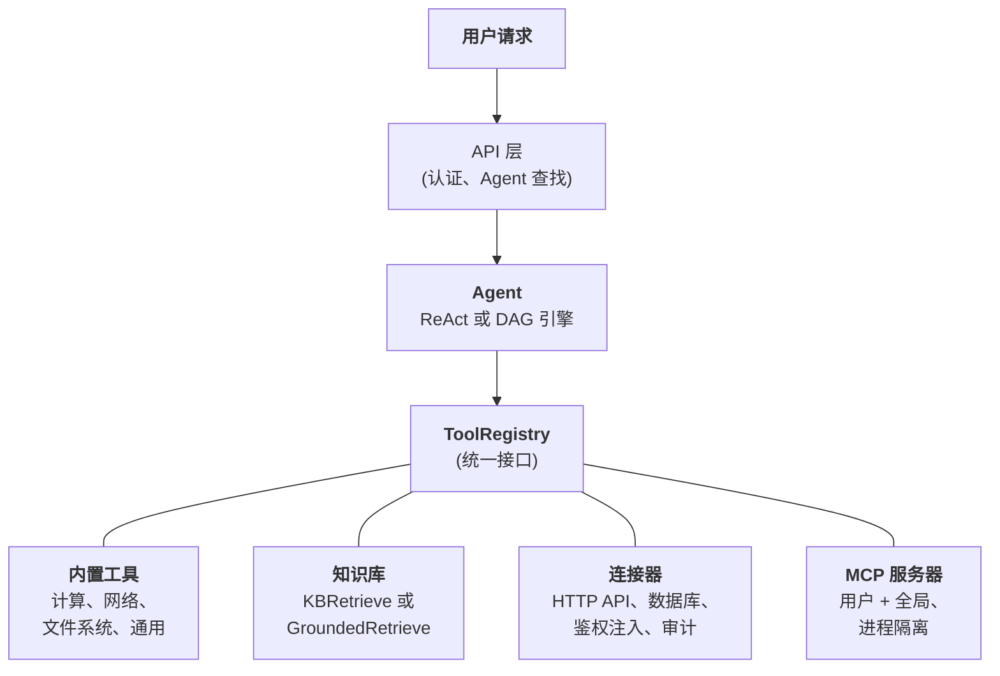
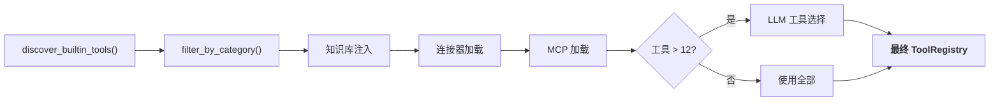

  ## 统一的工具抽象

FIM Agent 的核心设计理念是：**Agent 能做的一切都是工具**。计算器、知识库查询、ERP API 调用、第三方 MCP 服务器——它们都实现同一个 `Tool` 协议：`name`、`description`、`parameters_schema`、`category` 和 `run()`。Agent 不知道、也不需要关心它调用的是一个本地 Python 函数、向量数据库查询、遗留系统代理调用，还是社区 MCP 服务器。它看到的只是 `ToolRegistry` 中一个扁平的可调用工具列表。

这是一个刻意的架构选择，而不是偶然的简化。这意味着新增一种能力来源永远不需要修改 Agent、执行引擎或上下文管理层。你只需注册工具；Agent 自会使用。

四种能力来源汇聚到同一个注册表。Agent 平等地使用所有来源。

  ## 四种能力来源

### 内置工具

启动时通过 `discover_builtin_tools()` 自动发现。在 `core/tool/builtin/` 下放置一个 `BaseTool` 子类，即可自动注册，无需任何配置。类别包括计算 (`calculator`、`python_exec`)、网络 (`web_search`、`web_fetch`)、文件系统 (`file_ops`) 和通用 (`email_send`、`json_transform`、`template_render`、`text_utils`)。这些是 Agent 的原生能力——始终可用，零配置。

### 知识库

条件性注册。当 Agent 绑定了 `kb_ids` 时，通用的 `kb_retrieve` 工具会被替换为专用的检索工具。在**简单模式**下，`KBRetrieveTool` 执行基础 RAG 检索。在 **Grounding 模式**下，`GroundedRetrieveTool` 运行 5 阶段流水线：多知识库检索、引用提取、对齐评分、冲突检测和置信度计算。知识库不是一个独立于 Agent 之外的子系统——它以专用工具的身份进入 Agent，遵守与其他一切相同的 `Tool` 协议。

### 连接器

`ConnectorToolAdapter` 将企业系统操作封装为工具。每个操作成为一个名为 `{connector}__{action}` 的工具，分类为 `connector`。适配器增加了 HTTP 代理与鉴权注入 (bearer、API key、basic)、操作级别的访问控制 (read/write/admin)、响应截断和审计日志。对于直接数据库访问，`DatabaseToolAdapter` 提供 Schema 感知的 SQL 执行，可选只读模式。连接器是 AI 与遗留系统之间的桥梁——也是核心差异化能力。详见[连接器架构](/zh/architecture/connector-architecture)。

### MCP

外部 MCP 服务器通过标准协议提供第三方工具。每个服务器在独立进程中运行 (stdio 或 HTTP 传输)，与平台完全隔离。工具被适配为 `Tool` 协议并注册到 `mcp` 类别下。管理员可配置**全局 MCP 服务器**，自动为所有用户加载。MCP 是生态策略——任何兼容 MCP 的服务器无需定制集成即可使用。

  ## 每次请求的工具组装

每个聊天请求都会通过 `_resolve_tools()` 中的过滤管道组装一套新的工具集。这不是静态配置——而是根据 Agent 设置、用户身份、可用连接器和 MCP 服务器，在每次请求时动态计算的。

六个步骤：

1. **基础发现。** `discover_builtin_tools()` 加载所有内置工具，作用域限定在会话的沙箱内。
2. **Agent 类别过滤。** `filter_by_category(*agent.tool_categories)` 仅保留 Agent 被允许使用的类别。
3. **知识库注入。** 如果 Agent 有 `kb_ids`，根据检索模式将通用检索工具替换为 `KBRetrieveTool` 或 `GroundedRetrieveTool`。
4. **连接器加载。** 从数据库查询 Agent 绑定的连接器。每个连接器的操作 (或数据库 Schema) 被实例化为工具适配器并注册。
5. **MCP 加载。** 加载用户的个人 MCP 服务器和管理员配置的全局 MCP 服务器，建立连接，注册其工具。
6. **运行时选择。** 如果总工具数超过 12，一次轻量级 LLM 调用为当前查询挑选最相关的子集 (最多 6 个)。选择失败不会致命——Agent 回退到完整工具集。

最终结果：Agent 看到的恰好是它需要的工具，不多不少。一个没有连接器和知识库的简单 Agent 可能只看到 5 个工具。一个连接了 3 个企业系统、带有 Grounding 知识库和 2 个 MCP 服务器的 Hub Agent 可能有 30 个工具——但经过选择后，只有最相关的 6 个进入上下文。

  ## 何时使用什么

| 需求 | 使用 | 原因 |
|------|------|------|
| 通用计算、代码执行、文本转换 | 内置工具 | 始终可用，无需配置 |
| 企业系统集成 (ERP、CRM、OA) | 连接器 | 鉴权治理、审计追踪、操作级别访问控制 |
| 带引用和证据的知识检索 | 知识库 | RAG 流水线、Grounded Generation、冲突检测 |
| 第三方工具生态 | MCP | 标准协议、进程隔离、社区服务器 |
| 直接数据库访问 | 数据库连接器 | Schema 感知 SQL、可选只读强制 |
| 定制内部工具 | MCP 或内置 | MCP 用于进程隔离；内置用于紧密集成 |

这些类别并非互斥。单个 Agent 可以在一次对话中同时使用所有四种能力来源——查询知识库获取政策文档、调用连接器检查 ERP、使用内置工具格式化结果。

  ## 执行引擎是正交的

工具系统与执行引擎是独立的关注点。两个引擎从同一个 `ToolRegistry` 消费工具。引擎的选择影响的是工具的编排方式，而不是哪些工具可用。

**ReAct** 是迭代式工具循环。Agent 推理、选择工具、观察结果，然后重复直到完成。它擅长探索性、对话式任务，其中下一步取决于上一步的结果。循环最多运行 50 次迭代，每次迭代通过 ContextGuard 进行上下文管理。详见 [ReAct 引擎](/zh/architecture/react-engine)。

**DAG** 将目标分解为 2-6 个并行步骤。每个步骤运行一个独立的 ReAct Agent。PlanAnalyzer 评估目标是否达成；如果未达成，流水线自主重新规划 (最多 3 轮)。DAG 擅长有明确子任务且可并发执行的场景——"搜索三个来源并比较结果"只需一次搜索的时间，而不是三次。详见 [DAG 引擎](/zh/architecture/dag-engine)。

两个引擎共享基础设施：`structured_llm_call` 用于可靠的结构化输出，`ContextGuard` 用于 Token 预算控制，`ToolRegistry` 用于工具解析。添加新工具不需要修改任何引擎。添加新引擎 (如果有需要) 也不需要修改工具系统。

  ## 生命周期总览

**启动阶段。** `start.sh` 运行 Alembic 迁移，启动 FastAPI 服务器，发现内置工具，并为所有预配置的全局服务器建立 MCP 连接。

**每次请求。** JWT 认证 → Agent 配置查找 → 工具组装 (上述 6 步管道) → 引擎选择 (根据 Agent 配置选择 ReAct 或 DAG) → 执行与 SSE 流式输出 → 结果持久化。

**横切关注点。** [上下文管理](/zh/architecture/context-management) (5 层 Token 预算) 保护每次 LLM 调用不会溢出。审计日志追踪每次连接器工具调用。沙箱隔离封装代码执行工具。双 LLM 架构 (smart + fast) 在规划、执行和合成之间优化成本。

架构的设计使得每个关注点——工具注册、执行编排、上下文管理、安全——都可以独立演进。新的连接器类型、新的执行引擎或新的上下文策略，都可以在不引起系统级联变更的情况下加入。
