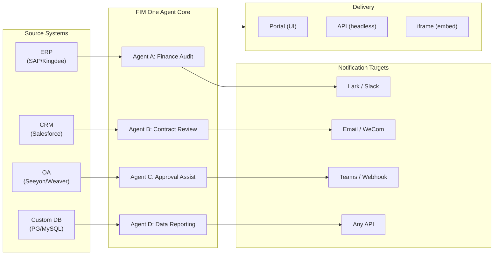

> 目标：构建**面向全球×中国企业的一体化智能体平台**——通过三种渐进式模式交付：独立版（门户助手）、副驾驶（嵌入主系统）、中枢（跨系统中央编排）。
>
> 原则：**提供商无关**（无供应商锁定）、**最小抽象**、**协议优先**、**连接器优先**（集成是核心价值）。

## 产品愿景

FIM One是一个**一体化智能体平台**，提供三种渐进式交付模式：

```
Standalone   → Your own AI assistant (Portal)
Copilot      → AI embedded in a host system (iframe / widget / embed)
Hub          → Central cross-system orchestration (Portal / API)
```

**跨系统编排是核心差异化优势。** 企业客户拥有遗留系统——ERP、CRM、OA、财务、HR——需要通过AI相互通信：



**GTM路径：先着陆，后扩展**

| 步骤 | 模式 | 发生的事 |
|------|------|-------------|
| 着陆 | Copilot | 嵌入到一个系统中，在其UI内证明价值 |
| 扩展 | Copilot → Hub | 推广到更多系统；Hub模式聚合它们 |

## 已知问题

可在生产环境中复现但尚未修复的跟踪缺陷。每个条目说明症状、疑似影响范围和解决方案（如有）。修复范围确定并排期后，条目将移至版本部分。

- **智能体编辑器在未进行任何编辑的情况下显示未保存更改警告。** 通过 `/agents/[id]` 打开现有智能体，立即点击返回会触发"未保存更改"对话框，即使没有触及任何字段。脏检查会对比加载的智能体有效负载中的 20 多个字段，因此状态初始化和脏比较之间的一个不对称默认值足以导致虚假不匹配——当前怀疑是嵌套的 `model_config_json` / 通知 / 审批路由字段之一，可能来自 `undefined` vs `null` vs `""` 规范化。特别是在组织范围的智能体上可复现。解决方案：关闭对话框（`Discard and leave`）——由于实际上没有任何更改，所以没有数据丢失。尝试的修复（`cb40c86a`）移除了资源选择器上相关的孤立徽章闪烁，但未解决此问题。

- **保存智能体编辑可能失败，错误为 `Input should be 'initiator', 'agent_owner' or 'org_members'`。** Pydantic 在 `/api/agents/{id}` PUT 边界处拒绝 `confirmation_approver_scope` 字段，尽管数据库中存储的每个值都是三个有效字面值之一。怀疑：前端 `as "initiator" | "agent_owner" | "org_members"` 强制转换仅是编译时承诺，因此来自模板、导入或较旧迁移的遗留或意外运行时字符串可能会通过 `setConfirmationApproverScope` 并被逐字回显。解决方案：在保存前在"审批"→"审批人范围"下拉菜单中显式重新选择一个值。

- **演练场停止并重试显示瞬间视觉伪影，页面刷新总是会清除。** 三个并发渲染源——`activeConversation.messages`（数据库快照）、SSE `messages` 流和乐观的 `pendingQuery` 占位符——未折叠为单个派生状态，因此在点击"重试"和配对的助手响应到达之间，UI 可能会（a）在流前窗口中短暂渲染相同查询两次，（b）在 `hasLiveMessages` 为真且快照重新加载前从重试历史中删除先前的孤立用户气泡，以及（c）在 SSE"完成"事件和下一个 `selectConversation` 刷新之间的狭窄窗口中闪烁。**数据永远不会丢失**——每条用户消息（包括中止的重试）都保存在 `conversation.messages` 中，通过 `normalize_alternating_messages` 传入下一个 LLM 调用，并在通过 `48ba08c6` 渲染修复中引入的 `HistoryTurn.orphanUserContents` 刷新后正确渲染。作为背景，Claude 自己的网页 UI 表现出类似的缺陷类别——在响应中途停止并立即发送后续查询有时会将后续查询作为第一个查询的同级编辑分支而不是作为新轮次追加——因此这是乐观 UI + SSE + 持久化历史设计中的已知难题，而不是 FIM One 特定的缺陷。正确的修复需要将三个渲染源折叠为单个派生状态；延迟到更广泛的演练场状态机重构。

## 已发布的版本

### v0.1 (2026-02-22) — MVP: ReAct + DAG Planner
- ReActAgent with tools (calculator, python_exec, web_search)
- DAG Planner (LLM generates dependency graphs)
- Portal UI with streaming + KaTeX

### v0.2 (2026-02-24) — 多模型 + 记忆
- 重试 / 速率限制 / 使用情况跟踪
- 原生函数调用（无仅 JSON 解析）
- 多模型支持（快速 + 主 LLM）
- 记忆：WindowMemory、SummaryMemory
- FastAPI 后端与 SSE 流式传输

### v0.3 (2026-02-25) — Web Tools + MCP
- Web tools (web_search, web_fetch) via Jina/Tavily/Brave
- File operations tool
- MCP client (standard tool integration)
- Tool auto-discovery + categories
- DAG visualization with click-to-scroll
- Code exec in Docker (`--network=none`)

### v0.4 (2026-02-25) — 多轮对话 + 智能体
- 多轮对话（DbMemory）
- 工具步骤折叠 UI
- HTTP 请求 + shell 执行工具
- 智能体管理（创建、配置、发布）
- JWT 身份验证
- 按智能体执行模式 + 温度控制

### v0.5 (2026-02-28) — 完整 RAG + 基础生成
- 完整 RAG 管道（嵌入 + 向量存储 + FTS + RRF + 重排序器）
- 基础生成（引用、置信度分数）
- 知识库文档管理（CRUD、搜索、重试、模式迁移）
- ContextGuard + 固定消息（令牌预算管理器）
- DbMemory 持久化 + LLM Compact
- DAG 重新规划（最多 3 轮）

### v0.6 (2026-03-01) — 连接器平台
- **连接器 CRUD**: 创建、读取、更新、删除
- **ConnectorToolAdapter**: 将连接器转换为 BaseTool
- **按用户凭证**: AES-GCM 加密
- **确认门**: 写入操作审批
- **审计日志**: 所有工具调用记录
- **断路器**: 故障时优雅降级
- **实用工具**: email_send、json_transform、template_render、text_utils
- **嵌入选项**: Jina、OpenAI、自定义提供商

### v0.7 (2026-03-06) — 管理平台 + 多租户
- **管理平台**: 用户管理、角色切换、密码重置、账户启用/禁用
- **邀请制注册**: 三种模式（开放/邀请/禁用）+ 邀请码 CRUD
- **存储管理**: 按用户磁盘使用量、清除、孤立文件清理
- **对话审核**: 管理员列表/删除所有对话
- **按用户强制登出**: 撤销所有令牌
- **API 健康仪表板**: 系统统计、连接器指标
- **首次运行设置向导**: 引导式管理员账户创建
- **个人中心**: 按用户全局指令、语言偏好
- **JWT 认证**: 基于令牌的 SSE 认证、对话所有权
- **全局 MCP 服务器**: 管理员配置、在所有会话中加载
- **向后兼容**: registration_enabled → registration_mode 自动迁移

### v0.7.x (2026-03-07 to 2026-03-12) — 稳定性 + 打磨
- 邀请码管理
- 按用户配额（429 强制执行）
- 结构化审计日志
- 敏感词过滤
- 管理员登录历史
- 管理员文件浏览器
- 增强的管理员视图（model_name、tools、kb_ids 字段）
- Docker Compose 部署（单个镜像、命名卷）
- OAuth 自动检测（来自 window.location）
- 扩展思考/推理支持（`LLM_REASONING_EFFORT`、`LLM_REASONING_BUDGET_TOKENS`）支持 OpenAI o 系列、Gemini 2.5+、Claude
- 管理员按工具启用/禁用（禁用的工具在运行时从聊天中排除）
- MCP 服务器管理移至连接器页面
- 双数据库支持：SQLite（零配置默认）+ PostgreSQL（生产环境）；Docker Compose 自动配置 PostgreSQL
- 模型配置文档页面，包含每个提供商的扩展思考设置
- SSE 协议 v2：实时答案流式传输，包含 `delta_reasoning`、`usage` 字段，以及拆分的 `done`/`suggestions`/`title`/`end` 事件；SQLite 连接池大小 5 -> 20
- AI Builder 扩展：7 个新的构建器工具（GetSettings、TestConnection、ImportOpenAPI 用于连接器；ListConnectors、AddConnector、RemoveConnector、SetModel 用于智能体），智能体上的 `is_builder` 标志，构建器提示自动刷新，SSRF 防护
- SSE v2 前端：流式点脉冲光标，DAG 重新规划轮快照作为可折叠卡片，DAG 布局与步骤状态解耦
- AI Builder 概念文档页面，包含连接器和智能体构建器指南
- 组织系统：完整的 CRUD 操作，基于角色的成员资格（所有者/管理员/成员），管理员管理 UI
- 三层资源可见性（个人/组织/全局）用于智能体、连接器、知识库、MCP 服务器
- 发布/取消发布 API 用于所有资源类型；已发布智能体的所有者委派
- 管理员设置可见性端点（替换克隆到全局）；统一的 `build_visibility_filter()` 查询助手
- 数据库连接器（第 1-3 阶段）：直接 SQL 访问 PG/MySQL/Oracle/SQL Server + 中文遗留数据库；模式内省、AI 注释、只读查询执行、加密凭证、每个连接器 3 个工具（`list_tables`、`describe_table`、`query`）
- **评估中心**：定量智能体质量基准测试 — 测试数据集 CRUD（提示 + 预期行为 + 断言），评估运行（并行执行 + LLM 评分器 + 每个案例的通过/失败/延迟/令牌结果），带自动轮询的结果查看器；迁移 `r8t0v2x4z567`
- 三个模型角色（通用/快速/推理）具有按层级的环境配置隔离；快速模型不再继承主模型设置
- `StepOutput` 数据类替换纯字符串步骤结果，用于结构化数据和工件传递
- DAG 执行的工具缓存 — 每次运行中相同的工具调用缓存，具有异步锁雷鸣羊群防护（`DAG_TOOL_CACHE`）
- 按步骤 LLM 验证，失败时重试 1 次（`DAG_STEP_VERIFICATION`）
- 自动路由：快速 LLM 将查询分类为 ReAct 或 DAG；`/api/auto` 端点；前端 3 向模式切换（`AUTO_ROUTING`）
- [x] ~~**影子市场组织 + 资源订阅**~~：内置市场组织（影子，无自动加入）替换平台组织；通过市场浏览发现资源并明确订阅（拉取模型）；用于订阅共享资源的市场 API；发布到市场始终需要审查；资源订阅表；基于组织的资源共享替换全局可见性
- [x] ~~**智能体自动发现和子智能体绑定**~~：智能体上的 `discoverable` 标志；`sub_agent_ids` 白名单；CallAgentTool 用于委派任务给专家智能体
- [x] ~~**MCP 服务器凭证 + 按用户覆盖**~~：`mcp_server_credentials` 表；`PUT /api/mcp-servers/{id}/my-credentials` 端点；凭证回退行为的 `allow_fallback` 标志
- [x] ~~**连接器/知识库切换**~~：`POST /api/connectors/{id}/toggle` 和 `POST /api/knowledge-bases/{id}/toggle` 用于暂停/恢复资源
- [x] ~~**独立知识库对话**~~：对话上的 `kb_ids` 字段，用于直接知识库聊天，无需智能体绑定

### v0.8 (2026-03-20) — 连接器声明式配置 + 渐进式披露
- [x] **数据库连接器**: 直接 SQL 访问 (PostgreSQL, MySQL, Oracle) *(在 v0.7.x 中发布 — 第 1-3 阶段)*
- [x] **RBAC**: 按用户/角色连接器访问控制 *(在 v0.7.x 中发布 — 组织系统 + 三层可见性)*
- [x] **连接器凭证加密 + 按用户覆盖**: `connector_credentials` 表，通过 `CREDENTIAL_ENCRYPTION_KEY` 进行 Fernet 加密，`allow_fallback` 标志，`GET/PUT/DELETE /my-credentials` 端点，聊天工具加载中的按用户凭证解析
- [x] **发布审核 UI**: 组织级发布审核系统 — 按组织审核切换，带有批准/拒绝工作流的 ReviewsSheet，资源卡上的状态徽章，发布对话框中的审核通知，被拒绝资源的重新提交
- [x] **连接器渐进式披露 (第 1-2 阶段)**: 单个 `ConnectorMetaTool` 替代按操作工具；系统提示词仅接收轻量级**存根** (名称 + 单行描述，约 30 tokens/连接器 vs 约 250 tokens/操作)；智能体调用 `discover(connector)` 按需加载完整操作架构 — 架构仅在模型选择连接器时加载，保持提示词前缀稳定以便缓存。遵循现代智能体框架中常见的延迟工具加载模式。`execute` 子命令；向后兼容性的功能标志。
- [x] **智能体技能系统 + 紧凑指令**: 智能体指令的按需技能加载 — `Skill` 模型 (名称、内容/SOP、可选脚本) 附加到智能体；在系统提示词中仅按名称引用 (~10 tokens/技能)；智能体调用 `read_skill(name)` 按需加载完整内容。将每次对话指令 token 成本降低约 80%，同时允许更丰富的 SOP 库。与 ConnectorMetaTool 的渐进式披露在指令级别的对应物。启用"指令 + 工具 + 技能"差异化故事。还向 Agent 模型添加 `compact_instructions` 字段 — 按智能体压缩优先级列表注入到 `ContextGuard` 中进行压缩 (例如，"保留订单 ID 和金额，删除原始 API 响应")，替换当前的静态通用提示词。遵循现代智能体框架中广泛采用的紧凑指令约定。
- [x] **连接器导入/导出**: 共享连接器模板
- [x] **连接器分叉**: 克隆 + 自定义现有连接器
- [x] **工作流第 2 阶段节点**: Iterator、Loop、VariableAggregator、ParameterExtractor、ListOperation、Transform、DocumentExtractor、QuestionUnderstanding、HumanIntervention — 9 种高级节点类型，具有完整的前端 + 后端 + 150 个新测试 (总计 275 个)。节点重试，指数退避，安全表达式评估。带成功率条的统计面板。12 个内置模板。窗格上下文菜单 (粘贴、全选、适应视图、自动布局)。
- [x] **工作流第 3 阶段节点: SubWorkflow + ENV** — 2 种新节点类型 (总计 25 个节点)，14 个新测试 (总计 306 个)，14 个内置模板。SubWorkflow: 完整的数据库支持的嵌套工作流执行器，具有目标工作流选择、变量映射和可配置的深度限制以防止无限递归。ENV: 使用密钥选择器和回退默认值读取加密的环境变量。完整的前端 (节点组件、配置面板、调色板条目、小地图颜色)。按节点执行统计面板 (成功率、持续时间、按最差优先排序的失败计数)。`getNodeStats` API 客户端 + `NodeStatEntry` 类型。键盘快捷键对话框 (`?` 键)。
- [x] **工作流计划触发器**: 按工作流 cron 配置，带时区、默认输入和下次运行时间计算。预设 cron 按钮，30 个触发器测试。
- [x] **工作流 API 触发器**: 公共按工作流 API 密钥 (`wf_` 前缀) 用于外部执行，无需用户身份验证，带速率限制。API 密钥管理对话框，带生成/重新生成/撤销、触发器 URL 和 cURL/JS 示例。
- [x] **工作流批量执行**: `POST /batch-run`，最多 100 个输入集，可配置的并行度 (1-10)，可折叠的按项结果，JSON 导出。14 个批量执行测试。
- [x] **工作流执行日志查看器**: 运行面板中的实时按时间顺序 SSE 事件流，带时间戳、彩色徽章和事件类型过滤切换。
- [x] **工作流运行统计**: 后端通过 GROUP BY 子查询批量获取运行计数和成功率；前端在工作流卡上显示统计信息，带彩色编码的成功率指示器。
- [x] **工作流调度程序守护程序**: 后台异步服务，每 60 秒轮询一次到期的基于 cron 的工作流。Croniter 时区支持、信号量并发、`last_scheduled_at` 跟踪、webhook 传递。14 个测试。
- [x] **工作流导入冲突解析器**: 在导入期间检测未解决的智能体/连接器/KB/MCP 引用。批量数据库查询，具有可见性过滤，前端 toast 警告。17 个测试。
- [x] **工作流测试节点执行**: 使用模拟变量的隔离单节点测试，集成到编辑器中 (配置面板测试按钮 + 上下文菜单)。23 个测试。
- [x] **工作流版本差异**: 并排蓝图比较，带节点/边变化检测，彩色编码指示器 (添加/删除/修改)。
- [x] **工作流运行管理**: 删除单个运行 (`DELETE /runs/{run_id}`) 和清除所有已完成的运行 (`DELETE /runs`)，带前端确认对话框。
- [x] **工作流运行重放叠加层**: 运行历史中的"在画布上查看"按钮，将过去的执行结果叠加在画布上，显示按节点状态和输出，无需重新执行。
- [x] **工作流收藏/固定**: 将工作流星标/固定到列表顶部，具有 localStorage 持久化。
- [x] **工作流运行历史导出**: 将运行历史导出为 JSON 文件下载，具有完整的运行元数据和按节点结果。
- [x] **管理员工作流管理**: 用于管理所有用户工作流的管理面板选项卡 — 列表、切换活跃/非活跃、带确认的删除。用于删除、切换和发布的批量端点，带审计日志。
- [x] **工作流模板系统**: `WorkflowTemplate` ORM 模型，具有管理员 CRUD、公共列表/克隆 API 和 5 个种子模板，在首次启动时自动插入。
- [x] **工作流内联验证徽章**: 画布上的实时按节点 `ValidationBadge`，带错误/警告工具提示，用于编辑期间的即时视觉反馈。
- [x] **工作流执行跟踪查看器**: 基于时间线的跟踪查看器 Sheet，带引擎 `trace_level` 参数和按节点变量快照，用于逐步调试。
- [x] **工作流速率限制和超时**: 按用户 `WorkflowRateLimiter` (滑动窗口 10 runs/min、3 并发) 和默认 10 分钟全局运行超时。
- [x] **工作流蓝图系统**: 用于设计和执行多步自动化蓝图的可视化工作流编辑器 — `Workflow` / `WorkflowRun` ORM 模型，完整的 CRUD + SSE 执行 API、导入/导出、复制、蓝图验证端点、`WorkflowEngine`，具有拓扑排序 + 基于信号量的并发 + 条件分支和 12 种节点类型 (Start、End、LLM、ConditionBranch、QuestionClassifier、Agent、KnowledgeRetrieval、Connector、HTTPRequest、VariableAssign、TemplateTransform、CodeExecution)、`VariableStore`，具有 `{{node_id.output}}` 插值和 `env.*` 命名空间、按节点错误策略 (STOP_WORKFLOW / CONTINUE / FAIL_BRANCH)，具有按节点超时和高级配置 UI、React Flow v12 可视化编辑器，具有拖放调色板 + 节点配置面板 + 变量选择器组合框 + 边上添加节点 + 自动布局 (ELK.js) + 运行历史 sheet、Dify 风格的紧凑节点设计，具有基于环的运行状态样式和动画边过渡、4 个内置启动模板 (简单 LLM 链、条件路由器、知识增强 QA、HTTP API 管道)，具有模板选择器对话框和 `GET /templates` + `POST /from-template` API、统计端点、`?run=true` URL 参数自动打开、基于子进程的代码执行安全、105 测试套件 (模板、eval 命名空间展平、蓝图验证警告、节点/边删除、导入/导出/复制、死锁检测、多条件分支)
- [x] **操作审计**: 详细的谁做了什么的日志 — 添加了管理员审核日志审计选项卡 (按组织/资源发布审核跟踪)
- [x] **语义架构注释**: 使用 `semantic_tag`、`description` 和 `pii` 标志扩展连接器架构字段；注释在 LLM 工具描述中显示，以便智能体理解字段意图，无需从列名猜测

### v0.8.1 (2026-03-29) — 渐进式信息披露成熟度 + ReAct 强化
- DB 连接器（`DatabaseMetaTool`）、MCP 服务器（`MCPServerMetaTool`）和按需工具加载（`request_tools` 元工具）的渐进式信息披露
- DAG 质量全面改进（5 项改进：模型升级、技能自动发现、引用验证器、结构化内容保留、领域感知路由）
- ReAct 中的领域模型升级（专业领域自动升级到推理模型）
- 按模型原生函数调用切换（`tool_choice_enabled`）
- ReAct 循环检测（确定性重复工具调用防止）
- ReAct 完成清单（使用工具时的答案前验证）
- 资源分叉第 1 阶段（MCP 服务器 + 技能分叉端点，带血缘追踪）
- 工作流连接依赖自动订阅（递归子工作流依赖解析）
- 预构建解决方案模板（首次注册时向市场植入 8 个垂直解决方案）
- 管理员通知改进（时区感知、主开关、SMTP 回复地址）
- 按轮次令牌预算断路器（`REACT_MAX_TURN_TOKENS`）
- 集中式工具截断、动态系统提示预算
- 文件附件下载、重复消息提交修复

### v0.8.2 (2026-04-10) — 智能体核心强化 + 视觉文档处理
- **智能体核心第0阶段** — 紧凑提示词升级为9段结构化格式；空工具结果保护（使用描述性消息而非 `(no output)`）；反循环提示词 + 循环检测阈值降低至2；域分类器 + 预检DB配置解析并行化（每个请求节省400–1100毫秒）；SSE `end` 事件在答案后立即发送，标题/建议移至后台任务
- **智能体核心第1阶段（上下文反膨胀）** — `MicroCompact` 基于规则的旧工具结果清理（保留最后6条）；`REACT_TOOL_RESULT_BUDGET=40000` 聚合上限；上下文溢出时反应式紧凑（自动紧凑至50%预算并重试，而非崩溃）
- **智能体核心第2阶段（速度）** — 基于关键词的工具预选（在明显匹配时跳过LLM调用，节省200–500毫秒）；`SharedHttpClient` LLM连接池；答案>200 token时跳过完成检查；`FallbackLLM` 包装主LLM+快速LLM，在429/503/529/连接错误时自动故障转移
- **智能文档处理（视觉感知）** — 自适应文档处理：PDF页面通过PyMuPDF为视觉能力模型（GPT-4o、Claude 3/4、Gemini）渲染为图像，通过pdfplumber提供纯文本回退。按模型 `supports_vision` 标志。通过 `DOCUMENT_PROCESSING_MODE`、`DOCUMENT_VISION_DPI`、`DOCUMENT_VISION_MAX_PAGES` 控制模式。DOCX/PPTX嵌入图像提取。跨对话轮次的多轮视觉持久化。智能PDF处理（文本丰富页面提取文本+图像；扫描页面渲染为全页PNG）。预构建沙箱镜像（`Dockerfile.sandbox`），包含用于 `--network=none` 代码执行的常见数据科学包
- **资源分支完成** — 智能体/连接器/工作流分支端点已添加，完成五类系统血缘追踪（KB分支已移除——本质上是用户本地的）
- **文件完整性护栏** — 系统提示词规则防止智能体在目标文件不可读时替换无关文件内容；上传的文件现在在消息上下文中包含 `file_id`，用于直接 `read_uploaded_file` 访问

### v0.8.3 (2026-04-16) — 通用文档转换 + 智能体核心第 3 阶段
- **通用文档转换（`convert_to_markdown` + OCR）** — 内置智能体工具，封装 Microsoft MarkItDown；将 PDF、Word、Excel、PowerPoint、HTML、JSON、CSV、XML、ZIP、EPUB、Outlook .msg、图像、音频、YouTube URL 转换为 Markdown。`LiteLLMOpenAIShim` 通过任何支持视觉的 LLM（Claude、Gemini、Bedrock、Azure）启用 OCR。支持视觉的 RAG 摄取，具有零回归纯文本降级方案。`LLM_SUPPORTS_VISION` 环境变量用于选择退出
- **智能体核心第 3 阶段（运行时不变量强化）** — 对话恢复（悬空 `tool_use` 自动修复）；结构化紧凑工作卡（`WorkCard` 跨压缩轮的类型化合并）；轮级分析器（`REACT_TURN_PROFILE_ENABLED`）；每用户速率限制（`LLM_RATE_LIMIT_PER_USER`）；包含 `tool_calls` 的空内容助手消息不再被丢弃

### v0.8.4 (2026-04-17) — 提示词缓存 + 推理正确性
- **系统提示词部分注册表与缓存断点** — 记忆化的 `PromptRegistry` 将系统提示词分为稳定前缀 + 动态后缀；支持缓存的提供商（Claude、Bedrock Anthropic、Vertex Claude）在前缀上接收 `cache_control: {"type": "ephemeral"}`，实现约 60-80% 的每轮输入 token 节省。不支持缓存的提供商获得单个连接的消息（零行为变化）
- **提示词缓存可观测性** — `cache_read_input_tokens` 和 `cache_creation_input_tokens` 通过 `UsageSummary` → `TurnProfiler` → `done_payload.cache` 字段进行追踪；每轮结构化 `turn_cache` 日志行。同时用作中继缓存诚实性探针
- **对话恢复 MVP** — 合成 `tool_result` 行在中断轮次后持久化；`POST /chat/resume` 从单调游标重放缓存的 SSE 事件；前端 `useSseResume` hook 自动重连，指数退避（300ms → 1s → 3s，最多 3 次尝试）并显示"重新连接中…"指示器
- **思考块持久化与签名** — `reasoning_content` + Anthropic `signature` 持久化在 `metadata_["thinking"]` 中并在后续轮次重放；修复 Claude 4 多轮对话中的 HTTP 400 签名不匹配问题
- **提供商感知推理重放策略** — `core/prompt/reasoning.py` 中的集中式 `reasoning_replay_policy()` 按提供商族系控制序列化：Claude 重放带签名的思考块；DeepSeek-R1/Qwen-QwQ/Gemini-thinking/o-series 在出站时删除 `reasoning_content`（之前泄露，破坏提供商 KV 缓存并违反 API 文档）

### v0.8.5 (2026-04-23) — 通道集成 + 钩子系统 + 贡献者国际化
- **Feishu 通道（第一阶段子集）** — 组织范围的 `Channel` 资源，采用 Fernet 加密凭证；`FeishuChannel` 支持交互式卡片发送 + 回调（签名验证 + URL 挑战）；设置 → 通道管理 UI（列表、创建/编辑含脏状态保护、详情含可复制回调 URL、测试发送）；CRUD API（`/api/channels`）和事件回调端点（`/api/channels/{id}/callback`）。为 2026-04-24 路演提前发布
- **智能体钩子系统（在 ReAct + DAG 运行时中实时运行）** — `PreToolUseHook` / `PostToolUseHook` 抽象位于 `src/fim_one/core/hooks/`；在 `model_config_json` 中声明 `hooks.class_hooks` 的智能体会在每个聊天会话中实例化和注册钩子。首个消费者 `FeishuGateHook` 在智能体调用 `requires_confirmation=True` 工具时向关联的 Feishu 群组发送审批/拒绝卡片，阻止执行，并根据裁决恢复或中止
- **可配置确认闸门（内联或通道）** — 每个智能体都获得审批部分，包含三种路由模式（自动 / 仅内联 / 仅通道）、审批人范围选择器（发起人 / 所有者 / 组织内任何人）、按工具覆盖和显式审批通道选择器。自动模式在未链接通道时优雅地回退到内联审批卡片。`POST /api/confirmations/{id}/respond` 与 Feishu webhook 共享单一决策记录路径
- **按智能体任务完成通知** — 长时间运行的 ReAct 或 DAG 智能体可在任务完成时向组织的通道推送摘要卡片。通用出站通知模式的首个消费者
- **钩子审批演练场** — 通道详情表有"测试审批流程"操作，该操作执行完整生产路径（真实 `ConfirmationRequest` 行、真实 Feishu 回调、状态转换）——与生产钩子使用的代码路径相同
- **贡献者友好的国际化 CI 回退** — `.github/workflows/i18n-sync.yml` 在 PR 合并后在 master 上将 EN → ZH/JA/KO/DE/FR 翻译，并使用 `[skip ci]` 自动提交；贡献者不再需要本地 `LLM_API_KEY`。提交前语言环境编辑守卫拒绝手动编辑生成的语言环境文件（`ALLOW_LOCALE_EDIT=1` 覆盖用于合法翻译修复）。通过烟雾测试推送端到端验证
- **Exa 集成文档** — 专用集成部分，首个一流的 Exa 页面涵盖完整 Exa 搜索表面（神经 / 快速 / 深度推理 / 即时）、过滤、内容检索和三个调优预设
- **信创数据库支持** — 数据库连接器现在列出 KingbaseES（人大金仓）、HighGo（瀚高）和 DM8（达梦）以及 PostgreSQL/MySQL。PG 兼容驱动重用 `asyncpg`；DM8 使用 `dmPython`。`scripts/test_xinchuang_dbs.py` 从 CLI 验证实时连接
- **通道 + 钩子系统架构文档** — `docs/architecture/hook-system.mdx` 解释三个钩子点并端到端演示 FeishuGateHook；现有架构页面交叉链接；README 将消息通道列为一流功能
- **加固** — 重复 Feishu 回调点击产生替换卡片而非双重决策；并发回调点击通过条件 `UPDATE ... WHERE status='pending'` 行计数检查解决；待处理审批在 `CHANNEL_CONFIRMATION_TTL_MINUTES`（默认 24 小时）后通过后台清理器自动过期；设置 → 通道尊重组织角色（成员看到只读 UI）；并行工具调用聚合器处理为每个增量重用 `index=0` 的提供商；会话过期重定向保留查询字符串

### v0.8.6 (2026-05-08) — Stripe 计费 + 波兰语支持
- [x] Stripe 计费 MVP — 免费 + 专业版套餐；结账、客户门户、webhook 生命周期；`/settings?tab=billing`；管理员计划/订阅 CRUD；配额强制执行遵守每个用户的套餐
- [x] 管理员控制的计费功能标志 — `system_settings.billing_enabled` 控制整个 Stripe 管道，因此没有 Stripe 凭证的私有部署永远不会显示非功能性的支付 UX
- [x] 每用户无限配额 — 空值继承全局默认值，`0` 授予无限；以前两者都折叠为同一状态
- [x] 翻译词汇表作为单一信息源 — `scripts/translation-glossary.md` 整合每个语言环境的规则；提交前钩子无条件拒绝对生成的语言环境文件的手动编辑
- [x] 许可证 + 管辖法律迁移至 FIM Labs Pte. Ltd.（新加坡）；SIAC 仲裁采用英文；新的顶级 `NOTICE` 文件
- [x] 演练场后续建议已恢复，每个智能体可选择启用
- [x] 稳定性修复 — 严格交替提供商历史、并行工具调用边界检测、无界智能体确认流、通道角色门控、重试重复抑制、拒绝后无释义

## 计划版本

### v0.9 — 可观测性 + 生产级加固

**目标**：生产级运维 + 四大支柱缩小"智能体可能遵循的指令"与"系统强制执行的保证"之间的差距——追踪层（查看发生了什么）· 钩子系统（强制执行必须发生的事）· 智能体工作区（持久化文件 + 交接）· IM通道（智能体存在于用户工作的地方）。

#### 连接器 + 工具

- [ ] **连接器渐进式披露第3-4阶段** — 统一的 `ConnectorExecutor`（API/DB/MCP）；`jsonschema` 操作验证；协议无关的发现/执行
- [ ] **YAML/JSON 连接器配置** — 平台自动生成 MCP 服务器
- [ ] **数据库连接器第4阶段** — Oracle（`oracledb`）、SQL Server（`aioodbc`）、GBase（`aioodbc` + GBase ODBC）。DM8 / KingbaseES / HighGo 已在 v0.8.5 中发布
- [ ] **MCP 连接池** — 使用按用户环境隔离的 STDIO 池；为 SSE/HTTP 共享 `httpx.AsyncClient`。目标 ≤100 ms 热启动，每个服务器 O(1) HTTP 连接

#### 内容护栏 {/* dev: dev/openai-agents-insights.md */}

- [x] 内容护栏（输入/输出、触发器模式）——v0 版本包含越狱检测器 + 最大长度输出护栏、环境变量配置、结构化 `guardrail_tripwired` SSE 事件
- [ ] 离题过滤器（分类器支持的输入护栏）——如果正则表达式保持充分，则推迟到 v0.5
- [ ] PII 编辑器输出护栏（正则表达式 + 分类器混合）
- [ ] 每个智能体护栏配置 UI（管理面板）

#### 钩子系统 {/* dev: dev/hook-system.md */}

- [ ] 每个钩子的配置传递（`{"name": ..., "config": {...}}` 模式）
- [ ] DAG `tools_used` 准确性（通过步骤完成回调从每步 ReAct 获取真实工具名称）
- [ ] `CallAgentTool` + Workflow `AGENT` 节点的钩子继承（安全默认值与灵活性默认值）
- [ ] 内置钩子：`ConnectorCallLog` 自动记录、只读模式阻止、数据库结果截断、每个连接器速率限制
- [ ] `SessionStart` 钩子点 + 用户定义的 YAML 钩子
- [x] ~~骨架 + FeishuGateHook + 审批演练场 + ReAct/DAG 运行时~~ *（在 v0.8.5 中发布）*

#### IM 通道集成 {/* dev: dev/im-channels.md */}

- [ ] 通道：WeCom、Slack、Email、Teams 出站
- [ ] 出站模式：失败告警、预算警告、定时摘要、升级、审计收据、审批升级
- [ ] 第 2 阶段——入站触发（在 IM 群组中 @mention 智能体）
- [x] ~~Feishu 通道（第 1 阶段子集）+ 任务完成通知~~ *(在 v0.8.5 中发布)*

#### 连接器授权层 {/* dev: dev/connector-rbac/00-overview.md */}

- [ ] 第1层——数据库模式（`ConnectorScopeGuard` PreToolUse 钩子：动词阻止、表允许/拒绝、列脱敏、作用域谓词注入）
- [ ] 第2层——开放API模式（管理员UI要求按用户凭证；密钥绑定健康仪表板）
- [ ] 第3层——登录票证交换（`LoginTicketCredential` 用于前后端分离系统，无用户范围API密钥）
- [ ] 跨层可审计性（`ConnectorCallLog` 中的 `caller_user_id`、`effective_credential_source`、`scope_rules_applied`）

#### 通道→集成推广 {/* dev: dev/channel-integration-sso.md */}

- [ ] `ThirdPartyIntegration` 模型——将通道提升为交付+登录+组织图同步子功能
- [ ] Feishu SSO（"使用Feishu登录"生成FIM会话+上游令牌，消除Tier-2的按用户API密钥摩擦）
- [ ] 组织图同步（Feishu部门→FIM组织树）；WeCom+DingTalk下一步

#### Public API Phase 2 {/* dev: dev/public-api-phase2.md */}

- [ ] 按密钥速率限制（`X-RateLimit-*` 头部、429）
- [ ] 按密钥使用配额（月度令牌/请求预算）
- [ ] 按端点的作用域强制
- [ ] API 版本控制（`/v1/...`）+ 弃用头部
- [ ] Webhook 回调（按密钥）
- [ ] SDK 生成（Python + TypeScript）
- [ ] 开发者门户（试用面板 + 按密钥分析）
- [ ] API 密钥轮换（24小时宽限期）
- [ ] 批量/异步 API（`POST /api/batch`）
- [ ] 按外部依赖熔断器

#### 可观测性 {/* dev: dev/agent-trace-layer.md */}

- [ ] **智能体追踪层** — 追踪/跨度模型、前端时间线查看器、OTel导出（LangSmith风格的应用级运行/追踪/线程）
- [ ] **指标仪表板** — 延迟、成功率、令牌使用、连接器分析（按智能体/用户/组织）

#### Agent Workspace {/* dev: dev/agent-workspace.md */}

- [ ] 工具输出卸载——用于 >8K 响应的 `workspace://` URI 和 `read/list/write_workspace_file` 工具
- [ ] 交接笔记——`write_handoff(summary)` 在压缩后保留
- [ ] Workspace UI——每个对话的文件浏览器；跨会话保留；按用户存储配额
- [ ] 跨会话对话回忆——`list_conversations`、`search_conversations`、`read_conversation` 工具

#### 提示词缓存 + 推理后续跟进 {/* dev: dev/prompt-cache-followups.md */}

- [ ] Gemini Context Cache Adapter（独立的REST缓存生命周期与Anthropic内联标记）
- [ ] 提示词注册表扩展至规划器/验证器/域分类器/紧凑型
- [ ] 按智能体`cache_ttl`（临时5分钟与扩展1小时）
- [ ] DAG步骤级检查点表用于DAG中途恢复
- [ ] 专用`tool_call_id`消息列（大规模孤立查询索引查找）
- [ ] 中途思考令牌重建（恢复粒度细于完整SSE事件）
- [ ] API中继缓存诚实性探针（管理员触发：检测中继是否剥离`cache_control`）

#### 可靠性后续跟进（智能体核心优先级矩阵）

- [ ] 内容替换状态持久化（流式不变量 #2："一旦看到，命运冻结"）
- [ ] 附件上下文路由器（去重、聚合预算、活跃性检查；与工作区卸载配对）
- [ ] 侧查询工作线程（为召回/分类/摘要专用池，以免与主速率限制预算竞争）

#### 生态系统 + 扩展

- [ ] **定时任务 + 事件触发的智能体** — `scheduled_jobs` + `job_runs` + APScheduler；cron + webhook-inbound。Hub 模式的异步子智能体用例
- [ ] **工作流触发身份可观测性** — `ExecutionContext.trigger_source`（`webhook | cron | manual | batch | sub`）在全部 5 个 WorkflowEngine 站点中填充；在运行面板和连接器日志中显示
- [ ] **按工作流 `credential_policy` 覆盖** （`owner` / `caller` / `auto`）— 覆盖默认的 `trigger_source → identity` 映射
- [ ] **数据库架构高级构建器** — AI 驱动的注解，用于 1K-7K+ 表部署（选择性 + 业务上下文推理）
- [ ] 沙箱加固（v2 代码执行隔离）
- [ ] 性能测试（并发负载基准测试）
- [ ] 内部工具基准测试（通过评估中心量化工具参数变化）

#### 已提前发货

- [x] ~~断路器、工作流运行保留清理、工作流版本差异摘要~~ *(v0.8 / v0.8.1)*
- [x] ~~DAG质量改进、域模型升级、按模型NFC切换~~ *(v0.8.1)*
- [x] ~~DatabaseMetaTool、MCPServerMetaTool、按需`request_tools`~~ *(v0.8.1)*
- [x] ~~工作流连接依赖自动订阅、工作流真实执行器~~ *(v0.8.1)*
- [x] ~~ReAct循环检测、完成清单~~ *(v0.8.1)*
- [x] ~~预构建解决方案模板（8个垂直套餐）、资源分叉（MCP/技能/智能体/连接器/工作流）~~ *(v0.8.1)*
- [x] ~~视觉文档处理（PDF / DOCX / PPTX）、MarkItDown OCR~~ *(v0.8.2 / v0.8.3)*
- [x] ~~智能文件内容注入 + `read_uploaded_file`~~ *(v0.8)*
- [x] ~~智能体核心第3阶段：对话恢复MVP、紧凑工作卡、转向分析器、按用户速率限制~~ *(v0.8.3)*
- [x] ~~对话恢复MVP、系统提示注册表 + 缓存、思维块持久化、推理重放策略、缓存可观测性~~ *(v0.8.4)*

### v1.0 — 热插拔 + 可嵌入

**目标**：零重启连接器添加、套餐生态系统和嵌入式交付。

- [ ] **连接器渐进式披露（第5阶段）**：**语义引导的工具选择**（从查询中提取实体 → 本体注册表查找 → 连接器集合缩减；50+连接器部署时减少90%+令牌）；批处理/ETL连接器的规模模式；CLI风格的通用`connector <name> <action> <params>`接口
- [ ] **跨连接器实体对齐（本体注册表）**：定义共享实体类型（Customer、Order、Asset），并在连接器间映射字段；DAGPlanner自动解析跨系统JOIN键；支持跨连接器查询（例如"Salesforce中在Shopify下单的客户"），无需硬编码字段名
- [ ] **热插拔连接器**：上传OpenAPI规范，AI生成配置，5分钟内上线（无需重启）
- [x] ~~**市场重设计第1阶段——解决方案+组件**~~：两层市场模型（解决方案：Agent/Skill/Workflow；组件：Connector/MCP Server）；范围选择器（全球市场/组织）；统一订阅模型（移除组织自动出现）；从市场范围移除KB；数据迁移为现有组织成员回填订阅
- [ ] **市场套餐系统**：市场的可分发资源包——用统一打包层替代按类型的"市场"。`fim-package.yaml`清单声明：元数据（名称、版本、描述、作者、许可证、标签、`min_fim_version`）、入口点（主要Skill或Agent）、资源列表（agents、skills、connectors、KBs、MCP servers、workflows）及配置引用、包间依赖关系（semver范围）、所需凭证（映射到连接器引用以供安装时收集）和用户可配置变量及默认值。**两种消费模式**：（1）**install**——批量创建所有资源+通过ID替换自动连接内部引用；安装链接到源以获取版本更新通知；`POST /api/market/packages/{id}/install`；（2）**fork**——克隆为用户拥有的可编辑副本，无更新链接（这就是模板模式）；`POST /api/market/packages/{id}/fork`。额外端点：发布（`POST /api/market/packages`带审核工作流）、卸载（`DELETE /packages/{id}/uninstall`带依赖检查+修改资源确认）、版本历史（`GET /packages/{id}/versions`）、升级（`POST /packages/{id}/upgrade`带按资源差异预览）。嵌套包需求的依赖解析器，带冲突检测。`PackageInstallation`表跟踪每个用户的已安装包及资源ID映射以供卸载/升级。**与单个资源发布共存**——Package是组合层，不是替代品；单个Connector仍可独立发布。示例依赖树：`Package: contract-review` → `Skill: contract-review`（入口点）→ `Agent: contract-analyst` + `Agent: risk-scorer` → `KB: legal-clauses` + `Connector: docusign-api` + `MCP: pdf-extractor` + `Workflow: contract-approval-flow`
- [ ] **创作者计划**：市场变现层——创作者档案及作品集页面、按套餐分析（安装、fork、活跃用户、评分/评论）、当套餐驱动新订阅时的联盟佣金跟踪。付费套餐层级，含定价、购买流程和审批工作流。创作者仪表板，含安装趋势、收入报告和用户反馈。用于程序化套餐发布的公共创作者API（套餐作者的CI/CD）。社区功能：套餐评论、问答、每个版本的更新日志
- [ ] **可嵌入小部件**：`<script src="fim-one.js">`注入到主机页面
- [ ] **页面上下文注入**：小部件读取主机页面上下文（当前ID、URL、DOM选择器）
- [ ] **高级触发器**：Webhook入站事件；计划作业增强（多时区、日历感知）
- [ ] **批量执行**：通过DAG处理1000+项
- [ ] **企业安全**：IP白名单、静态加密、SSO
- [ ] **KB高级编辑器**：为管理大型知识库的高级用户提供的Builder模式智能体——批量URL摄取、重复检测、差距分析、文档生命周期管理；使用ReAct工具循环扩展现有KB AI聊天
- [ ] **Stripe计费（v1 MVP——Pro订阅）**：免费+Pro两层订阅，含月度令牌配额。Stripe Checkout（托管）+Customer Portal（自助）+webhook驱动的生命周期（`checkout.session.completed` / `customer.subscription.updated|deleted` / `invoice.payment_succeeded|failed`）。在配额耗尽时软上限（HTTP 402+升级提示）——v1中无超额费用。仅按用户计费；组织/团队订阅推迟到v3。前置条件：
  - [x] ~~**数据模型+SDK基础工作**（P1）——`billing_plans` / `subscriptions` / `stripe_webhook_events`表、ORM模型、Stripe SDK单例、Free+Pro种子~~ *（已在v0.8.6中发布）*
  - [x] ~~**后端API+webhook处理程序**（P2）——`/api/billing/*` + `/api/webhooks/stripe`，含签名验证+幂等性；计划感知配额；每小时生命周期扫描~~ *（已在v0.8.6中发布）*
  - [x] ~~**前端计费标签+402升级对话框**（P3）——`/settings?tab=billing`配额显示、升级CTA、`past_due`横幅、流中402对话框~~ *（已在v0.8.6中发布）*
  - [x] ~~**管理员计划管理**（P4）——`admin/billing/{plans,subscriptions}` CRUD~~ *（已在v0.8.6中发布）*
  - [x] ~~**管理员控制的计费功能标志**（P5）——`system_settings.billing_enabled`控制Stripe管道；幂等激活种子Free+Pro、设置默认计划指针、回填用户；激活后切换开/关是纯标志翻转~~ *（已在v0.8.6中发布）*
  - [ ] **协调+端到端+上线**（P6）——每晚`subscriptions` ↔ `stripe.Subscription.list()`协调脚本以恢复错过的webhook；完整堆栈快乐路径/取消中期/逾期回归测试；从测试模式`stripe_price_id`切换到实时`price_id`；使用真实卡在staging上进行烟雾测试。

- [ ] **团队计划（Stripe座位）**——通过`stripe.Subscription.quantity`的按座位定价，与组织成员资格集成。让公司订阅一个N座位的团队范围计划；配额和功能标志通过座位组而非单个用户解析。建立在v1.0 Stripe MVP和现有组织模型基础上。
- [ ] **非计费部署的组级令牌配额**——没有Stripe的企业/私有部署配置组织级令牌预算。配额链扩展到`override > group > plan > default`；组解析使用`max(user_quota, group_quota)`，以便单个VIP不受团队上限约束。与团队计划一起推出，以便相同的原语为计费和自托管拓扑服务。

**影响**：企业在数天内从零部署FIM One到多系统编排。套餐系统创建创作者生态——解决方案作者发布复合包（Skill+Agents+Connectors+KBs+Workflows），企业一键安装，创作者从采用中获利。安装/fork二元性在单一机制中涵盖"按原样使用"和"从模板自定义"两种用例。

## 冻结功能（已发布，仅维护）

根据[正交性策略](/strategy/orthogonality-strategy)，这些功能已发布并正常运行，但不会获得新功能（仅进行错误修复）：

| 功能 | 版本 | 冻结原因 |
|---------|---------|-----------|
| ReAct 智能体 | v0.1, v0.9 | 模型现已具有原生工具调用能力。中间循环自反思（v0.9）防止长链中的目标漂移。工具观察合成质量已改进（8K 字符，可通过 `REACT_TOOL_OBS_TRUNCATION` 配置） |
| DAG 规划 / 重新规划 | v0.1, v0.5, v0.7.5 | 模型推理能力不断提升；分解逐渐变为单次完成。v0.7.5 中已发布逐步验证（`DAG_STEP_VERIFICATION`）。已加固：级联失败传播、验证器状态修复、规划器工具描述、完整重规划历史、基于白名单的工具缓存。14 个引擎常数已作为环境变量公开——不再计划新的规划原语 |
| 内存（窗口、摘要、紧凑） | v0.2, v0.5 | 上下文窗口不断增长（200K+）；对外部内存管理的需求减少 |
| RAG 管道 | v0.5 | 提供商正在原生构建检索功能（OpenAI file_search、Gemini Search Grounding） |
| 基础生成 | v0.5 | 模型在引用方面不断改进；5 阶段管道的边际价值递减 |
| ContextGuard / 固定消息 | v0.5 | 按现状发布；无新功能 |

## 考虑中（无限期延迟）

根据正交性策略，这些功能需要高投入且面临吸收风险：

| 功能 | 延迟原因 |
|---------|------------|
| 多智能体编排（深层级结构） | 提供商正在原生构建（OpenAI Swarm、Google A2A 及类似的多智能体产品）。FIM One 的 CallAgentTool 覆盖单级委派场景；事件触发的后台智能体由 v0.9 中的定时任务覆盖 |
| 智能体自修改技能（过程记忆） | 智能体在执行期间更新自己的 `skill.md` — 高复杂度、安全/审计表面积大。取决于智能体技能系统（v0.8）先发布。如果企业客户明确请求自改进智能体，则重新评估 |
| ~~智能体工作区（工具输出文件卸载）~~ | 升级至 v0.9。价值在于**选择性读取**，而非上下文容量 — 跨框架验证已确认。原始延迟理由（"200K+ 窗口降低紧迫性"）是错误的 |
| 跨会话长期记忆 | 上下文窗口快速增长（200K–2M）；提供商添加内置记忆（OpenAI 记忆、Gemini 上下文缓存）；实现成本高 vs 差异化价值递减。当企业客户明确请求时重新评估 |
| 记忆生命周期（TTL、配额） | 取决于跨会话记忆；一起延迟 |
| 主动上下文压缩工具（智能体触发） | 已通过 ContextGuard（v0.5）明确冻结。200K+ 上下文窗口降低价值。除非上下文成本成为主要企业投诉，否则不会重新审视 |
| 浏览器自动化 / 计算机使用 | 高维护成本（DOM 变化、反爬虫、沙箱）。行业正在汇聚到计算机使用模式（Anthropic、OpenAI Operator、Google Mariner）和 MCP 浏览器工具（Puppeteer/Playwright MCP）。通过 MCP 集成消费，不自建。当稳定的计算机使用 MCP 标准出现时重新评估 |
| Web 推送通知 | 浏览器原生推送通过 Service Worker + VAPID。与 IM 频道集成（v0.8）重叠，后者覆盖企业首选频道（Lark/Slack/WeCom/Email）。IM 推送具有更高的企业价值；Web 推送 是仅限门户用户的锦上添花。IM 频道发布后重新评估 — 如果用户请求超出 IM 覆盖范围的浏览器通知 |
| 多用户工作流协作编辑 | 实时共同编辑同一工作流蓝图（Figma/Notion 风格），具有光标感知、冲突解决和按节点锁定。高实现成本（CRDT / OT、存在基础设施），企业需求不明确，相比今天的"一次一个编辑器 + 版本差异"模式。如果多个企业明确请求共享实时编辑，则重新评估 |
| 按节点工作流执行权限（运行时 RBAC） | 单个工作流运行内的细粒度授权 — 例如"节点 X 需要 `finance_approver` 角色才能执行"。今天授权发生在工作流级别（谁可以触发）和连接器级别（谁的凭证运行）；按节点 RBAC 添加第三个轴，具有实质性复杂度且没有活跃客户请求 |
| 跨组织工作流共享与实时更新 | 订阅来自另一个组织的工作流并接收上游更新，无需重新分叉。今天订阅 = 分叉（快照），所以破坏性上游更改永远不会传播。实时更新需要上游兼容的模式演进 + 冲突解决；高维护成本。如果企业要求"跨子公司共享工作流"，则重新评估 |

## 版本如何与模式对齐

| 版本 | 独立模式 | 副驾驶模式 | Hub | 备注 |
|---------|-----------|---------|-----|-------|
| **v0.1–v0.3** | 可用 | 尚未支持 | 尚未支持 | 仅限门户，单用户 |
| **v0.4** | 可用 | 尚未支持 | 尚未支持 | 多对话，智能体管理 |
| **v0.5** | 可用 | 尚未支持 | 尚未支持 | 知识库 + RAG |
| **v0.6** | 可用 | 可能 | 可能 | 连接器发布；副驾驶模式/Hub 可通过手动配置实现 |
| **v0.7** | 可用 | 就绪 | 就绪 | 管理平台；多租户身份验证；生产就绪 |
| **v0.8** | 可用 | 就绪 | 优化 | 每系统 RBAC + 审计日志；更易于集成 |
| **v0.9** | 可用 | 就绪 | 生产 | 可观测性、性能、加固 |
| **v1.0** | 可用 | 优化 | 企业级 | 包系统、创作者计划、热插拔、可嵌入小部件、Webhook、批处理 |

## 资源分配 (v0.8–v1.0)

正交性策略指导工作重点分配：

| 类别 | 分配比例 | 版本 | 原因 |
|----------|-----------|----------|-----|
| **连接器平台** (v0.6+) | 50% | 持续进行 | 核心差异化；无被吸收风险 |
| **企业功能** (RBAC、审计、安全、可观测性) | 30% | v0.8–v1.0 | 虽然平凡但持久；生产环境必需。智能体追踪层是商业支撑点 |
| **智能体智能** (技能系统、定时智能体) | 15% | v0.8–v0.9 | 指令+工具+技能 差异化故事；低被吸收风险——框架验证模式，但企业SOP是客户特定的 |
| **v0.1–v0.5 维护** | 5% | 持续进行 | 仅限错误修复；无新功能 |

## 指标驱动的里程碑

成功通过以下指标衡量：

| 指标 | v0.7 目标 | v0.8 目标 | v1.0 目标 |
|--------|------------|------------|------------|
| 已部署的连接器 | 5 | 20+ | 100+ |
| 企业客户 | 1–2 | 5–10 | 20+ |
| 平均连接器设置时间 | 2 周 | 2 天 | 5 分钟（热插拔） |
| 令牌效率（DAG vs ReAct-only） | 30% 降低 | 40% 降低 | 50% 降低 |
| 正常运行时间 SLA | 99.5% | 99.9% | 99.95% |
| 支持工单主题 | 集成、设置 | 连接器自定义逻辑 | 热插拔、扩展 |

## 开放问题 / 待定事项

- **Marketplace 审核**：如何验证社区包和单个资源？对包配置中的凭证泄露进行自动扫描？(v1.0)
- **Token 经济学**：如何为多用户、多智能体场景定价？(v1.0)
- **包版本控制**：已安装包中的破坏性更改——使用迁移脚本自动升级，还是每次更新都需要手动批准？依赖钻石问题解决？(v1.0)
- **包定价**：免费与付费层级、Creator Program 的佣金率、支付提供商集成？(v1.0)
- **包凭证 UX**：安装时凭证收集——向导式逐步操作还是延迟设置？使用相同连接器类型的包之间的凭证共享？(v1.0)
- **遥测选择退出**：如何尊重隐私偏好？(v0.8)
- **连接器版本控制**：如何管理连接器 API 中的破坏性更改？(v0.8)
- **速率限制**：已发布按用户工作流速率限制（滑动窗口 10 runs/min，3 并发）。按连接器和按智能体速率限制待定 (v0.9)
- **连接器授权层级选择**：管理员如何发现哪个层级适用于给定的上游系统？自动探测（尝试按用户 API 密钥 → 回退到登录票证 → 回退到共享数据库）vs. 在连接器规范中显式声明？我们如何在 UI 中表达"此连接器支持第 2 层但管理员选择在第 1 层运行"而不会让非技术管理员感到困惑？(v0.9)
- **集成 vs 连接器二元性**：当 Feishu 绑定同时是 SSO 提供商和 API 调用表面时，我们如何在设置中呈现它？一个对象带三个切换开关，还是三个共享凭证的独立绑定？卸载语义的含义（撤销 SSO 是否会杀死连接器？）(v0.9)

