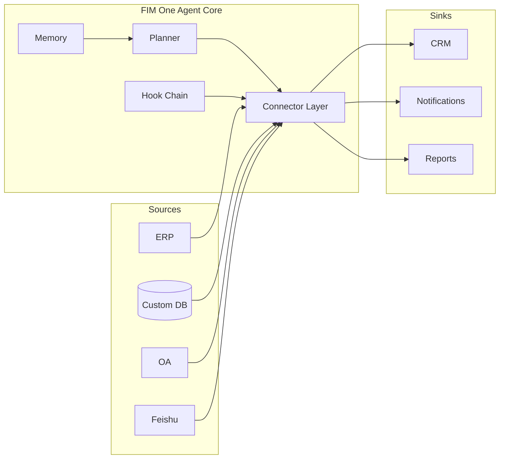

<Frame>
  
</Frame>

<Info>
  **版本 1.1 · 2026年4月。** 本白皮书记录了FIM One的架构论点、类别定位和部署模型。
  它面向CTO、企业架构师、AI平台负责人和正在评估如何将AI引入现有系统的技术投资者。
</Info>

## 执行摘要

**数据永不离开您的边界。** 这一句话是FIM One背后每个决策的一阶设计约束，也是需要一个新基础设施层的原因——不是另一个iPaaS，也不是另一个通用智能体。

大多数企业已经拥有他们需要的系统——ERP、CRM、OA、自定义数据库、内部API、行业SaaS。他们缺少的是让AI能够**触达**这些系统的方式，而无需将数据迁移到供应商云端，也无需为每个用例进行为期六个月的集成项目。市场规模庞大、发展迅速，并且已在重新定位：全球企业GenAI基础设施支出预计在2025年达到**US$18B，同比增长3.2倍**（Menlo Ventures 2025）。中国的增速更快——企业AI智能体支出达到**120% CAGR（2023–2027），到2027年将达到¥65.5B**（iResearch · CAICT 2025）。中央/国有企业占大模型采购的**60%以上**，信创（信创）私有部署是硬性约束。

Gartner已正式将此类别重新命名为"AI Agent Platform"（文档6300015，2025）；CAICT的2025智能体AI技术报告称其为"智能体平台"；历史上的iPaaS领导者MuleSoft在2025年iPaaS魔力象限中**从Leader降级为Challenger**。主导企业集成十年的类别正在被实时替代。

FIM One为新类别而构建。它是一个**一体化智能体平台**，面向全球×中国企业——一个提供商无关的Python框架，其中AI智能体动态规划和执行跨越您现有系统的任务，通过一个智能体核心连接全球SaaS和中国栈，部署在您自己的环境中，端到端可审计。一个智能体核心，三种交付模式：

| 模式 | 部署位置 | 典型应用 |
|---|---|---|
| **独立版** | 自有门户 | 知识问答、内部聊天、代码沙箱 |
| **副驾驶** | 嵌入宿主系统内 | ERP网页UI内的"财务副驾驶" |
| **中枢** | 跨系统中央编排器 | 智能体查询ERP、检查OA、通过Feishu通知 |

本文阐述了为什么该类别在发生变化、为什么iPaaS无法承载新工作负载、FIM One在底层是什么样的，以及您如何将其投入生产。

## 1. 问题所在：企业AI是一个对齐问题

2025–2026年的公开AI讨论一直被模型能力主导——更长的上下文、更好的推理、更便宜的token。在企业内部，能力很少是瓶颈。瓶颈在于**AI在你的系统内部没有"手"**。

一个能读懂万行代码库并提出正确修复方案的前沿LLM，本身无法：

- 从本地部署的SAP实例中提取昨天的库存数据。
- 在只有遗留SOAP API集成接口的SaaS HR工具中批准休假请求。
- 向符合信创标准的ERP中写入一行数据，其身份验证是登录票据服务而非OAuth2。
- 向飞书群组发送通知，同时遵守该群组自身的审批规则。

这些都是已解决的集成问题——各自一次。困难在于每个企业都有数十个这样的系统，每个系统都有自己的身份验证模型、数据形状和故障模式。硬编码它们会给你一个脆弱的单体。让LLM在运行时发现它们会导致幻觉API调用。

**缺失的原始设计是一个对齐的接口。** 一个类型化、经过身份验证、可发现的模型与系统之间的接口——它告诉模型它能做什么、每个操作的成本、谁必须批准它，以及结果会是什么样子。这个原始设计就是FIM One所说的**连接器**。

## 2. 为什么现有方法不足

### 2.1 iPaaS和工作流构建器——一个衰退的类别

iPaaS（MuleSoft、Boomi、Workato）和轻量级工作流家族（n8n、Zapier、Dify、Coze）将集成视为**设计时**问题：人类绘制节点图并在字段级粒度进行连接，该图在运行时确定性地运行。当集成数量少且稳定时，这种方法是可行的。

但它不适用于AI驱动的企业自动化，原因有三：

1. **逻辑已经存在于目标系统内。** 每个节点都是围绕API调用的薄包装，而你现在需要在两个地方维护它。
2. **人类必须提前知道计划。** 企业问题如"关闭所有亚太地区实体的Q1"是开放式的——计划必须在运行时生成，而不是由设计师绘制。
3. **字段级映射在规模上崩溃。** 跨十几个系统的千节点图无法维护；AI可读的操作界面完全取代了它。

该类别正在明显转变。Gartner在2025年将该领域重新分类为"AI智能体平台"（文档6300015）。CAICT在其2025年智能体AI技术报告中采用了相同的框架（"智能体平台"）。最能说明问题的是，**作为十年来iPaaS参考供应商的MuleSoft——在Gartner 2025年iPaaS魔力象限中从领导者降级为挑战者**。与此同时，Anthropic的MCP协议在2024年11月发布后，在15个月内增长到**10,000+个服务器和9,700万次月度SDK下载**。信号很明确：企业自动化的集成层正在被重建。

### 2.2 通用智能体（Manus、AutoGPT、OpenAI Assistants）

通用智能体设计用于消费者和知识工作任务——浏览网页、起草文档、操作电子表格。它们无法进入你的VPN、向你的ERP进行身份验证或通过你的安全审查。当围绕企业系统部署时，它们成为在试点阶段就失败的演示。

### 2.3 厂商内置AI（飞书AI、SAP Joule、Salesforce Einstein）

厂商已将自己的AI内置到自己的产品中。问题在于结构性的：**任何上游厂商都没有动力去打破自己的数据孤岛。** 飞书AI不了解你的ERP数据；钉钉AI不了解你的合同状态。每个厂商的AI只能看到该厂商卖给你的内容。对于跨系统工作，它们根本无法胜任。

### 2.4 自建和RPA

自建方案周期长、适配成本高。RPA像人类一样驱动UI——这是最通用的方法，也是最脆弱的：每次UI变化都会破坏它，每个身份验证提示都会让它停止。它只是对缺失API的补丁，不是构建AI的基础。

FIM One占据了这些方案都留下的空白：对真实系统的类型化API，由模型规划，由企业治理，部署在企业边界内。

## 3. FIM One 论文

三项信念塑造了每一个设计决策。

**信念 1——系统已经存在。** 不要求企业重建；在企业所在的地方与其相遇。每个连接器都是一座桥梁，而非替代品。数据永远不会离开信息源，也永远不会离开企业边界。

**信念 2——对齐优于能力。** 一个较弱但工具集对齐的模型胜过一个在原始 API 上摸索的更强模型。护城河是连接器库、其认证模型和治理层——而非智能体的原始推理能力。

**信念 3——动态规划是正确的中间立场。** 刚性工作流（iPaaS、BPM）对真实企业任务过于脆弱；完全自主智能体（AutoGPT、Manus）对生产环境过于不可预测。FIM One 在运行时规划，但在类型化的行动空间内——每一步都是连接器调用，而非开放式的 LLM 独白。有界自主性：`re-plan ≤ 3 | token budget | confirmation gate`。

### 超越iPaaS

FIM One刻意不是iPaaS，这种区别不仅仅是表面的。iPaaS是字段级、设计时、人工建模、供应商云托管的。FIM One是操作级、运行时、模型规划、企业自托管的。

| 维度 | iPaaS | FIM One |
|---|---|---|
| 粒度 | 字段映射 | 类型化操作 |
| 规划时间 | 设计时 | 运行时 |
| 谁来建模 | 人工设计师 | 模型 |
| 数据位置 | 供应商云 | 您的服务器 |
| 治理 | 外部附加组件 | 内置钩子 |
| 分类（Gartner 2025） | iPaaS MQ（衰退中） | AI Agent Platform |

## 4. 架构原则

<CardGroup cols={2}>
  <Card title="提供商无关" icon="shuffle">
    任何OpenAI兼容的LLM——OpenAI、Anthropic、DeepSeek、Qwen、本地Ollama、信创认证模型。模型选择是部署变量，而非架构承诺。
  </Card>
  <Card title="协议优先" icon="network-wired">
    每个连接器都发布类型化的模式。智能体看到的是操作、参数和返回类型——永远不是原始HTTP。OpenAPI、MCP和直接数据库连接都是一等公民。
  </Card>
  <Card title="三个执行引擎" icon="sitemap">
    **ReAct**用于探索性任务，**DAG**用于结构化管道，**Workflow**（最多25个节点）用于确定性的人工设计管道。一个智能体核心根据任务选择引擎。
  </Card>
  <Card title="模式优先工具加载" icon="bolt">
    工具模式以~30个token的成本预先加载；智能体按需扩展。每个会话的提示词开销下降~80%，平台可扩展到**10,000+个API**而不会爆炸上下文窗口。
  </Card>
  <Card title="钩子治理" icon="shield-halved">
    每个工具调用都通过可配置的钩子链：审计、策略、人工审批。钩子在LLM循环外运行——确定性且可审计。
  </Card>
  <Card title="内存感知" icon="brain">
    短期对话、长期知识库和跨会话内存是一等原语，而非附加功能。
  </Card>
</CardGroup>

## 5. 三种交付模式——一个智能体核心

相同的规划器、记忆和连接器库支持三种不同的产品形态。选择是部署决策，而非代码分支。

**独立版** ——自包含的门户。买方需要在精选知识库上的聊天界面，或代码沙箱，或通用助手。不涉及主机系统。适用于内部IT帮助台、工程生产力、客户支持知识库。

**副驾驶** ——通过iframe、小部件或直接嵌入集成到现有主机系统内的智能体。主机处理身份验证；副驾驶继承用户上下文。适用于SAP Fiori内的财务副驾驶、Salesforce内的销售副驾驶、内部开发者门户内的DevOps副驾驶。

**中枢** ——中央编排表面。每个连接的系统都在此终止。用户提出跨系统问题；智能体在系统间规划和执行。适用于"关闭所有亚太地区实体的Q1"、"查找每个错过续约的客户并起草外展"、"协调昨天网关和账本之间的付款"。

## 6. 连接器对齐模型

连接器是由身份验证策略支持的类型化操作表面。FIM One定义了三个身份验证层级，涵盖绝大多数企业系统。

<AccordionGroup>
  <Accordion title="第1层——数据库连接器（完整或基础）">
    直接连接到关系型或文档数据库。**完整**模式向智能体公开任意SQL，由只读角色进行控制；**基础**模式仅公开预注册的参数化查询。原生支持**Xinchuang兼容数据库——Dameng (DM8)、KingbaseES、HighGo、GBase**——以及PostgreSQL、MySQL和Oracle。中央/国有和受监管客户可在第一天通过合规采购。
  </Accordion>
  <Accordion title="第2层——OpenAPI连接器（用户密钥）">
    任何具有OpenAPI规范的REST API。智能体读取规范、选择端点，并使用已登录用户的密钥调用它。涵盖现代SaaS（Slack、Linear、GitHub）和文档完善的内部API。
  </Accordion>
  <Accordion title="第3层——登录票证/遗留连接器">
    针对通过登录票证服务而非OAuth2进行身份验证的系统——在中国市场尤为常见。连接器管理票证生命周期（获取、刷新、失效），并向上呈现正常的类型化表面。此层级解锁其他供应商跳过的系统。
  </Accordion>
</AccordionGroup>

每个连接器还声明了**通道/集成二元性**：同一底层系统既可以作为*通道*（通知接收器、审批表面）出现，也可以作为*集成*（数据源、操作目标）出现。Feishu既是通知通道，也是群聊数据源；DingTalk和WeCom遵循相同模式。

## 7. 可信的企业级AI——三大支柱

企业级AI在生产环境中失败，不是因为模型有问题，而是因为组织无法证明它是正确的。FIM One将信任视为架构，通过三大支柱来体现。

<CardGroup cols={3}>
  <Card title="每个结论都有引用" icon="paperclip">
    RAG检索+引用链让智能体为每个声明引用特定文档中的特定段落。结论可追溯且可审计。没有黑盒输出。
  </Card>
  <Card title="每次写入都需确认" icon="hand">
    写操作被强制暂停，在执行前等待人工审批——可在门户中内联进行，也可通过Feishu审批组进行带外审批。钩子链是架构约束，而非政策建议。它无法被绕过。
  </Card>
  <Card title="每次发布都有度量" icon="chart-bar">
    数据驱动的评估在每次发布前量化质量。每次迭代都可度量；企业采购获得的是证据，而非承诺。
  </Card>
</CardGroup>

为此提供支持，每次智能体运行都会生成结构化追踪：计划、工具调用、参数、观察、审批、最终答案。追踪是审计的基本单位。凭证使用Fernet加密（AES-128-CBC + HMAC-SHA256）。完整的审计日志被存储并可导出。

当操作员拒绝工具调用时，智能体停止——它不会改述并重试。拒绝是一项政策决定，而非要恢复的错误。

## 8. 部署和商业模式

FIM One 在宽松许可证（FIM-SAL）下开源，提供三种部署形式和三个版本层级。

<CardGroup cols={3}>
  <Card title="Community" icon="code">
    永久免费。自托管。面向开发者和评估团队。
  </Card>
  <Card title="Cloud" icon="cloud">
    由Wuzhi托管在cloud.fim.ai。按用户+按连接器订阅。新加坡实体处理海外合同。
  </Card>
  <Card title="Enterprise" icon="briefcase">
    私有部署、定制定价、合规工具、专属技术支持。面向大型企业和政府/国有客户。
  </Card>
</CardGroup>

代码库包含约170,000行Python代码，分布在1,590多个模块中，包含约100个测试文件，内置支持6种UI语言。源代码在FIM-SAL下开源——企业可以自行审计安全性。主要运行成本是LLM令牌，而非基础设施；提供商无关性意味着当前沿技术推低价格时，你可以受益，无需迁移。

## 9. 交付路径

生产部署遵循三步路径，确保风险可控且快速实现价值。

| 步骤 | 时间表 | 发生的事情 |
|---|---|---|
| **1. 概念验证** | 2 周 | 1–2 个代表性场景（财务审计、合同审查、数据报告），端到端真实数据验证。第 7 天完成初版，第 14 天交付验证报告。 |
| **2. 试点** | 1–2 个月 | 私有部署到您的服务器。首批 3–5 个连接器（ERP / OA / Feishu / DingTalk / 数据库）。覆盖一条业务线。建立审计和审批基线。 |
| **3. 扩展** | 3–6 个月 | 扩展到更多业务线和连接器。积累行业技能包。培训内部管理员。交付运营手册和 SLA。 |

八个垂直预构建解决方案模板涵盖最常见的场景：财务审计、合同审查、数据报告、采购对账、客户收款、合规筛查、人力资源筛查、运维值班。

## 10. 这将走向何处

**近期——连接器深度。** 为中国市场提供更多第三层级遗留连接器、更深入的信创认证，以及一个AI Builder，能在几分钟内将OpenAPI规范或数据库架构截图转化为可工作的连接器。

**近期——治理深度。** 更丰富的RBAC、四层连接器权限、独立IdP、默认SSO、SOC 2和ISO 27001合规态势。

**中期——生态系统。** 云SaaS、连接器市场和行业解决方案包——第三方构建的基础设施层。

长期的赌注是企业AI的形态将远比CLI更像一个跨系统智能体平台。知识工作者不会安装十个AI助手；他们会询问公司的智能体平台，该平台将知道如何到达任何持有答案的系统——全球SaaS、中国企业堆栈或两者之间的任何东西。FIM One正在构建这个平台。

## 11. 附录——深入了解

- **[系统概览](/architecture/system-overview)** — 组件级架构。
- **[连接器架构](/architecture/connector-architecture)** — 连接器契约、生命周期和扩展模型。
- **[设计理念](/architecture/design-philosophy)** — 我们做出每个核心权衡的原因。
- **[钩子系统](/architecture/hook-system)** — 策略、审批和审计深度解析。
- **[竞争格局](/strategy/competitive-landscape)** — 类别定位和对标比较。
- **[快速开始](/quickstart)** — 在十分钟内在你的笔记本电脑上运行FIM One。

<Tip>
  有问题、更正或商业咨询：hi@fim.ai · [Discord](https://discord.gg/z64czxdC7z) · [GitHub](https://github.com/fim-ai/fim-one)
</Tip>
